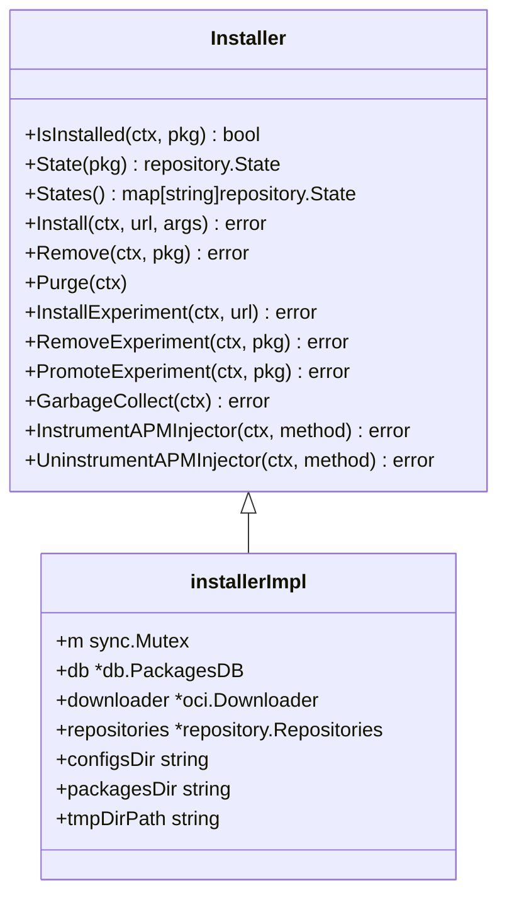

# Overview

The Fleet Installer is a package manager responsible for installing and uninstalling packages. It provides functionalities to check if a package is installed, retrieve the state of a package, and manage the states of all packages.

# Core Functionalities

The Installer can install or update packages from a given URL, remove packages, and purge all packages. It also supports experimental features, allowing the installation, removal, and promotion of experimental packages. Additionally, the Installer includes methods for garbage collection to remove unused packages and for instrumenting and uninstrumenting the APM injector.

# Implementation Details

The implementation of the Installer involves managing package directories, downloading packages, and interacting with a database to keep track of package states.

# Installer Interface

The <SwmToken path="pkg/fleet/installer/installer.go" pos="44:2:2" line-data="// Installer is a package manager that installs and uninstalls packages.">`Installer`</SwmToken> interface defines the methods available for managing packages, including installation, removal, and state management.

<SwmSnippet path="/pkg/fleet/installer/installer.go" line="44">

---

The <SwmToken path="pkg/fleet/installer/installer.go" pos="44:2:2" line-data="// Installer is a package manager that installs and uninstalls packages.">`Installer`</SwmToken> interface provides methods such as <SwmToken path="pkg/fleet/installer/installer.go" pos="46:1:1" line-data="	IsInstalled(ctx context.Context, pkg string) (bool, error)">`IsInstalled`</SwmToken>, <SwmToken path="pkg/fleet/installer/installer.go" pos="47:1:1" line-data="	State(pkg string) (repository.State, error)">`State`</SwmToken>, <SwmToken path="pkg/fleet/installer/installer.go" pos="48:1:1" line-data="	States() (map[string]repository.State, error)">`States`</SwmToken>, <SwmToken path="pkg/fleet/installer/installer.go" pos="50:1:1" line-data="	Install(ctx context.Context, url string, args []string) error">`Install`</SwmToken>, <SwmToken path="pkg/fleet/installer/installer.go" pos="51:1:1" line-data="	Remove(ctx context.Context, pkg string) error">`Remove`</SwmToken>, <SwmToken path="pkg/fleet/installer/installer.go" pos="52:1:1" line-data="	Purge(ctx context.Context)">`Purge`</SwmToken>, <SwmToken path="pkg/fleet/installer/installer.go" pos="54:1:1" line-data="	InstallExperiment(ctx context.Context, url string) error">`InstallExperiment`</SwmToken>, <SwmToken path="pkg/fleet/installer/installer.go" pos="55:1:1" line-data="	RemoveExperiment(ctx context.Context, pkg string) error">`RemoveExperiment`</SwmToken>, <SwmToken path="pkg/fleet/installer/installer.go" pos="56:1:1" line-data="	PromoteExperiment(ctx context.Context, pkg string) error">`PromoteExperiment`</SwmToken>, <SwmToken path="pkg/fleet/installer/installer.go" pos="58:1:1" line-data="	GarbageCollect(ctx context.Context) error">`GarbageCollect`</SwmToken>, <SwmToken path="pkg/fleet/installer/installer.go" pos="60:1:1" line-data="	InstrumentAPMInjector(ctx context.Context, method string) error">`InstrumentAPMInjector`</SwmToken>, and <SwmToken path="pkg/fleet/installer/installer.go" pos="61:1:1" line-data="	UninstrumentAPMInjector(ctx context.Context, method string) error">`UninstrumentAPMInjector`</SwmToken>.

```go
// Installer is a package manager that installs and uninstalls packages.
type Installer interface {
	IsInstalled(ctx context.Context, pkg string) (bool, error)
	State(pkg string) (repository.State, error)
	States() (map[string]repository.State, error)

	Install(ctx context.Context, url string, args []string) error
	Remove(ctx context.Context, pkg string) error
	Purge(ctx context.Context)

	InstallExperiment(ctx context.Context, url string) error
	RemoveExperiment(ctx context.Context, pkg string) error
	PromoteExperiment(ctx context.Context, pkg string) error

	GarbageCollect(ctx context.Context) error

	InstrumentAPMInjector(ctx context.Context, method string) error
	UninstrumentAPMInjector(ctx context.Context, method string) error
}
```

---

</SwmSnippet>

# <SwmToken path="pkg/fleet/installer/service/datadog_installer.go" pos="45:2:2" line-data="// SetupInstaller installs and starts the installer systemd units">`SetupInstaller`</SwmToken> Function

The <SwmToken path="pkg/fleet/installer/service/datadog_installer.go" pos="45:2:2" line-data="// SetupInstaller installs and starts the installer systemd units">`SetupInstaller`</SwmToken> function sets up the installer systemd units and prepares the environment for package management.

<SwmSnippet path="/pkg/fleet/installer/service/datadog_installer.go" line="45">

---

The <SwmToken path="pkg/fleet/installer/service/datadog_installer.go" pos="45:2:2" line-data="// SetupInstaller installs and starts the installer systemd units">`SetupInstaller`</SwmToken> function installs and starts the installer systemd units, creates the <SwmToken path="pkg/fleet/installer/service/datadog_installer.go" pos="55:12:14" line-data="		return fmt.Errorf(&quot;error creating dd-agent group: %w&quot;, err)">`dd-agent`</SwmToken> group and user, and adds the user to the group.

```go
// SetupInstaller installs and starts the installer systemd units
func SetupInstaller(ctx context.Context) (err error) {
	defer func() {
		if err != nil {
			log.Errorf("Failed to setup installer: %s, reverting", err)
			err = RemoveInstaller(ctx)
		}
	}()

	if err = addDDAgentGroup(ctx); err != nil {
		return fmt.Errorf("error creating dd-agent group: %w", err)
	}
	if addDDAgentUser(ctx) != nil {
		return fmt.Errorf("error creating dd-agent user: %w", err)
	}
	err = exec.CommandContext(ctx, "usermod", "-g", "dd-agent", "dd-agent").Run()
	if err != nil {
		return fmt.Errorf("error adding dd-agent user to dd-agent group: %w", err)
	}
	ddAgentUID, ddAgentGID, err := getAgentIDs()
	if err != nil {
```

---

</SwmSnippet>

# Install Method

The <SwmToken path="pkg/fleet/installer/installer.go" pos="50:1:1" line-data="	Install(ctx context.Context, url string, args []string) error">`Install`</SwmToken> method handles the downloading and installation of packages, including checking dependencies and updating the package database.

<SwmSnippet path="/pkg/fleet/installer/installer.go" line="127">

---

The <SwmToken path="pkg/fleet/installer/installer.go" pos="127:2:2" line-data="// Install installs or updates a package.">`Install`</SwmToken> function locks the installer to prevent concurrent modifications, downloads the package, and then sets it up.

```go
// Install installs or updates a package.
func (i *installerImpl) Install(ctx context.Context, url string, args []string) error {
	i.m.Lock()
	defer i.m.Unlock()
	pkg, err := i.downloader.Download(ctx, url)
	if err != nil {
		return fmt.Errorf("could not download package: %w", err)
	}
	span, ok := tracer.SpanFromContext(ctx)
	if ok {
		span.SetTag(ext.ResourceName, pkg.Name)
		span.SetTag("package_version", pkg.Version)
	}

	for _, dependency := range packageDependencies[pkg.Name] {
		installed, err := i.IsInstalled(ctx, dependency)
		if err != nil {
			return fmt.Errorf("could not check if required package %s is installed: %w", dependency, err)
		}
		if !installed {
			// TODO: we should resolve the dependency version & install it instead
```

---

</SwmSnippet>

# Remove Method

The <SwmToken path="pkg/fleet/installer/installer.go" pos="51:1:1" line-data="	Remove(ctx context.Context, pkg string) error">`Remove`</SwmToken> function uninstalls a package. It locks the installer, removes the package, and updates the package state in the database.

<SwmSnippet path="/pkg/fleet/installer/installer.go" line="297">

---

The <SwmToken path="pkg/fleet/installer/installer.go" pos="297:2:2" line-data="// Remove uninstalls a package.">`Remove`</SwmToken> function locks the installer, removes the package, deletes the repository, and updates the package state in the database.

```go
// Remove uninstalls a package.
func (i *installerImpl) Remove(ctx context.Context, pkg string) error {
	i.m.Lock()
	defer i.m.Unlock()
	err := i.removePackage(ctx, pkg)
	if err != nil {
		return fmt.Errorf("could not remove package: %w", err)
	}
	err = i.repositories.Delete(ctx, pkg)
	if err != nil {
		return fmt.Errorf("could not delete repository: %w", err)
	}
	err = i.db.DeletePackage(pkg)
	if err != nil {
		return fmt.Errorf("could not remove package installation in db: %w", err)
	}
	return nil
}
```

---

</SwmSnippet>

&nbsp;

*This is an auto-generated document by Swimm AI 🌊 and has not yet been verified by a human*

<SwmMeta version="3.0.0" repo-id="Z2l0aHViJTNBJTNBZGF0YWRvZy1hZ2VudCUzQSUzQVN3aW1tLURlbW8=" repo-name="datadog-agent"><sup>Powered by [Swimm](/)</sup></SwmMeta>
