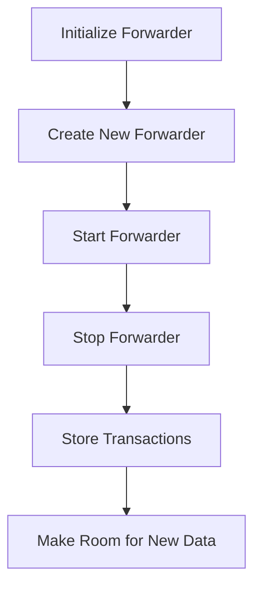

This document will cover the Forwarder Component Management feature, which includes:

1. Initializing the Forwarder
2. Creating a New Forwarder
3. Starting the Forwarder
4. Stopping the Forwarder
5. Storing Transactions
6. Making Room for New Data

Technical document: <SwmLink doc-title="Forwarder Component Management">[Forwarder Component Management](/.swm/forwarder-component-management.kqgxsmpm.sw.md)</SwmLink>

# [Initializing the Forwarder](https://app.swimm.io/repos/Z2l0aHViJTNBJTNBZGF0YWRvZy1hZ2VudCUzQSUzQVN3aW1tLURlbW8=/docs/kqgxsmpm#initialization-of-the-forwarder)

The initialization process involves setting up the necessary configurations and dependencies for the forwarder. This step ensures that the forwarder has all the required settings and resources to function correctly. It includes configuring logging, lifecycle management, and other parameters essential for the forwarder's operation.

# [Creating a New Forwarder](https://app.swimm.io/repos/Z2l0aHViJTNBJTNBZGF0YWRvZy1hZ2VudCUzQSUzQVN3aW1tLURlbW8=/docs/kqgxsmpm#creating-a-new-forwarder)

Creating a new forwarder involves setting up a forwarder component with the necessary configurations. This step checks if a NoopForwarder should be used based on the provided parameters. If not, it initializes a DefaultForwarder and sets up lifecycle hooks to manage the forwarder's start and stop processes. This ensures that the forwarder is correctly configured and ready to handle data forwarding tasks.

# [Starting the Forwarder](https://app.swimm.io/repos/Z2l0aHViJTNBJTNBZGF0YWRvZy1hZ2VudCUzQSUzQVN3aW1tLURlbW8=/docs/kqgxsmpm#starting-the-forwarder)

Starting the forwarder involves initializing and running the forwarder. This step locks the forwarder to prevent it from being stopped while starting. It starts all domain forwarders, logs the endpoint configurations, and starts the health checker. This ensures that the forwarder is fully operational and ready to forward data to the configured endpoints.

# [Stopping the Forwarder](https://app.swimm.io/repos/Z2l0aHViJTNBJTNBZGF0YWRvZy1hZ2VudCUzQSUzQVN3aW1tLURlbW8=/docs/kqgxsmpm#stopping-the-forwarder)

Stopping the forwarder involves halting all components of the forwarder and freeing up resources. This step locks the process to prevent new forwarders from starting while the current one is stopping. It sets the internal state to stopped, stops each domain forwarder, and clears the domain forwarders map. This ensures that the forwarder is properly shut down and resources are released.

# [Storing Transactions](https://app.swimm.io/repos/Z2l0aHViJTNBJTNBZGF0YWRvZy1hZ2VudCUzQSUzQVN3aW1tLURlbW8=/docs/kqgxsmpm#storing-transactions)

Storing transactions involves saving transaction data to the file system. This step resets the serializer to ensure no leftover data from previous operations, serializes each transaction, and writes the serialized data to a temporary file. It checks if there is enough room on the disk before writing and updates the current disk usage and telemetry data. This ensures that transaction data is safely stored and can be retrieved later if needed.

# [Making Room for New Data](https://app.swimm.io/repos/Z2l0aHViJTNBJTNBZGF0YWRvZy1hZ2VudCUzQSUzQVN3aW1tLURlbW8=/docs/kqgxsmpm#making-room-for-new-data)

Making room for new data involves ensuring there is enough disk space to store new transaction data. This step checks if the new data exceeds the maximum allowed size and calculates the available space. If necessary, it removes old files to free up space and updates telemetry data accordingly. This ensures that the forwarder can continue to store new transaction data without running out of disk space.

&nbsp;

*This is an auto-generated document by Swimm AI 🌊 and has not yet been verified by a human*

<SwmMeta version="3.0.0" repo-id="Z2l0aHViJTNBJTNBZGF0YWRvZy1hZ2VudCUzQSUzQVN3aW1tLURlbW8=" repo-name="datadog-agent">Powered by [Swimm](/)</SwmMeta>
