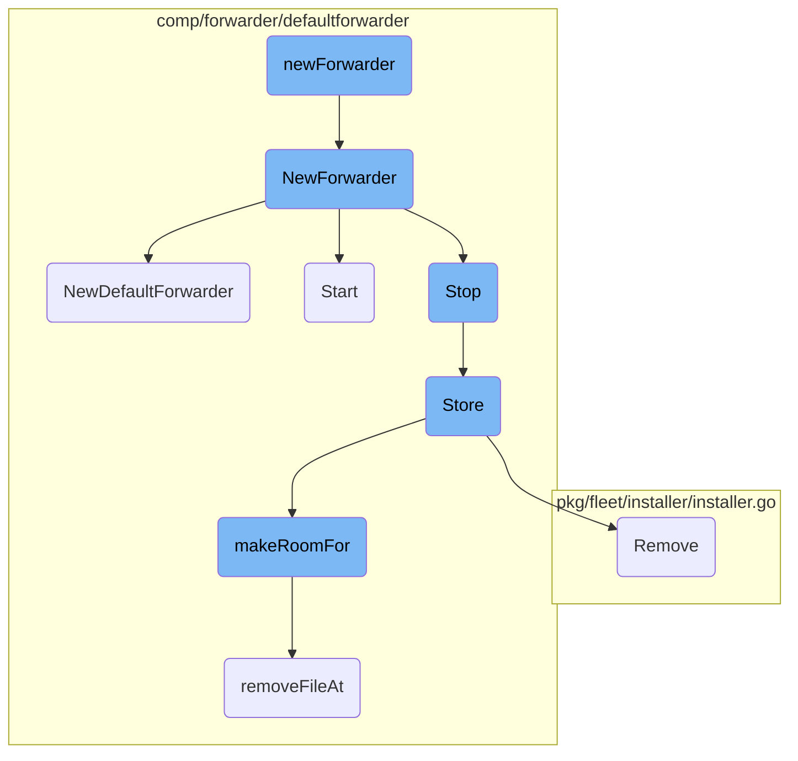
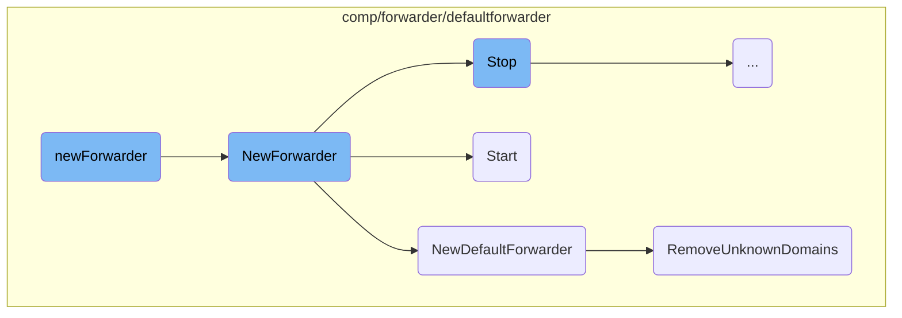
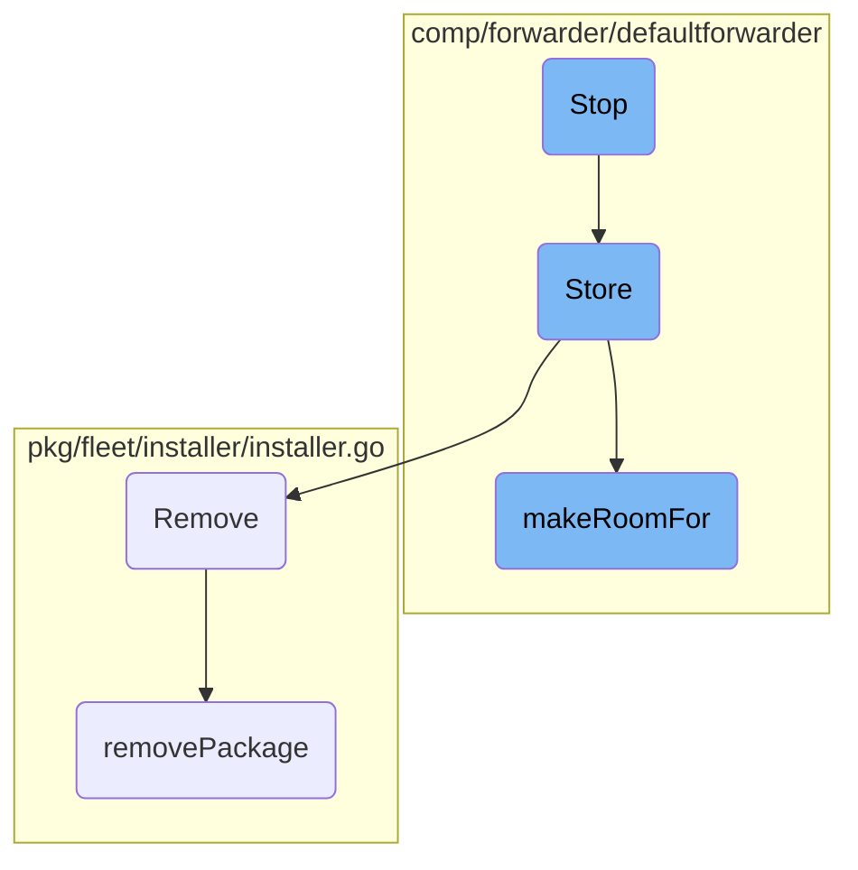

This document explains the process of setting up and managing a forwarder component. It covers the initialization, creation, starting, stopping, and storage management of the forwarder.

The process starts with initializing a new forwarder by setting up the necessary configurations and dependencies. Then, a new forwarder component is created, which may involve setting up a default forwarder with various configurations. The forwarder is then started, which involves initializing and running the forwarder, starting all domain forwarders, and logging the endpoint configurations. When stopping the forwarder, it ensures that no new forwarder can start while the current one is stopping, stops all domain forwarders, and clears the domain forwarders map. Additionally, the forwarder handles storing transactions to the file system and making room for new data by removing old files if necessary.

Here is a high level diagram of the flow, showing only the most important functions:



# Flow drill down

First, we'll zoom into this section of the flow:



<SwmSnippet path="/comp/forwarder/defaultforwarder/forwarder.go" line="33">

---

## Initialization of the Forwarder

The <SwmToken path="comp/forwarder/defaultforwarder/forwarder.go" pos="33:2:2" line-data="func newForwarder(dep dependencies) provides {">`newForwarder`</SwmToken> function initializes a new forwarder by calling <SwmToken path="comp/forwarder/defaultforwarder/forwarder.go" pos="33:2:2" line-data="func newForwarder(dep dependencies) provides {">`newForwarder`</SwmToken> with the provided dependencies. This sets up the necessary configuration, logging, lifecycle, and parameters for the forwarder.

```go
func newForwarder(dep dependencies) provides {
	return NewForwarder(dep.Config, dep.Log, dep.Lc, true, dep.Params)
```

---

</SwmSnippet>

<SwmSnippet path="/comp/forwarder/defaultforwarder/forwarder.go" line="40">

---

## Creating a New Forwarder

The <SwmToken path="comp/forwarder/defaultforwarder/forwarder.go" pos="40:2:2" line-data="func NewForwarder(config config.Component, log log.Component, lc fx.Lifecycle, ignoreLifeCycleError bool, params Params) provides {">`NewForwarder`</SwmToken> function creates a new forwarder component. It checks if a <SwmToken path="comp/forwarder/defaultforwarder/forwarder.go" pos="43:4:4" line-data="			Comp: NoopForwarder{},">`NoopForwarder`</SwmToken> should be used based on the parameters. If not, it initializes a <SwmToken path="comp/forwarder/defaultforwarder/default_forwarder.go" pos="217:25:25" line-data="func NewDefaultForwarder(config config.Component, log log.Component, options *Options) *DefaultForwarder {">`DefaultForwarder`</SwmToken> and sets up lifecycle hooks to start and stop the forwarder.

```go
func NewForwarder(config config.Component, log log.Component, lc fx.Lifecycle, ignoreLifeCycleError bool, params Params) provides {
	if params.UseNoopForwarder {
		return provides{
			Comp: NoopForwarder{},
		}
	}
	forwarder := NewDefaultForwarder(config, log, params.Options)

	lc.Append(fx.Hook{
		OnStart: func(context.Context) error {
			err := forwarder.Start()
			if ignoreLifeCycleError {
				return nil
			}
			return err
		},
		OnStop: func(context.Context) error { forwarder.Stop(); return nil }})

	return provides{
		Comp:           forwarder,
		StatusProvider: status.NewInformationProvider(statusProvider{config: config}),
```

---

</SwmSnippet>

<SwmSnippet path="/comp/forwarder/defaultforwarder/default_forwarder.go" line="217">

---

## Default Forwarder Setup

The <SwmToken path="comp/forwarder/defaultforwarder/default_forwarder.go" pos="217:2:2" line-data="func NewDefaultForwarder(config config.Component, log log.Component, options *Options) *DefaultForwarder {">`NewDefaultForwarder`</SwmToken> function sets up a <SwmToken path="comp/forwarder/defaultforwarder/default_forwarder.go" pos="217:25:25" line-data="func NewDefaultForwarder(config config.Component, log log.Component, options *Options) *DefaultForwarder {">`DefaultForwarder`</SwmToken> with various configurations such as domain forwarders, health checkers, and retry policies. It also handles disk persistence and domain registration.

```go
func NewDefaultForwarder(config config.Component, log log.Component, options *Options) *DefaultForwarder {
	agentName := getAgentName(options)
	f := &DefaultForwarder{
		config:           config,
		log:              log,
		NumberOfWorkers:  options.NumberOfWorkers,
		domainForwarders: map[string]*domainForwarder{},
		domainResolvers:  map[string]resolver.DomainResolver{},
		internalState:    atomic.NewUint32(Stopped),
		healthChecker: &forwarderHealth{
			log:                   log,
			config:                config,
			domainResolvers:       options.DomainResolvers,
			disableAPIKeyChecking: options.DisableAPIKeyChecking,
			validationInterval:    options.APIKeyValidationInterval,
		},
		completionHandler: options.CompletionHandler,
		agentName:         agentName,
	}
	var optionalRemovalPolicy *retry.FileRemovalPolicy
	storageMaxSize := config.GetInt64("forwarder_storage_max_size_in_bytes")
```

---

</SwmSnippet>

<SwmSnippet path="/comp/forwarder/defaultforwarder/default_forwarder.go" line="374">

---

## Starting the Forwarder

The <SwmToken path="comp/forwarder/defaultforwarder/default_forwarder.go" pos="374:2:2" line-data="// Start initialize and runs the forwarder.">`Start`</SwmToken> method initializes and runs the forwarder. It locks the forwarder to prevent stopping while starting, starts all domain forwarders, logs the endpoint configurations, and starts the health checker.

```go
// Start initialize and runs the forwarder.
func (f *DefaultForwarder) Start() error {
	// Lock so we can't stop a Forwarder while is starting
	f.m.Lock()
	defer f.m.Unlock()

	if f.internalState.Load() == Started {
		return fmt.Errorf("the forwarder is already started")
	}

	for _, df := range f.domainForwarders {
		_ = df.Start()
	}

	// log endpoints configuration
	endpointLogs := make([]string, 0, len(f.domainResolvers))
	for domain, dr := range f.domainResolvers {
		endpointLogs = append(endpointLogs, fmt.Sprintf("\"%s\" (%v api key(s))",
			domain, len(dr.GetAPIKeys())))
	}
	f.log.Infof("Forwarder started, sending to %v endpoint(s) with %v worker(s) each: %s",
```

---

</SwmSnippet>

<SwmSnippet path="/comp/forwarder/defaultforwarder/internal/retry/file_removal_policy.go" line="77">

---

## Removing Unknown Domains

The <SwmToken path="comp/forwarder/defaultforwarder/internal/retry/file_removal_policy.go" pos="77:2:2" line-data="// RemoveUnknownDomains remove unknown domains.">`RemoveUnknownDomains`</SwmToken> method in the <SwmToken path="comp/forwarder/defaultforwarder/internal/retry/file_removal_policy.go" pos="78:6:6" line-data="func (p *FileRemovalPolicy) RemoveUnknownDomains() ([]string, error) {">`FileRemovalPolicy`</SwmToken> removes any domains that are not recognized. It iterates through domain paths and removes those not found in the known domain folders.

```go
// RemoveUnknownDomains remove unknown domains.
func (p *FileRemovalPolicy) RemoveUnknownDomains() ([]string, error) {
	files, err := p.forEachDomainPath(func(folderPath string) ([]string, error) {
		if _, found := p.knownDomainFolders[folderPath]; !found {
			return p.removeUnknownDomain(folderPath)
		}
		return nil, nil
	})
	p.telemetry.setFilesFromUnknownDomainCount(len(files))
	return files, err
}
```

---

</SwmSnippet>

Now, lets zoom into this section of the flow:



<SwmSnippet path="/comp/forwarder/defaultforwarder/default_forwarder.go" line="402">

---

## Stopping the Forwarder

The <SwmToken path="comp/forwarder/defaultforwarder/default_forwarder.go" pos="402:2:2" line-data="// Stop all the component of a forwarder and free resources">`Stop`</SwmToken> function is responsible for stopping all components of a forwarder and freeing up resources. It ensures that no new forwarder can start while the current one is stopping by locking the process. If the forwarder is already stopped, it logs a warning and exits. Otherwise, it sets the internal state to stopped and proceeds to stop each domain forwarder. If a purge timeout is configured, it waits for all domain forwarders to stop within the specified timeout period. Finally, it stops the health checker and clears the domain forwarders map.

```go
// Stop all the component of a forwarder and free resources
func (f *DefaultForwarder) Stop() {
	f.log.Infof("stopping the Forwarder")
	// Lock so we can't start a Forwarder while is stopping
	f.m.Lock()
	defer f.m.Unlock()

	if f.internalState.Load() == Stopped {
		f.log.Warnf("the forwarder is already stopped")
		return
	}

	f.internalState.Store(Stopped)

	purgeTimeout := f.config.GetDuration("forwarder_stop_timeout") * time.Second
	if purgeTimeout > 0 {
		var wg sync.WaitGroup

		for _, df := range f.domainForwarders {
			wg.Add(1)
			go func(df *domainForwarder) {
```

---

</SwmSnippet>

<SwmSnippet path="/comp/forwarder/defaultforwarder/internal/retry/on_disk_retry_queue.go" line="67">

---

## Storing Transactions

The <SwmToken path="comp/forwarder/defaultforwarder/internal/retry/on_disk_retry_queue.go" pos="67:2:2" line-data="// Store stores transactions to the file system.">`Store`</SwmToken> function handles storing transactions to the file system. It first resets the serializer to ensure no leftover data from previous operations. It then serializes each transaction and writes the serialized data to a temporary file. Before writing, it checks if there is enough room on the disk by calling <SwmToken path="comp/forwarder/defaultforwarder/internal/retry/on_disk_retry_queue.go" pos="87:9:9" line-data="	if err := s.makeRoomFor(bufferSize); err != nil {">`makeRoomFor`</SwmToken>. If successful, it updates the current disk usage and telemetry data.

```go
// Store stores transactions to the file system.
func (s *onDiskRetryQueue) Store(transactions []transaction.Transaction) error {
	s.telemetry.addSerializeCount()

	// Reset the serializer in case some transactions were serialized
	// but `GetBytesAndReset` was not called because of an error.
	_, _ = s.serializer.GetBytesAndReset()

	for _, t := range transactions {
		if err := t.SerializeTo(s.log, s.serializer); err != nil {
			return err
		}
	}

	bytes, err := s.serializer.GetBytesAndReset()
	if err != nil {
		return err
	}
	bufferSize := int64(len(bytes))

	if err := s.makeRoomFor(bufferSize); err != nil {
```

---

</SwmSnippet>

<SwmSnippet path="/pkg/fleet/installer/installer.go" line="297">

---

## Removing a Package

The <SwmToken path="pkg/fleet/installer/installer.go" pos="297:2:2" line-data="// Remove uninstalls a package.">`Remove`</SwmToken> function is used to uninstall a package. It locks the process to prevent concurrent modifications and calls <SwmToken path="pkg/fleet/installer/installer.go" pos="301:7:7" line-data="	err := i.removePackage(ctx, pkg)">`removePackage`</SwmToken> to handle the actual removal. If successful, it deletes the package from the repository and the database, ensuring that all traces of the package are removed.

```go
// Remove uninstalls a package.
func (i *installerImpl) Remove(ctx context.Context, pkg string) error {
	i.m.Lock()
	defer i.m.Unlock()
	err := i.removePackage(ctx, pkg)
	if err != nil {
		return fmt.Errorf("could not remove package: %w", err)
	}
	err = i.repositories.Delete(ctx, pkg)
	if err != nil {
		return fmt.Errorf("could not delete repository: %w", err)
	}
	err = i.db.DeletePackage(pkg)
	if err != nil {
		return fmt.Errorf("could not remove package installation in db: %w", err)
	}
	return nil
}
```

---

</SwmSnippet>

<SwmSnippet path="/comp/forwarder/defaultforwarder/internal/retry/on_disk_retry_queue.go" line="154">

---

### Making Room for New Data

The <SwmToken path="comp/forwarder/defaultforwarder/internal/retry/on_disk_retry_queue.go" pos="154:9:9" line-data="func (s *onDiskRetryQueue) makeRoomFor(bufferSize int64) error {">`makeRoomFor`</SwmToken> function ensures there is enough disk space to store new data. It checks if the new data exceeds the maximum allowed size and calculates the available space. If necessary, it removes old files to free up space, updating telemetry data accordingly.

```go
func (s *onDiskRetryQueue) makeRoomFor(bufferSize int64) error {
	maxSizeInBytes := s.diskUsageLimit.getMaxSizeInBytes()
	if bufferSize > maxSizeInBytes {
		return fmt.Errorf("The payload is too big. Current:%v Maximum:%v", bufferSize, maxSizeInBytes)
	}

	maxStorageInBytes, err := s.diskUsageLimit.computeAvailableSpace(s.currentSizeInBytes)
	if err != nil {
		return err
	}
	for len(s.filenames) > 0 && s.currentSizeInBytes+bufferSize > maxStorageInBytes {
		index := 0
		filename := s.filenames[index]
		s.log.Errorf("Maximum disk space for retry transactions is reached. Removing %s", filename)

		bytes, err := os.ReadFile(filename)
		if err != nil {
			s.log.Errorf("Cannot read the file %v: %v", filename, err)
		} else if transactions, _, errDeserialize := s.serializer.Deserialize(bytes); errDeserialize == nil {
			pointDroppedCount := 0
			for _, tr := range transactions {
```

---

</SwmSnippet>

<SwmSnippet path="/pkg/fleet/installer/installer.go" line="410">

---

### Removing a Package Implementation

The <SwmToken path="pkg/fleet/installer/installer.go" pos="410:9:9" line-data="func (i *installerImpl) removePackage(ctx context.Context, pkg string) error {">`removePackage`</SwmToken> function handles the actual removal of a package based on its type. It delegates the removal process to specific service functions depending on the package being removed.

```go
func (i *installerImpl) removePackage(ctx context.Context, pkg string) error {
	switch pkg {
	case packageDatadogAgent:
		return service.RemoveAgent(ctx)
	case packageAPMInjector:
		return service.RemoveAPMInjector(ctx)
	case packageDatadogInstaller:
		return service.RemoveInstaller(ctx)
	default:
		return nil
	}
}
```

---

</SwmSnippet>

&nbsp;

*This is an auto-generated document by Swimm AI 🌊 and has not yet been verified by a human*

<SwmMeta version="3.0.0" repo-id="Z2l0aHViJTNBJTNBZGF0YWRvZy1hZ2VudCUzQSUzQVN3aW1tLURlbW8=" repo-name="datadog-agent"><sup>Powered by [Swimm](/)</sup></SwmMeta>
