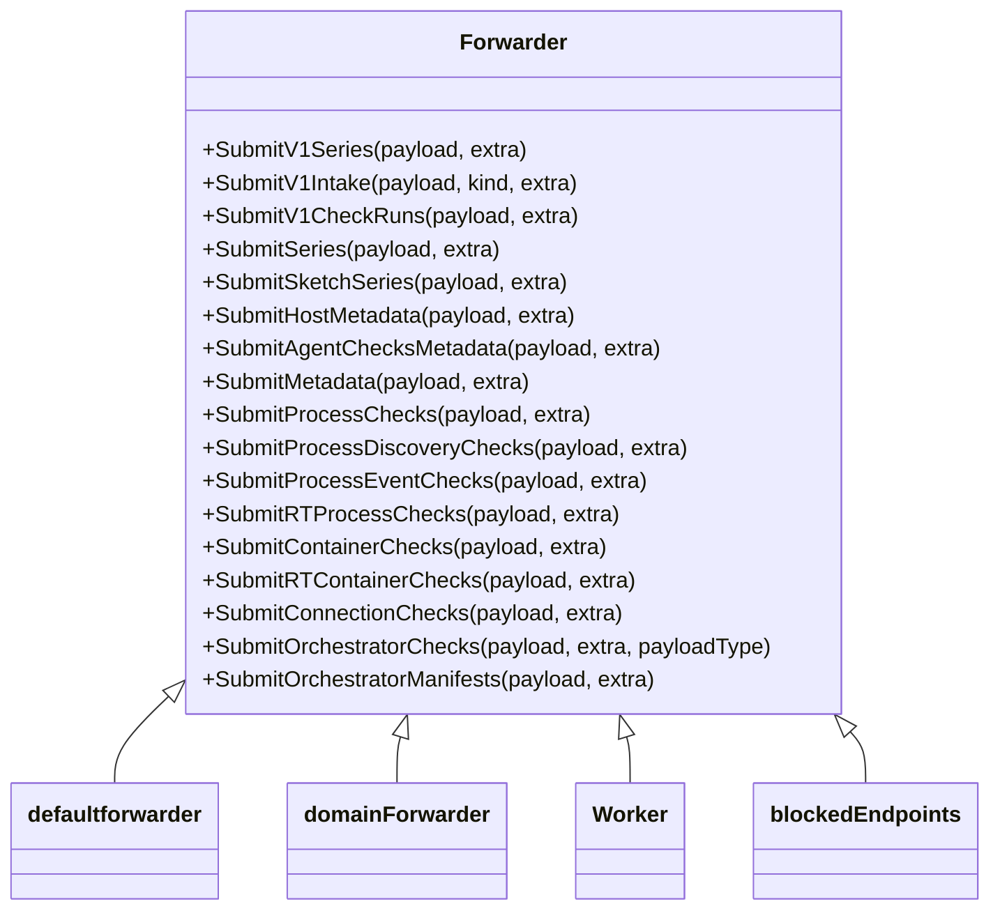

# Overview

The Forwarder is responsible for sending payloads to the backend. These payloads can come from various sources and in different formats, but the Forwarder does not inspect them. It can handle multiple domains, each with a list of API keys. Every payload is sent to each domain/API key pair, creating what is known as a 'Transaction'.

# Transaction Handling

Transactions are retried on error, with the newest transactions being retried first. These transactions are processed asynchronously by Workers.

# Components of the Forwarder

The Forwarder is composed of multiple parts, including the <SwmToken path="comp/forwarder/defaultforwarder/endpoints/endpoints.go" pos="10:17:17" line-data="import &quot;github.com/DataDog/datadog-agent/comp/forwarder/defaultforwarder/transaction&quot;">`defaultforwarder`</SwmToken>, domainForwarder, Worker, and blockedEndpoints, each playing a specific role in the payload forwarding process.

# Usage

To use the Forwarder, you need to initialize it with a map of domains and their corresponding API keys. Then, set the number of workers and start the Forwarder.

<SwmSnippet path="/comp/forwarder/defaultforwarder/endpoints/endpoints.go" line="13">

---

The <SwmToken path="comp/forwarder/defaultforwarder/endpoints/endpoints.go" pos="13:3:3" line-data="	// V1SeriesEndpoint is a v1 endpoint used to send series">`V1SeriesEndpoint`</SwmToken> is a <SwmToken path="comp/forwarder/defaultforwarder/endpoints/endpoints.go" pos="13:9:9" line-data="	// V1SeriesEndpoint is a v1 endpoint used to send series">`v1`</SwmToken> endpoint used to send series data. It is defined with the route <SwmToken path="comp/forwarder/defaultforwarder/endpoints/endpoints.go" pos="14:13:18" line-data="	V1SeriesEndpoint = transaction.Endpoint{Route: &quot;/api/v1/series&quot;, Name: &quot;series_v1&quot;}">`/api/v1/series`</SwmToken> and is named <SwmToken path="comp/forwarder/defaultforwarder/endpoints/endpoints.go" pos="14:26:26" line-data="	V1SeriesEndpoint = transaction.Endpoint{Route: &quot;/api/v1/series&quot;, Name: &quot;series_v1&quot;}">`series_v1`</SwmToken> for telemetry purposes.

```go
	// V1SeriesEndpoint is a v1 endpoint used to send series
	V1SeriesEndpoint = transaction.Endpoint{Route: "/api/v1/series", Name: "series_v1"}
	// V1CheckRunsEndpoint is a v1 endpoint used to send checks results
```

---

</SwmSnippet>

<SwmSnippet path="/comp/forwarder/defaultforwarder/endpoints/endpoints.go" line="26">

---

The <SwmToken path="comp/forwarder/defaultforwarder/endpoints/endpoints.go" pos="26:3:3" line-data="	// SeriesEndpoint is the v2 endpoint used to send series">`SeriesEndpoint`</SwmToken> is the <SwmToken path="comp/forwarder/defaultforwarder/endpoints/endpoints.go" pos="26:9:9" line-data="	// SeriesEndpoint is the v2 endpoint used to send series">`v2`</SwmToken> endpoint used to send series data. It is defined with the route <SwmToken path="comp/forwarder/defaultforwarder/endpoints/endpoints.go" pos="27:13:18" line-data="	SeriesEndpoint = transaction.Endpoint{Route: &quot;/api/v2/series&quot;, Name: &quot;series_v2&quot;}">`/api/v2/series`</SwmToken> and is named <SwmToken path="comp/forwarder/defaultforwarder/endpoints/endpoints.go" pos="27:26:26" line-data="	SeriesEndpoint = transaction.Endpoint{Route: &quot;/api/v2/series&quot;, Name: &quot;series_v2&quot;}">`series_v2`</SwmToken> for telemetry purposes.

```go
	// SeriesEndpoint is the v2 endpoint used to send series
	SeriesEndpoint = transaction.Endpoint{Route: "/api/v2/series", Name: "series_v2"}
	// EventsEndpoint is the v2 endpoint used to send events
```

---

</SwmSnippet>

&nbsp;

*This is an auto-generated document by Swimm AI 🌊 and has not yet been verified by a human*

<SwmMeta version="3.0.0" repo-id="Z2l0aHViJTNBJTNBZGF0YWRvZy1hZ2VudCUzQSUzQVN3aW1tLURlbW8=" repo-name="datadog-agent"><sup>Powered by [Swimm](/)</sup></SwmMeta>
