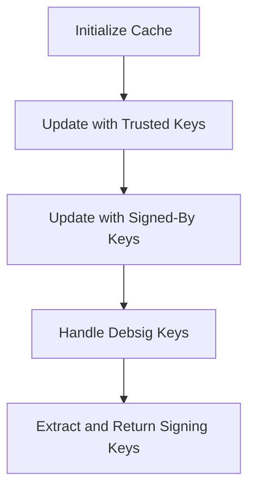

This document will cover the process of gathering APT signature keys, which includes:

1. Initializing the cache
2. Updating the cache with trusted keys
3. Updating the cache with signed-by keys
4. Handling debsig keys
5. Extracting and returning the signing keys.

Technical document: <SwmLink doc-title="Gathering APT Signature Keys">[Gathering APT Signature Keys](/.swm/gathering-apt-signature-keys.mxgge1o8.sw.md)</SwmLink>

# [Initializing the Cache](https://app.swimm.io/repos/Z2l0aHViJTNBJTNBZGF0YWRvZy1hZ2VudCUzQSUzQVN3aW1tLURlbW8=/docs/mxgge1o8#getaptsignaturekeys)

The process begins by initializing a cache to store the APT signature keys. This cache will temporarily hold the keys as they are gathered from various sources. Initializing the cache ensures that we have a dedicated space to collect and manage the keys efficiently.

# [Updating the Cache with Trusted Keys](https://app.swimm.io/repos/Z2l0aHViJTNBJTNBZGF0YWRvZy1hZ2VudCUzQSUzQVN3aW1tLURlbW8=/docs/mxgge1o8#updatewithtrustedkeys)

Next, the cache is updated with trusted keys. These keys are sourced from the legacy trusted.gpg.d folder and trusted.gpg file. The system reads these directories and files, and for each file, it extracts the key information and adds it to the cache. This step ensures that all trusted keys are included in the cache, providing a foundation of known and verified keys.

# [Updating the Cache with Signed-By Keys](https://app.swimm.io/repos/Z2l0aHViJTNBJTNBZGF0YWRvZy1hZ2VudCUzQSUzQVN3aW1tLURlbW8=/docs/mxgge1o8#updatewithsignedbykeys)

The cache is then updated with keys referenced in the sources.list file by the signed-by attribute. This involves checking if package signing is enabled and parsing the main source list file and other source list files. Each key found is added to the cache. This step ensures that keys specified in the sources.list file are included, which is crucial for verifying the authenticity of packages.

# [Handling Debsig Keys](https://app.swimm.io/repos/Z2l0aHViJTNBJTNBZGF0YWRvZy1hZ2VudCUzQSUzQVN3aW1tLURlbW8=/docs/mxgge1o8#getaptsignaturekeys)

The process also involves handling debsig keys, which are used to sign packages. The system retrieves the paths to these keys and reads each key file, extracting the key information and adding it to the cache. This step ensures that all debsig keys are included, providing additional verification for signed packages.

# [Extracting and Returning the Signing Keys](https://app.swimm.io/repos/Z2l0aHViJTNBJTNBZGF0YWRvZy1hZ2VudCUzQSUzQVN3aW1tLURlbW8=/docs/mxgge1o8#getaptsignaturekeys)

Finally, the signing keys are extracted from the cache and returned as a list. This list contains all the gathered keys, which can then be used for verifying the authenticity of packages. This step ensures that the gathered keys are readily available for use, completing the process of gathering APT signature keys.

&nbsp;

*This is an auto-generated document by Swimm AI 🌊 and has not yet been verified by a human*

<SwmMeta version="3.0.0" repo-id="Z2l0aHViJTNBJTNBZGF0YWRvZy1hZ2VudCUzQSUzQVN3aW1tLURlbW8=" repo-name="datadog-agent">Powered by [Swimm](/)</SwmMeta>
