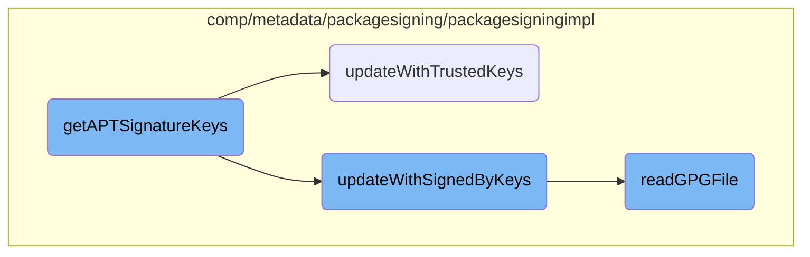

In this document, we will explain the process of gathering APT signature keys. The process involves initializing a cache, updating it with trusted and <SwmToken path="comp/metadata/packagesigning/packagesigningimpl/aptsigning.go" pos="44:23:25" line-data="	// Regular files are referenced in the sources.list file by signed-by=filename">`signed-by`</SwmToken> keys, handling debsig keys, and finally extracting and returning the signing keys.

The flow is straightforward and involves initializing a cache for the keys, updating it with trusted keys, updating it with <SwmToken path="comp/metadata/packagesigning/packagesigningimpl/aptsigning.go" pos="44:23:25" line-data="	// Regular files are referenced in the sources.list file by signed-by=filename">`signed-by`</SwmToken> keys, handling debsig keys, and finally extracting the signing keys from the cache and returning them.

# Flow drill down



<SwmSnippet path="/comp/metadata/packagesigning/packagesigningimpl/aptsigning.go" line="36">

---

## <SwmToken path="comp/metadata/packagesigning/packagesigningimpl/aptsigning.go" pos="36:2:2" line-data="// getAPTSignatureKeys returns the list of debian signature keys">`getAPTSignatureKeys`</SwmToken>

The function <SwmToken path="comp/metadata/packagesigning/packagesigningimpl/aptsigning.go" pos="36:2:2" line-data="// getAPTSignatureKeys returns the list of debian signature keys">`getAPTSignatureKeys`</SwmToken> is responsible for gathering all the APT signature keys. It initializes a cache for the keys and then calls <SwmToken path="comp/metadata/packagesigning/packagesigningimpl/aptsigning.go" pos="40:5:5" line-data="	err := updateWithTrustedKeys(cacheKeys, client)">`updateWithTrustedKeys`</SwmToken> and <SwmToken path="comp/metadata/packagesigning/packagesigningimpl/aptsigning.go" pos="45:5:5" line-data="	err = updateWithSignedByKeys(cacheKeys, client)">`updateWithSignedByKeys`</SwmToken> to populate this cache. It also handles debsig keys by calling <SwmToken path="comp/metadata/packagesigning/packagesigningimpl/aptsigning.go" pos="55:5:5" line-data="		err = readGPGFile(cacheKeys, repoFile{filename: keyPath, repositories: nil}, &quot;debsig&quot;, client)">`readGPGFile`</SwmToken> for each key path obtained from <SwmToken path="comp/metadata/packagesigning/packagesigningimpl/aptsigning.go" pos="50:8:8" line-data="	keyPaths, err := getDebsigKeyPaths()">`getDebsigKeyPaths`</SwmToken>. Finally, it extracts the signing keys from the cache and returns them as a list.

```go
// getAPTSignatureKeys returns the list of debian signature keys
func getAPTSignatureKeys(client *http.Client, logger log.Component) []signingKey {
	cacheKeys := make(map[string]signingKey)
	// debian 11 and ubuntu 22.04 will be the last using legacy trusted.gpg.d folder and trusted.gpg file
	err := updateWithTrustedKeys(cacheKeys, client)
	if err != nil {
		logger.Debugf("Error while reading trusted keys: %s", err)
	}
	// Regular files are referenced in the sources.list file by signed-by=filename
	err = updateWithSignedByKeys(cacheKeys, client)
	if err != nil {
		logger.Debugf("Error while reading signed-by keys: %s", err)
	}
	// In APT we can also sign packages with debsig
	keyPaths, err := getDebsigKeyPaths()
	if err != nil {
		logger.Debugf("Error while reading debsig keys: %s", err)
	}
	for _, keyPath := range keyPaths {
		err = readGPGFile(cacheKeys, repoFile{filename: keyPath, repositories: nil}, "debsig", client)
		if err != nil {
```

---

</SwmSnippet>

<SwmSnippet path="/comp/metadata/packagesigning/packagesigningimpl/aptsigning.go" line="69">

---

## <SwmToken path="comp/metadata/packagesigning/packagesigningimpl/aptsigning.go" pos="69:2:2" line-data="func updateWithTrustedKeys(cacheKeys map[string]signingKey, client *http.Client) error {">`updateWithTrustedKeys`</SwmToken>

The function <SwmToken path="comp/metadata/packagesigning/packagesigningimpl/aptsigning.go" pos="69:2:2" line-data="func updateWithTrustedKeys(cacheKeys map[string]signingKey, client *http.Client) error {">`updateWithTrustedKeys`</SwmToken> updates the cache with keys from the legacy <SwmToken path="comp/metadata/packagesigning/packagesigningimpl/aptsigning.go" pos="70:27:31" line-data="	// debian 11 and ubuntu 22.04 will be the last using legacy trusted.gpg.d folder and trusted.gpg file">`trusted.gpg.d`</SwmToken> folder and <SwmToken path="comp/metadata/packagesigning/packagesigningimpl/aptsigning.go" pos="70:27:29" line-data="	// debian 11 and ubuntu 22.04 will be the last using legacy trusted.gpg.d folder and trusted.gpg file">`trusted.gpg`</SwmToken> file. It reads the directory and files, and for each file, it calls <SwmToken path="comp/metadata/packagesigning/packagesigningimpl/aptsigning.go" pos="77:5:5" line-data="			err = readGPGFile(cacheKeys, repoFile{trustedFileName, nil}, &quot;trusted&quot;, client)">`readGPGFile`</SwmToken> to parse and extract the key information.

```go
func updateWithTrustedKeys(cacheKeys map[string]signingKey, client *http.Client) error {
	// debian 11 and ubuntu 22.04 will be the last using legacy trusted.gpg.d folder and trusted.gpg file
	if _, err := os.Stat(trustedFolder); err != nil {
		return err
	}
	if files, err := os.ReadDir(trustedFolder); err == nil {
		for _, file := range files {
			trustedFileName := filepath.Join(trustedFolder, file.Name())
			err = readGPGFile(cacheKeys, repoFile{trustedFileName, nil}, "trusted", client)
			if err != nil {
				return err
			}
		}
	}
	if _, err := os.Stat(trustedFile); err != nil {
		return err
	}
	return readGPGFile(cacheKeys, repoFile{trustedFile, nil}, "trusted", client)
}
```

---

</SwmSnippet>

<SwmSnippet path="/comp/metadata/packagesigning/packagesigningimpl/aptsigning.go" line="89">

---

## <SwmToken path="comp/metadata/packagesigning/packagesigningimpl/aptsigning.go" pos="89:2:2" line-data="func updateWithSignedByKeys(cacheKeys map[string]signingKey, client *http.Client) error {">`updateWithSignedByKeys`</SwmToken>

The function <SwmToken path="comp/metadata/packagesigning/packagesigningimpl/aptsigning.go" pos="89:2:2" line-data="func updateWithSignedByKeys(cacheKeys map[string]signingKey, client *http.Client) error {">`updateWithSignedByKeys`</SwmToken> updates the cache with keys referenced in the <SwmToken path="comp/metadata/packagesigning/packagesigningimpl/aptsigning.go" pos="44:15:17" line-data="	// Regular files are referenced in the sources.list file by signed-by=filename">`sources.list`</SwmToken> file by <SwmToken path="comp/metadata/packagesigning/packagesigningimpl/aptsigning.go" pos="44:23:27" line-data="	// Regular files are referenced in the sources.list file by signed-by=filename">`signed-by=filename`</SwmToken>. It checks if package signing is enabled and parses the main source list file and other source list files, calling <SwmToken path="comp/metadata/packagesigning/packagesigningimpl/aptsigning.go" pos="99:5:5" line-data="		err := readGPGFile(cacheKeys, repoFile{name, repos}, &quot;signed-by&quot;, client)">`readGPGFile`</SwmToken> for each key found.

```go
func updateWithSignedByKeys(cacheKeys map[string]signingKey, client *http.Client) error {
	gpgcheck, err := pkgUtils.IsPackageSigningEnabled()
	if err != nil {
		return err
	}
	if _, err := os.Stat(mainSourceList); err != nil {
		return err
	}
	reposPerKey := parseSourceListFile(mainSourceList, gpgcheck)
	for name, repos := range reposPerKey {
		err := readGPGFile(cacheKeys, repoFile{name, repos}, "signed-by", client)
		if err != nil {
			return err
		}
	}

	if _, err := os.Stat(sourceList); err != nil {
		return err
	}
	if files, err := os.ReadDir(sourceList); err == nil {
		for _, file := range files {
```

---

</SwmSnippet>

<SwmSnippet path="/comp/metadata/packagesigning/packagesigningimpl/readgpg.go" line="39">

---

## <SwmToken path="comp/metadata/packagesigning/packagesigningimpl/readgpg.go" pos="39:2:2" line-data="// readGPGFile parse a gpg file (local or http) and extract signing keys information">`readGPGFile`</SwmToken>

The function <SwmToken path="comp/metadata/packagesigning/packagesigningimpl/readgpg.go" pos="39:2:2" line-data="// readGPGFile parse a gpg file (local or http) and extract signing keys information">`readGPGFile`</SwmToken> parses a GPG file (local or HTTP) and extracts signing keys information. It handles different cases such as 'nokey' files, HTTP URLs, and local files. It reads the content of the file and calls <SwmToken path="comp/metadata/packagesigning/packagesigningimpl/readgpg.go" pos="71:3:3" line-data="	return readGPGContent(cacheKeys, content, keyType, gpgFile.repositories)">`readGPGContent`</SwmToken> to process the key information.

```go
// readGPGFile parse a gpg file (local or http) and extract signing keys information
// Some files can contain a list of repositories.
// We insert information even if the key is not found (nokey file or issue in getting the URI content)
func readGPGFile(cacheKeys map[string]signingKey, gpgFile repoFile, keyType string, client *http.Client) error {
	var reader io.Reader
	epochDate := time.Date(1970, 01, 01, 0, 0, 0, 0, time.UTC)
	if gpgFile.filename == "nokey" {
		insertKey(cacheKeys, gpgFile.filename, epochDate, nil, keyType, gpgFile.repositories)
		return nil
	}
	// Nominal case
	if strings.HasPrefix(gpgFile.filename, "http") {
		response, err := client.Get(gpgFile.filename)
		if err != nil {
			insertKey(cacheKeys, "keynotfound", epochDate, nil, keyType, gpgFile.repositories)
			return err
		}
		defer response.Body.Close()
		reader = response.Body
	} else {
		file, err := os.Open(strings.Replace(gpgFile.filename, "file://", "", 1))
```

---

</SwmSnippet>

&nbsp;

*This is an auto-generated document by Swimm AI 🌊 and has not yet been verified by a human*

<SwmMeta version="3.0.0" repo-id="Z2l0aHViJTNBJTNBZGF0YWRvZy1hZ2VudCUzQSUzQVN3aW1tLURlbW8=" repo-name="datadog-agent"><sup>Powered by [Swimm](/)</sup></SwmMeta>
