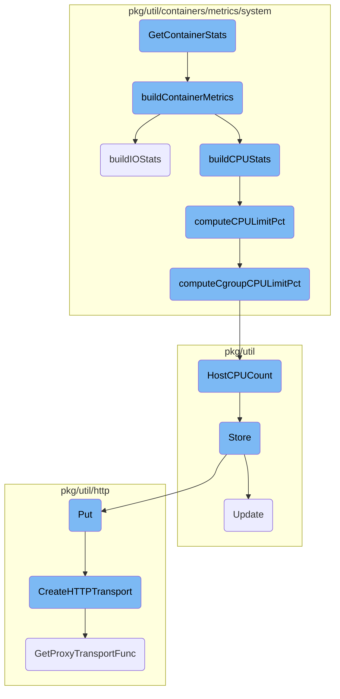
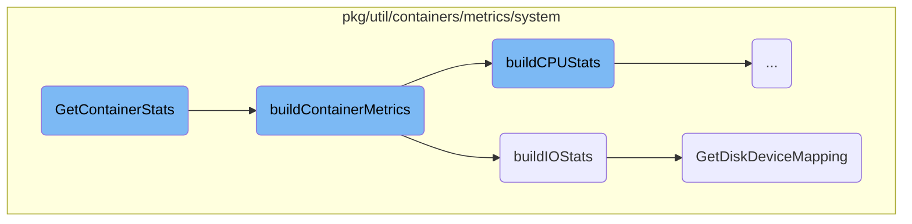
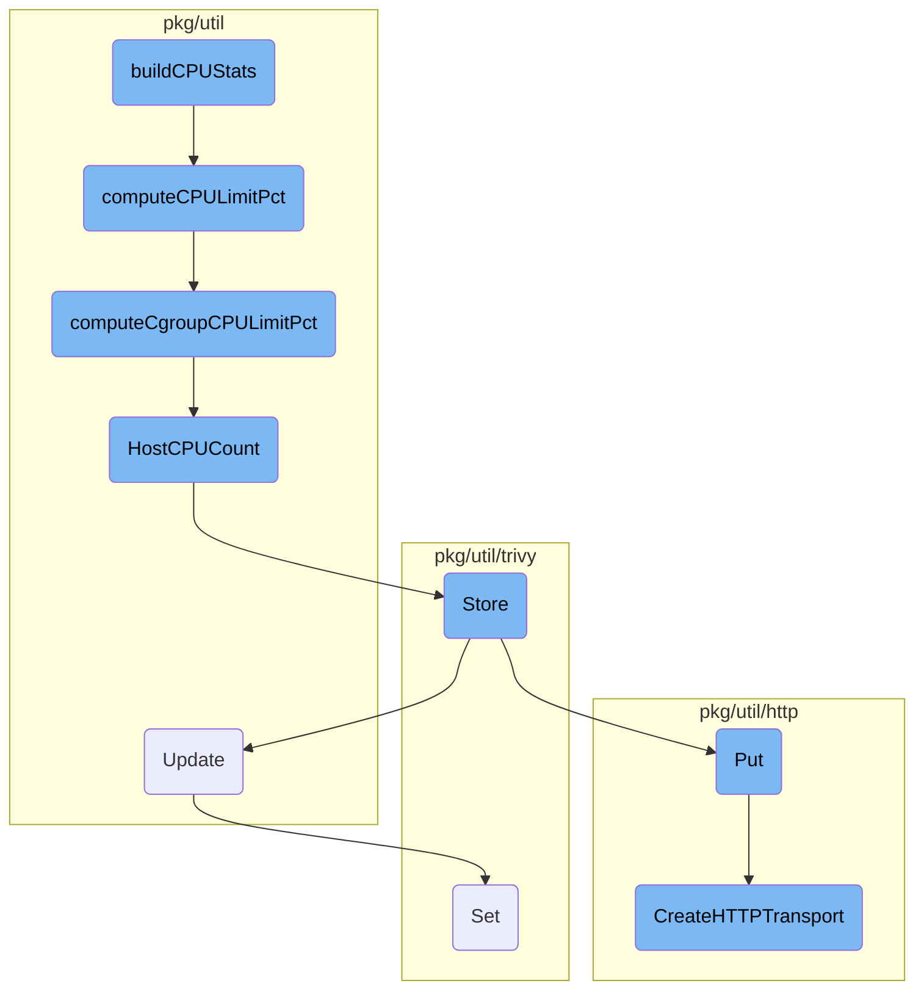

This document explains the process of gathering container statistics. It outlines the steps involved in fetching cgroup information, building container metrics, and gathering various statistics such as memory, CPU, IO, and PID.

The flow starts by fetching the cgroup information for a given container ID. Once the cgroup information is retrieved, the process moves on to building container metrics. This involves gathering various statistics like memory, CPU, IO, and PID. Helper functions are used to build these metrics, ensuring that all necessary data is collected and processed.

Here is a high level diagram of the flow, showing only the most important functions:



# Flow drill down

First, we'll zoom into this section of the flow:



<SwmSnippet path="/pkg/util/containers/metrics/system/collector_linux.go" line="178">

---

## <SwmToken path="pkg/util/containers/metrics/system/collector_linux.go" pos="178:9:9" line-data="func (c *systemCollector) GetContainerStats(_, containerID string, cacheValidity time.Duration) (*provider.ContainerStats, error) {">`GetContainerStats`</SwmToken>

The <SwmToken path="pkg/util/containers/metrics/system/collector_linux.go" pos="178:9:9" line-data="func (c *systemCollector) GetContainerStats(_, containerID string, cacheValidity time.Duration) (*provider.ContainerStats, error) {">`GetContainerStats`</SwmToken> function is responsible for retrieving the statistics of a container. It first fetches the cgroup information for the given container ID and then calls <SwmToken path="pkg/util/containers/metrics/system/collector_linux.go" pos="184:5:5" line-data="	return c.buildContainerMetrics(cg, cacheValidity)">`buildContainerMetrics`</SwmToken> to construct the container metrics.

```go
func (c *systemCollector) GetContainerStats(_, containerID string, cacheValidity time.Duration) (*provider.ContainerStats, error) {
	cg, err := c.getCgroup(containerID, cacheValidity)
	if err != nil {
		return nil, err
	}

	return c.buildContainerMetrics(cg, cacheValidity)
}
```

---

</SwmSnippet>

<SwmSnippet path="/pkg/util/containers/metrics/system/collector_linux.go" line="290">

---

## <SwmToken path="pkg/util/containers/metrics/system/collector_linux.go" pos="290:9:9" line-data="func (c *systemCollector) buildContainerMetrics(cg cgroups.Cgroup, _ time.Duration) (*provider.ContainerStats, error) {">`buildContainerMetrics`</SwmToken>

The <SwmToken path="pkg/util/containers/metrics/system/collector_linux.go" pos="290:9:9" line-data="func (c *systemCollector) buildContainerMetrics(cg cgroups.Cgroup, _ time.Duration) (*provider.ContainerStats, error) {">`buildContainerMetrics`</SwmToken> function constructs the container metrics by gathering various statistics such as memory, CPU, IO, and PID. It uses helper functions like <SwmToken path="pkg/util/containers/metrics/system/collector_linux.go" pos="313:4:4" line-data="		Memory:    buildMemoryStats(stats.Memory),">`buildMemoryStats`</SwmToken>, <SwmToken path="pkg/util/containers/metrics/system/collector_linux.go" pos="350:2:2" line-data="func buildCPUStats(cgs *cgroups.CPUStats, parentCPUStatsRetriever func(parentCPUStats *cgroups.CPUStats) error) *provider.ContainerCPUStats {">`buildCPUStats`</SwmToken>, and <SwmToken path="pkg/util/containers/metrics/system/collector_disk_linux.go" pos="30:2:2" line-data="func buildIOStats(procPath string, cgs *cgroups.IOStats) *provider.ContainerIOStats {">`buildIOStats`</SwmToken> to build these metrics.

```go
func (c *systemCollector) buildContainerMetrics(cg cgroups.Cgroup, _ time.Duration) (*provider.ContainerStats, error) {
	stats := &cgroups.Stats{}
	allFailed, errs := cgroups.GetStats(cg, stats)
	if allFailed {
		return nil, fmt.Errorf("cgroup parsing failed, no data for containerID: %s, err: %w", cg.Identifier(), multierror.Append(nil, errs...))
	} else if len(errs) > 0 {
		log.Debugf("Incomplete data when getting cgroup stats for cgroup id: %s, errs: %v", cg.Identifier(), errs)
	}

	parentCPUStatRetriever := func(parentCPUStats *cgroups.CPUStats) error {
		parentCg, err := cg.GetParent()
		if err != nil {
			return err
		}
		if parentCg == nil {
			return errors.New("no parent cgroup")
		}

		return parentCg.GetCPUStats(parentCPUStats)
	}

```

---

</SwmSnippet>

<SwmSnippet path="/pkg/util/containers/metrics/system/collector_disk_linux.go" line="30">

---

### <SwmToken path="pkg/util/containers/metrics/system/collector_disk_linux.go" pos="30:2:2" line-data="func buildIOStats(procPath string, cgs *cgroups.IOStats) *provider.ContainerIOStats {">`buildIOStats`</SwmToken>

The <SwmToken path="pkg/util/containers/metrics/system/collector_disk_linux.go" pos="30:2:2" line-data="func buildIOStats(procPath string, cgs *cgroups.IOStats) *provider.ContainerIOStats {">`buildIOStats`</SwmToken> function is used within <SwmToken path="pkg/util/containers/metrics/system/collector_linux.go" pos="184:5:5" line-data="	return c.buildContainerMetrics(cg, cacheValidity)">`buildContainerMetrics`</SwmToken> to gather IO statistics. It converts various IO fields and retrieves the disk device mapping using the <SwmToken path="pkg/util/containers/metrics/system/collector_disk_linux.go" pos="42:8:8" line-data="	deviceMapping, err := GetDiskDeviceMapping(procPath)">`GetDiskDeviceMapping`</SwmToken> function.

```go
func buildIOStats(procPath string, cgs *cgroups.IOStats) *provider.ContainerIOStats {
	if cgs == nil {
		return nil
	}
	cs := &provider.ContainerIOStats{}

	convertField(cgs.ReadBytes, &cs.ReadBytes)
	convertField(cgs.WriteBytes, &cs.WriteBytes)
	convertField(cgs.ReadOperations, &cs.ReadOperations)
	convertField(cgs.WriteOperations, &cs.WriteOperations)
	convertFieldAndUnit(cgs.PSISome.Total, &cs.PartialStallTime, float64(time.Microsecond))

	deviceMapping, err := GetDiskDeviceMapping(procPath)
	if err != nil {
		log.Debugf("Error while getting disk mapping, no disk metrics will be present, err:  %v", err)
		return cs
	}

	csDevicesStats := make(map[string]provider.DeviceIOStats, len(cgs.Devices))
	for deviceID, deviceStats := range cgs.Devices {
		if deviceName, found := deviceMapping[deviceID]; found {
```

---

</SwmSnippet>

<SwmSnippet path="/pkg/util/containers/metrics/system/collector_disk_linux.go" line="69">

---

### <SwmToken path="pkg/util/containers/metrics/system/collector_disk_linux.go" pos="69:2:2" line-data="// GetDiskDeviceMapping scrapes /proc/diskstats to build a mapping from">`GetDiskDeviceMapping`</SwmToken>

The <SwmToken path="pkg/util/containers/metrics/system/collector_disk_linux.go" pos="69:2:2" line-data="// GetDiskDeviceMapping scrapes /proc/diskstats to build a mapping from">`GetDiskDeviceMapping`</SwmToken> function builds a mapping from device numbers to device names by parsing the <SwmToken path="pkg/util/containers/metrics/system/collector_disk_linux.go" pos="69:6:9" line-data="// GetDiskDeviceMapping scrapes /proc/diskstats to build a mapping from">`/proc/diskstats`</SwmToken> file. This mapping is cached for efficiency.

```go
// GetDiskDeviceMapping scrapes /proc/diskstats to build a mapping from
// "major:minor" device numbers to device name.
// It is cached for 1 minute
// Format:
// 7       0 loop0 0 0 0 0 0 0 0 0 0 0 0
// 7       1 loop1 0 0 0 0 0 0 0 0 0 0 0
// 8       0 sda 24398 2788 1317975 40488 25201 46267 1584744 142336 0 22352 182660
// 8       1 sda1 24232 2788 1312025 40376 25201 46267 1584744 142336 0 22320 182552
// 8      16 sdb 189 0 4063 220 0 0 0 0 0 112 204
func GetDiskDeviceMapping(procPath string) (map[string]string, error) {
	// Cache lookup
	if cached, hit := cache.Cache.Get(diskMappingCacheKey); hit {
		if mapping, ok := cached.(map[string]string); ok {
			return mapping, nil
		}
	}

	// Cache miss, parse file
	statfile := filepath.Join(procPath, "diskstats")
	f, err := os.Open(statfile)
	if err != nil {
```

---

</SwmSnippet>

Now, lets zoom into this section of the flow:



<SwmSnippet path="/pkg/util/containers/metrics/system/collector_linux.go" line="350">

---

## <SwmToken path="pkg/util/containers/metrics/system/collector_linux.go" pos="350:2:2" line-data="func buildCPUStats(cgs *cgroups.CPUStats, parentCPUStatsRetriever func(parentCPUStats *cgroups.CPUStats) error) *provider.ContainerCPUStats {">`buildCPUStats`</SwmToken>

The <SwmToken path="pkg/util/containers/metrics/system/collector_linux.go" pos="350:2:2" line-data="func buildCPUStats(cgs *cgroups.CPUStats, parentCPUStatsRetriever func(parentCPUStats *cgroups.CPUStats) error) *provider.ContainerCPUStats {">`buildCPUStats`</SwmToken> function is responsible for constructing the CPU statistics for a container. It initializes a <SwmToken path="pkg/util/containers/metrics/system/collector_linux.go" pos="350:30:30" line-data="func buildCPUStats(cgs *cgroups.CPUStats, parentCPUStatsRetriever func(parentCPUStats *cgroups.CPUStats) error) *provider.ContainerCPUStats {">`ContainerCPUStats`</SwmToken> object and populates it with basic fields by converting values from the <SwmToken path="pkg/util/containers/metrics/system/collector_linux.go" pos="350:7:9" line-data="func buildCPUStats(cgs *cgroups.CPUStats, parentCPUStatsRetriever func(parentCPUStats *cgroups.CPUStats) error) *provider.ContainerCPUStats {">`cgroups.CPUStats`</SwmToken> structure. Additionally, it computes complex fields such as the CPU limit percentage by calling the <SwmToken path="pkg/util/containers/metrics/system/collector_linux.go" pos="368:12:12" line-data="	cs.Limit, cs.DefaultedLimit = computeCPULimitPct(cgs, parentCPUStatsRetriever)">`computeCPULimitPct`</SwmToken> function.

```go
func buildCPUStats(cgs *cgroups.CPUStats, parentCPUStatsRetriever func(parentCPUStats *cgroups.CPUStats) error) *provider.ContainerCPUStats {
	if cgs == nil {
		return nil
	}
	cs := &provider.ContainerCPUStats{}

	// Copy basid fields
	convertField(cgs.Total, &cs.Total)
	convertField(cgs.System, &cs.System)
	convertField(cgs.User, &cs.User)
	convertField(cgs.Shares, &cs.Shares)
	convertField(cgs.Weight, &cs.Weight)
	convertField(cgs.ElapsedPeriods, &cs.ElapsedPeriods)
	convertField(cgs.ThrottledPeriods, &cs.ThrottledPeriods)
	convertField(cgs.ThrottledTime, &cs.ThrottledTime)
	convertFieldAndUnit(cgs.PSISome.Total, &cs.PartialStallTime, float64(time.Microsecond))

	// Compute complex fields
	cs.Limit, cs.DefaultedLimit = computeCPULimitPct(cgs, parentCPUStatsRetriever)

	return cs
```

---

</SwmSnippet>

<SwmSnippet path="/pkg/util/containers/metrics/system/collector_linux.go" line="373">

---

## <SwmToken path="pkg/util/containers/metrics/system/collector_linux.go" pos="373:2:2" line-data="func computeCPULimitPct(cgs *cgroups.CPUStats, parentCPUStatsRetriever func(parentCPUStats *cgroups.CPUStats) error) (*float64, bool) {">`computeCPULimitPct`</SwmToken>

The <SwmToken path="pkg/util/containers/metrics/system/collector_linux.go" pos="373:2:2" line-data="func computeCPULimitPct(cgs *cgroups.CPUStats, parentCPUStatsRetriever func(parentCPUStats *cgroups.CPUStats) error) (*float64, bool) {">`computeCPULimitPct`</SwmToken> function calculates the CPU limit percentage for a container. It first attempts to compute the limit using the current cgroup's CPU statistics. If unsuccessful, it retrieves the parent cgroup's CPU statistics and tries again. If no limit is found, it defaults to the number of host <SwmToken path="pkg/util/containers/metrics/system/collector_linux.go" pos="385:26:26" line-data="	// If no limit is available, setting the limit to number of CPUs.">`CPUs`</SwmToken>, ensuring that a limit is always reported for accurate CPU percentage computation.

```go
func computeCPULimitPct(cgs *cgroups.CPUStats, parentCPUStatsRetriever func(parentCPUStats *cgroups.CPUStats) error) (*float64, bool) {
	limitPct := computeCgroupCPULimitPct(cgs)
	defaulted := false

	// Check parent cgroup as it's used on ECS
	if limitPct == nil {
		parentCPUStats := &cgroups.CPUStats{}
		if err := parentCPUStatsRetriever(parentCPUStats); err == nil {
			limitPct = computeCgroupCPULimitPct(parentCPUStats)
		}
	}

	// If no limit is available, setting the limit to number of CPUs.
	// Always reporting a limit allows to compute CPU % accurately.
	if limitPct == nil {
		limitPct = pointer.Ptr(float64(systemutils.HostCPUCount() * 100))
		defaulted = true
	}

	return limitPct, defaulted
```

---

</SwmSnippet>

&nbsp;

*This is an auto-generated document by Swimm AI 🌊 and has not yet been verified by a human*

<SwmMeta version="3.0.0" repo-id="Z2l0aHViJTNBJTNBZGF0YWRvZy1hZ2VudCUzQSUzQVN3aW1tLURlbW8=" repo-name="datadog-agent"><sup>Powered by [Swimm](/)</sup></SwmMeta>
