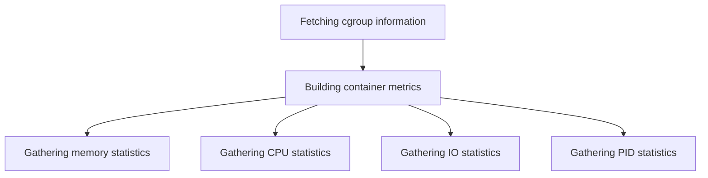

This document will cover the process of gathering container statistics, which includes:

1. Fetching cgroup information
2. Building container metrics
3. Gathering various statistics such as memory, CPU, IO, and PID.

Technical document: <SwmLink doc-title="Gathering Container Statistics">[Gathering Container Statistics](/.swm/gathering-container-statistics.el8uawmx.sw.md)</SwmLink>

# [Fetching cgroup information](https://app.swimm.io/repos/Z2l0aHViJTNBJTNBZGF0YWRvZy1hZ2VudCUzQSUzQVN3aW1tLURlbW8=/docs/el8uawmx#getcontainerstats)

The process begins by fetching the cgroup information for a given container ID. This step is crucial as it retrieves the necessary control group data that is used to monitor and limit the resources of the container. This information is essential for building accurate container metrics.

# [Building container metrics](https://app.swimm.io/repos/Z2l0aHViJTNBJTNBZGF0YWRvZy1hZ2VudCUzQSUzQVN3aW1tLURlbW8=/docs/el8uawmx#buildcontainermetrics)

Once the cgroup information is retrieved, the next step is to build the container metrics. This involves gathering various statistics such as memory, CPU, IO, and PID. Helper functions are used to build these metrics, ensuring that all necessary data is collected and processed. This step is important for providing a comprehensive view of the container's performance and resource usage.

# [Gathering memory statistics](https://app.swimm.io/repos/Z2l0aHViJTNBJTNBZGF0YWRvZy1hZ2VudCUzQSUzQVN3aW1tLURlbW8=/docs/el8uawmx#buildmemorystats)

Memory statistics are gathered to monitor the memory usage of the container. This includes data such as the total memory used, memory limits, and memory usage over time. These statistics help in understanding the memory consumption patterns of the container and identifying potential memory leaks or inefficiencies.

# [Gathering CPU statistics](https://app.swimm.io/repos/Z2l0aHViJTNBJTNBZGF0YWRvZy1hZ2VudCUzQSUzQVN3aW1tLURlbW8=/docs/el8uawmx#buildcpustats)

CPU statistics are gathered to monitor the CPU usage of the container. This includes data such as the total CPU time used, CPU limits, and CPU usage over time. These statistics help in understanding the CPU consumption patterns of the container and identifying potential CPU bottlenecks or inefficiencies.

# [Gathering IO statistics](https://app.swimm.io/repos/Z2l0aHViJTNBJTNBZGF0YWRvZy1hZ2VudCUzQSUzQVN3aW1tLURlbW8=/docs/el8uawmx#buildiostats)

IO statistics are gathered to monitor the input/output operations of the container. This includes data such as the total bytes read and written, the number of read and write operations, and the IO wait time. These statistics help in understanding the IO performance of the container and identifying potential IO bottlenecks or inefficiencies.

# [Gathering PID statistics](https://app.swimm.io/repos/Z2l0aHViJTNBJTNBZGF0YWRvZy1hZ2VudCUzQSUzQVN3aW1tLURlbW8=/docs/el8uawmx#buildpidstats)

PID statistics are gathered to monitor the process <SwmToken path="tasks/gitlab_helpers.py" pos="90:10:10" line-data="def print_gitlab_object(get_object, ctx, ids, repo=&#39;DataDog/datadog-agent&#39;, jq: str | None = None, jq_colors=True):">`ids`</SwmToken> of the container. This includes data such as the total number of processes, the number of running and sleeping processes, and the process creation rate. These statistics help in understanding the process management of the container and identifying potential issues with process creation or termination.

&nbsp;

*This is an auto-generated document by Swimm AI 🌊 and has not yet been verified by a human*

<SwmMeta version="3.0.0" repo-id="Z2l0aHViJTNBJTNBZGF0YWRvZy1hZ2VudCUzQSUzQVN3aW1tLURlbW8=" repo-name="datadog-agent">Powered by [Swimm](/)</SwmMeta>
