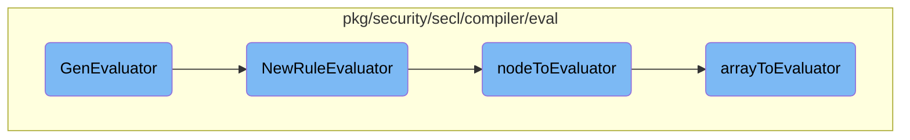

In this document, we will explain the process of generating and evaluating rules using the <SwmToken path="pkg/security/secl/compiler/eval/rule.go" pos="222:2:2" line-data="// GenEvaluator - Compile and generates the RuleEvaluator">`GenEvaluator`</SwmToken> function. The process involves setting the model, parsing the rule, creating a new rule evaluator, and handling any errors that occur during these steps.

The flow starts with setting the model for the rule. If the rule's abstract syntax tree (AST) is not already set, it parses the rule. After parsing, it creates a new rule evaluator. If any errors occur during this process, they are handled and returned appropriately.

# Flow drill down



<SwmSnippet path="/pkg/security/secl/compiler/eval/rule.go" line="222">

---

## <SwmToken path="pkg/security/secl/compiler/eval/rule.go" pos="222:2:2" line-data="// GenEvaluator - Compile and generates the RuleEvaluator">`GenEvaluator`</SwmToken>

The <SwmToken path="pkg/security/secl/compiler/eval/rule.go" pos="222:2:2" line-data="// GenEvaluator - Compile and generates the RuleEvaluator">`GenEvaluator`</SwmToken> function is responsible for compiling and generating the <SwmToken path="pkg/security/secl/compiler/eval/rule.go" pos="222:14:14" line-data="// GenEvaluator - Compile and generates the RuleEvaluator">`RuleEvaluator`</SwmToken>. It first sets the model for the rule and checks if the abstract syntax tree (AST) is nil. If the AST is nil, it parses the rule using the provided parsing context. After parsing, it calls <SwmToken path="pkg/security/secl/compiler/eval/rule.go" pos="232:8:8" line-data="	evaluator, err := NewRuleEvaluator(r.ast, model, r.Opts)">`NewRuleEvaluator`</SwmToken> to create a new evaluator for the rule. If any errors occur during this process, they are handled and returned appropriately.

```go
// GenEvaluator - Compile and generates the RuleEvaluator
func (r *Rule) GenEvaluator(model Model, parsingCtx *ast.ParsingContext) error {
	r.Model = model

	if r.ast == nil {
		if err := r.Parse(parsingCtx); err != nil {
			return err
		}
	}

	evaluator, err := NewRuleEvaluator(r.ast, model, r.Opts)
	if err != nil {
		if err, ok := err.(*ErrAstToEval); ok {
			return fmt.Errorf("rule syntax error: %s: %w", err, &ErrRuleParse{pos: err.Pos, expr: r.Expression})
		}
		return fmt.Errorf("rule compilation error: %w", err)
	}
	r.evaluator = evaluator

	return nil
}
```

---

</SwmSnippet>

<SwmSnippet path="/pkg/security/secl/compiler/eval/rule.go" line="184">

---

## <SwmToken path="pkg/security/secl/compiler/eval/rule.go" pos="184:2:2" line-data="// NewRuleEvaluator returns a new evaluator for a rule">`NewRuleEvaluator`</SwmToken>

The <SwmToken path="pkg/security/secl/compiler/eval/rule.go" pos="184:2:2" line-data="// NewRuleEvaluator returns a new evaluator for a rule">`NewRuleEvaluator`</SwmToken> function creates a new evaluator for a given rule. It initializes a state with the model and macros, then calls <SwmToken path="pkg/security/secl/compiler/eval/rule.go" pos="192:11:11" line-data="	eval, _, err := nodeToEvaluator(rule.BooleanExpression, opts, state)">`nodeToEvaluator`</SwmToken> to evaluate the rule's boolean expression. The function ensures that the evaluation result is a boolean evaluator and retrieves the event types from the model. If the evaluation function is nil, it wraps the value in a function. Finally, it returns a <SwmToken path="pkg/security/secl/compiler/eval/rule.go" pos="185:25:25" line-data="func NewRuleEvaluator(rule *ast.Rule, model Model, opts *Opts) (*RuleEvaluator, error) {">`RuleEvaluator`</SwmToken> containing the evaluation function, event types, and field values.

```go
// NewRuleEvaluator returns a new evaluator for a rule
func NewRuleEvaluator(rule *ast.Rule, model Model, opts *Opts) (*RuleEvaluator, error) {
	macros := make(map[MacroID]*MacroEvaluator)
	for _, macro := range opts.MacroStore.List() {
		macros[macro.ID] = macro.evaluator
	}
	state := NewState(model, "", macros)

	eval, _, err := nodeToEvaluator(rule.BooleanExpression, opts, state)
	if err != nil {
		return nil, err
	}

	evalBool, ok := eval.(*BoolEvaluator)
	if !ok {
		return nil, NewTypeError(rule.Pos, reflect.Bool)
	}

	events, err := eventTypesFromFields(model, state)
	if err != nil {
		return nil, err
```

---

</SwmSnippet>

<SwmSnippet path="/pkg/security/secl/compiler/eval/eval.go" line="419">

---

## <SwmToken path="pkg/security/secl/compiler/eval/eval.go" pos="419:2:2" line-data="func nodeToEvaluator(obj interface{}, opts *Opts, state *State) (interface{}, lexer.Position, error) {">`nodeToEvaluator`</SwmToken>

The <SwmToken path="pkg/security/secl/compiler/eval/eval.go" pos="419:2:2" line-data="func nodeToEvaluator(obj interface{}, opts *Opts, state *State) (interface{}, lexer.Position, error) {">`nodeToEvaluator`</SwmToken> function recursively evaluates different types of AST nodes, such as boolean expressions, comparisons, and arithmetic operations. It handles various cases, including logical operations (AND, OR), bit operations, and array comparisons. The function ensures that the types of operands are correct and performs the necessary operations to return the appropriate evaluator.

```go
func nodeToEvaluator(obj interface{}, opts *Opts, state *State) (interface{}, lexer.Position, error) {
	var err error
	var boolEvaluator *BoolEvaluator
	var pos lexer.Position
	var cmp, unary, next interface{}

	switch obj := obj.(type) {
	case *ast.BooleanExpression:
		return nodeToEvaluator(obj.Expression, opts, state)
	case *ast.Expression:
		cmp, pos, err = nodeToEvaluator(obj.Comparison, opts, state)
		if err != nil {
			return nil, pos, err
		}

		if obj.Op != nil {
			cmpBool, ok := cmp.(*BoolEvaluator)
			if !ok {
				return nil, obj.Pos, NewTypeError(obj.Pos, reflect.Bool)
			}

```

---

</SwmSnippet>

<SwmSnippet path="/pkg/security/secl/compiler/eval/eval.go" line="156">

---

## <SwmToken path="pkg/security/secl/compiler/eval/eval.go" pos="156:2:2" line-data="func arrayToEvaluator(array *ast.Array, opts *Opts, state *State) (interface{}, lexer.Position, error) {">`arrayToEvaluator`</SwmToken>

The <SwmToken path="pkg/security/secl/compiler/eval/eval.go" pos="156:2:2" line-data="func arrayToEvaluator(array *ast.Array, opts *Opts, state *State) (interface{}, lexer.Position, error) {">`arrayToEvaluator`</SwmToken> function evaluates array nodes in the AST. It handles arrays of numbers, strings, identifiers, variables, and CIDR values. Depending on the type of array elements, it creates the corresponding evaluator (e.g., <SwmToken path="pkg/security/secl/compiler/eval/eval.go" pos="158:5:5" line-data="		var evaluator IntArrayEvaluator">`IntArrayEvaluator`</SwmToken>, <SwmToken path="pkg/security/secl/compiler/eval/eval.go" pos="162:5:5" line-data="		var evaluator StringValuesEvaluator">`StringValuesEvaluator`</SwmToken>, <SwmToken path="pkg/security/secl/compiler/eval/eval.go" pos="199:5:5" line-data="			var evaluator BoolArrayEvaluator">`BoolArrayEvaluator`</SwmToken>). The function also supports evaluating arrays of constants and ensures that the types of constants are consistent.

```go
func arrayToEvaluator(array *ast.Array, opts *Opts, state *State) (interface{}, lexer.Position, error) {
	if len(array.Numbers) != 0 {
		var evaluator IntArrayEvaluator
		evaluator.AppendValues(array.Numbers...)
		return &evaluator, array.Pos, nil
	} else if len(array.StringMembers) != 0 {
		var evaluator StringValuesEvaluator
		evaluator.AppendMembers(array.StringMembers...)
		return &evaluator, array.Pos, nil
	} else if array.Ident != nil {
		if state.macros != nil {
			if macro, ok := state.macros[*array.Ident]; ok {
				return macro.Value, array.Pos, nil
			}
		}

		// could be an iterator
		return identToEvaluator(&ident{Pos: array.Pos, Ident: array.Ident}, opts, state)
	} else if len(array.Idents) != 0 {
		// Only "Constants" idents are supported, and only string, int and boolean constants are expected.
		// Determine the type with the first ident
```

---

</SwmSnippet>

&nbsp;

*This is an auto-generated document by Swimm AI 🌊 and has not yet been verified by a human*

<SwmMeta version="3.0.0" repo-id="Z2l0aHViJTNBJTNBZGF0YWRvZy1hZ2VudCUzQSUzQVN3aW1tLURlbW8=" repo-name="datadog-agent"><sup>Powered by [Swimm](/)</sup></SwmMeta>
