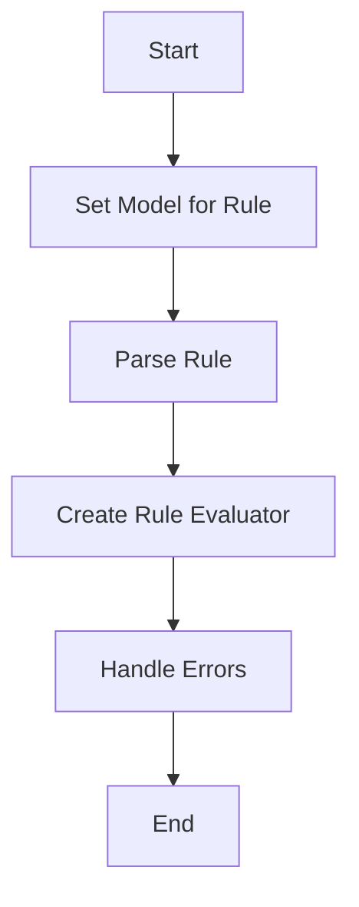

This document will cover the process of generating and evaluating rules, which includes:

1. Setting the model for the rule
2. Parsing the rule
3. Creating a new rule evaluator
4. Handling errors during the process.

Technical document: <SwmLink doc-title="Generating and Evaluating Rules">[Generating and Evaluating Rules](/.swm/generating-and-evaluating-rules.29dwrzxu.sw.md)</SwmLink>

# [Setting the Model for the Rule](https://app.swimm.io/repos/Z2l0aHViJTNBJTNBZGF0YWRvZy1hZ2VudCUzQSUzQVN3aW1tLURlbW8=/docs/29dwrzxu#genevaluator)

The process begins by setting the model for the rule. The model represents the structure and behavior that the rule will follow. This step ensures that the rule has a defined context and framework to operate within. For the end user, this means that the rule will be evaluated based on a specific set of criteria and conditions defined by the model.

# [Parsing the Rule](https://app.swimm.io/repos/Z2l0aHViJTNBJTNBZGF0YWRvZy1hZ2VudCUzQSUzQVN3aW1tLURlbW8=/docs/29dwrzxu#genevaluator)

If the rule's abstract syntax tree (AST) is not already set, the rule needs to be parsed. Parsing the rule involves analyzing the rule's syntax and converting it into a structured format that can be evaluated. This step is crucial for ensuring that the rule is syntactically correct and can be processed further. For the end user, this means that any rule they create will be checked for syntax errors before being evaluated.

# [Creating a New Rule Evaluator](https://app.swimm.io/repos/Z2l0aHViJTNBJTNBZGF0YWRvZy1hZ2VudCUzQSUzQVN3aW1tLURlbW8=/docs/29dwrzxu#newruleevaluator)

After parsing, a new rule evaluator is created. The rule evaluator is responsible for assessing the rule's conditions and determining whether they are met. This involves initializing a state with the model and any macros, and then evaluating the rule's boolean expression. For the end user, this means that their rules will be actively evaluated against the defined model, ensuring that the conditions specified in the rule are accurately checked.

# [Handling Errors](https://app.swimm.io/repos/Z2l0aHViJTNBJTNBZGF0YWRvZy1hZ2VudCUzQSUzQVN3aW1tLURlbW8=/docs/29dwrzxu#genevaluator)

During the process of setting the model, parsing the rule, and creating the rule evaluator, errors may occur. These errors need to be handled appropriately to ensure that the rule evaluation process is robust and reliable. If any errors are encountered, they are returned with detailed information about what went wrong. For the end user, this means that they will receive clear feedback if there are issues with their rules, allowing them to make necessary corrections.

&nbsp;

*This is an auto-generated document by Swimm AI 🌊 and has not yet been verified by a human*

<SwmMeta version="3.0.0" repo-id="Z2l0aHViJTNBJTNBZGF0YWRvZy1hZ2VudCUzQSUzQVN3aW1tLURlbW8=" repo-name="datadog-agent">Powered by [Swimm](/)</SwmMeta>
