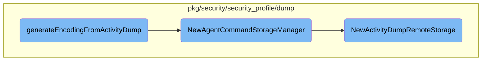

This document outlines the process of generating encoding from an activity dump. The process involves creating an empty activity dump, decoding the input file, parsing storage requests, and setting up storage managers to handle the storage of the activity dump.

The process starts by creating an empty activity dump and decoding the input file. It then parses the storage requests and adds them to the activity dump. After loading the configuration, a storage manager is created to handle the storage of the activity dump. Finally, the activity dump is converted to a transcoding request message, and any errors are checked.

# Flow drill down



<SwmSnippet path="/cmd/system-probe/subcommands/runtime/activity_dump.go" line="363">

---

## Generating Encoding from Activity Dump

The function <SwmToken path="cmd/system-probe/subcommands/runtime/activity_dump.go" pos="363:2:2" line-data="func generateEncodingFromActivityDump(_ log.Component, _ config.Component, _ secrets.Component, activityDumpArgs *activityDumpCliParams) error {">`generateEncodingFromActivityDump`</SwmToken> handles the process of generating encoding from an activity dump. It starts by creating an empty activity dump and decoding the input file. It then parses storage requests and adds them to the activity dump. After loading the configuration, it creates a storage manager using <SwmToken path="pkg/security/security_profile/dump/storage_manager.go" pos="54:2:2" line-data="// NewAgentCommandStorageManager returns a new instance of ActivityDumpStorageManager">`NewAgentCommandStorageManager`</SwmToken> and persists the activity dump. Finally, it converts the activity dump to a transcoding request message and checks for errors.

```go
func generateEncodingFromActivityDump(_ log.Component, _ config.Component, _ secrets.Component, activityDumpArgs *activityDumpCliParams) error {
	var output *api.TranscodingRequestMessage

	// encoding request will be handled locally
	ad := dump.NewEmptyActivityDump(nil)

	// open and parse input file
	if err := ad.Decode(activityDumpArgs.file); err != nil {
		return err
	}
	parsedRequests, err := parseStorageRequest(activityDumpArgs)
	if err != nil {
		return err
	}

	storageRequests, err := secconfig.ParseStorageRequests(parsedRequests)
	if err != nil {
		return fmt.Errorf("couldn't parse transcoding request for [%s]: %v", ad.GetSelectorStr(), err)
	}
	for _, request := range storageRequests {
		ad.AddStorageRequest(request)
```

---

</SwmSnippet>

<SwmSnippet path="/pkg/security/security_profile/dump/storage_manager.go" line="54">

---

### Creating Storage Manager

The function <SwmToken path="pkg/security/security_profile/dump/storage_manager.go" pos="54:2:2" line-data="// NewAgentCommandStorageManager returns a new instance of ActivityDumpStorageManager">`NewAgentCommandStorageManager`</SwmToken> creates a new instance of <SwmToken path="pkg/security/security_profile/dump/storage_manager.go" pos="54:14:14" line-data="// NewAgentCommandStorageManager returns a new instance of ActivityDumpStorageManager">`ActivityDumpStorageManager`</SwmToken>. It initializes local storage and remote storage by calling <SwmToken path="pkg/security/security_profile/dump/storage_manager.go" pos="60:8:8" line-data="	storage, err := NewActivityDumpLocalStorage(cfg, nil)">`NewActivityDumpLocalStorage`</SwmToken> and <SwmToken path="pkg/security/security_profile/dump/storage_manager.go" pos="67:8:8" line-data="	remote, err := NewActivityDumpRemoteStorage()">`NewActivityDumpRemoteStorage`</SwmToken> respectively. These storages are then added to the manager's storage map.

```go
// NewAgentCommandStorageManager returns a new instance of ActivityDumpStorageManager
func NewAgentCommandStorageManager(cfg *config.Config) (*ActivityDumpStorageManager, error) {
	manager := &ActivityDumpStorageManager{
		storages: make(map[config.StorageType]ActivityDumpStorage),
	}

	storage, err := NewActivityDumpLocalStorage(cfg, nil)
	if err != nil {
		return nil, fmt.Errorf("couldn't instantiate storage: %w", err)
	}
	manager.storages[storage.GetStorageType()] = storage

	// create remote storage
	remote, err := NewActivityDumpRemoteStorage()
	if err != nil {
		return nil, fmt.Errorf("couldn't instantiate remote storage: %w", err)
	}
	manager.storages[remote.GetStorageType()] = remote

	return manager, nil
```

---

</SwmSnippet>

<SwmSnippet path="/pkg/security/security_profile/dump/remote_storage.go" line="47">

---

### Setting Up Remote Storage

The function <SwmToken path="pkg/security/security_profile/dump/remote_storage.go" pos="47:2:2" line-data="// NewActivityDumpRemoteStorage returns a new instance of ActivityDumpRemoteStorage">`NewActivityDumpRemoteStorage`</SwmToken> sets up remote storage for activity dumps. It initializes the storage with a map for tracking large entities and an HTTP client. It then generates storage endpoints and appends them to the storage's URL list along with their corresponding API keys.

```go
// NewActivityDumpRemoteStorage returns a new instance of ActivityDumpRemoteStorage
func NewActivityDumpRemoteStorage() (ActivityDumpStorage, error) {
	storage := &ActivityDumpRemoteStorage{
		tooLargeEntities: make(map[tooLargeEntityStatsEntry]*atomic.Uint64),
		client: &http.Client{
			Transport: ddhttputil.CreateHTTPTransport(pkgconfig.Datadog()),
		},
	}

	for _, format := range config.AllStorageFormats() {
		for _, compression := range []bool{true, false} {
			entry := tooLargeEntityStatsEntry{
				storageFormat: format,
				compression:   compression,
			}
			storage.tooLargeEntities[entry] = atomic.NewUint64(0)
		}
	}

	endpoints, err := config.ActivityDumpRemoteStorageEndpoints("cws-intake.", "secdump", logsconfig.DefaultIntakeProtocol, "cloud-workload-security")
	if err != nil {
```

---

</SwmSnippet>

&nbsp;

*This is an auto-generated document by Swimm AI 🌊 and has not yet been verified by a human*

<SwmMeta version="3.0.0" repo-id="Z2l0aHViJTNBJTNBZGF0YWRvZy1hZ2VudCUzQSUzQVN3aW1tLURlbW8=" repo-name="datadog-agent"><sup>Powered by [Swimm](/)</sup></SwmMeta>
