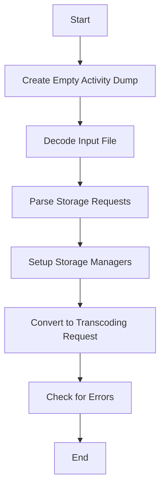

This document will cover the process of generating encoding from an activity dump, which includes:

1. Creating an empty activity dump
2. Decoding the input file
3. Parsing storage requests
4. Setting up storage managers
5. Converting the activity dump to a transcoding request message.

Technical document: <SwmLink doc-title="Generating Encoding from Activity Dump">[Generating Encoding from Activity Dump](/.swm/generating-encoding-from-activity-dump.m2bpur3j.sw.md)</SwmLink>

# [Creating an Empty Activity Dump](https://app.swimm.io/repos/Z2l0aHViJTNBJTNBZGF0YWRvZy1hZ2VudCUzQSUzQVN3aW1tLURlbW8=/docs/m2bpur3j#creating-an-empty-activity-dump)

The process begins by creating an empty activity dump. This step initializes a new activity dump object that will be used to store the decoded data and parsed storage requests. This empty activity dump serves as a container for all subsequent data processing steps.

# [Decoding the Input File](https://app.swimm.io/repos/Z2l0aHViJTNBJTNBZGF0YWRvZy1hZ2VudCUzQSUzQVN3aW1tLURlbW8=/docs/m2bpur3j#decoding-the-input-file)

Next, the input file containing the activity data is decoded. This step involves reading the input file and extracting the relevant activity data. The decoded data is then stored in the previously created empty activity dump. This step ensures that the raw activity data is available for further processing.

# [Parsing Storage Requests](https://app.swimm.io/repos/Z2l0aHViJTNBJTNBZGF0YWRvZy1hZ2VudCUzQSUzQVN3aW1tLURlbW8=/docs/m2bpur3j#parsing-storage-requests)

After decoding the input file, the next step is to parse the storage requests. Storage requests specify how and where the activity data should be stored. These requests are extracted from the decoded data and added to the activity dump. This step ensures that the activity data is associated with the appropriate storage instructions.

# [Setting Up Storage Managers](https://app.swimm.io/repos/Z2l0aHViJTNBJTNBZGF0YWRvZy1hZ2VudCUzQSUzQVN3aW1tLURlbW8=/docs/m2bpur3j#creating-storage-manager)

Once the storage requests have been parsed, a storage manager is created to handle the storage of the activity dump. The storage manager is responsible for managing both local and remote storage options. It initializes the necessary storage mechanisms and ensures that the activity data can be stored according to the specified requests.

# [Converting to Transcoding Request](https://app.swimm.io/repos/Z2l0aHViJTNBJTNBZGF0YWRvZy1hZ2VudCUzQSUzQVN3aW1tLURlbW8=/docs/m2bpur3j#converting-the-activity-dump-to-a-transcoding-request-message)

Finally, the activity dump is converted into a transcoding request message. This step involves transforming the activity data and storage requests into a format that can be processed by the transcoding system. The transcoding request message is then ready to be sent for further processing. Any errors encountered during this process are checked and handled appropriately.

&nbsp;

*This is an auto-generated document by Swimm AI 🌊 and has not yet been verified by a human*

<SwmMeta version="3.0.0" repo-id="Z2l0aHViJTNBJTNBZGF0YWRvZy1hZ2VudCUzQSUzQVN3aW1tLURlbW8=" repo-name="datadog-agent">Powered by [Swimm](/)</SwmMeta>
