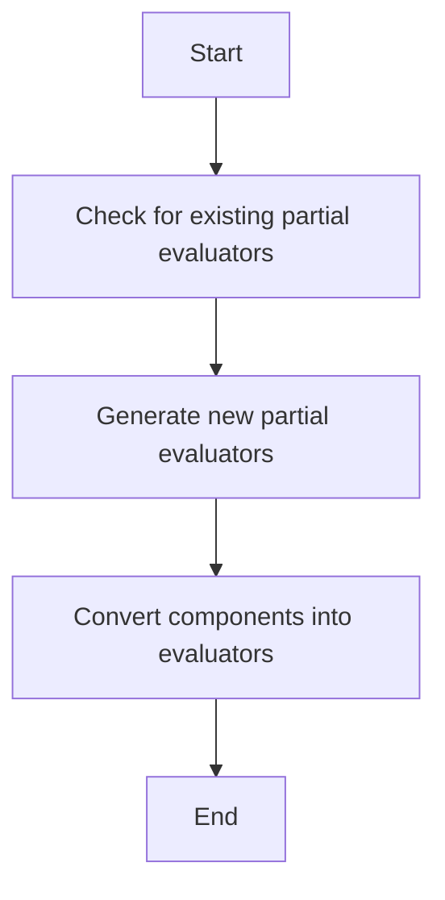

This document will cover the process of generating partial evaluators for a given field within a rule. We'll cover:

1. Checking for existing partial evaluators
2. Generating new partial evaluators
3. Converting components into evaluators.

Technical document: <SwmLink doc-title="Generating Partial Evaluators">[Generating Partial Evaluators](/.swm/generating-partial-evaluators.u3nouz0g.sw.md)</SwmLink>

# [Checking for existing partial evaluators](https://app.swimm.io/repos/Z2l0aHViJTNBJTNBZGF0YWRvZy1hZ2VudCUzQSUzQVN3aW1tLURlbW8=/docs/u3nouz0g#getpartialeval)

The process begins by checking if a partial evaluator already exists for the specified field. This step ensures that we do not duplicate efforts by generating new evaluators unnecessarily. If a partial evaluator is found, it is returned immediately, saving time and resources.

# [Generating new partial evaluators](https://app.swimm.io/repos/Z2l0aHViJTNBJTNBZGF0YWRvZy1hZ2VudCUzQSUzQVN3aW1tLURlbW8=/docs/u3nouz0g#genpartials)

If no existing partial evaluator is found, the system proceeds to generate new partial evaluators. This involves compiling the necessary components to create a new evaluator. The process includes generating macro partials and converting nodes into evaluators. This step ensures that the rule can be evaluated efficiently by breaking it down into smaller, manageable parts.

# [Converting components into evaluators](https://app.swimm.io/repos/Z2l0aHViJTNBJTNBZGF0YWRvZy1hZ2VudCUzQSUzQVN3aW1tLURlbW8=/docs/u3nouz0g#nodetoevaluator)

The final step involves converting various components into evaluators. This includes handling different types of nodes such as Boolean expressions, comparisons, and arithmetic operations. Each component is converted into an evaluator that can be used to assess the rule's conditions. This step is crucial for ensuring that the rule evaluation process is both accurate and efficient.

&nbsp;

*This is an auto-generated document by Swimm AI 🌊 and has not yet been verified by a human*

<SwmMeta version="3.0.0" repo-id="Z2l0aHViJTNBJTNBZGF0YWRvZy1hZ2VudCUzQSUzQVN3aW1tLURlbW8=" repo-name="datadog-agent">Powered by [Swimm](/)</SwmMeta>
