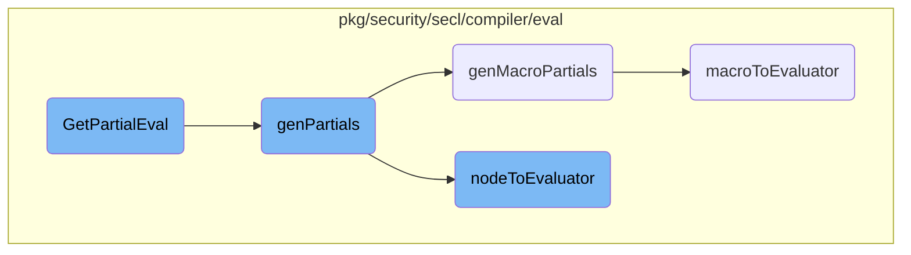

This document explains the process of generating partial evaluators for a given field within a rule. The process involves checking for existing partial evaluators, generating new ones if necessary, and converting various components into evaluators.

The flow starts by checking if a partial evaluator already exists for a given field. If it doesn't, the system generates new partial evaluators by compiling the necessary components. This involves generating macro partials and converting nodes into evaluators. The process ensures that the rule can be evaluated efficiently by breaking it down into smaller, manageable parts.

# Flow drill down



<SwmSnippet path="/pkg/security/secl/compiler/eval/rule.go" line="120">

---

## <SwmToken path="pkg/security/secl/compiler/eval/rule.go" pos="120:2:2" line-data="// GetPartialEval - Returns the Partial RuleEvaluator for the given Field">`GetPartialEval`</SwmToken>

The <SwmToken path="pkg/security/secl/compiler/eval/rule.go" pos="120:2:2" line-data="// GetPartialEval - Returns the Partial RuleEvaluator for the given Field">`GetPartialEval`</SwmToken> function is responsible for returning the partial <SwmToken path="pkg/security/secl/compiler/eval/rule.go" pos="120:12:12" line-data="// GetPartialEval - Returns the Partial RuleEvaluator for the given Field">`RuleEvaluator`</SwmToken> for a given field. If the partial evaluator does not exist, it calls <SwmToken path="pkg/security/secl/compiler/eval/rule.go" pos="124:9:9" line-data="		if err := r.genPartials(field); err != nil {">`genPartials`</SwmToken> to generate it.

```go
// GetPartialEval - Returns the Partial RuleEvaluator for the given Field
func (r *Rule) GetPartialEval(field Field) BoolEvalFnc {
	partial, exists := r.evaluator.partialEvals[field]
	if !exists {
		if err := r.genPartials(field); err != nil {
			return nil
		}
		partial = r.evaluator.partialEvals[field]
	}

	return partial
}
```

---

</SwmSnippet>

<SwmSnippet path="/pkg/security/secl/compiler/eval/rule.go" line="269">

---

## <SwmToken path="pkg/security/secl/compiler/eval/rule.go" pos="269:2:2" line-data="// GenPartials - Compiles and generates partial Evaluators">`GenPartials`</SwmToken>

The <SwmToken path="pkg/security/secl/compiler/eval/rule.go" pos="269:2:2" line-data="// GenPartials - Compiles and generates partial Evaluators">`GenPartials`</SwmToken> function compiles and generates partial evaluators. It first checks if the field is part of the rule's fields. If so, it generates macro partials and then creates a new state to generate the partial evaluator using <SwmToken path="pkg/security/secl/compiler/eval/rule.go" pos="281:11:11" line-data="	pEval, _, err := nodeToEvaluator(r.ast.BooleanExpression, r.Opts, state)">`nodeToEvaluator`</SwmToken>.

```go
// GenPartials - Compiles and generates partial Evaluators
func (r *Rule) genPartials(field Field) error {
	if !slices.Contains(r.GetFields(), field) {
		return nil
	}

	macroPartial, err := r.genMacroPartials(field)
	if err != nil {
		return err
	}

	state := NewState(r.Model, field, macroPartial)
	pEval, _, err := nodeToEvaluator(r.ast.BooleanExpression, r.Opts, state)
	if err != nil {
		return fmt.Errorf("couldn't generate partial for field %s and rule %s: %w", field, r.ID, err)
	}

	pEvalBool, ok := pEval.(*BoolEvaluator)
	if !ok {
		return NewTypeError(r.ast.Pos, reflect.Bool)
	}
```

---

</SwmSnippet>

<SwmSnippet path="/pkg/security/secl/compiler/eval/rule.go" line="244">

---

### <SwmToken path="pkg/security/secl/compiler/eval/rule.go" pos="244:9:9" line-data="func (r *Rule) genMacroPartials(field Field) (map[MacroID]*MacroEvaluator, error) {">`genMacroPartials`</SwmToken>

The <SwmToken path="pkg/security/secl/compiler/eval/rule.go" pos="244:9:9" line-data="func (r *Rule) genMacroPartials(field Field) (map[MacroID]*MacroEvaluator, error) {">`genMacroPartials`</SwmToken> function generates macro partial evaluators for a given field. It iterates over the macros in the <SwmToken path="pkg/security/secl/compiler/eval/rule.go" pos="246:16:16" line-data="	for _, macro := range r.Opts.MacroStore.List() {">`MacroStore`</SwmToken> and converts each macro's AST to an evaluator using <SwmToken path="pkg/security/secl/compiler/eval/rule.go" pos="252:8:8" line-data="			evaluator, err = macroToEvaluator(macro.ast, r.Model, r.Opts, field)">`macroToEvaluator`</SwmToken>.

```go
func (r *Rule) genMacroPartials(field Field) (map[MacroID]*MacroEvaluator, error) {
	macroEvaluators := make(map[MacroID]*MacroEvaluator)
	for _, macro := range r.Opts.MacroStore.List() {
		var err error
		var evaluator *MacroEvaluator
		if macro.ast != nil {
			// NOTE(safchain) this is not working with nested macro. It will be removed once partial
			// will be generated another way
			evaluator, err = macroToEvaluator(macro.ast, r.Model, r.Opts, field)
			if err != nil {
				if err, ok := err.(*ErrAstToEval); ok {
					return nil, fmt.Errorf("macro syntax error: %w", &ErrRuleParse{pos: err.Pos})
				}
				return nil, fmt.Errorf("macro compilation error: %w", err)
			}
		} else {
			evaluator = macro.GetEvaluator()
		}

		macroEvaluators[macro.ID] = evaluator
	}
```

---

</SwmSnippet>

<SwmSnippet path="/pkg/security/secl/compiler/eval/eval.go" line="419">

---

### <SwmToken path="pkg/security/secl/compiler/eval/eval.go" pos="419:2:2" line-data="func nodeToEvaluator(obj interface{}, opts *Opts, state *State) (interface{}, lexer.Position, error) {">`nodeToEvaluator`</SwmToken>

The <SwmToken path="pkg/security/secl/compiler/eval/eval.go" pos="419:2:2" line-data="func nodeToEvaluator(obj interface{}, opts *Opts, state *State) (interface{}, lexer.Position, error) {">`nodeToEvaluator`</SwmToken> function recursively converts AST nodes to evaluators. It handles various types of AST nodes such as Boolean expressions, comparisons, and arithmetic operations, and returns the corresponding evaluator.

```go
func nodeToEvaluator(obj interface{}, opts *Opts, state *State) (interface{}, lexer.Position, error) {
	var err error
	var boolEvaluator *BoolEvaluator
	var pos lexer.Position
	var cmp, unary, next interface{}

	switch obj := obj.(type) {
	case *ast.BooleanExpression:
		return nodeToEvaluator(obj.Expression, opts, state)
	case *ast.Expression:
		cmp, pos, err = nodeToEvaluator(obj.Comparison, opts, state)
		if err != nil {
			return nil, pos, err
		}

		if obj.Op != nil {
			cmpBool, ok := cmp.(*BoolEvaluator)
			if !ok {
				return nil, obj.Pos, NewTypeError(obj.Pos, reflect.Bool)
			}

```

---

</SwmSnippet>

<SwmSnippet path="/pkg/security/secl/compiler/eval/macro.go" line="97">

---

### <SwmToken path="pkg/security/secl/compiler/eval/macro.go" pos="97:2:2" line-data="func macroToEvaluator(macro *ast.Macro, model Model, opts *Opts, field Field) (*MacroEvaluator, error) {">`macroToEvaluator`</SwmToken>

The <SwmToken path="pkg/security/secl/compiler/eval/macro.go" pos="97:2:2" line-data="func macroToEvaluator(macro *ast.Macro, model Model, opts *Opts, field Field) (*MacroEvaluator, error) {">`macroToEvaluator`</SwmToken> function converts a macro's AST to a <SwmToken path="pkg/security/secl/compiler/eval/macro.go" pos="97:30:30" line-data="func macroToEvaluator(macro *ast.Macro, model Model, opts *Opts, field Field) (*MacroEvaluator, error) {">`MacroEvaluator`</SwmToken>. It creates a new state and uses <SwmToken path="pkg/security/secl/compiler/eval/macro.go" pos="109:11:11" line-data="		eval, _, err = nodeToEvaluator(macro.Expression, opts, state)">`nodeToEvaluator`</SwmToken> to generate the evaluator for the macro's expression, array, or primary node.

```go
func macroToEvaluator(macro *ast.Macro, model Model, opts *Opts, field Field) (*MacroEvaluator, error) {
	macros := make(map[MacroID]*MacroEvaluator)
	for _, macro := range opts.MacroStore.List() {
		macros[macro.ID] = macro.evaluator
	}
	state := NewState(model, field, macros)

	var eval interface{}
	var err error

	switch {
	case macro.Expression != nil:
		eval, _, err = nodeToEvaluator(macro.Expression, opts, state)
	case macro.Array != nil:
		eval, _, err = nodeToEvaluator(macro.Array, opts, state)
	case macro.Primary != nil:
		eval, _, err = nodeToEvaluator(macro.Primary, opts, state)
	}

	if err != nil {
		return nil, err
```

---

</SwmSnippet>

&nbsp;

*This is an auto-generated document by Swimm AI 🌊 and has not yet been verified by a human*

<SwmMeta version="3.0.0" repo-id="Z2l0aHViJTNBJTNBZGF0YWRvZy1hZ2VudCUzQSUzQVN3aW1tLURlbW8=" repo-name="datadog-agent"><sup>Powered by [Swimm](/)</sup></SwmMeta>
