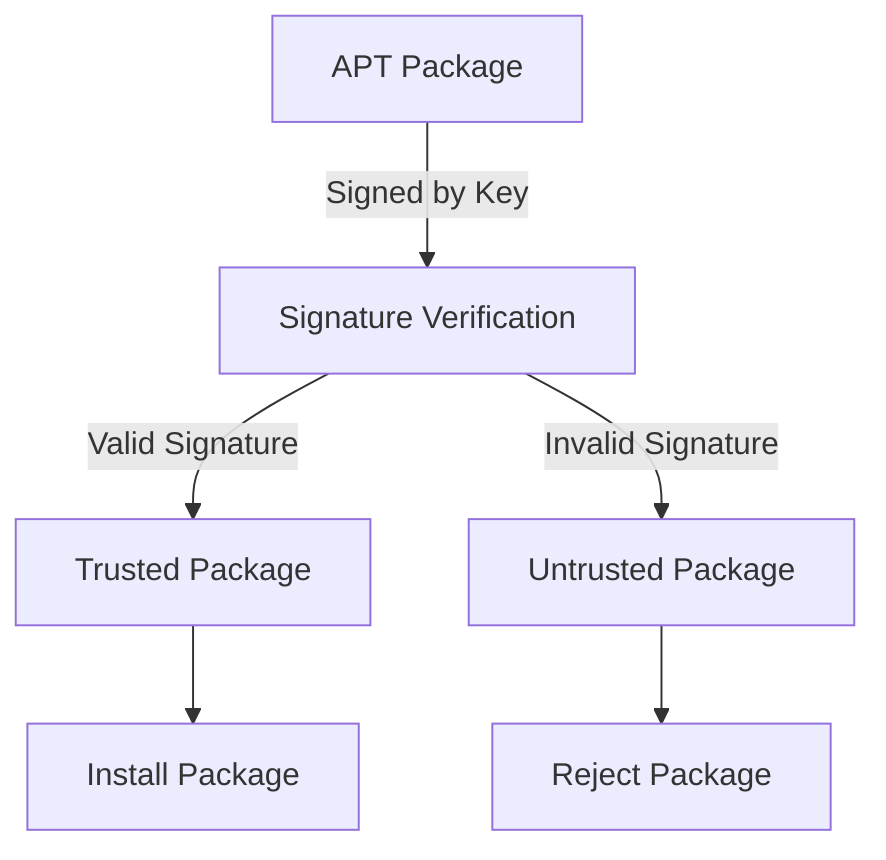

# Introduction

APT signing refers to the process of managing and verifying the signatures of APT packages to ensure their authenticity and integrity. This document will guide you through the steps to get started with APT signing, including retrieving APT signature keys, updating with trusted keys, updating with <SwmToken path="comp/metadata/packagesigning/packagesigningimpl/aptsigning.go" pos="44:23:25" line-data="	// Regular files are referenced in the sources.list file by signed-by=filename">`signed-by`</SwmToken> keys, and retrieving debsig key paths.

# Retrieving APT Signature Keys

The <SwmToken path="comp/metadata/packagesigning/packagesigningimpl/aptsigning.go" pos="36:2:2" line-data="// getAPTSignatureKeys returns the list of debian signature keys">`getAPTSignatureKeys`</SwmToken> function retrieves a list of Debian signature keys by reading from various sources such as trusted keys, <SwmToken path="comp/metadata/packagesigning/packagesigningimpl/aptsigning.go" pos="44:23:25" line-data="	// Regular files are referenced in the sources.list file by signed-by=filename">`signed-by`</SwmToken> keys, and debsig keys.

<SwmSnippet path="/comp/metadata/packagesigning/packagesigningimpl/aptsigning.go" line="36">

---

The <SwmToken path="comp/metadata/packagesigning/packagesigningimpl/aptsigning.go" pos="36:2:2" line-data="// getAPTSignatureKeys returns the list of debian signature keys">`getAPTSignatureKeys`</SwmToken> function initializes a cache for the keys and updates it by calling <SwmToken path="comp/metadata/packagesigning/packagesigningimpl/aptsigning.go" pos="40:5:5" line-data="	err := updateWithTrustedKeys(cacheKeys, client)">`updateWithTrustedKeys`</SwmToken>, <SwmToken path="comp/metadata/packagesigning/packagesigningimpl/aptsigning.go" pos="45:5:5" line-data="	err = updateWithSignedByKeys(cacheKeys, client)">`updateWithSignedByKeys`</SwmToken>, and <SwmToken path="comp/metadata/packagesigning/packagesigningimpl/aptsigning.go" pos="50:8:8" line-data="	keyPaths, err := getDebsigKeyPaths()">`getDebsigKeyPaths`</SwmToken>. It reads from legacy <SwmToken path="comp/metadata/packagesigning/packagesigningimpl/aptsigning.go" pos="39:27:31" line-data="	// debian 11 and ubuntu 22.04 will be the last using legacy trusted.gpg.d folder and trusted.gpg file">`trusted.gpg.d`</SwmToken> folders, <SwmToken path="comp/metadata/packagesigning/packagesigningimpl/aptsigning.go" pos="44:15:17" line-data="	// Regular files are referenced in the sources.list file by signed-by=filename">`sources.list`</SwmToken> files, and debsig policies.

```go
// getAPTSignatureKeys returns the list of debian signature keys
func getAPTSignatureKeys(client *http.Client, logger log.Component) []signingKey {
	cacheKeys := make(map[string]signingKey)
	// debian 11 and ubuntu 22.04 will be the last using legacy trusted.gpg.d folder and trusted.gpg file
	err := updateWithTrustedKeys(cacheKeys, client)
	if err != nil {
		logger.Debugf("Error while reading trusted keys: %s", err)
	}
	// Regular files are referenced in the sources.list file by signed-by=filename
	err = updateWithSignedByKeys(cacheKeys, client)
	if err != nil {
		logger.Debugf("Error while reading signed-by keys: %s", err)
	}
	// In APT we can also sign packages with debsig
	keyPaths, err := getDebsigKeyPaths()
	if err != nil {
		logger.Debugf("Error while reading debsig keys: %s", err)
	}
	for _, keyPath := range keyPaths {
		err = readGPGFile(cacheKeys, repoFile{filename: keyPath, repositories: nil}, "debsig", client)
		if err != nil {
```

---

</SwmSnippet>

# Updating with Trusted Keys

The <SwmToken path="comp/metadata/packagesigning/packagesigningimpl/aptsigning.go" pos="40:5:5" line-data="	err := updateWithTrustedKeys(cacheKeys, client)">`updateWithTrustedKeys`</SwmToken> function updates the cache of signature keys by reading from the legacy <SwmToken path="comp/metadata/packagesigning/packagesigningimpl/aptsigning.go" pos="39:27:31" line-data="	// debian 11 and ubuntu 22.04 will be the last using legacy trusted.gpg.d folder and trusted.gpg file">`trusted.gpg.d`</SwmToken> folder and <SwmToken path="comp/metadata/packagesigning/packagesigningimpl/aptsigning.go" pos="39:27:29" line-data="	// debian 11 and ubuntu 22.04 will be the last using legacy trusted.gpg.d folder and trusted.gpg file">`trusted.gpg`</SwmToken> file.

<SwmSnippet path="/comp/metadata/packagesigning/packagesigningimpl/aptsigning.go" line="69">

---

The <SwmToken path="comp/metadata/packagesigning/packagesigningimpl/aptsigning.go" pos="69:2:2" line-data="func updateWithTrustedKeys(cacheKeys map[string]signingKey, client *http.Client) error {">`updateWithTrustedKeys`</SwmToken> function checks for the existence of the <SwmToken path="comp/metadata/packagesigning/packagesigningimpl/aptsigning.go" pos="70:27:31" line-data="	// debian 11 and ubuntu 22.04 will be the last using legacy trusted.gpg.d folder and trusted.gpg file">`trusted.gpg.d`</SwmToken> folder and <SwmToken path="comp/metadata/packagesigning/packagesigningimpl/aptsigning.go" pos="70:27:29" line-data="	// debian 11 and ubuntu 22.04 will be the last using legacy trusted.gpg.d folder and trusted.gpg file">`trusted.gpg`</SwmToken> file. It reads each file and updates the cache with the keys found.

```go
func updateWithTrustedKeys(cacheKeys map[string]signingKey, client *http.Client) error {
	// debian 11 and ubuntu 22.04 will be the last using legacy trusted.gpg.d folder and trusted.gpg file
	if _, err := os.Stat(trustedFolder); err != nil {
		return err
	}
	if files, err := os.ReadDir(trustedFolder); err == nil {
		for _, file := range files {
			trustedFileName := filepath.Join(trustedFolder, file.Name())
			err = readGPGFile(cacheKeys, repoFile{trustedFileName, nil}, "trusted", client)
			if err != nil {
				return err
			}
		}
	}
	if _, err := os.Stat(trustedFile); err != nil {
		return err
	}
	return readGPGFile(cacheKeys, repoFile{trustedFile, nil}, "trusted", client)
}
```

---

</SwmSnippet>

# Updating with <SwmToken path="comp/metadata/packagesigning/packagesigningimpl/aptsigning.go" pos="44:23:25" line-data="	// Regular files are referenced in the sources.list file by signed-by=filename">`signed-by`</SwmToken> Keys

The <SwmToken path="comp/metadata/packagesigning/packagesigningimpl/aptsigning.go" pos="45:5:5" line-data="	err = updateWithSignedByKeys(cacheKeys, client)">`updateWithSignedByKeys`</SwmToken> function updates the cache of signature keys by reading from the <SwmToken path="comp/metadata/packagesigning/packagesigningimpl/aptsigning.go" pos="44:15:17" line-data="	// Regular files are referenced in the sources.list file by signed-by=filename">`sources.list`</SwmToken> file and other source list files, looking for repositories that specify a <SwmToken path="comp/metadata/packagesigning/packagesigningimpl/aptsigning.go" pos="44:23:25" line-data="	// Regular files are referenced in the sources.list file by signed-by=filename">`signed-by`</SwmToken> key.

<SwmSnippet path="/comp/metadata/packagesigning/packagesigningimpl/aptsigning.go" line="89">

---

The <SwmToken path="comp/metadata/packagesigning/packagesigningimpl/aptsigning.go" pos="89:2:2" line-data="func updateWithSignedByKeys(cacheKeys map[string]signingKey, client *http.Client) error {">`updateWithSignedByKeys`</SwmToken> function reads the <SwmToken path="comp/metadata/packagesigning/packagesigningimpl/aptsigning.go" pos="44:15:17" line-data="	// Regular files are referenced in the sources.list file by signed-by=filename">`sources.list`</SwmToken> file and other source list files to find repositories that specify a <SwmToken path="comp/metadata/packagesigning/packagesigningimpl/aptsigning.go" pos="99:20:22" line-data="		err := readGPGFile(cacheKeys, repoFile{name, repos}, &quot;signed-by&quot;, client)">`signed-by`</SwmToken> key. It then updates the cache with the keys found.

```go
func updateWithSignedByKeys(cacheKeys map[string]signingKey, client *http.Client) error {
	gpgcheck, err := pkgUtils.IsPackageSigningEnabled()
	if err != nil {
		return err
	}
	if _, err := os.Stat(mainSourceList); err != nil {
		return err
	}
	reposPerKey := parseSourceListFile(mainSourceList, gpgcheck)
	for name, repos := range reposPerKey {
		err := readGPGFile(cacheKeys, repoFile{name, repos}, "signed-by", client)
		if err != nil {
			return err
		}
	}

	if _, err := os.Stat(sourceList); err != nil {
		return err
	}
	if files, err := os.ReadDir(sourceList); err == nil {
		for _, file := range files {
```

---

</SwmSnippet>

# Retrieving Debsig Key Paths

The <SwmToken path="comp/metadata/packagesigning/packagesigningimpl/aptsigning.go" pos="50:8:8" line-data="	keyPaths, err := getDebsigKeyPaths()">`getDebsigKeyPaths`</SwmToken> function retrieves the paths of debsig keys by reading policy files and extracting the required GPG file names.

<SwmSnippet path="/comp/metadata/packagesigning/packagesigningimpl/aptsigning.go" line="158">

---

The <SwmToken path="comp/metadata/packagesigning/packagesigningimpl/aptsigning.go" pos="158:2:2" line-data="func getDebsigKeyPaths() ([]string, error) {">`getDebsigKeyPaths`</SwmToken> function searches in the policy files for GPG file names and verifies their existence. It returns the paths of the valid debsig keys.

```go
func getDebsigKeyPaths() ([]string, error) {
	filePaths := make(map[string]struct{})
	// Search in the policy files
	if _, err := os.Stat(debsigPolicies); err != nil {
		return nil, err
	}
	if debsigDirs, err := os.ReadDir(debsigPolicies); err == nil {
		for _, debsigDir := range debsigDirs {
			if debsigDir.IsDir() {
				if policyFiles, err := os.ReadDir(filepath.Join(debsigPolicies, debsigDir.Name())); err == nil {
					for _, policyFile := range policyFiles {
						// Get the gpg file name from policy files
						if debsigFile := getDebsigFileFromPolicy(filepath.Join(debsigPolicies, debsigDir.Name(), policyFile.Name())); debsigFile != "" {
							debsigFilePath := filepath.Join(debsigKeyring, debsigDir.Name(), debsigFile)
							if _, err := os.Stat(debsigFilePath); err == nil {
								filePaths[debsigFilePath] = struct{}{}
							} else {
								return nil, err
							}
						}
					}
```

---

</SwmSnippet>

&nbsp;

*This is an auto-generated document by Swimm AI 🌊 and has not yet been verified by a human*

<SwmMeta version="3.0.0" repo-id="Z2l0aHViJTNBJTNBZGF0YWRvZy1hZ2VudCUzQSUzQVN3aW1tLURlbW8=" repo-name="datadog-agent"><sup>Powered by [Swimm](/)</sup></SwmMeta>
