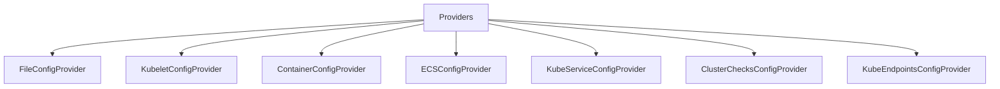

# Getting Started with Autodiscovery Providers

Autodiscovery Providers in Datadog Agent are responsible for scanning various sources such as files on disk, environment variables, databases, or containers and objects metadata to search for integration configurations. Each provider implements the <SwmToken path="comp/core/autodiscovery/providers/providers.go" pos="21:22:22" line-data="	factory func(providerConfig *config.ConfigurationProviders, telemetryStore *telemetry.Store) (ConfigProvider, error),">`ConfigProvider`</SwmToken> interface and dumps every configuration it finds into a `CheckConfig` struct containing an array of configuration instances. These instances are converted into YAML format so that a check object can eventually convert them into the appropriate data structure.

## Types of Providers

There are various types of providers, each designed to detect check configurations from specific sources. Some of the common providers include:

- `FileConfigProvider`
- `KubeletConfigProvider`
- `ContainerConfigProvider`
- `ECSConfigProvider`
- `KubeServiceConfigProvider`
- `ClusterChecksConfigProvider`
- `KubeEndpointsConfigProvider`

## Registering Providers

The <SwmToken path="comp/core/autodiscovery/providers/providers.go" pos="19:2:2" line-data="// RegisterProvider adds a loader to the providers catalog">`RegisterProvider`</SwmToken> function is used to add a loader to the providers catalog. This function takes the name of the provider, a factory function to create the provider, and the provider catalog where the provider will be registered.

<SwmSnippet path="/comp/core/autodiscovery/providers/providers.go" line="19">

---

The <SwmToken path="comp/core/autodiscovery/providers/providers.go" pos="19:2:2" line-data="// RegisterProvider adds a loader to the providers catalog">`RegisterProvider`</SwmToken> function ensures that the provider is registered with the necessary components and is available for use in the catalog.

```go
// RegisterProvider adds a loader to the providers catalog
func RegisterProvider(name string,
	factory func(providerConfig *config.ConfigurationProviders, telemetryStore *telemetry.Store) (ConfigProvider, error),
	providerCatalog map[string]ConfigProviderFactory) {
	RegisterProviderWithComponents(
		name,
		func(providerConfig *config.ConfigurationProviders, wmeta workloadmeta.Component, telemetryStore *telemetry.Store) (ConfigProvider, error) {
			return factory(providerConfig, telemetryStore)
		},
		providerCatalog,
	)
}
```

---

</SwmSnippet>

## Registering Default Providers

The <SwmToken path="comp/core/autodiscovery/providers/providers.go" pos="46:2:2" line-data="// RegisterProviders adds all the default providers to the catalog">`RegisterProviders`</SwmToken> function adds all the default providers to the catalog. It calls <SwmToken path="comp/core/autodiscovery/providers/providers.go" pos="19:2:2" line-data="// RegisterProvider adds a loader to the providers catalog">`RegisterProvider`</SwmToken> for each default provider, ensuring they are all registered and available for use.

## Collecting Configurations

The <SwmToken path="comp/core/autodiscovery/providers/providers.go" pos="89:3:3" line-data="	// Collect is responsible of populating a list of Config instances by">`Collect`</SwmToken> function is responsible for populating a list of configuration instances by retrieving configuration patterns from external resources. It is a key function for providers that do not support streaming.

<SwmSnippet path="/comp/core/autodiscovery/providers/providers.go" line="89">

---

The <SwmToken path="comp/core/autodiscovery/providers/providers.go" pos="89:3:3" line-data="	// Collect is responsible of populating a list of Config instances by">`Collect`</SwmToken> function retrieves configuration patterns from external resources.

```go
	// Collect is responsible of populating a list of Config instances by
	// retrieving configuration patterns from external resources.
	Collect(context.Context) ([]integration.Config, error)

	// IsUpToDate determines whether the information returned from the last
	// call to Collect is still correct.  If not, Collect will be called again.
	IsUpToDate(context.Context) (bool, error)
}
```

---

</SwmSnippet>

## Checking Configuration Updates

The <SwmToken path="comp/core/autodiscovery/providers/providers.go" pos="93:3:3" line-data="	// IsUpToDate determines whether the information returned from the last">`IsUpToDate`</SwmToken> function determines whether the information returned from the last call to <SwmToken path="comp/core/autodiscovery/providers/providers.go" pos="89:3:3" line-data="	// Collect is responsible of populating a list of Config instances by">`Collect`</SwmToken> is still correct. If not, <SwmToken path="comp/core/autodiscovery/providers/providers.go" pos="89:3:3" line-data="	// Collect is responsible of populating a list of Config instances by">`Collect`</SwmToken> will be called again.

<SwmSnippet path="/comp/core/autodiscovery/providers/providers.go" line="93">

---

The <SwmToken path="comp/core/autodiscovery/providers/providers.go" pos="93:3:3" line-data="	// IsUpToDate determines whether the information returned from the last">`IsUpToDate`</SwmToken> function checks if the collected information is still correct.

```go
	// IsUpToDate determines whether the information returned from the last
	// call to Collect is still correct.  If not, Collect will be called again.
	IsUpToDate(context.Context) (bool, error)
}
```

---

</SwmSnippet>

## Streaming Configurations

The <SwmToken path="comp/core/autodiscovery/providers/providers.go" pos="102:3:3" line-data="	// Stream starts the streaming config provider until the provided">`Stream`</SwmToken> function starts the streaming config provider until the provided context is cancelled. Config changes are sent on the return channel, making it suitable for providers that support streaming.

<SwmSnippet path="/comp/core/autodiscovery/providers/providers.go" line="102">

---

The <SwmToken path="comp/core/autodiscovery/providers/providers.go" pos="102:3:3" line-data="	// Stream starts the streaming config provider until the provided">`Stream`</SwmToken> function starts the streaming config provider and sends config changes on the return channel.

```go
	// Stream starts the streaming config provider until the provided
	// context is cancelled. Config changes are sent on the return channel.
	Stream(context.Context) <-chan integration.ConfigChanges
}
```

---

</SwmSnippet>

## Example Usage

Here is an example of how to use Providers in the Datadog Agent:

<SwmSnippet path="/comp/core/autodiscovery/providers/providers.go" line="1">

---

Example code demonstrating how to use Providers in the Datadog Agent.

```go
// Unless explicitly stated otherwise all files in this repository are licensed
// under the Apache License Version 2.0.
// This product includes software developed at Datadog (https://www.datadoghq.com/).
// Copyright 2016-present Datadog, Inc.

```

---

</SwmSnippet>

&nbsp;

*This is an auto-generated document by Swimm AI 🌊 and has not yet been verified by a human*

<SwmMeta version="3.0.0" repo-id="Z2l0aHViJTNBJTNBZGF0YWRvZy1hZ2VudCUzQSUzQVN3aW1tLURlbW8=" repo-name="datadog-agent"><sup>Powered by [Swimm](/)</sup></SwmMeta>
