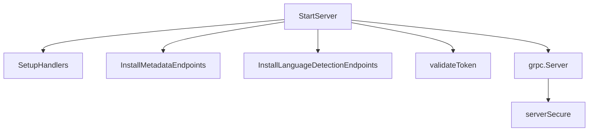

<SwmSnippet path="/cmd/cluster-agent/api/server.go" line="55">

---

# API Initialization

The <SwmToken path="cmd/cluster-agent/api/server.go" pos="55:2:2" line-data="// StartServer creates the router and starts the HTTP server">`StartServer`</SwmToken> function initializes the API server by setting up the HTTP router and subrouters for different API versions. It configures TLS for secure communication and initializes authentication tokens.

```go
// StartServer creates the router and starts the HTTP server
func StartServer(ctx context.Context, w workloadmeta.Component, taggerComp tagger.Component, ac autodiscovery.Component, statusComponent status.Component, settings settings.Component, cfg config.Component) error {
	// create the root HTTP router
	router = mux.NewRouter()
	apiRouter = router.PathPrefix("/api/v1").Subrouter()

	// IPC REST API server
	agent.SetupHandlers(router, w, ac, statusComponent, settings)

	// API V1 Metadata APIs
	v1.InstallMetadataEndpoints(apiRouter, w)

	// API V1 Language Detection APIs
	languagedetection.InstallLanguageDetectionEndpoints(ctx, apiRouter, w, cfg)

	// Validate token for every request
	router.Use(validateToken)

	// get the transport we're going to use under HTTP
	var err error
	listener, err = getListener()
```

---

</SwmSnippet>

<SwmSnippet path="/cmd/cluster-agent/api/agent/agent.go" line="34">

---

# Setting Up Handlers

The <SwmToken path="cmd/cluster-agent/api/agent/agent.go" pos="34:2:2" line-data="// SetupHandlers adds the specific handlers for cluster agent endpoints">`SetupHandlers`</SwmToken> function registers the specific handlers for various cluster agent endpoints, such as version, hostname, flare, stop, status, <SwmToken path="cmd/cluster-agent/api/agent/agent.go" pos="44:7:9" line-data="	r.HandleFunc(&quot;/config-check&quot;, func(w http.ResponseWriter, r *http.Request) {">`config-check`</SwmToken>, <SwmToken path="cmd/cluster-agent/api/agent/agent.go" pos="51:7:9" line-data="	r.HandleFunc(&quot;/tagger-list&quot;, getTaggerList).Methods(&quot;GET&quot;)">`tagger-list`</SwmToken>, and <SwmToken path="cmd/cluster-agent/api/agent/agent.go" pos="52:7:9" line-data="	r.HandleFunc(&quot;/workload-list&quot;, func(w http.ResponseWriter, r *http.Request) {">`workload-list`</SwmToken>.

```go
// SetupHandlers adds the specific handlers for cluster agent endpoints
func SetupHandlers(r *mux.Router, wmeta workloadmeta.Component, ac autodiscovery.Component, statusComponent status.Component, settings settings.Component) {
	r.HandleFunc("/version", getVersion).Methods("GET")
	r.HandleFunc("/hostname", getHostname).Methods("GET")
	r.HandleFunc("/flare", func(w http.ResponseWriter, r *http.Request) {
		makeFlare(w, r, statusComponent)
	}).Methods("POST")
	r.HandleFunc("/stop", stopAgent).Methods("POST")
	r.HandleFunc("/status", func(w http.ResponseWriter, r *http.Request) { getStatus(w, r, statusComponent) }).Methods("GET")
	r.HandleFunc("/status/health", getHealth).Methods("GET")
	r.HandleFunc("/config-check", func(w http.ResponseWriter, r *http.Request) {
		getConfigCheck(w, r, ac)
	}).Methods("GET")
	r.HandleFunc("/config", settings.GetFullConfig("")).Methods("GET")
	r.HandleFunc("/config/list-runtime", settings.ListConfigurable).Methods("GET")
	r.HandleFunc("/config/{setting}", settings.GetValue).Methods("GET")
	r.HandleFunc("/config/{setting}", settings.SetValue).Methods("POST")
	r.HandleFunc("/tagger-list", getTaggerList).Methods("GET")
	r.HandleFunc("/workload-list", func(w http.ResponseWriter, r *http.Request) {
		getWorkloadList(w, r, wmeta)
	}).Methods("GET")
```

---

</SwmSnippet>

<SwmSnippet path="/cmd/cluster-agent/api/v1/install.go" line="21">

---

# Metadata Endpoints

The <SwmToken path="cmd/cluster-agent/api/v1/install.go" pos="21:2:2" line-data="// InstallMetadataEndpoints registers endpoints for metadata">`InstallMetadataEndpoints`</SwmToken> function registers endpoints for metadata-related operations. It installs either Cloud Foundry or Kubernetes metadata endpoints based on the configuration.

```go
// InstallMetadataEndpoints registers endpoints for metadata
func InstallMetadataEndpoints(r *mux.Router, w workloadmeta.Component) {
	log.Debug("Registering metadata endpoints")
	if config.Datadog().GetBool("cloud_foundry") {
		installCloudFoundryMetadataEndpoints(r)
	} else {
		installKubernetesMetadataEndpoints(r, w)
	}
}
```

---

</SwmSnippet>

<SwmSnippet path="/cmd/cluster-agent/api/v1/languagedetection/handler.go" line="43">

---

# Language Detection Endpoints

The <SwmToken path="cmd/cluster-agent/api/server.go" pos="68:3:3" line-data="	languagedetection.InstallLanguageDetectionEndpoints(ctx, apiRouter, w, cfg)">`InstallLanguageDetectionEndpoints`</SwmToken> function sets up the endpoints for language detection <SwmToken path="cmd/cluster-agent/api/server.go" pos="64:9:9" line-data="	// API V1 Metadata APIs">`APIs`</SwmToken>. It processes requests, extracts detected languages, and pushes them to the workload metadata store.

```go
func newLanguageDetectionHandler(wlm workloadmeta.Component, cfg config.Component) *languageDetectionHandler {
	return &languageDetectionHandler{
		cfg: handlerConfig{
			enabled:       cfg.GetBool("language_detection.enabled"),
			languageTTL:   cfg.GetDuration("cluster_agent.language_detection.cleanup.language_ttl"),
			cleanupPeriod: cfg.GetDuration("cluster_agent.language_detection.cleanup.period"),
		},
		wlm:             wlm,
		ownersLanguages: newOwnersLanguages(),
	}
}
```

---

</SwmSnippet>

<SwmSnippet path="/cmd/cluster-agent/api/server.go" line="165">

---

# Token Validation

The <SwmToken path="cmd/cluster-agent/api/server.go" pos="165:2:2" line-data="func validateToken(next http.Handler) http.Handler {">`validateToken`</SwmToken> function is middleware that validates tokens for incoming requests, ensuring that only authorized requests are processed.

```go
func validateToken(next http.Handler) http.Handler {
	return http.HandlerFunc(func(w http.ResponseWriter, r *http.Request) {
		path := r.URL.String()
		var isValid bool
		if !isExternalPath(path) {
			if err := util.Validate(w, r); err == nil {
				isValid = true
			}
		}
		if !isValid {
			if err := util.ValidateDCARequest(w, r); err != nil {
				return
			}
		}
		next.ServeHTTP(w, r)
	})
}
```

---

</SwmSnippet>

<SwmSnippet path="/cmd/cluster-agent/api/grpc.go" line="1">

---

# <SwmToken path="cmd/cluster-agent/api/server.go" pos="30:8:8" line-data="	grpc_auth &quot;github.com/grpc-ecosystem/go-grpc-middleware/auth&quot;">`grpc`</SwmToken> Server

The <SwmToken path="cmd/cluster-agent/api/grpc.go" pos="16:2:2" line-data="type serverSecure struct {">`serverSecure`</SwmToken> struct implements the <SwmToken path="cmd/cluster-agent/api/server.go" pos="30:8:8" line-data="	grpc_auth &quot;github.com/grpc-ecosystem/go-grpc-middleware/auth&quot;">`grpc`</SwmToken> server methods, providing secure communication channels for internal components like the tagger server.

```go
// Unless explicitly stated otherwise all files in this repository are licensed
// under the Apache License Version 2.0.
// This product includes software developed at Datadog (https://www.datadoghq.com/).
// Copyright 2016-present Datadog, Inc.

package api

import (
	"context"

	pbgo "github.com/DataDog/datadog-agent/pkg/proto/pbgo/core"

	taggerserver "github.com/DataDog/datadog-agent/comp/core/tagger/taggerimpl/server"
)

type serverSecure struct {
	pbgo.UnimplementedAgentSecureServer

	taggerServer *taggerserver.Server
}
```

---

</SwmSnippet>

# Cluster Agent Endpoints

## <SwmPath>[cmd/agent/subcommands/version/](cmd/agent/subcommands/version/)</SwmPath>

The <SwmPath>[cmd/agent/subcommands/version/](cmd/agent/subcommands/version/)</SwmPath> endpoint is used to retrieve the current version of the Datadog Agent. It is handled by the <SwmToken path="cmd/cluster-agent/api/agent/agent.go" pos="36:11:11" line-data="	r.HandleFunc(&quot;/version&quot;, getVersion).Methods(&quot;GET&quot;)">`getVersion`</SwmToken> function, which responds to GET requests by returning the agent's version in JSON format.

## <SwmPath>[cmd/agent/subcommands/hostname/](cmd/agent/subcommands/hostname/)</SwmPath>

The <SwmPath>[cmd/agent/subcommands/hostname/](cmd/agent/subcommands/hostname/)</SwmPath> endpoint is used to retrieve the hostname of the machine where the Datadog Agent is running. It is handled by the <SwmToken path="cmd/cluster-agent/api/agent/agent.go" pos="37:11:11" line-data="	r.HandleFunc(&quot;/hostname&quot;, getHostname).Methods(&quot;GET&quot;)">`getHostname`</SwmToken> function, which responds to GET requests by returning the hostname in JSON format.

&nbsp;

*This is an auto-generated document by Swimm AI 🌊 and has not yet been verified by a human*

<SwmMeta version="3.0.0" repo-id="Z2l0aHViJTNBJTNBZGF0YWRvZy1hZ2VudCUzQSUzQVN3aW1tLURlbW8=" repo-name="datadog-agent"><sup>Powered by [Swimm](/)</sup></SwmMeta>
