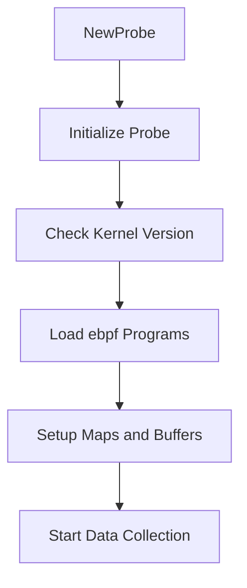

# Getting Started with <SwmToken path="pkg/collector/corechecks/ebpf/probe/oomkill/oom_kill.go" pos="48:7:7" line-data="func NewProbe(cfg *ebpf.Config) (*Probe, error) {">`ebpf`</SwmToken> Probe

This document provides a comprehensive guide on getting started with the <SwmToken path="pkg/collector/corechecks/ebpf/probe/oomkill/oom_kill.go" pos="48:7:7" line-data="func NewProbe(cfg *ebpf.Config) (*Probe, error) {">`ebpf`</SwmToken> Probe in the Datadog Agent. The <SwmToken path="pkg/collector/corechecks/ebpf/probe/oomkill/oom_kill.go" pos="48:7:7" line-data="func NewProbe(cfg *ebpf.Config) (*Probe, error) {">`ebpf`</SwmToken> Probe is a crucial component within the <SwmToken path="pkg/collector/corechecks/ebpf/probe/oomkill/oom_kill.go" pos="48:7:7" line-data="func NewProbe(cfg *ebpf.Config) (*Probe, error) {">`ebpf`</SwmToken> check <SwmToken path="pkg/collector/corechecks/ebpf/probe/oomkill/oom_kill.go" pos="11:10:12" line-data="// Package oomkill is the system-probe side of the OOM Kill check">`system-probe`</SwmToken>, responsible for collecting and managing various eBPF-related data.

## Probe Initialization

The <SwmToken path="pkg/collector/corechecks/ebpf/probe/oomkill/oom_kill.go" pos="47:2:2" line-data="// NewProbe creates a [Probe]">`NewProbe`</SwmToken> function is used to create and initialize a new Probe instance. It checks the kernel version and configuration settings to ensure compatibility. This function loads the <SwmToken path="pkg/collector/corechecks/ebpf/probe/oomkill/oom_kill.go" pos="48:7:7" line-data="func NewProbe(cfg *ebpf.Config) (*Probe, error) {">`ebpf`</SwmToken> program and sets up necessary buffers and maps.

<SwmSnippet path="/pkg/collector/corechecks/ebpf/probe/oomkill/oom_kill.go" line="47">

---

The <SwmToken path="pkg/collector/corechecks/ebpf/probe/oomkill/oom_kill.go" pos="47:2:2" line-data="// NewProbe creates a [Probe]">`NewProbe`</SwmToken> function initializes a new Probe instance, ensuring the system meets the required kernel version and configuration settings. It attempts to load the <SwmToken path="pkg/collector/corechecks/ebpf/probe/oomkill/oom_kill.go" pos="56:15:17" line-data="			return nil, fmt.Errorf(&quot;error loading CO-RE oom-kill probe: %s. set system_probe_config.allow_runtime_compiled_fallback to true to allow fallback to runtime compilation&quot;, err)">`CO-RE`</SwmToken> (Compile Once - Run Everywhere) version of the probe and falls back to a runtime-compiled version if necessary.

```go
// NewProbe creates a [Probe]
func NewProbe(cfg *ebpf.Config) (*Probe, error) {
	if cfg.EnableCORE {
		probe, err := loadOOMKillCOREProbe(cfg)
		if err == nil {
			return probe, nil
		}

		if !cfg.AllowRuntimeCompiledFallback {
			return nil, fmt.Errorf("error loading CO-RE oom-kill probe: %s. set system_probe_config.allow_runtime_compiled_fallback to true to allow fallback to runtime compilation", err)
		}
		log.Warnf("error loading CO-RE oom-kill probe: %s. falling back to runtime compiled probe", err)
	}

	return loadOOMKillRuntimeCompiledProbe(cfg)
}
```

---

</SwmSnippet>

## Probe Structure

The <SwmToken path="pkg/collector/corechecks/ebpf/probe/oomkill/oom_kill.go" pos="47:9:9" line-data="// NewProbe creates a [Probe]">`Probe`</SwmToken> struct defines the various <SwmToken path="pkg/collector/corechecks/ebpf/probe/oomkill/oom_kill.go" pos="48:7:7" line-data="func NewProbe(cfg *ebpf.Config) (*Probe, error) {">`ebpf`</SwmToken> maps and buffers used to collect and manage data. It includes fields for managing file descriptors, collections, maps, links, and buffers.

<SwmSnippet path="/pkg/collector/corechecks/ebpf/probe/ebpfcheck/probe.go" line="49">

---

The <SwmToken path="pkg/collector/corechecks/ebpf/probe/ebpfcheck/probe.go" pos="49:2:2" line-data="// Probe is the eBPF side of the eBPF check">`Probe`</SwmToken> struct includes fields such as <SwmToken path="pkg/collector/corechecks/ebpf/probe/ebpfcheck/probe.go" pos="51:1:1" line-data="	statsFD               io.Closer">`statsFD`</SwmToken>, <SwmToken path="pkg/collector/corechecks/ebpf/probe/ebpfcheck/probe.go" pos="52:1:1" line-data="	coll                  *ebpf.Collection">`coll`</SwmToken>, <SwmToken path="pkg/collector/corechecks/ebpf/probe/ebpfcheck/probe.go" pos="53:1:1" line-data="	perfBufferMap         *ebpf.Map">`perfBufferMap`</SwmToken>, <SwmToken path="pkg/collector/corechecks/ebpf/probe/ebpfcheck/probe.go" pos="54:1:1" line-data="	ringBufferMap         *ebpf.Map">`ringBufferMap`</SwmToken>, <SwmToken path="pkg/collector/corechecks/ebpf/probe/ebpfcheck/probe.go" pos="55:1:1" line-data="	pidMap                *ebpf.Map">`pidMap`</SwmToken>, <SwmToken path="pkg/collector/corechecks/ebpf/probe/ebpfcheck/probe.go" pos="56:1:1" line-data="	links                 []link.Link">`links`</SwmToken>, <SwmToken path="pkg/collector/corechecks/ebpf/probe/ebpfcheck/probe.go" pos="57:1:1" line-data="	mapBuffers            entryCountBuffers">`mapBuffers`</SwmToken>, <SwmToken path="pkg/collector/corechecks/ebpf/probe/ebpfcheck/probe.go" pos="58:1:1" line-data="	entryCountMaxRestarts int">`entryCountMaxRestarts`</SwmToken>, <SwmToken path="pkg/collector/corechecks/ebpf/probe/ebpfcheck/probe.go" pos="60:1:1" line-data="	mphCache *mapProgHelperCache">`mphCache`</SwmToken>, and <SwmToken path="pkg/collector/corechecks/ebpf/probe/ebpfcheck/probe.go" pos="62:1:1" line-data="	nrcpus uint32">`nrcpus`</SwmToken>.

```go
// Probe is the eBPF side of the eBPF check
type Probe struct {
	statsFD               io.Closer
	coll                  *ebpf.Collection
	perfBufferMap         *ebpf.Map
	ringBufferMap         *ebpf.Map
	pidMap                *ebpf.Map
	links                 []link.Link
	mapBuffers            entryCountBuffers
	entryCountMaxRestarts int

	mphCache *mapProgHelperCache

	nrcpus uint32
}
```

---

</SwmSnippet>

## Probe Data Management

The <SwmToken path="pkg/collector/corechecks/ebpf/probe/ebpfcheck/probe.go" pos="203:2:2" line-data="// Close releases all associated resources">`Close`</SwmToken> method releases all associated resources, ensuring that the Probe cleans up properly after use. This includes unlinking programs, closing caches, and ensuring all file descriptors are properly closed.

<SwmSnippet path="/pkg/collector/corechecks/ebpf/probe/ebpfcheck/probe.go" line="203">

---

The <SwmToken path="pkg/collector/corechecks/ebpf/probe/ebpfcheck/probe.go" pos="203:2:2" line-data="// Close releases all associated resources">`Close`</SwmToken> function releases all associated resources of the Probe. It unlinks programs, closes caches, and ensures that all file descriptors are properly closed.

```go
// Close releases all associated resources
func (k *Probe) Close() {
	ddebpf.RemoveNameMappingsCollection(k.coll)
	for _, l := range k.links {
		if err := l.Close(); err != nil {
			log.Warnf("error unlinking program: %s", err)
		}
	}

	k.mphCache.Close()

	k.coll.Close()
	if k.statsFD != nil {
		_ = k.statsFD.Close()
	}
}
```

---

</SwmSnippet>

## Probe Endpoints

The <SwmToken path="pkg/collector/corechecks/ebpf/probe/oomkill/oom_kill.go" pos="47:2:2" line-data="// NewProbe creates a [Probe]">`NewProbe`</SwmToken> function is responsible for creating and initializing a new instance of the <SwmToken path="pkg/collector/corechecks/ebpf/probe/oomkill/oom_kill.go" pos="47:9:9" line-data="// NewProbe creates a [Probe]">`Probe`</SwmToken> struct. It checks the configuration settings and kernel version to determine whether to load the <SwmToken path="pkg/collector/corechecks/ebpf/probe/oomkill/oom_kill.go" pos="56:15:17" line-data="			return nil, fmt.Errorf(&quot;error loading CO-RE oom-kill probe: %s. set system_probe_config.allow_runtime_compiled_fallback to true to allow fallback to runtime compilation&quot;, err)">`CO-RE`</SwmToken> or runtime-compiled version of the probe.

<SwmSnippet path="/pkg/collector/corechecks/ebpf/probe/oomkill/oom_kill.go" line="47">

---

The <SwmToken path="pkg/collector/corechecks/ebpf/probe/oomkill/oom_kill.go" pos="47:2:2" line-data="// NewProbe creates a [Probe]">`NewProbe`</SwmToken> function initializes a new Probe instance, ensuring the system meets the required kernel version and configuration settings. It attempts to load the <SwmToken path="pkg/collector/corechecks/ebpf/probe/oomkill/oom_kill.go" pos="56:15:17" line-data="			return nil, fmt.Errorf(&quot;error loading CO-RE oom-kill probe: %s. set system_probe_config.allow_runtime_compiled_fallback to true to allow fallback to runtime compilation&quot;, err)">`CO-RE`</SwmToken> (Compile Once - Run Everywhere) version of the probe and falls back to a runtime-compiled version if necessary.

```go
// NewProbe creates a [Probe]
func NewProbe(cfg *ebpf.Config) (*Probe, error) {
	if cfg.EnableCORE {
		probe, err := loadOOMKillCOREProbe(cfg)
		if err == nil {
			return probe, nil
		}

		if !cfg.AllowRuntimeCompiledFallback {
			return nil, fmt.Errorf("error loading CO-RE oom-kill probe: %s. set system_probe_config.allow_runtime_compiled_fallback to true to allow fallback to runtime compilation", err)
		}
		log.Warnf("error loading CO-RE oom-kill probe: %s. falling back to runtime compiled probe", err)
	}

	return loadOOMKillRuntimeCompiledProbe(cfg)
}
```

---

</SwmSnippet>

## <SwmToken path="pkg/collector/corechecks/ebpf/probe/oomkill/oom_kill.go" pos="147:2:2" line-data="// GetAndFlush gets the stats">`GetAndFlush`</SwmToken>

The <SwmToken path="pkg/collector/corechecks/ebpf/probe/oomkill/oom_kill.go" pos="147:2:2" line-data="// GetAndFlush gets the stats">`GetAndFlush`</SwmToken> function retrieves the collected OOM kill statistics from the <SwmToken path="pkg/collector/corechecks/ebpf/probe/oomkill/oom_kill.go" pos="48:7:7" line-data="func NewProbe(cfg *ebpf.Config) (*Probe, error) {">`ebpf`</SwmToken> map and then deletes the entries from the map. This ensures that the statistics are reset after each retrieval.

<SwmSnippet path="/pkg/collector/corechecks/ebpf/probe/oomkill/oom_kill.go" line="147">

---

The <SwmToken path="pkg/collector/corechecks/ebpf/probe/oomkill/oom_kill.go" pos="147:2:2" line-data="// GetAndFlush gets the stats">`GetAndFlush`</SwmToken> function retrieves the collected OOM kill statistics from the <SwmToken path="pkg/collector/corechecks/ebpf/probe/oomkill/oom_kill.go" pos="48:7:7" line-data="func NewProbe(cfg *ebpf.Config) (*Probe, error) {">`ebpf`</SwmToken> map and then deletes the entries from the map. This ensures that the statistics are reset after each retrieval.

```go
// GetAndFlush gets the stats
func (k *Probe) GetAndFlush() (results []model.OOMKillStats) {
	var pid uint32
	var stat C.struct_oom_stats
	it := k.oomMap.Iterate()
	for it.Next(&pid, &stat) {
		results = append(results, convertStats(stat))
	}

	if err := it.Err(); err != nil {
		log.Warnf("failed to iterate on OOM stats while flushing: %s", err)
	}

	for _, r := range results {
		if err := k.oomMap.Delete(&r.Pid); err != nil {
			log.Warnf("failed to delete stat: %s", err)
		}
	}

	return results
}
```

---

</SwmSnippet>

&nbsp;

*This is an auto-generated document by Swimm AI 🌊 and has not yet been verified by a human*

<SwmMeta version="3.0.0" repo-id="Z2l0aHViJTNBJTNBZGF0YWRvZy1hZ2VudCUzQSUzQVN3aW1tLURlbW8=" repo-name="datadog-agent"><sup>Powered by [Swimm](/)</sup></SwmMeta>
