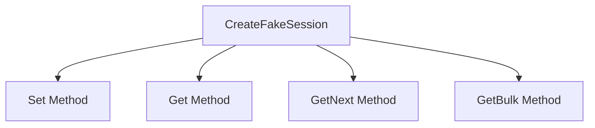

# Getting Started with <SwmToken path="pkg/collector/corechecks/snmp/internal/session/fake_session.go" pos="79:10:10" line-data="// CreateFakeSession creates a new FakeSession with an empty set of data.">`FakeSession`</SwmToken>

<SwmToken path="pkg/collector/corechecks/snmp/internal/session/fake_session.go" pos="79:10:10" line-data="// CreateFakeSession creates a new FakeSession with an empty set of data.">`FakeSession`</SwmToken> is a type that implements the Session interface by wrapping around a fixed set of Protocol Data Units <SwmToken path="pkg/collector/corechecks/snmp/internal/session/fake_session.go" pos="102:10:11" line-data="func (fs *FakeSession) SetMany(pdus ...gosnmp.SnmpPDU) {">`(pdus`</SwmToken>). It uses a map to store <SwmToken path="pkg/collector/corechecks/snmp/internal/session/fake_session.go" pos="144:2:2" line-data="// PDUs of type NoSuchObject.">`PDUs`</SwmToken> and maintains a sorted slice of all Object Identifiers <SwmToken path="pkg/collector/corechecks/snmp/internal/session/fake_session.go" pos="145:10:11" line-data="func (fs *FakeSession) Get(oids []string) (result *gosnmp.SnmpPacket, err error) {">`(oids`</SwmToken>) in the data. The <SwmToken path="pkg/collector/corechecks/snmp/internal/session/fake_session.go" pos="79:10:10" line-data="// CreateFakeSession creates a new FakeSession with an empty set of data.">`FakeSession`</SwmToken> type includes methods to set and retrieve <SwmToken path="pkg/collector/corechecks/snmp/internal/session/fake_session.go" pos="144:2:2" line-data="// PDUs of type NoSuchObject.">`PDUs`</SwmToken>, as well as to handle SNMP operations like Get, <SwmToken path="pkg/collector/corechecks/snmp/internal/session/fake_session.go" pos="213:2:2" line-data="// GetNext returns the first PDU after each of the given OIDs. An OID with">`GetNext`</SwmToken>, and <SwmToken path="pkg/collector/corechecks/snmp/internal/session/fake_session.go" pos="200:2:2" line-data="// GetBulk returns the `count` next PDUs after each of the given oids.">`GetBulk`</SwmToken>.

<SwmSnippet path="/pkg/collector/corechecks/snmp/internal/session/fake_session.go" line="79">

---

The <SwmToken path="pkg/collector/corechecks/snmp/internal/session/fake_session.go" pos="79:2:2" line-data="// CreateFakeSession creates a new FakeSession with an empty set of data.">`CreateFakeSession`</SwmToken> function initializes a new <SwmToken path="pkg/collector/corechecks/snmp/internal/session/fake_session.go" pos="79:10:10" line-data="// CreateFakeSession creates a new FakeSession with an empty set of data.">`FakeSession`</SwmToken> with an empty set of data. It returns a pointer to the newly created <SwmToken path="pkg/collector/corechecks/snmp/internal/session/fake_session.go" pos="79:10:10" line-data="// CreateFakeSession creates a new FakeSession with an empty set of data.">`FakeSession`</SwmToken>.

```go
// CreateFakeSession creates a new FakeSession with an empty set of data.
func CreateFakeSession() *FakeSession {
	return &FakeSession{
		data: make(map[string]gosnmp.SnmpPDU),
	}
}
```

---

</SwmSnippet>

## Set Method

The <SwmToken path="pkg/collector/corechecks/snmp/internal/session/fake_session.go" pos="79:18:18" line-data="// CreateFakeSession creates a new FakeSession with an empty set of data.">`set`</SwmToken> method allows adding or updating <SwmToken path="pkg/collector/corechecks/snmp/internal/session/fake_session.go" pos="144:2:2" line-data="// PDUs of type NoSuchObject.">`PDUs`</SwmToken> in the session. If a new OID is added, it marks the <SwmToken path="pkg/collector/corechecks/snmp/internal/session/fake_session.go" pos="90:14:14" line-data="		// new OID, need to rebuild oids">`oids`</SwmToken> as dirty, indicating that the sorted list of <SwmToken path="pkg/collector/corechecks/snmp/internal/session/fake_session.go" pos="90:14:14" line-data="		// new OID, need to rebuild oids">`oids`</SwmToken> needs to be rebuilt.

<SwmSnippet path="/pkg/collector/corechecks/snmp/internal/session/fake_session.go" line="86">

---

The <SwmToken path="pkg/collector/corechecks/snmp/internal/session/fake_session.go" pos="86:2:2" line-data="// Set creates a new PDU with the given attributes, replacing any in the">`Set`</SwmToken> method creates a new PDU with the given attributes, replacing any in the session with the same OID.

```go
// Set creates a new PDU with the given attributes, replacing any in the
// session with the same OID.
func (fs *FakeSession) Set(oid string, typ gosnmp.Asn1BER, val any) *FakeSession {
	if _, ok := fs.data[oid]; !ok {
		// new OID, need to rebuild oids
		fs.dirty = true
	}
	fs.data[oid] = gosnmp.SnmpPDU{
		Name:  oid,
		Type:  typ,
		Value: val,
	}
	return fs
}
```

---

</SwmSnippet>

## Get Method

The <SwmToken path="pkg/collector/corechecks/snmp/internal/session/fake_session.go" pos="143:2:2" line-data="// Get gets the values for the given OIDs. OIDs not in the session will return">`Get`</SwmToken> method retrieves the values for given <SwmToken path="pkg/collector/corechecks/snmp/internal/session/fake_session.go" pos="90:14:14" line-data="		// new OID, need to rebuild oids">`oids`</SwmToken>. If an OID is not present in the session, it returns a PDU of type <SwmToken path="pkg/collector/corechecks/snmp/internal/session/fake_session.go" pos="144:8:8" line-data="// PDUs of type NoSuchObject.">`NoSuchObject`</SwmToken>.

<SwmSnippet path="/pkg/collector/corechecks/snmp/internal/session/fake_session.go" line="143">

---

The <SwmToken path="pkg/collector/corechecks/snmp/internal/session/fake_session.go" pos="143:2:2" line-data="// Get gets the values for the given OIDs. OIDs not in the session will return">`Get`</SwmToken> method retrieves the values for the given <SwmToken path="pkg/collector/corechecks/snmp/internal/session/fake_session.go" pos="143:16:16" line-data="// Get gets the values for the given OIDs. OIDs not in the session will return">`OIDs`</SwmToken>. <SwmToken path="pkg/collector/corechecks/snmp/internal/session/fake_session.go" pos="143:16:16" line-data="// Get gets the values for the given OIDs. OIDs not in the session will return">`OIDs`</SwmToken> not in the session will return <SwmToken path="pkg/collector/corechecks/snmp/internal/session/fake_session.go" pos="144:2:2" line-data="// PDUs of type NoSuchObject.">`PDUs`</SwmToken> of type <SwmToken path="pkg/collector/corechecks/snmp/internal/session/fake_session.go" pos="144:8:8" line-data="// PDUs of type NoSuchObject.">`NoSuchObject`</SwmToken>.

```go
// Get gets the values for the given OIDs. OIDs not in the session will return
// PDUs of type NoSuchObject.
func (fs *FakeSession) Get(oids []string) (result *gosnmp.SnmpPacket, err error) {
	vars := make([]gosnmp.SnmpPDU, len(oids))
	for i, oid := range oids {
		v, ok := fs.data[oid]
		if !ok {
			v = gosnmp.SnmpPDU{
				Name:  oid,
				Type:  gosnmp.NoSuchObject,
				Value: nil,
			}
		}
		vars[i] = v
	}
	return &gosnmp.SnmpPacket{
		Variables: vars,
	}, nil
}
```

---

</SwmSnippet>

## <SwmToken path="pkg/collector/corechecks/snmp/internal/session/fake_session.go" pos="213:2:2" line-data="// GetNext returns the first PDU after each of the given OIDs. An OID with">`GetNext`</SwmToken> Method

The <SwmToken path="pkg/collector/corechecks/snmp/internal/session/fake_session.go" pos="213:2:2" line-data="// GetNext returns the first PDU after each of the given OIDs. An OID with">`GetNext`</SwmToken> method returns the first PDU after each of the given <SwmToken path="pkg/collector/corechecks/snmp/internal/session/fake_session.go" pos="90:14:14" line-data="		// new OID, need to rebuild oids">`oids`</SwmToken>. If there is no OID greater than the given one, it returns an <SwmToken path="pkg/collector/corechecks/snmp/internal/session/fake_session.go" pos="201:32:32" line-data="// If it runs off the end of the data the extra values will all be EndOfMibView">`EndOfMibView`</SwmToken> PDU.

<SwmSnippet path="/pkg/collector/corechecks/snmp/internal/session/fake_session.go" line="213">

---

The <SwmToken path="pkg/collector/corechecks/snmp/internal/session/fake_session.go" pos="213:2:2" line-data="// GetNext returns the first PDU after each of the given OIDs. An OID with">`GetNext`</SwmToken> method returns the first PDU after each of the given <SwmToken path="pkg/collector/corechecks/snmp/internal/session/fake_session.go" pos="213:22:22" line-data="// GetNext returns the first PDU after each of the given OIDs. An OID with">`OIDs`</SwmToken>. An OID with nothing greater than it will result in an <SwmToken path="pkg/collector/corechecks/snmp/internal/session/fake_session.go" pos="214:18:18" line-data="// nothing greater than it will result in an EndOfMibView PDU.">`EndOfMibView`</SwmToken> PDU.

```go
// GetNext returns the first PDU after each of the given OIDs. An OID with
// nothing greater than it will result in an EndOfMibView PDU.
func (fs *FakeSession) GetNext(oids []string) (*gosnmp.SnmpPacket, error) {
	vars, err := fs.getNexts(oids, 1)
	if err != nil {
		return nil, err
	}
	return &gosnmp.SnmpPacket{
		Variables: vars,
	}, nil
}
```

---

</SwmSnippet>

## <SwmToken path="pkg/collector/corechecks/snmp/internal/session/fake_session.go" pos="200:2:2" line-data="// GetBulk returns the `count` next PDUs after each of the given oids.">`GetBulk`</SwmToken> Method

The <SwmToken path="pkg/collector/corechecks/snmp/internal/session/fake_session.go" pos="200:2:2" line-data="// GetBulk returns the `count` next PDUs after each of the given oids.">`GetBulk`</SwmToken> method returns the specified number of <SwmToken path="pkg/collector/corechecks/snmp/internal/session/fake_session.go" pos="144:2:2" line-data="// PDUs of type NoSuchObject.">`PDUs`</SwmToken> after each of the given <SwmToken path="pkg/collector/corechecks/snmp/internal/session/fake_session.go" pos="90:14:14" line-data="		// new OID, need to rebuild oids">`oids`</SwmToken>. If it runs off the end of the data, the extra values will be <SwmToken path="pkg/collector/corechecks/snmp/internal/session/fake_session.go" pos="201:32:32" line-data="// If it runs off the end of the data the extra values will all be EndOfMibView">`EndOfMibView`</SwmToken> <SwmToken path="pkg/collector/corechecks/snmp/internal/session/fake_session.go" pos="144:2:2" line-data="// PDUs of type NoSuchObject.">`PDUs`</SwmToken>.

<SwmSnippet path="/pkg/collector/corechecks/snmp/internal/session/fake_session.go" line="200">

---

The <SwmToken path="pkg/collector/corechecks/snmp/internal/session/fake_session.go" pos="200:2:2" line-data="// GetBulk returns the `count` next PDUs after each of the given oids.">`GetBulk`</SwmToken> method returns the <SwmToken path="pkg/collector/corechecks/snmp/internal/session/fake_session.go" pos="200:9:9" line-data="// GetBulk returns the `count` next PDUs after each of the given oids.">`count`</SwmToken> next <SwmToken path="pkg/collector/corechecks/snmp/internal/session/fake_session.go" pos="200:14:14" line-data="// GetBulk returns the `count` next PDUs after each of the given oids.">`PDUs`</SwmToken> after each of the given <SwmToken path="pkg/collector/corechecks/snmp/internal/session/fake_session.go" pos="200:26:26" line-data="// GetBulk returns the `count` next PDUs after each of the given oids.">`oids`</SwmToken>. If it runs off the end of the data, the extra values will all be <SwmToken path="pkg/collector/corechecks/snmp/internal/session/fake_session.go" pos="201:32:32" line-data="// If it runs off the end of the data the extra values will all be EndOfMibView">`EndOfMibView`</SwmToken> <SwmToken path="pkg/collector/corechecks/snmp/internal/session/fake_session.go" pos="200:14:14" line-data="// GetBulk returns the `count` next PDUs after each of the given oids.">`PDUs`</SwmToken>.

```go
// GetBulk returns the `count` next PDUs after each of the given oids.
// If it runs off the end of the data the extra values will all be EndOfMibView
// PDUs.
func (fs *FakeSession) GetBulk(oids []string, count uint32) (*gosnmp.SnmpPacket, error) {
	vars, err := fs.getNexts(oids, int(count))
	if err != nil {
		return nil, err
	}
	return &gosnmp.SnmpPacket{
		Variables: vars,
	}, nil
}
```

---

</SwmSnippet>

&nbsp;

*This is an auto-generated document by Swimm AI 🌊 and has not yet been verified by a human*

<SwmMeta version="3.0.0" repo-id="Z2l0aHViJTNBJTNBZGF0YWRvZy1hZ2VudCUzQSUzQVN3aW1tLURlbW8=" repo-name="datadog-agent"><sup>Powered by [Swimm](/)</sup></SwmMeta>
