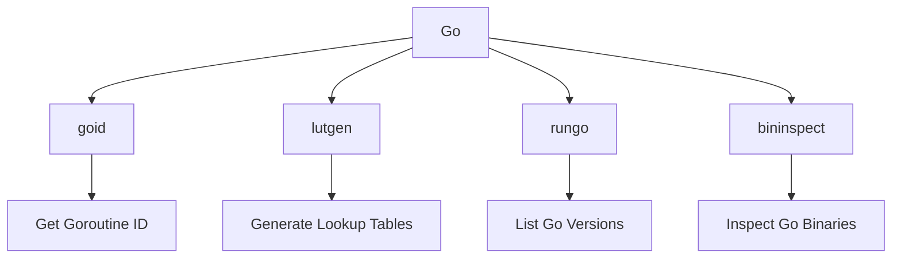

# Introduction

Go is used to manage various aspects of the Datadog Agent's network functionality. It includes handling goroutine <SwmToken path="tasks/gitlab_helpers.py" pos="90:10:10" line-data="def print_gitlab_object(get_object, ctx, ids, repo=&#39;DataDog/datadog-agent&#39;, jq: str | None = None, jq_colors=True):">`ids`</SwmToken>, Go version lookups, and generating lookup tables for different Go versions and architectures.

# goid Package

The <SwmToken path="pkg/network/go/goid/main.go" pos="6:4:4" line-data="// Package goid provides a function to get the current goroutine ID.">`goid`</SwmToken> package provides a function to get the current goroutine ID, which is essential for debugging and performance monitoring.

<SwmSnippet path="/pkg/network/go/goid/main.go" line="6">

---

The <SwmToken path="pkg/network/go/goid/main.go" pos="6:4:4" line-data="// Package goid provides a function to get the current goroutine ID.">`goid`</SwmToken> package includes a function to get the current goroutine ID. This is crucial for debugging and performance monitoring. The implementation is generated using the <SwmToken path="pkg/network/go/goid/main.go" pos="13:1:3" line-data="//go:generate go run ./internal/generate_goid_lut.go --test-program ./internal/testprogram/program.go --package goid --out ./goid_offset.go --min-go 1.13 --arch amd64,arm64 --shared-build-dir /var/tmp/datadog-agent/system-probe/go-toolchains">`go:generate`</SwmToken> directive.

```go
// Package goid provides a function to get the current goroutine ID.
package goid

// This generates GetGoroutineIDOffset's implementation in ./goid_offset.go:
// - Use /var/tmp/datadog-agent/system-probe/go-toolchains
//   as the location for the Go toolchains to be downloaded to.
//   Each toolchain version is around 500 MiB on disk.
//go:generate go run ./internal/generate_goid_lut.go --test-program ./internal/testprogram/program.go --package goid --out ./goid_offset.go --min-go 1.13 --arch amd64,arm64 --shared-build-dir /var/tmp/datadog-agent/system-probe/go-toolchains
```

---

</SwmSnippet>

# lutgen Package

The <SwmToken path="pkg/network/go/lutgen/run.go" pos="6:2:2" line-data="package lutgen">`lutgen`</SwmToken> package is responsible for generating lookup tables that map Go versions and architectures to specific output types. This is useful for resolving values that change based on the Go version or architecture.

<SwmSnippet path="/pkg/network/go/lutgen/run.go" line="24">

---

The <SwmToken path="pkg/network/go/lutgen/run.go" pos="24:2:2" line-data="// LookupTableGenerator configures the process of generating">`LookupTableGenerator`</SwmToken> configures the process of generating a Go source file that implements lookup tables for any value based on an input Go version and architecture. This helps resolve values about a binary that change based on the Go version or architecture.

```go
// LookupTableGenerator configures the process of generating
// a Go source file that implements lookup table(s) for any value
// based on an input Go version and Go architecture.
// This can be used to resolve values about a binary that change
// based on the Go version/architecture,
// by compiling and inspecting small test binaries ahead-of-type
// for each Go version/architecture and generating the lookup table(s)
// based on the results of this process.
//
// Each lookup table is implemented as a function,
// which are configured in LookupFunction types.
type LookupTableGenerator struct {
	Package                string
	MinGoVersion           goversion.GoVersion
	Architectures          []string
	CompilationParallelism int
	LookupFunctions        []LookupFunction
	ExtraImports           []string
	InspectBinary          func(binary Binary) (interface{}, error)
	TestProgramPath        string
	InstallDirectory       string
```

---

</SwmSnippet>

# rungo Package

The <SwmToken path="pkg/network/go/lutgen/run.go" pos="20:18:18" line-data="	&quot;github.com/DataDog/datadog-agent/pkg/network/go/rungo&quot;">`rungo`</SwmToken> package includes functionality to list all current Go versions by downloading and scanning the Golang download page. This helps in maintaining compatibility with different Go versions.

<SwmSnippet path="/pkg/network/go/rungo/list.go" line="20">

---

The <SwmToken path="pkg/network/go/rungo/list.go" pos="24:2:2" line-data="// ListGoVersions gets a list of all current Go versions by downloading the Golang download page">`ListGoVersions`</SwmToken> function gets a list of all current Go versions by downloading the Golang download page and scanning it for Go versions. This includes beta and RC versions, as well as normal point releases.

```go
type goRelease struct {
	Version string `json:"version"`
}

// ListGoVersions gets a list of all current Go versions by downloading the Golang download page
// and scanning it for Go versions.
// Includes beta and RC versions, as well as normal point releases.
// See https://golang.org/dl (all versions are listed under "Archived versions")
// or https://go.dev/dl/?mode=json&include=all
func ListGoVersions(ctx context.Context) ([]string, error) {
```

---

</SwmSnippet>

# bininspect Package

The <SwmToken path="pkg/network/go/bininspect/utils.go" pos="8:2:2" line-data="package bininspect">`bininspect`</SwmToken> package provides utilities to inspect Go binaries, such as determining the Go version used to build a binary and finding return locations in the binary's functions.

<SwmSnippet path="/pkg/network/go/bininspect/utils.go" line="53">

---

The <SwmToken path="pkg/network/go/bininspect/utils.go" pos="53:2:2" line-data="// FindGoVersion attempts to determine the Go version">`FindGoVersion`</SwmToken> function attempts to determine the Go version from the embedded string inserted in the binary by the linker. The main logic is available in the <SwmToken path="pkg/network/go/bininspect/utils.go" pos="57:24:24" line-data="// The main logic was pulled out to a sub-package, `binversion`">`binversion`</SwmToken> <SwmToken path="pkg/network/go/bininspect/utils.go" pos="57:18:20" line-data="// The main logic was pulled out to a sub-package, `binversion`">`sub-package`</SwmToken>.

```go
// FindGoVersion attempts to determine the Go version
// from the embedded string inserted in the binary by the linker.
// The implementation is available in src/cmd/go/internal/version/version.go:
// https://cs.opensource.google/go/go/+/refs/tags/go1.17.2:src/cmd/go/internal/version/version.go
// The main logic was pulled out to a sub-package, `binversion`
func FindGoVersion(elfFile *elf.File) (ddversion.GoVersion, error) {
	version, err := binversion.ReadElfBuildInfo(elfFile)
	if err != nil {
		return ddversion.GoVersion{}, fmt.Errorf("could not get Go toolchain version from ELF binary file: %w", err)
	}

	return ddversion.NewGoVersion(strings.TrimPrefix(version, "go"))
}
```

---

</SwmSnippet>

&nbsp;

*This is an auto-generated document by Swimm AI 🌊 and has not yet been verified by a human*

<SwmMeta version="3.0.0" repo-id="Z2l0aHViJTNBJTNBZGF0YWRvZy1hZ2VudCUzQSUzQVN3aW1tLURlbW8=" repo-name="datadog-agent"><sup>Powered by [Swimm](/)</sup></SwmMeta>
