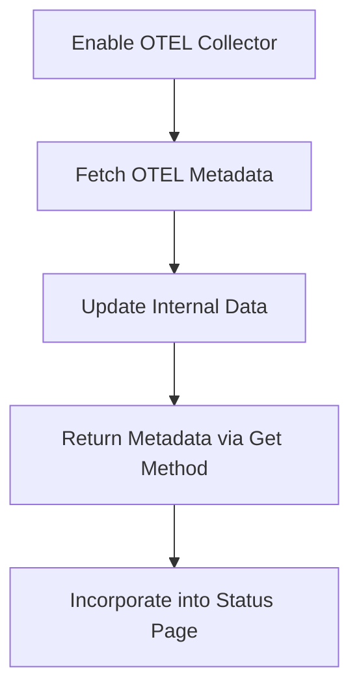

# Introduction

Inventory OTEL refers to the component responsible for generating the <SwmToken path="tasks/libs/pipeline/stats.py" pos="155:1:1" line-data="    datadog_agent = get_gitlab_repo(repo=project_name)">`datadog_agent`</SwmToken> metadata payload for inventory purposes. This component populates some of the OpenTelemetry (OTEL) agent-related fields in the <SwmToken path="comp/metadata/inventoryotel/inventoryotelimpl/inventoryotel.go" pos="66:17:17" line-data="	return nil, fmt.Errorf(&quot;could not split inventories agent payload any more, payload is too big for intake&quot;)">`inventories`</SwmToken> product in <SwmToken path="comp/metadata/inventoryotel/inventoryotelimpl/inventoryotel.go" pos="3:14:14" line-data="// This product includes software developed at Datadog (https://www.datadoghq.com/).">`Datadog`</SwmToken>, specifically in the `datadog-otel-agent` table. The payload includes various fields such as hostname, unique identifier (UUID), timestamp, and OTEL agent metadata like version, command used to launch the agent, and configuration details. The payload is sent every 10 minutes or whenever it is updated, with a maximum of one update every minute. The component can be enabled or disabled through configuration settings, and it ensures that sensitive information is scrubbed from the payload.

# How Inventory OTEL Works

The <SwmToken path="comp/metadata/inventoryotel/inventoryotelimpl/inventoryotel.go" pos="102:10:10" line-data="	hname, _ := hostname.Get(context.Background())">`Get`</SwmToken> method returns a copy of the agent metadata, which is useful for incorporating into the status page. It locks the data to ensure thread safety, copies the metadata, and then returns it.

<SwmSnippet path="/comp/metadata/inventoryotel/inventoryotelimpl/inventoryotel.go" line="266">

---

The <SwmToken path="comp/metadata/inventoryotel/inventoryotelimpl/inventoryotel.go" pos="266:2:2" line-data="// Get returns a copy of the agent metadata. Useful to be incorporated in the status page.">`Get`</SwmToken> method in the <SwmToken path="comp/metadata/inventoryotel/inventoryotelimpl/inventoryotel.go" pos="267:6:6" line-data="func (i *inventoryotel) Get() otelMetadata {">`inventoryotel`</SwmToken> implementation ensures thread safety by locking the data, copying the metadata, and then returning it.

```go
// Get returns a copy of the agent metadata. Useful to be incorporated in the status page.
func (i *inventoryotel) Get() otelMetadata {
	i.m.Lock()
	defer i.m.Unlock()

	data := otelMetadata{}
	for k, v := range i.data {
		data[k] = v
	}
	return data
}
```

---

</SwmSnippet>

# Fetching OTEL Agent Metadata

The <SwmToken path="comp/metadata/inventoryotel/inventoryotelimpl/inventoryotel.go" pos="210:9:9" line-data="func (i *inventoryotel) fetchOtelAgentMetadata() {">`fetchOtelAgentMetadata`</SwmToken> method fetches the latest OTEL agent metadata. It checks if the OTEL collector is enabled, fetches the configuration, and updates the internal data structure with the new metadata.

<SwmSnippet path="/comp/metadata/inventoryotel/inventoryotelimpl/inventoryotel.go" line="210">

---

The <SwmToken path="comp/metadata/inventoryotel/inventoryotelimpl/inventoryotel.go" pos="210:9:9" line-data="func (i *inventoryotel) fetchOtelAgentMetadata() {">`fetchOtelAgentMetadata`</SwmToken> method checks if the OTEL collector is enabled, fetches the configuration, and updates the internal data structure with the new metadata.

```go
func (i *inventoryotel) fetchOtelAgentMetadata() {
	isEnabled := i.conf.GetBool("otelcollector.enabled")

	if !isEnabled {
		i.log.Infof("OTel Metadata unavailable as OTel collector is disabled")
		i.data = nil

		return
	}
	data, err := i.f.getConfig()
	if err != nil {
		i.log.Errorf("Unable to fetch fresh inventory metadata: ", err)
		return
	}

	i.data = data
	if i.data == nil {
		i.log.Infof("OTel config returned empty")
		return
	}
```

---

</SwmSnippet>

# Initializing Inventory OTEL

The <SwmToken path="comp/metadata/inventoryotel/inventoryotelimpl/inventoryotel.go" pos="101:2:2" line-data="func newInventoryOtelProvider(deps dependencies) (provides, error) {">`newInventoryOtelProvider`</SwmToken> function initializes the Inventory OTEL component. It sets up the necessary configurations, HTTP client, and metadata fetching mechanisms. It also registers the component to be notified of configuration updates.

<SwmSnippet path="/comp/metadata/inventoryotel/inventoryotelimpl/inventoryotel.go" line="101">

---

The <SwmToken path="comp/metadata/inventoryotel/inventoryotelimpl/inventoryotel.go" pos="101:2:2" line-data="func newInventoryOtelProvider(deps dependencies) (provides, error) {">`newInventoryOtelProvider`</SwmToken> function initializes the Inventory OTEL component with necessary configurations, HTTP client, and metadata fetching mechanisms.

```go
func newInventoryOtelProvider(deps dependencies) (provides, error) {
	hname, _ := hostname.Get(context.Background())
	// HTTP client need not verify otel-agent cert since it's self-signed
	// at start-up. TLS used for encryption not authentication.
	tr := &http.Transport{
		TLSClientConfig: &tls.Config{InsecureSkipVerify: true},
	}
	i := &inventoryotel{
		conf:      deps.Config,
		log:       deps.Log,
		hostname:  hname,
		data:      make(otelMetadata),
		authToken: deps.AuthToken,
		httpClient: &http.Client{
			Transport: tr,
			Timeout:   httpTO,
		},
	}

	getter := i.fetchRemoteOtelConfig
```

---

</SwmSnippet>

# Fetching Remote OTEL Configuration

The <SwmToken path="comp/metadata/inventoryotel/inventoryotelimpl/inventoryotel.go" pos="120:7:7" line-data="	getter := i.fetchRemoteOtelConfig">`fetchRemoteOtelConfig`</SwmToken> function is responsible for fetching the OpenTelemetry (OTEL) configuration from a remote URL. It creates an HTTP GET request with a Bearer token for authorization and processes the response to extract the OTEL metadata.

<SwmSnippet path="/comp/metadata/inventoryotel/inventoryotelimpl/inventoryotel.go" line="170">

---

The <SwmToken path="comp/metadata/inventoryotel/inventoryotelimpl/inventoryotel.go" pos="170:9:9" line-data="func (i *inventoryotel) fetchRemoteOtelConfig(u *url.URL) (otelMetadata, error) {">`fetchRemoteOtelConfig`</SwmToken> function creates an HTTP GET request with a Bearer token for authorization and processes the response to extract the OTEL metadata.

```go
func (i *inventoryotel) fetchRemoteOtelConfig(u *url.URL) (otelMetadata, error) {
	// Create a Bearer string by appending string access token
	bearer := "Bearer " + i.authToken.Get()

	// Create a new request using http
	req, err := http.NewRequest("GET", u.String(), nil)
	if err != nil {
		i.log.Errorf("Error building request: ", err)
		return nil, err
	}

	// add authorization header to the req
	req.Header.Add("Authorization", bearer)

	resp, err := i.httpClient.Do(req)
	if err != nil {
		i.log.Errorf("Error on response: ", err)
		return nil, err
	}
	defer resp.Body.Close()
```

---

</SwmSnippet>

# Fetching Dummy OTEL Configuration

The <SwmToken path="comp/metadata/inventoryotel/inventoryotelimpl/inventoryotel.go" pos="200:9:9" line-data="func (i *inventoryotel) fetchDummyOtelConfig(_ *url.URL) (otelMetadata, error) {">`fetchDummyOtelConfig`</SwmToken> function is used to fetch a dummy OTEL configuration from a local file. This is useful for testing purposes when a real remote configuration is not available.

<SwmSnippet path="/comp/metadata/inventoryotel/inventoryotelimpl/inventoryotel.go" line="200">

---

The <SwmToken path="comp/metadata/inventoryotel/inventoryotelimpl/inventoryotel.go" pos="200:9:9" line-data="func (i *inventoryotel) fetchDummyOtelConfig(_ *url.URL) (otelMetadata, error) {">`fetchDummyOtelConfig`</SwmToken> function reads dummy data from a file and parses it into the OTEL metadata format for testing purposes.

```go
func (i *inventoryotel) fetchDummyOtelConfig(_ *url.URL) (otelMetadata, error) {
	dummy, err := dummyFS.ReadFile(path.Join("dummy_data", "response.json"))
	if err != nil {
		i.log.Errorf("Unable to read embedded dummy data:", err)
		return nil, err
	}

	return i.parseResponseFromJSON(dummy)
}
```

---

</SwmSnippet>

&nbsp;

*This is an auto-generated document by Swimm AI 🌊 and has not yet been verified by a human*

<SwmMeta version="3.0.0" repo-id="Z2l0aHViJTNBJTNBZGF0YWRvZy1hZ2VudCUzQSUzQVN3aW1tLURlbW8=" repo-name="datadog-agent"><sup>Powered by [Swimm](/)</sup></SwmMeta>
