```mermaid
classDiagram
 class Launcher {
 +Start(sourceProvider: sourceProvider, pipelineProvider: pipeline.Provider, registry: auditor.Registry, tracker: tailers.TailerTracker)
 +Stop()
 }
 class sourceProvider {
 +SubscribeForType(sourceType: string)
 +SubscribeAll()
 +GetAddedForType(sourceType: string)
 }
 Launcher --> sourceProvider

%% Swimm:
%% classDiagram
%%  class Launcher {
%%  +Start(sourceProvider: <SwmToken path="pkg/logs/launchers/launchers.go" pos="20:3:3" line-data="	// sourceProvider is the SourceProvider that will be given to launchers&#39; Start method.">`sourceProvider`</SwmToken>, <SwmToken path="pkg/logs/launchers/launchers.go" pos="23:3:3" line-data="	// pipelineProvider will be given to launchers&#39; Start method.">`pipelineProvider`</SwmToken>: <SwmToken path="pkg/logs/launchers/launchers.go" pos="24:3:5" line-data="	pipelineProvider pipeline.Provider">`pipeline.Provider`</SwmToken>, registry: <SwmToken path="pkg/logs/launchers/launchers.go" pos="27:3:5" line-data="	registry auditor.Registry">`auditor.Registry`</SwmToken>, tracker: <SwmToken path="pkg/logs/launchers/launchers.go" pos="30:4:6" line-data="	tracker *tailers.TailerTracker">`tailers.TailerTracker`</SwmToken>)
%%  +Stop()
%%  }
%%  class <SwmToken path="pkg/logs/launchers/launchers.go" pos="20:3:3" line-data="	// sourceProvider is the SourceProvider that will be given to launchers&#39; Start method.">`sourceProvider`</SwmToken> {
%%  +SubscribeForType(sourceType: string)
%%  +SubscribeAll()
%%  +GetAddedForType(sourceType: string)
%%  }
%%  Launcher --> <SwmToken path="pkg/logs/launchers/launchers.go" pos="20:3:3" line-data="	// sourceProvider is the SourceProvider that will be given to launchers&#39; Start method.">`sourceProvider`</SwmToken>
```

# Overview of Launchers

Launchers are responsible for translating sources (<SwmToken path="pkg/logs/launchers/types.go" pos="40:14:16" line-data="	SubscribeForType(sourceType string) (added chan *sources.LogSource, removed chan *sources.LogSource)">`sources.LogSource`</SwmToken>) to tailers and managing their lifecycle. The logs agent maintains a set of current launchers, starting and stopping them at startup and stopping them when the <SwmToken path="pkg/logs/launchers/types.go" pos="18:12:14" line-data="// Launchers are started when the logs-agent starts, or when they are added to">`logs-agent`</SwmToken> stops.

# Implementation of Launchers

Launchers are implemented in sub-packages of <SwmPath>[pkg/logs/launchers/](pkg/logs/launchers/)</SwmPath>. They are responsible for creating tailers, which contain pipelines. Each launcher filters the sources, usually based on `source.Config.Type`, which comes from the <SwmToken path="pkg/logs/launchers/launchers.go" pos="19:0:0" line-data="type Launchers struct {">`type`</SwmToken> key in `logs_config` sections.

# Example of a Launcher

Several Launchers are quite simple, translating sources into tailers. For example, the file launcher handles wild-card filenames and logfile rotation by creating multiple tailers for each source.

<SwmSnippet path="/pkg/logs/launchers/launchers.go" line="18">

---

The <SwmToken path="pkg/logs/launchers/launchers.go" pos="18:2:2" line-data="// Launchers manages a collection of launchers.">`Launchers`</SwmToken> type manages a collection of launchers, including their source provider, pipeline provider, registry, and tailers.

```go
// Launchers manages a collection of launchers.
type Launchers struct {
	// sourceProvider is the SourceProvider that will be given to launchers' Start method.
	sourceProvider SourceProvider

	// pipelineProvider will be given to launchers' Start method.
	pipelineProvider pipeline.Provider

	// registry will be given to launchers' Start method.
	registry auditor.Registry

	// tailers will be given to launchers' Start method.
	tracker *tailers.TailerTracker

	// launchers is the set of running launchers
	launchers []Launcher

	// started is true after Start
	started bool
}
```

---

</SwmSnippet>

<SwmSnippet path="/pkg/logs/launchers/launchers.go" line="39">

---

The <SwmToken path="pkg/logs/launchers/launchers.go" pos="39:2:2" line-data="// NewLaunchers creates a new, empty Launchers instance">`NewLaunchers`</SwmToken> function creates a new, empty <SwmToken path="pkg/logs/launchers/launchers.go" pos="39:13:13" line-data="// NewLaunchers creates a new, empty Launchers instance">`Launchers`</SwmToken> instance, initializing it with the provided source provider, pipeline provider, registry, and tailer tracker.

```go
// NewLaunchers creates a new, empty Launchers instance
func NewLaunchers(
	sources *sources.LogSources,
	pipelineProvider pipeline.Provider,
	registry auditor.Registry,
	tracker *tailers.TailerTracker,
) *Launchers {
	return &Launchers{
		sourceProvider:   sources,
		pipelineProvider: pipelineProvider,
		registry:         registry,
		tracker:          tracker,
	}
}
```

---

</SwmSnippet>

# Main Functions

There are several main functions in this folder. Some of them are translating sources to tailers and managing tailers' lifecycle. We will dive a little into translating sources to tailers and managing tailers' lifecycle.

## Translating Sources to Tailers

Launchers are responsible for translating sources (<SwmToken path="pkg/logs/launchers/types.go" pos="40:14:16" line-data="	SubscribeForType(sourceType string) (added chan *sources.LogSource, removed chan *sources.LogSource)">`sources.LogSource`</SwmToken>) to tailers. This involves taking the log sources and creating tailers that can read and process the logs from these sources.

## Managing Tailers' Lifecycle

Launchers manage the lifecycle of tailers, which includes starting and stopping them. The logs agent maintains a set of current launchers, starting them at startup and stopping them when the <SwmToken path="pkg/logs/launchers/types.go" pos="18:12:14" line-data="// Launchers are started when the logs-agent starts, or when they are added to">`logs-agent`</SwmToken> stops.

# Launcher Endpoints

Launcher Endpoints

## Start

The <SwmToken path="pkg/logs/launchers/launchers.go" pos="20:24:24" line-data="	// sourceProvider is the SourceProvider that will be given to launchers&#39; Start method.">`Start`</SwmToken> method initializes the launcher with the provided <SwmToken path="pkg/logs/launchers/launchers.go" pos="20:3:3" line-data="	// sourceProvider is the SourceProvider that will be given to launchers&#39; Start method.">`sourceProvider`</SwmToken>, <SwmToken path="pkg/logs/launchers/launchers.go" pos="24:3:5" line-data="	pipelineProvider pipeline.Provider">`pipeline.Provider`</SwmToken>, <SwmToken path="pkg/logs/launchers/launchers.go" pos="27:3:5" line-data="	registry auditor.Registry">`auditor.Registry`</SwmToken>, and <SwmToken path="pkg/logs/launchers/launchers.go" pos="30:4:6" line-data="	tracker *tailers.TailerTracker">`tailers.TailerTracker`</SwmToken>. This method is responsible for starting the log pipelines in response to sources.

<SwmSnippet path="/pkg/logs/launchers/types.go" line="21">

---

The <SwmToken path="pkg/logs/launchers/types.go" pos="21:3:3" line-data="	// Start the launcher.">`Start`</SwmToken> method initializes the launcher with the provided <SwmToken path="pkg/logs/launchers/types.go" pos="22:3:3" line-data="	Start(sourceProvider SourceProvider, pipelineProvider pipeline.Provider, registry auditor.Registry, tracker *tailers.TailerTracker)">`sourceProvider`</SwmToken>, <SwmToken path="pkg/logs/launchers/types.go" pos="22:10:12" line-data="	Start(sourceProvider SourceProvider, pipelineProvider pipeline.Provider, registry auditor.Registry, tracker *tailers.TailerTracker)">`pipeline.Provider`</SwmToken>, <SwmToken path="pkg/logs/launchers/types.go" pos="22:17:19" line-data="	Start(sourceProvider SourceProvider, pipelineProvider pipeline.Provider, registry auditor.Registry, tracker *tailers.TailerTracker)">`auditor.Registry`</SwmToken>, and <SwmToken path="pkg/logs/launchers/types.go" pos="22:25:27" line-data="	Start(sourceProvider SourceProvider, pipelineProvider pipeline.Provider, registry auditor.Registry, tracker *tailers.TailerTracker)">`tailers.TailerTracker`</SwmToken>.

```go
	// Start the launcher.
	Start(sourceProvider SourceProvider, pipelineProvider pipeline.Provider, registry auditor.Registry, tracker *tailers.TailerTracker)
```

---

</SwmSnippet>

## Stop

The <SwmToken path="pkg/logs/launchers/types.go" pos="24:3:3" line-data="	// Stop the launcher, and wait until shutdown is complete.  It is not">`Stop`</SwmToken> method stops the launcher and waits until the shutdown is complete. It ensures that any background goroutines or other resources are freed, although it is not necessary to unsubscribe from the <SwmToken path="pkg/logs/launchers/launchers.go" pos="20:3:3" line-data="	// sourceProvider is the SourceProvider that will be given to launchers&#39; Start method.">`sourceProvider`</SwmToken>.

<SwmSnippet path="/pkg/logs/launchers/types.go" line="24">

---

The <SwmToken path="pkg/logs/launchers/types.go" pos="24:3:3" line-data="	// Stop the launcher, and wait until shutdown is complete.  It is not">`Stop`</SwmToken> method stops the launcher and waits until the shutdown is complete. It ensures that any background goroutines or other resources are freed.

```go
	// Stop the launcher, and wait until shutdown is complete.  It is not
	// necessary to unsubscribe from the sourceProvider, but any background
	// goroutines or other resources should be freed.
	Stop()
```

---

</SwmSnippet>

&nbsp;

*This is an auto-generated document by Swimm AI 🌊 and has not yet been verified by a human*

<SwmMeta version="3.0.0" repo-id="Z2l0aHViJTNBJTNBZGF0YWRvZy1hZ2VudCUzQSUzQVN3aW1tLURlbW8=" repo-name="datadog-agent"><sup>Powered by [Swimm](/)</sup></SwmMeta>
