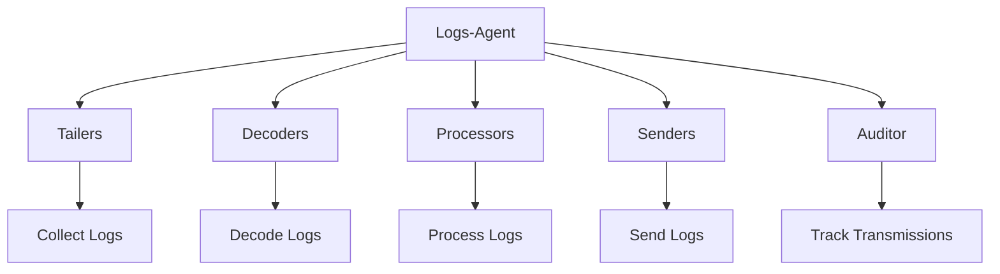

# Getting Started with Logs in Components

Logs refer to the data collected by the logs-agent, which is then submitted to Datadog's infrastructure for further analysis and monitoring. The logs-agent processes and sends logs to the backend, ensuring that logs are collected from various sources and transmitted efficiently.

## Agent Structure

The logs-agent has two main components: determining what to log and managing the mechanics of logging. It includes components such as tailers, decoders, processors, and senders, which work together to handle the logging process.

## Auditor

The logs-agent includes an auditor that tracks successful message transmissions and helps manage message re-transmissions after an agent restart.

## Logs Endpoints

Logs endpoints are crucial for transmitting logs to the backend. The logs-agent supports both HTTP and TCP endpoints.

<SwmSnippet path="/comp/logs/agent/config/endpoints.go" line="96">

---

### <SwmToken path="comp/logs/agent/config/endpoints.go" pos="96:2:2" line-data="// NewHTTPEndpoint returns a new HTTP Endpoint based on LogsConfigKeys The endpoint is by default reliable and will use">`NewHTTPEndpoint`</SwmToken>

The <SwmToken path="comp/logs/agent/config/endpoints.go" pos="96:2:2" line-data="// NewHTTPEndpoint returns a new HTTP Endpoint based on LogsConfigKeys The endpoint is by default reliable and will use">`NewHTTPEndpoint`</SwmToken> function creates a new HTTP endpoint based on the provided <SwmToken path="comp/logs/agent/config/endpoints.go" pos="96:18:18" line-data="// NewHTTPEndpoint returns a new HTTP Endpoint based on LogsConfigKeys The endpoint is by default reliable and will use">`LogsConfigKeys`</SwmToken>. This endpoint is reliable by default and uses settings related to HTTP from the configuration, such as compression, backoff, and recovery.

```go
// NewHTTPEndpoint returns a new HTTP Endpoint based on LogsConfigKeys The endpoint is by default reliable and will use
// the settings related to HTTP from the configuration (compression, Backoff, recovery, ...).
func NewHTTPEndpoint(logsConfig *LogsConfigKeys) Endpoint {
	return Endpoint{
		apiKeyGetter:            logsConfig.getAPIKeyGetter(),
		UseCompression:          logsConfig.useCompression(),
		CompressionLevel:        logsConfig.compressionLevel(),
		ConnectionResetInterval: logsConfig.connectionResetInterval(),
		BackoffBase:             logsConfig.senderBackoffBase(),
		BackoffMax:              logsConfig.senderBackoffMax(),
		BackoffFactor:           logsConfig.senderBackoffFactor(),
		RecoveryInterval:        logsConfig.senderRecoveryInterval(),
		RecoveryReset:           logsConfig.senderRecoveryReset(),
		useSSL:                  logsConfig.logsNoSSL(),
		isReliable:              true, // by default endpoints are reliable
	}
}
```

---

</SwmSnippet>

<SwmSnippet path="/comp/logs/agent/config/endpoints.go" line="84">

---

### <SwmToken path="comp/logs/agent/config/endpoints.go" pos="84:2:2" line-data="// NewTCPEndpoint returns a new TCP Endpoint based on LogsConfigKeys. The endpoint is by default reliable and will use">`NewTCPEndpoint`</SwmToken>

The <SwmToken path="comp/logs/agent/config/endpoints.go" pos="84:2:2" line-data="// NewTCPEndpoint returns a new TCP Endpoint based on LogsConfigKeys. The endpoint is by default reliable and will use">`NewTCPEndpoint`</SwmToken> function creates a new TCP endpoint based on the provided <SwmToken path="comp/logs/agent/config/endpoints.go" pos="84:18:18" line-data="// NewTCPEndpoint returns a new TCP Endpoint based on LogsConfigKeys. The endpoint is by default reliable and will use">`LogsConfigKeys`</SwmToken>. This endpoint is reliable by default and uses settings from the configuration, including socks proxy and SSL settings.

```go
// NewTCPEndpoint returns a new TCP Endpoint based on LogsConfigKeys. The endpoint is by default reliable and will use
// socks proxy and SSL settings from the configuration.
func NewTCPEndpoint(logsConfig *LogsConfigKeys) Endpoint {
	return Endpoint{
		apiKeyGetter:            logsConfig.getAPIKeyGetter(),
		ProxyAddress:            logsConfig.socks5ProxyAddress(),
		ConnectionResetInterval: logsConfig.connectionResetInterval(),
		useSSL:                  logsConfig.logsNoSSL(),
		isReliable:              true, // by default endpoints are reliable
	}
}
```

---

</SwmSnippet>

&nbsp;

*This is an auto-generated document by Swimm AI 🌊 and has not yet been verified by a human*

<SwmMeta version="3.0.0" repo-id="Z2l0aHViJTNBJTNBZGF0YWRvZy1hZ2VudCUzQSUzQVN3aW1tLURlbW8=" repo-name="datadog-agent"><sup>Powered by [Swimm](/)</sup></SwmMeta>
