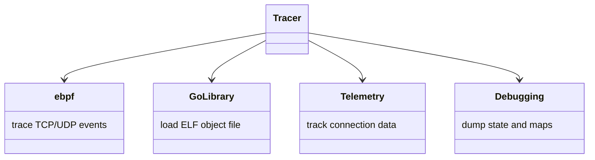

# Getting Started with Network Tracer

The Network Tracer is an <SwmToken path="pkg/network/tracer/tracer.go" pos="228:14:14" line-data="		return fmt.Errorf(&quot;could not start ebpf tracer: %s&quot;, err)">`ebpf`</SwmToken> program that uses kprobes to trace TCP/UDP events such as connect, accept, close, send_msg, and recv_msg. The <SwmToken path="pkg/network/tracer/tracer.go" pos="228:14:14" line-data="		return fmt.Errorf(&quot;could not start ebpf tracer: %s&quot;, err)">`ebpf`</SwmToken> program is compiled into an ELF object file, which is then loaded using a Go library. Internally, the Go library uses a fork of the cilium ebpf package to manage the <SwmToken path="pkg/network/tracer/tracer.go" pos="228:14:14" line-data="		return fmt.Errorf(&quot;could not start ebpf tracer: %s&quot;, err)">`ebpf`</SwmToken> program.

# Tracer Overview

The Tracer in the network package is responsible for collecting and managing network connection data. It tracks active and closed connections, handles telemetry, and provides methods to start, stop, and pause the tracing process. The Tracer also includes functionality for debugging, such as dumping the current state and <SwmToken path="pkg/network/tracer/tracer.go" pos="228:14:14" line-data="		return fmt.Errorf(&quot;could not start ebpf tracer: %s&quot;, err)">`ebpf`</SwmToken> maps.

<SwmSnippet path="/pkg/network/tracer/tracer.go" line="107">

---

# Tracer Initialization

The <SwmToken path="pkg/network/tracer/tracer.go" pos="107:2:2" line-data="// NewTracer creates a Tracer">`NewTracer`</SwmToken> function initializes a new Tracer instance with the given configuration and telemetry component.

```go
// NewTracer creates a Tracer
func NewTracer(config *config.Config, telemetryComponent telemetryComponent.Component) (*Tracer, error) {
	tr, err := newTracer(config, telemetryComponent)
	if err != nil {
		return nil, err
	}

	if err := tr.start(); err != nil {
		return nil, err
	}

	return tr, nil
}
```

---

</SwmSnippet>

<SwmSnippet path="/pkg/network/tracer/tracer.go" line="222">

---

# Starting the Tracer

The <SwmToken path="pkg/network/tracer/tracer.go" pos="222:2:2" line-data="// start starts the tracer. This function is present to separate">`start`</SwmToken> method begins the tracing process by starting the <SwmToken path="pkg/network/tracer/tracer.go" pos="228:14:14" line-data="		return fmt.Errorf(&quot;could not start ebpf tracer: %s&quot;, err)">`ebpf`</SwmToken> tracer and reverse DNS monitor.

```go
// start starts the tracer. This function is present to separate
// the creation from the start of the tracer for tests
func (t *Tracer) start() error {
	err := t.ebpfTracer.Start(t.storeClosedConnections)
	if err != nil {
		t.Stop()
		return fmt.Errorf("could not start ebpf tracer: %s", err)
	}

	if err = t.reverseDNS.Start(); err != nil {
		t.Stop()
		return fmt.Errorf("could not start reverse dns monitor: %w", err)
	}

	return nil
}
```

---

</SwmSnippet>

<SwmSnippet path="/pkg/network/tracer/tracer.go" line="377">

---

# Stopping the Tracer

The <SwmToken path="pkg/network/tracer/tracer.go" pos="377:2:2" line-data="// Stop stops the tracer">`Stop`</SwmToken> method stops the tracer and cleans up resources, ensuring that all monitoring activities are halted.

```go
// Stop stops the tracer
func (t *Tracer) Stop() {
	if t.gwLookup != nil {
		t.gwLookup.Close()
	}
	if t.reverseDNS != nil {
		t.reverseDNS.Close()
	}
	if t.ebpfTracer != nil {
		t.ebpfTracer.Stop()
		telemetry.GetCompatComponent().UnregisterCollector(t.ebpfTracer)
	}
	if t.usmMonitor != nil {
		t.usmMonitor.Stop()
	}
	if t.conntracker != nil {
		t.conntracker.Close()
		telemetry.GetCompatComponent().UnregisterCollector(t.conntracker)
	}
	if t.processCache != nil {
		events.UnregisterHandler(t.processCache)
```

---

</SwmSnippet>

# Tracer Endpoints

The Tracer provides several endpoints to interact with the network data it collects.

<SwmSnippet path="/pkg/network/tracer/connection/tracer.go" line="73">

---

## <SwmToken path="pkg/network/tracer/connection/tracer.go" pos="74:1:1" line-data="	GetConnections(buffer *network.ConnectionBuffer, filter func(*network.ConnectionStats) bool) error">`GetConnections`</SwmToken>

The <SwmToken path="pkg/network/tracer/connection/tracer.go" pos="74:1:1" line-data="	GetConnections(buffer *network.ConnectionBuffer, filter func(*network.ConnectionStats) bool) error">`GetConnections`</SwmToken> method returns the list of currently active connections, using the buffer provided. An optional filter function can be used to exclude unwanted connections.

```go
	// The optional filter function is used to prevent unwanted connections from being returned and consuming resources.
	GetConnections(buffer *network.ConnectionBuffer, filter func(*network.ConnectionStats) bool) error
```

---

</SwmSnippet>

&nbsp;

*This is an auto-generated document by Swimm AI 🌊 and has not yet been verified by a human*

<SwmMeta version="3.0.0" repo-id="Z2l0aHViJTNBJTNBZGF0YWRvZy1hZ2VudCUzQSUzQVN3aW1tLURlbW8=" repo-name="datadog-agent"><sup>Powered by [Swimm](/)</sup></SwmMeta>
