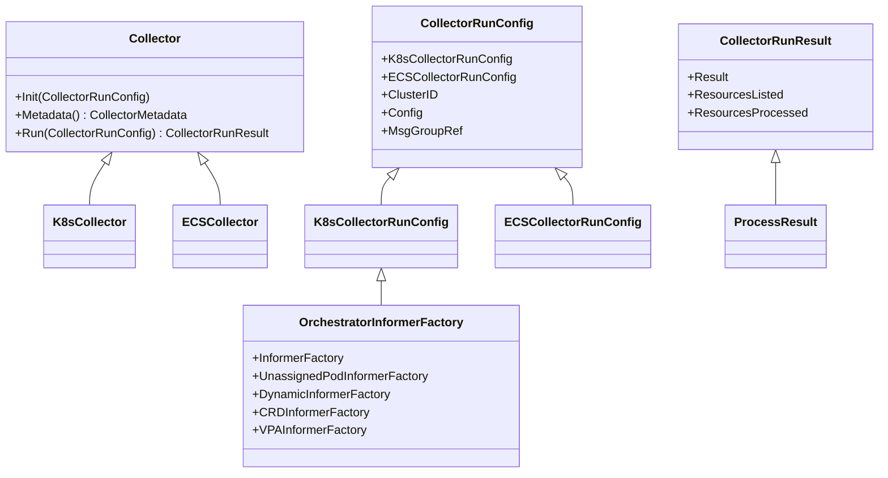

# Getting Started with Orchestrator Collectors

Orchestrator Collectors are responsible for gathering data from various sources within a Kubernetes cluster. They initialize informers and listers to watch for changes in the cluster resources, process the gathered data, and produce metadata and manifests for further analysis.

## Collector Configuration

Collectors are configured using the <SwmToken path="pkg/collector/corechecks/cluster/orchestrator/collectors/collector.go" pos="28:4:4" line-data="	Init(*CollectorRunConfig)">`CollectorRunConfig`</SwmToken> structure, which includes settings specific to Kubernetes and ECS collectors. The <SwmToken path="pkg/collector/corechecks/cluster/orchestrator/collectors/collector.go" pos="63:1:1" line-data="	OrchestratorInformerFactory *OrchestratorInformerFactory">`OrchestratorInformerFactory`</SwmToken> is used to create the necessary informers for different resource types.

## Collector Interface

Each collector implements the <SwmToken path="pkg/collector/corechecks/cluster/orchestrator/collectors/collector.go" pos="23:2:2" line-data="// Collector is an interface that represents the collection process for a">`Collector`</SwmToken> interface, which defines methods for initialization, metadata access, and running the collection process.

<SwmSnippet path="/pkg/collector/corechecks/cluster/orchestrator/collectors/collector.go" line="23">

---

The <SwmToken path="pkg/collector/corechecks/cluster/orchestrator/collectors/collector.go" pos="23:2:2" line-data="// Collector is an interface that represents the collection process for a">`Collector`</SwmToken> interface defines the methods that each collector must implement, including initialization, metadata access, and running the collection process.

```go
// Collector is an interface that represents the collection process for a
// resource type.
type Collector interface {
	// Init is where the collector initialization happens. It is used to create
	// informers and listers.
	Init(*CollectorRunConfig)

	// Metadata is used to access information describing the collector.
	Metadata() *CollectorMetadata

	// Run triggers the collection process given a configuration and returns the
	// collection result. Returns an error if the collection failed.
	Run(*CollectorRunConfig) (*CollectorRunResult, error)
```

---

</SwmSnippet>

## Collector Metadata

The <SwmToken path="pkg/collector/corechecks/cluster/orchestrator/collectors/collector.go" pos="31:6:6" line-data="	Metadata() *CollectorMetadata">`CollectorMetadata`</SwmToken> structure contains information about a collector, such as its name, version, and stability.

<SwmSnippet path="/pkg/collector/corechecks/cluster/orchestrator/collectors/collector.go" line="38">

---

The <SwmToken path="pkg/collector/corechecks/cluster/orchestrator/collectors/collector.go" pos="38:2:2" line-data="// CollectorMetadata contains information about a collector.">`CollectorMetadata`</SwmToken> structure contains information about a collector, such as its name, version, and stability.

```go
// CollectorMetadata contains information about a collector.
type CollectorMetadata struct {
	IsDefaultVersion          bool
	IsMetadataProducer        bool
	IsManifestProducer        bool
	IsStable                  bool
	SupportsManifestBuffering bool
	Name                      string
	NodeType                  pkgorchestratormodel.NodeType
	Version                   string
	IsSkipped                 bool
	SkippedReason             string
}
```

---

</SwmSnippet>

## Collector Run Result

The <SwmToken path="pkg/collector/corechecks/cluster/orchestrator/collectors/collector.go" pos="35:9:9" line-data="	Run(*CollectorRunConfig) (*CollectorRunResult, error)">`CollectorRunResult`</SwmToken> structure encapsulates the results of the collection process, including information about the resources listed and processed.

<SwmSnippet path="/pkg/collector/corechecks/cluster/orchestrator/collectors/collector.go" line="84">

---

The <SwmToken path="pkg/collector/corechecks/cluster/orchestrator/collectors/collector.go" pos="84:2:2" line-data="// CollectorRunResult contains information about what the collector has done.">`CollectorRunResult`</SwmToken> structure encapsulates the results of the collection process, including information about the resources listed and processed.

```go
// CollectorRunResult contains information about what the collector has done.
// Metadata is a list of payload, each payload contains a list of k8s resources metadata and manifest
// Manifests is a list of payload, each payload contains a list of k8s resources manifest.
// Manifests is a copy of part of Metadata
type CollectorRunResult struct {
	Result             processors.ProcessResult
	ResourcesListed    int
	ResourcesProcessed int
}
```

---

</SwmSnippet>

## Main Functions

There are several main functions in this folder. Some of them are <SwmToken path="pkg/collector/corechecks/cluster/orchestrator/collectors/collector.go" pos="26:3:3" line-data="	// Init is where the collector initialization happens. It is used to create">`Init`</SwmToken>, <SwmToken path="pkg/collector/corechecks/cluster/orchestrator/collectors/collector.go" pos="30:3:3" line-data="	// Metadata is used to access information describing the collector.">`Metadata`</SwmToken>, and <SwmToken path="pkg/collector/corechecks/cluster/orchestrator/collectors/collector.go" pos="33:3:3" line-data="	// Run triggers the collection process given a configuration and returns the">`Run`</SwmToken>. We will dive a little into <SwmToken path="pkg/collector/corechecks/cluster/orchestrator/collectors/collector.go" pos="26:3:3" line-data="	// Init is where the collector initialization happens. It is used to create">`Init`</SwmToken> and <SwmToken path="pkg/collector/corechecks/cluster/orchestrator/collectors/collector.go" pos="30:3:3" line-data="	// Metadata is used to access information describing the collector.">`Metadata`</SwmToken>.

### Init

<SwmToken path="pkg/collector/corechecks/cluster/orchestrator/collectors/collector.go" pos="26:3:3" line-data="	// Init is where the collector initialization happens. It is used to create">`Init`</SwmToken> is where the collector initialization happens. It is used to create informers and listers.

### Metadata

<SwmToken path="pkg/collector/corechecks/cluster/orchestrator/collectors/collector.go" pos="30:3:3" line-data="	// Metadata is used to access information describing the collector.">`Metadata`</SwmToken> is used to access information describing the collector.

<SwmSnippet path="/pkg/collector/corechecks/cluster/orchestrator/collectors/collector.go" line="30">

---

<SwmToken path="pkg/collector/corechecks/cluster/orchestrator/collectors/collector.go" pos="30:3:3" line-data="	// Metadata is used to access information describing the collector.">`Metadata`</SwmToken> is used to access information describing the collector.

```go
	// Metadata is used to access information describing the collector.
	Metadata() *CollectorMetadata
```

---

</SwmSnippet>

<SwmSnippet path="/pkg/collector/corechecks/cluster/orchestrator/collectors/collector.go" line="33">

---

<SwmToken path="pkg/collector/corechecks/cluster/orchestrator/collectors/collector.go" pos="33:3:3" line-data="	// Run triggers the collection process given a configuration and returns the">`Run`</SwmToken> triggers the collection process given a configuration and returns the collection result. Returns an error if the collection failed.

```go
	// Run triggers the collection process given a configuration and returns the
	// collection result. Returns an error if the collection failed.
	Run(*CollectorRunConfig) (*CollectorRunResult, error)
```

---

</SwmSnippet>

## Collector Endpoints

Collector Endpoints are specific functions that create new collectors for different resource types.

<SwmSnippet path="/pkg/collector/corechecks/cluster/orchestrator/collectors/ecs/task.go" line="29">

---

The <SwmToken path="pkg/collector/corechecks/cluster/orchestrator/collectors/ecs/task.go" pos="29:2:2" line-data="// NewTaskCollector creates a new collector for the ECS Task resource.">`NewTaskCollector`</SwmToken> function creates a new collector for ECS Task resources. It initializes the collector's metadata and processor, setting up the necessary configurations for collecting ECS Task data.

```go
// NewTaskCollector creates a new collector for the ECS Task resource.
func NewTaskCollector() *TaskCollector {
	return &TaskCollector{
		metadata: &collectors.CollectorMetadata{
			IsStable:           false,
			IsMetadataProducer: true,
			IsManifestProducer: false,
			Name:               "ecstasks",
			NodeType:           orchestrator.ECSTask,
		},
		processor: processors.NewProcessor(new(ecs.TaskHandlers)),
	}
}
```

---

</SwmSnippet>

### <SwmToken path="pkg/collector/corechecks/cluster/orchestrator/collectors/k8s/cr.go" pos="43:2:2" line-data="// NewCRCollector creates a new collector for Kubernetes CRs.">`NewCRCollector`</SwmToken>

The <SwmToken path="pkg/collector/corechecks/cluster/orchestrator/collectors/k8s/cr.go" pos="43:2:2" line-data="// NewCRCollector creates a new collector for Kubernetes CRs.">`NewCRCollector`</SwmToken> function creates a new collector for Kubernetes Custom Resources. It sets up the collector's metadata and processor, preparing it to handle the collection of custom resource data within a Kubernetes cluster.

<SwmSnippet path="/pkg/collector/corechecks/cluster/orchestrator/collectors/k8s/cr.go" line="43">

---

The <SwmToken path="pkg/collector/corechecks/cluster/orchestrator/collectors/k8s/cr.go" pos="43:2:2" line-data="// NewCRCollector creates a new collector for Kubernetes CRs.">`NewCRCollector`</SwmToken> function creates a new collector for Kubernetes Custom Resources. It sets up the collector's metadata and processor, preparing it to handle the collection of custom resource data within a Kubernetes cluster.

```go
// NewCRCollector creates a new collector for Kubernetes CRs.
func NewCRCollector(name string, groupVersion string) (*CRCollector, error) {
	gv, err := schema.ParseGroupVersion(groupVersion)
	if err != nil {
		return nil, err
	}
	return &CRCollector{
		metadata: &collectors.CollectorMetadata{
			IsDefaultVersion:          true,
			IsStable:                  false,
			IsManifestProducer:        true,
			IsMetadataProducer:        false,
			SupportsManifestBuffering: false,
			Name:                      name,
			NodeType:                  orchestrator.K8sCR,
			Version:                   groupVersion,
		},
		gvr:       gv.WithResource(name),
		processor: processors.NewProcessor(new(k8sProcessors.CRHandlers)),
	}, nil
}
```

---

</SwmSnippet>

&nbsp;

*This is an auto-generated document by Swimm AI 🌊 and has not yet been verified by a human*

<SwmMeta version="3.0.0" repo-id="Z2l0aHViJTNBJTNBZGF0YWRvZy1hZ2VudCUzQSUzQVN3aW1tLURlbW8=" repo-name="datadog-agent"><sup>Powered by [Swimm](/)</sup></SwmMeta>
