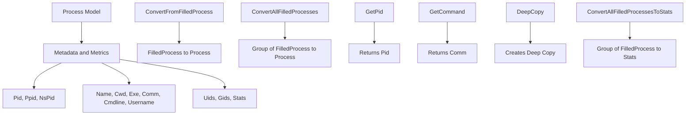

<SwmSnippet path="/pkg/process/procutil/process_model.go" line="14">

---

# Process Model

The Process Model holds all relevant metadata and metrics for a process, including Pid, Ppid, <SwmToken path="pkg/process/procutil/process_model.go" pos="18:1:1" line-data="	NsPid    int32 // process namespaced PID">`NsPid`</SwmToken>, Name, Cwd, Exe, Comm, Cmdline, Username, Uids, Gids, and Stats.

```go
// Process holds all relevant metadata and metrics for a process
type Process struct {
	Pid      int32
	Ppid     int32
	NsPid    int32 // process namespaced PID
	Name     string
	Cwd      string
	Exe      string
	Comm     string
	Cmdline  []string
	Username string // (Windows only)
	Uids     []int32
	Gids     []int32

	Stats *Stats
}
```

---

</SwmSnippet>

<SwmSnippet path="/pkg/process/procutil/process_model.go" line="251">

---

# <SwmToken path="pkg/process/procutil/process_model.go" pos="251:2:2" line-data="// ConvertFromFilledProcess takes a FilledProcess object and convert it into Process">`ConvertFromFilledProcess`</SwmToken>

The function <SwmToken path="pkg/process/procutil/process_model.go" pos="251:2:2" line-data="// ConvertFromFilledProcess takes a FilledProcess object and convert it into Process">`ConvertFromFilledProcess`</SwmToken> takes a <SwmToken path="pkg/process/procutil/process_model.go" pos="251:8:8" line-data="// ConvertFromFilledProcess takes a FilledProcess object and convert it into Process">`FilledProcess`</SwmToken> object and converts it into a Process object, populating all relevant fields.

```go
// ConvertFromFilledProcess takes a FilledProcess object and convert it into Process
func ConvertFromFilledProcess(p *process.FilledProcess) *Process {
	return &Process{
		Pid:      p.Pid,
		Ppid:     p.Ppid,
		NsPid:    p.NsPid,
		Name:     p.Name,
		Cwd:      p.Cwd,
		Exe:      p.Exe,
		Cmdline:  p.Cmdline,
		Username: p.Username,
		Uids:     p.Uids,
		Gids:     p.Gids,
		Stats:    ConvertFilledProcessesToStats(p),
	}
}
```

---

</SwmSnippet>

<SwmSnippet path="/pkg/process/procutil/process_model.go" line="217">

---

# <SwmToken path="pkg/process/procutil/process_model.go" pos="217:2:2" line-data="// ConvertAllFilledProcesses takes a group of FilledProcess objects and convert them into Process">`ConvertAllFilledProcesses`</SwmToken>

The function <SwmToken path="pkg/process/procutil/process_model.go" pos="217:2:2" line-data="// ConvertAllFilledProcesses takes a group of FilledProcess objects and convert them into Process">`ConvertAllFilledProcesses`</SwmToken> takes a group of <SwmToken path="pkg/process/procutil/process_model.go" pos="217:12:12" line-data="// ConvertAllFilledProcesses takes a group of FilledProcess objects and convert them into Process">`FilledProcess`</SwmToken> objects and converts them into Process objects, making it easier to handle multiple processes at once.

```go
// ConvertAllFilledProcesses takes a group of FilledProcess objects and convert them into Process
func ConvertAllFilledProcesses(processes map[int32]*process.FilledProcess) map[int32]*Process {
	result := make(map[int32]*Process, len(processes))
	for pid, p := range processes {
		result[pid] = ConvertFromFilledProcess(p)
	}
	return result
}
```

---

</SwmSnippet>

# Main Functions

There are several main functions in this folder. Some of them are <SwmToken path="pkg/process/procutil/process_model.go" pos="32:9:9" line-data="func (p *Process) GetPid() int32 {">`GetPid`</SwmToken>, <SwmToken path="pkg/process/procutil/process_model.go" pos="37:9:9" line-data="func (p *Process) GetCommand() string {">`GetCommand`</SwmToken>, <SwmToken path="pkg/process/procutil/process_model.go" pos="46:2:2" line-data="// DeepCopy creates a deep copy of Process">`DeepCopy`</SwmToken>, <SwmToken path="pkg/process/procutil/process_model.go" pos="217:2:2" line-data="// ConvertAllFilledProcesses takes a group of FilledProcess objects and convert them into Process">`ConvertAllFilledProcesses`</SwmToken>, and <SwmToken path="pkg/process/procutil/process_model.go" pos="226:2:2" line-data="// ConvertAllFilledProcessesToStats takes a group of FilledProcess objects and convert them into Stats">`ConvertAllFilledProcessesToStats`</SwmToken>. We will dive a little into <SwmToken path="pkg/process/procutil/process_model.go" pos="32:9:9" line-data="func (p *Process) GetPid() int32 {">`GetPid`</SwmToken> and <SwmToken path="pkg/process/procutil/process_model.go" pos="46:2:2" line-data="// DeepCopy creates a deep copy of Process">`DeepCopy`</SwmToken>.

<SwmSnippet path="/pkg/process/procutil/process_model.go" line="31">

---

### <SwmToken path="pkg/process/procutil/process_model.go" pos="32:9:9" line-data="func (p *Process) GetPid() int32 {">`GetPid`</SwmToken>

The <SwmToken path="pkg/process/procutil/process_model.go" pos="32:9:9" line-data="func (p *Process) GetPid() int32 {">`GetPid`</SwmToken> function returns the process ID (Pid) of the <SwmToken path="pkg/process/procutil/process_model.go" pos="32:6:6" line-data="func (p *Process) GetPid() int32 {">`Process`</SwmToken> struct. This is useful for identifying the specific process being monitored.

```go
//nolint:revive // TODO(PROC) Fix revive linter
func (p *Process) GetPid() int32 {
	return p.Pid
}
```

---

</SwmSnippet>

<SwmSnippet path="/pkg/process/procutil/process_model.go" line="36">

---

### <SwmToken path="pkg/process/procutil/process_model.go" pos="37:9:9" line-data="func (p *Process) GetCommand() string {">`GetCommand`</SwmToken>

The <SwmToken path="pkg/process/procutil/process_model.go" pos="37:9:9" line-data="func (p *Process) GetCommand() string {">`GetCommand`</SwmToken> function returns the command name (Comm) of the <SwmToken path="pkg/process/procutil/process_model.go" pos="37:6:6" line-data="func (p *Process) GetCommand() string {">`Process`</SwmToken> struct. This provides the name of the command that started the process.

```go
//nolint:revive // TODO(PROC) Fix revive linter
func (p *Process) GetCommand() string {
	return p.Comm
}
```

---

</SwmSnippet>

<SwmSnippet path="/pkg/process/procutil/process_model.go" line="46">

---

### <SwmToken path="pkg/process/procutil/process_model.go" pos="46:2:2" line-data="// DeepCopy creates a deep copy of Process">`DeepCopy`</SwmToken>

The <SwmToken path="pkg/process/procutil/process_model.go" pos="46:2:2" line-data="// DeepCopy creates a deep copy of Process">`DeepCopy`</SwmToken> function creates a deep copy of the <SwmToken path="pkg/process/procutil/process_model.go" pos="46:14:14" line-data="// DeepCopy creates a deep copy of Process">`Process`</SwmToken> struct. This is important for creating independent copies of process data without affecting the original data.

```go
// DeepCopy creates a deep copy of Process
func (p *Process) DeepCopy() *Process {
	//nolint:revive // TODO(PROC) Fix revive linter
	copy := &Process{
		Pid:      p.Pid,
		Ppid:     p.Ppid,
		NsPid:    p.NsPid,
		Name:     p.Name,
		Cwd:      p.Cwd,
		Exe:      p.Exe,
		Username: p.Username,
	}
	copy.Cmdline = make([]string, len(p.Cmdline))
	for i := range p.Cmdline {
		copy.Cmdline[i] = p.Cmdline[i]
	}
	copy.Uids = make([]int32, len(p.Uids))
	for i := range p.Uids {
		copy.Uids[i] = p.Uids[i]
	}
	copy.Gids = make([]int32, len(p.Gids))
```

---

</SwmSnippet>

<SwmSnippet path="/pkg/process/procutil/process_model.go" line="226">

---

### <SwmToken path="pkg/process/procutil/process_model.go" pos="226:2:2" line-data="// ConvertAllFilledProcessesToStats takes a group of FilledProcess objects and convert them into Stats">`ConvertAllFilledProcessesToStats`</SwmToken>

The <SwmToken path="pkg/process/procutil/process_model.go" pos="226:2:2" line-data="// ConvertAllFilledProcessesToStats takes a group of FilledProcess objects and convert them into Stats">`ConvertAllFilledProcessesToStats`</SwmToken> function takes a group of <SwmToken path="pkg/process/procutil/process_model.go" pos="226:12:12" line-data="// ConvertAllFilledProcessesToStats takes a group of FilledProcess objects and convert them into Stats">`FilledProcess`</SwmToken> objects and converts them into <SwmToken path="pkg/process/procutil/process_model.go" pos="226:24:24" line-data="// ConvertAllFilledProcessesToStats takes a group of FilledProcess objects and convert them into Stats">`Stats`</SwmToken> objects. This is used to extract and store statistical data from the collected process information.

```go
// ConvertAllFilledProcessesToStats takes a group of FilledProcess objects and convert them into Stats
func ConvertAllFilledProcessesToStats(processes map[int32]*process.FilledProcess) map[int32]*Stats {
	stats := make(map[int32]*Stats, len(processes))
	for pid, p := range processes {
		stats[pid] = ConvertFilledProcessesToStats(p)
	}
	return stats
}
```

---

</SwmSnippet>

&nbsp;

*This is an auto-generated document by Swimm AI 🌊 and has not yet been verified by a human*

<SwmMeta version="3.0.0" repo-id="Z2l0aHViJTNBJTNBZGF0YWRvZy1hZ2VudCUzQSUzQVN3aW1tLURlbW8=" repo-name="datadog-agent"><sup>Powered by [Swimm](/)</sup></SwmMeta>
