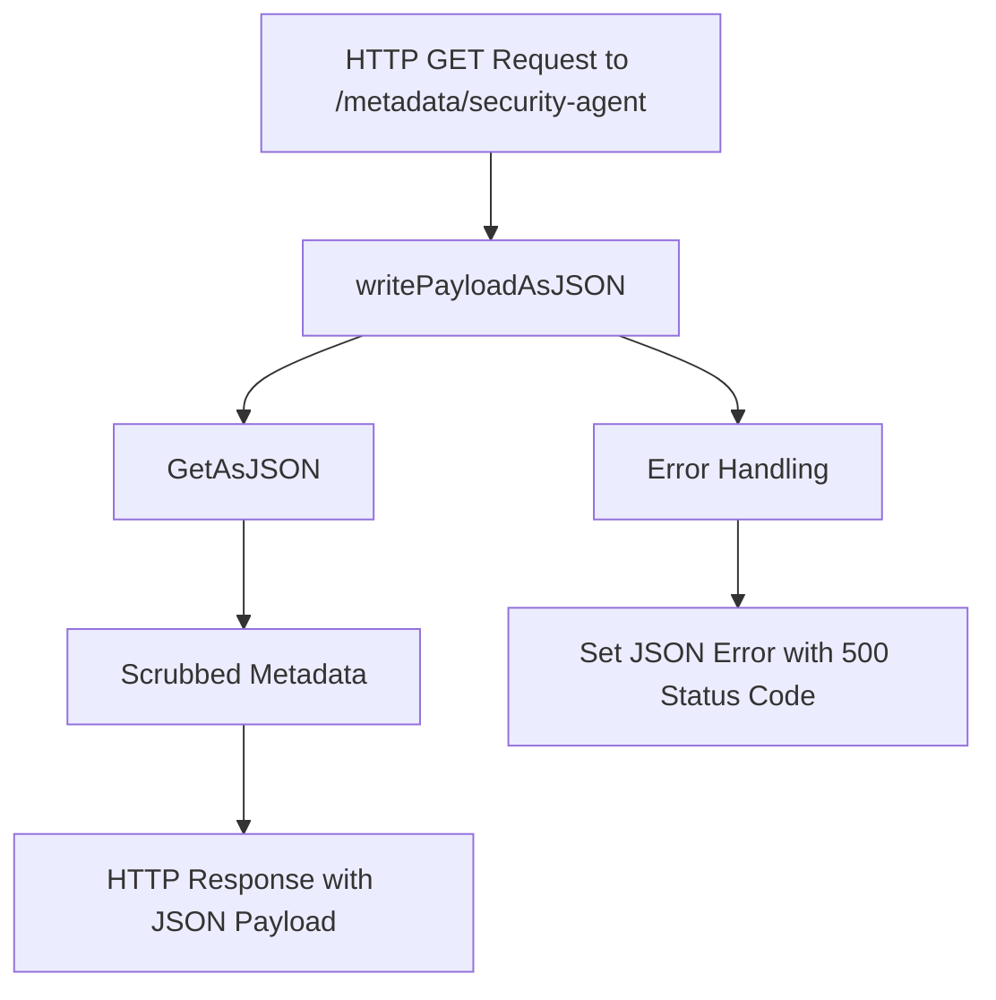

# Introduction

The Security Agent is a component responsible for collecting and managing security-related metadata. It ensures that compliance and runtime security features are enabled and functioning correctly. This document will guide you through getting started with Security Agent Metadata, including enabling security features, understanding the metadata payload, dependencies, main functions, and endpoints.

# Enabling Security Features

To enable the compliance and runtime security features, set the `compliance` and `runtime` fields to `true` in the <SwmPath>[google-marketplace/chart/datadog-mp/values.yaml](google-marketplace/chart/datadog-mp/values.yaml)</SwmPath> file.

# Security Agent Metadata

The Security Agent's metadata payload includes details such as the hostname, timestamp, and a map of security agent metadata. This payload is serialized into JSON for further processing and analysis.

<SwmSnippet path="/comp/metadata/securityagent/impl/security_agent.go" line="41">

---

The <SwmToken path="comp/metadata/securityagent/impl/security_agent.go" pos="41:2:2" line-data="// Payload handles the JSON unmarshalling of the metadata payload">`Payload`</SwmToken> struct handles the JSON unmarshalling of the metadata payload. It includes fields for the hostname, timestamp, and a map of security agent metadata.

```go
// Payload handles the JSON unmarshalling of the metadata payload
type Payload struct {
	Hostname  string                 `json:"hostname"`
	Timestamp int64                  `json:"timestamp"`
	Metadata  map[string]interface{} `json:"security_agent_metadata"`
}
```

---

</SwmSnippet>

# Dependencies

The Security Agent relies on several dependencies, including logging, configuration, and authentication components, to function effectively. These dependencies ensure that the Security Agent can securely fetch and process configuration data.

<SwmSnippet path="/comp/metadata/securityagent/impl/security_agent.go" line="69">

---

The <SwmToken path="comp/metadata/securityagent/impl/security_agent.go" pos="69:2:2" line-data="// Requires defines the dependencies for the securityagent metadata component">`Requires`</SwmToken> struct defines the dependencies for the security agent metadata component. It includes components for logging, configuration, serialization, and authentication.

```go
// Requires defines the dependencies for the securityagent metadata component
type Requires struct {
	Log        log.Component
	Config     config.Component
	Serializer serializer.MetricSerializer
	// We need the authtoken to be created so we requires the comp. It will be used by configFetcher.
	AuthToken authtoken.Component
}
```

---

</SwmSnippet>

# Main Functions

The main functions of the Security Agent Metadata component include creating the component, generating the payload, and handling HTTP requests for metadata.

## <SwmToken path="comp/metadata/securityagent/impl/security_agent.go" pos="86:2:2" line-data="// NewComponent creates a new securityagent metadata Component">`NewComponent`</SwmToken>

The <SwmToken path="comp/metadata/securityagent/impl/security_agent.go" pos="86:2:2" line-data="// NewComponent creates a new securityagent metadata Component">`NewComponent`</SwmToken> function creates a new security agent metadata component. It initializes the component with necessary dependencies such as logging, configuration, and serializer components. This function also sets up the inventory payload and returns the component along with metadata and flare providers.

<SwmSnippet path="/comp/metadata/securityagent/impl/security_agent.go" line="86">

---

The <SwmToken path="comp/metadata/securityagent/impl/security_agent.go" pos="86:2:2" line-data="// NewComponent creates a new securityagent metadata Component">`NewComponent`</SwmToken> function initializes the security agent metadata component with dependencies and sets up the inventory payload.

```go
// NewComponent creates a new securityagent metadata Component
func NewComponent(deps Requires) Provides {
	hname, _ := hostname.Get(context.Background())
	sa := &securityagent{
		log:      deps.Log,
		conf:     deps.Config,
		hostname: hname,
	}
	sa.InventoryPayload = util.CreateInventoryPayload(deps.Config, deps.Log, deps.Serializer, sa.getPayload, "security-agent.json")

	return Provides{
		Comp:             sa,
		MetadataProvider: sa.MetadataProvider(),
		FlareProvider:    sa.FlareProvider(),
		Endpoint:         api.NewAgentEndpointProvider(sa.writePayloadAsJSON, "/metadata/security-agent", "GET"),
	}
}
```

---

</SwmSnippet>

## <SwmToken path="comp/metadata/securityagent/impl/security_agent.go" pos="94:28:28" line-data="	sa.InventoryPayload = util.CreateInventoryPayload(deps.Config, deps.Log, deps.Serializer, sa.getPayload, &quot;security-agent.json&quot;)">`getPayload`</SwmToken>

The <SwmToken path="comp/metadata/securityagent/impl/security_agent.go" pos="94:28:28" line-data="	sa.InventoryPayload = util.CreateInventoryPayload(deps.Config, deps.Log, deps.Serializer, sa.getPayload, &quot;security-agent.json&quot;)">`getPayload`</SwmToken> function generates the payload for the security agent. It includes the hostname, timestamp, and metadata. The metadata is fetched using the <SwmToken path="comp/metadata/securityagent/impl/security_agent.go" pos="169:6:6" line-data="		Metadata:  sa.getConfigLayers(),">`getConfigLayers`</SwmToken> function, which gathers various configuration layers and their details.

<SwmSnippet path="/comp/metadata/securityagent/impl/security_agent.go" line="165">

---

The <SwmToken path="comp/metadata/securityagent/impl/security_agent.go" pos="165:9:9" line-data="func (sa *securityagent) getPayload() marshaler.JSONMarshaler {">`getPayload`</SwmToken> function generates the security agent's payload, including the hostname, timestamp, and metadata.

```go
func (sa *securityagent) getPayload() marshaler.JSONMarshaler {
	return &Payload{
		Hostname:  sa.hostname,
		Timestamp: time.Now().UnixNano(),
		Metadata:  sa.getConfigLayers(),
	}
}
```

---

</SwmSnippet>

# Security Agent Endpoints

The Security Agent provides an endpoint to access its metadata.

## <SwmPath>[Dockerfiles/manifests/security-agent/](Dockerfiles/manifests/security-agent/)</SwmPath>

The endpoint <SwmPath>[Dockerfiles/manifests/security-agent/](Dockerfiles/manifests/security-agent/)</SwmPath> is defined to provide metadata related to the Security Agent. It is a GET endpoint that returns the security agent's metadata in JSON format. The function <SwmToken path="comp/metadata/securityagent/impl/security_agent.go" pos="100:10:10" line-data="		Endpoint:         api.NewAgentEndpointProvider(sa.writePayloadAsJSON, &quot;/metadata/security-agent&quot;, &quot;GET&quot;),">`writePayloadAsJSON`</SwmToken> handles the HTTP request and response for this endpoint.

<SwmSnippet path="/comp/metadata/securityagent/impl/security_agent.go" line="100">

---

The endpoint <SwmPath>[Dockerfiles/manifests/security-agent/](Dockerfiles/manifests/security-agent/)</SwmPath> is set up to provide the security agent's metadata in JSON format.

```go
		Endpoint:         api.NewAgentEndpointProvider(sa.writePayloadAsJSON, "/metadata/security-agent", "GET"),
	}
}
```

---

</SwmSnippet>

<SwmSnippet path="/comp/metadata/securityagent/impl/security_agent.go" line="104">

---

The <SwmToken path="comp/metadata/securityagent/impl/security_agent.go" pos="104:9:9" line-data="func (sa *securityagent) writePayloadAsJSON(w http.ResponseWriter, _ *http.Request) {">`writePayloadAsJSON`</SwmToken> function handles the HTTP request and response for the <SwmPath>[Dockerfiles/manifests/security-agent/](Dockerfiles/manifests/security-agent/)</SwmPath> endpoint. It retrieves the scrubbed metadata and writes it to the HTTP response. If an error occurs, it sets a JSON error with a 500 status code.

```go
func (sa *securityagent) writePayloadAsJSON(w http.ResponseWriter, _ *http.Request) {
	// GetAsJSON calls getPayload which already scrub the data
	scrubbed, err := sa.GetAsJSON()
	if err != nil {
		httputils.SetJSONError(w, err, 500)
		return
	}
	w.Write(scrubbed)
}
```

---

</SwmSnippet>

&nbsp;

*This is an auto-generated document by Swimm AI 🌊 and has not yet been verified by a human*

<SwmMeta version="3.0.0" repo-id="Z2l0aHViJTNBJTNBZGF0YWRvZy1hZ2VudCUzQSUzQVN3aW1tLURlbW8=" repo-name="datadog-agent"><sup>Powered by [Swimm](/)</sup></SwmMeta>
