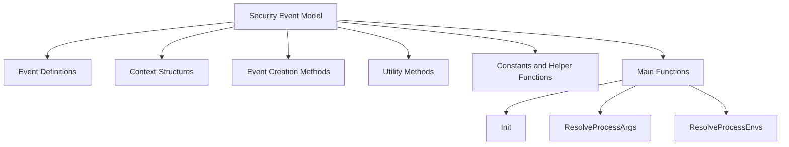

# Introduction

The Security Event Model in the Datadog Agent describes the data model for runtime security agent events. It defines the structure and behavior of various events and contexts related to security monitoring. This document will guide you through the key components of the Security Event Model, including event definitions, context structures, event creation methods, utility methods, constants, and main functions.

# Event Definitions

The Model defines various event types such as process events and file events. Each event type has specific fields and methods to handle its data.

<SwmSnippet path="/pkg/security/secl/model/model_windows.go" line="26">

---

The <SwmToken path="pkg/security/secl/model/model_windows.go" pos="26:2:2" line-data="// Event represents an event sent from the kernel">`Event`</SwmToken> struct represents an event sent from the kernel. It includes fields for different types of events such as process execution, process termination, file creation, and file renaming.

```go
// Event represents an event sent from the kernel
// genaccessors
type Event struct {
	BaseEvent

	// process events
	Exec ExecEvent `field:"exec" event:"exec"` // [7.27] [Process] A process was executed or forked
	Exit ExitEvent `field:"exit" event:"exit"` // [7.38] [Process] A process was terminated

	// FIM
	CreateNewFile CreateNewFileEvent `field:"create" event:"create"` // [7.52] [File] A file was created
	RenameFile    RenameFileEvent    `field:"rename" event:"rename"` // [7.54] [File] A file was renamed
```

---

</SwmSnippet>

# Context Structures

The Model includes context structures like <SwmToken path="pkg/security/secl/model/model.go" pos="508:2:2" line-data="// ProcessContext holds the process context of an event">`ProcessContext`</SwmToken>, which provide additional information about the environment in which an event occurred.

<SwmSnippet path="/pkg/security/secl/model/model.go" line="508">

---

The <SwmToken path="pkg/security/secl/model/model.go" pos="508:2:2" line-data="// ProcessContext holds the process context of an event">`ProcessContext`</SwmToken> struct holds the process context of an event, including information about the parent process and ancestor processes.

```go
// ProcessContext holds the process context of an event
type ProcessContext struct {
	Process

	Parent   *Process           `field:"parent,opts:exposed_at_event_root_only,check:HasParent"`
	Ancestor *ProcessCacheEntry `field:"ancestors,iterator:ProcessAncestorsIterator,check:IsNotKworker"`
}
```

---

</SwmSnippet>

# Event Creation Methods

Methods within the Model, such as <SwmToken path="pkg/security/secl/model/model_helpers_unix.go" pos="88:2:2" line-data="// ValidateField validates the value of a field">`ValidateField`</SwmToken>, are used to create and validate new instances of events, ensuring they are initialized with the necessary context and default values.

<SwmSnippet path="/pkg/security/secl/model/model_helpers_unix.go" line="88">

---

The <SwmToken path="pkg/security/secl/model/model_helpers_unix.go" pos="88:2:2" line-data="// ValidateField validates the value of a field">`ValidateField`</SwmToken> method validates the value of a field, ensuring it meets specific criteria such as path validation and return value checks.

```go
// ValidateField validates the value of a field
func (m *Model) ValidateField(field eval.Field, fieldValue eval.FieldValue) error {
	if strings.HasSuffix(field, ".path") && !strings.HasSuffix(field, ".syscall.path") {
		if err := validatePath(field, fieldValue); err != nil {
			return err
		}
	}

	switch field {

	case "event.retval":
		if value := fieldValue.Value; value != -int(syscall.EPERM) && value != -int(syscall.EACCES) {
			return errors.New("return value can only be tested against EPERM or EACCES")
		}
	case "bpf.map.name", "bpf.prog.name":
		if value, ok := fieldValue.Value.(string); ok {
			if len(value) > MaxBpfObjName {
				return fmt.Errorf("the name provided in %s must be at most %d characters, len(\"%s\") = %d", field, MaxBpfObjName, value, len(value))
			}
		}
	}
```

---

</SwmSnippet>

# Utility Methods

The Model includes utility methods for managing event lifecycle, such as <SwmToken path="pkg/security/secl/model/accessors_windows.go" pos="39:9:9" line-data="func (m *Model) GetEvaluator(field eval.Field, regID eval.RegisterID) (eval.Evaluator, error) {">`GetEvaluator`</SwmToken>, which handle reference counting and resource cleanup.

<SwmSnippet path="/pkg/security/secl/model/accessors_windows.go" line="39">

---

The <SwmToken path="pkg/security/secl/model/accessors_windows.go" pos="39:9:9" line-data="func (m *Model) GetEvaluator(field eval.Field, regID eval.RegisterID) (eval.Evaluator, error) {">`GetEvaluator`</SwmToken> method returns an evaluator for a given field, which can be used to resolve specific data related to the event.

```go
func (m *Model) GetEvaluator(field eval.Field, regID eval.RegisterID) (eval.Evaluator, error) {
	switch field {
	case "change_permission.new_sd":
		return &eval.StringEvaluator{
			EvalFnc: func(ctx *eval.Context) string {
				ev := ctx.Event.(*Event)
				return ev.FieldHandlers.ResolveNewSecurityDescriptor(ev, &ev.ChangePermission)
			},
			Field:  field,
			Weight: eval.HandlerWeight,
		}, nil
	case "change_permission.old_sd":
		return &eval.StringEvaluator{
			EvalFnc: func(ctx *eval.Context) string {
				ev := ctx.Event.(*Event)
				return ev.FieldHandlers.ResolveOldSecurityDescriptor(ev, &ev.ChangePermission)
			},
			Field:  field,
			Weight: eval.HandlerWeight,
		}, nil
```

---

</SwmSnippet>

# Constants and Helper Functions

The Model defines constants and helper functions to support event processing, such as <SwmToken path="pkg/security/secl/model/model.go" pos="365:3:3" line-data="	// Done means that the hashes were already computed">`Done`</SwmToken>, which indicates that the hashes were already computed.

<SwmSnippet path="/pkg/security/secl/model/model.go" line="364">

---

The <SwmToken path="pkg/security/secl/model/model.go" pos="364:3:3" line-data="	NoHash HashState = iota">`HashState`</SwmToken> constants define different states for hash computation, such as <SwmToken path="pkg/security/secl/model/model.go" pos="364:1:1" line-data="	NoHash HashState = iota">`NoHash`</SwmToken>, <SwmToken path="pkg/security/secl/model/model.go" pos="365:3:3" line-data="	// Done means that the hashes were already computed">`Done`</SwmToken>, and <SwmToken path="pkg/security/secl/model/model.go" pos="367:3:3" line-data="	// FileNotFound means that the underlying file is not longer available to compute the hash">`FileNotFound`</SwmToken>.

```go
	NoHash HashState = iota
	// Done means that the hashes were already computed
	Done
	// FileNotFound means that the underlying file is not longer available to compute the hash
	FileNotFound
```

---

</SwmSnippet>

# Main Functions

There are several main functions in this folder. Some of them are <SwmToken path="pkg/security/secl/model/model.go" pos="184:2:2" line-data="// Init initialize the event">`Init`</SwmToken>, <SwmToken path="pkg/security/secl/model/model_unix.go" pos="239:13:13" line-data="	Args          string   `field:&quot;args,handler:ResolveProcessArgs,weight:500&quot;`                                                                                                                                                                              // SECLDoc[args] Definition:`Arguments of the process (as a string, excluding argv0)` Example:`exec.args == &quot;-sV -p 22,53,110,143,4564 198.116.0-255.1-127&quot;` Description:`Matches any process with these exact arguments.` Example:`exec.args =~ &quot;* -F * http*&quot;` Description:`Matches any process that has the &quot;-F&quot; argument anywhere before an argument starting with &quot;http&quot;.`">`ResolveProcessArgs`</SwmToken>, and <SwmToken path="pkg/security/secl/model/model_unix.go" pos="242:15:15" line-data="	Envs          []string `field:&quot;envs,handler:ResolveProcessEnvs,weight:100&quot;`                                                                                                                                                                              // SECLDoc[envs] Definition:`Environment variable names of the process`">`ResolveProcessEnvs`</SwmToken>. We will dive a little into <SwmToken path="pkg/security/secl/model/model.go" pos="184:2:2" line-data="// Init initialize the event">`Init`</SwmToken> and <SwmToken path="pkg/security/secl/model/model_unix.go" pos="239:13:13" line-data="	Args          string   `field:&quot;args,handler:ResolveProcessArgs,weight:500&quot;`                                                                                                                                                                              // SECLDoc[args] Definition:`Arguments of the process (as a string, excluding argv0)` Example:`exec.args == &quot;-sV -p 22,53,110,143,4564 198.116.0-255.1-127&quot;` Description:`Matches any process with these exact arguments.` Example:`exec.args =~ &quot;* -F * http*&quot;` Description:`Matches any process that has the &quot;-F&quot; argument anywhere before an argument starting with &quot;http&quot;.`">`ResolveProcessArgs`</SwmToken>.

## Init

The <SwmToken path="pkg/security/secl/model/model.go" pos="184:2:2" line-data="// Init initialize the event">`Init`</SwmToken> function initializes the event by setting up its members using reflection. This ensures that all necessary fields are properly initialized before the event is used.

<SwmSnippet path="/pkg/security/secl/model/model.go" line="184">

---

The <SwmToken path="pkg/security/secl/model/model.go" pos="184:2:2" line-data="// Init initialize the event">`Init`</SwmToken> method initializes the event by calling <SwmToken path="pkg/security/secl/model/model.go" pos="186:1:1" line-data="	initMember(reflect.ValueOf(e).Elem(), map[string]bool{})">`initMember`</SwmToken> on the event's members.

```go
// Init initialize the event
func (e *Event) Init() {
	initMember(reflect.ValueOf(e).Elem(), map[string]bool{})
}
```

---

</SwmSnippet>

## <SwmToken path="pkg/security/secl/model/model_unix.go" pos="239:13:13" line-data="	Args          string   `field:&quot;args,handler:ResolveProcessArgs,weight:500&quot;`                                                                                                                                                                              // SECLDoc[args] Definition:`Arguments of the process (as a string, excluding argv0)` Example:`exec.args == &quot;-sV -p 22,53,110,143,4564 198.116.0-255.1-127&quot;` Description:`Matches any process with these exact arguments.` Example:`exec.args =~ &quot;* -F * http*&quot;` Description:`Matches any process that has the &quot;-F&quot; argument anywhere before an argument starting with &quot;http&quot;.`">`ResolveProcessArgs`</SwmToken>

The <SwmToken path="pkg/security/secl/model/model_unix.go" pos="239:13:13" line-data="	Args          string   `field:&quot;args,handler:ResolveProcessArgs,weight:500&quot;`                                                                                                                                                                              // SECLDoc[args] Definition:`Arguments of the process (as a string, excluding argv0)` Example:`exec.args == &quot;-sV -p 22,53,110,143,4564 198.116.0-255.1-127&quot;` Description:`Matches any process with these exact arguments.` Example:`exec.args =~ &quot;* -F * http*&quot;` Description:`Matches any process that has the &quot;-F&quot; argument anywhere before an argument starting with &quot;http&quot;.`">`ResolveProcessArgs`</SwmToken> function handles the resolution of process arguments. It converts the arguments of a process into a string format, which can then be used for further processing or matching.

<SwmSnippet path="/pkg/security/secl/model/model_unix.go" line="238">

---

The <SwmToken path="pkg/security/secl/model/model_unix.go" pos="239:13:13" line-data="	Args          string   `field:&quot;args,handler:ResolveProcessArgs,weight:500&quot;`                                                                                                                                                                              // SECLDoc[args] Definition:`Arguments of the process (as a string, excluding argv0)` Example:`exec.args == &quot;-sV -p 22,53,110,143,4564 198.116.0-255.1-127&quot;` Description:`Matches any process with these exact arguments.` Example:`exec.args =~ &quot;* -F * http*&quot;` Description:`Matches any process that has the &quot;-F&quot; argument anywhere before an argument starting with &quot;http&quot;.`">`ResolveProcessArgs`</SwmToken> method converts the process arguments into a string format for further processing.

```go
	Argv0         string   `field:"argv0,handler:ResolveProcessArgv0,weight:100"`                                                                                                                                                                            // SECLDoc[argv0] Definition:`First argument of the process`
	Args          string   `field:"args,handler:ResolveProcessArgs,weight:500"`                                                                                                                                                                              // SECLDoc[args] Definition:`Arguments of the process (as a string, excluding argv0)` Example:`exec.args == "-sV -p 22,53,110,143,4564 198.116.0-255.1-127"` Description:`Matches any process with these exact arguments.` Example:`exec.args =~ "* -F * http*"` Description:`Matches any process that has the "-F" argument anywhere before an argument starting with "http".`
	Argv          []string `field:"argv,handler:ResolveProcessArgv,weight:500; cmdargv,handler:ResolveProcessCmdArgv,opts:getters_only; args_flags,handler:ResolveProcessArgsFlags,opts:helper; args_options,handler:ResolveProcessArgsOptions,opts:helper"` // SECLDoc[argv] Definition:`Arguments of the process (as an array, excluding argv0)` Example:`exec.argv in ["127.0.0.1"]` Description:`Matches any process that has this IP address as one of its arguments.` SECLDoc[args_flags] Definition:`Flags in the process arguments` Example:`exec.args_flags in ["s"] && exec.args_flags in ["V"]` Description:`Matches any process with both "-s" and "-V" flags in its arguments. Also matches "-sV".` SECLDoc[args_options] Definition:`Argument of the process as options` Example:`exec.args_options in ["p=0-1024"]` Description:`Matches any process that has either "-p 0-1024" or "--p=0-1024" in its arguments.`
```

---

</SwmSnippet>

## <SwmToken path="pkg/security/secl/model/model_unix.go" pos="242:15:15" line-data="	Envs          []string `field:&quot;envs,handler:ResolveProcessEnvs,weight:100&quot;`                                                                                                                                                                              // SECLDoc[envs] Definition:`Environment variable names of the process`">`ResolveProcessEnvs`</SwmToken>

The <SwmToken path="pkg/security/secl/model/model_unix.go" pos="242:15:15" line-data="	Envs          []string `field:&quot;envs,handler:ResolveProcessEnvs,weight:100&quot;`                                                                                                                                                                              // SECLDoc[envs] Definition:`Environment variable names of the process`">`ResolveProcessEnvs`</SwmToken> function resolves the environment variables of a process. It converts the environment variables into a list of strings, making them accessible for further operations.

<SwmSnippet path="/pkg/security/secl/model/model_unix.go" line="242">

---

The <SwmToken path="pkg/security/secl/model/model_unix.go" pos="242:15:15" line-data="	Envs          []string `field:&quot;envs,handler:ResolveProcessEnvs,weight:100&quot;`                                                                                                                                                                              // SECLDoc[envs] Definition:`Environment variable names of the process`">`ResolveProcessEnvs`</SwmToken> method converts the environment variables into a list of strings for further operations.

```go
	Envs          []string `field:"envs,handler:ResolveProcessEnvs,weight:100"`                                                                                                                                                                              // SECLDoc[envs] Definition:`Environment variable names of the process`
	Envp          []string `field:"envp,handler:ResolveProcessEnvp,weight:100"`                                                                                                                                                                              // SECLDoc[envp] Definition:`Environment variables of the process`
	EnvsTruncated bool     `field:"envs_truncated,handler:ResolveProcessEnvsTruncated"`                                                                                                                                                                      // SECLDoc[envs_truncated] Definition:`Indicator of environment variables truncation`
```

---

</SwmSnippet>

&nbsp;

*This is an auto-generated document by Swimm AI 🌊 and has not yet been verified by a human*

<SwmMeta version="3.0.0" repo-id="Z2l0aHViJTNBJTNBZGF0YWRvZy1hZ2VudCUzQSUzQVN3aW1tLURlbW8=" repo-name="datadog-agent"><sup>Powered by [Swimm](/)</sup></SwmMeta>
