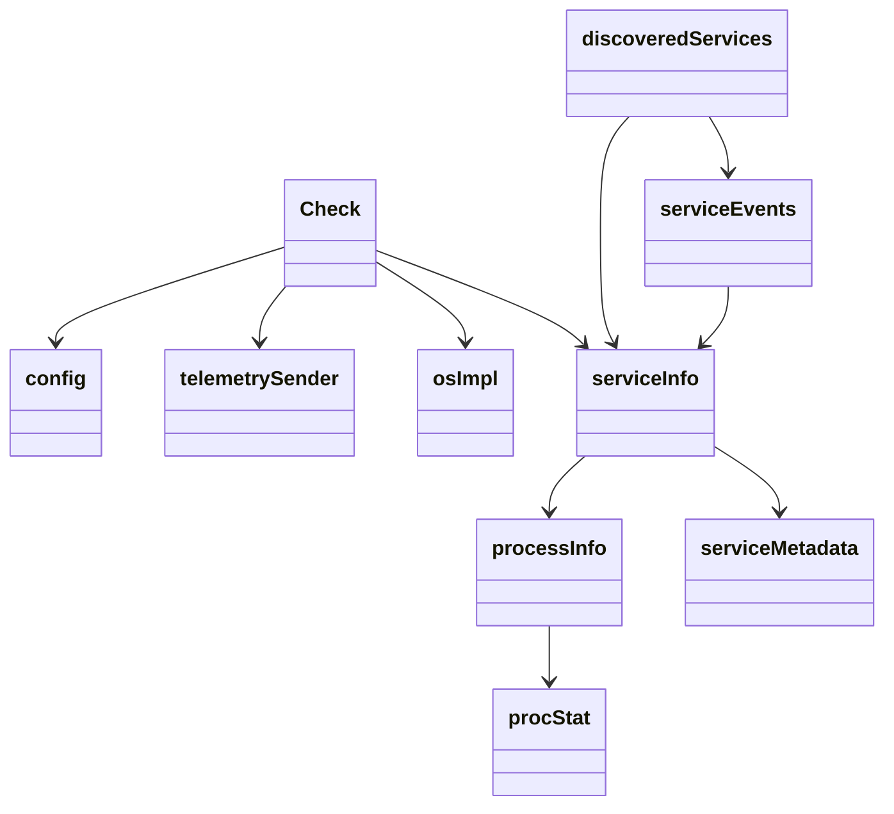

# Getting Started with Service Discovery

Service discovery is a core component responsible for identifying and reporting services running on the monitored infrastructure. This document will guide you through the essential types and their roles in the service discovery process.

<SwmSnippet path="/pkg/collector/corechecks/servicediscovery/servicediscovery.go" line="93">

---

## Check Type

The <SwmToken path="pkg/collector/corechecks/servicediscovery/servicediscovery.go" pos="93:2:2" line-data="// Check reports discovered services.">`Check`</SwmToken> type is designed to report discovered services. It uses various fields such as <SwmToken path="pkg/collector/corechecks/servicediscovery/servicediscovery.go" pos="96:1:1" line-data="	cfg                   *config">`cfg`</SwmToken> for configuration and <SwmToken path="pkg/collector/corechecks/servicediscovery/servicediscovery.go" pos="98:1:1" line-data="	sender                *telemetrySender">`sender`</SwmToken> for telemetry data.

```go
// Check reports discovered services.
type Check struct {
	corechecks.CheckBase
	cfg                   *config
	os                    osImpl
	sender                *telemetrySender
	sentRepeatedEventPIDs map[int]bool
}
```

---

</SwmSnippet>

<SwmSnippet path="/pkg/collector/corechecks/servicediscovery/servicediscovery.go" line="47">

---

## Process Info

The <SwmToken path="pkg/collector/corechecks/servicediscovery/servicediscovery.go" pos="47:2:2" line-data="type processInfo struct {">`processInfo`</SwmToken> type captures details about a process, such as its PID, command line arguments, environment variables, and open ports.

```go
type processInfo struct {
	PID     int
	CmdLine []string
	Env     []string
	Cwd     string
	Stat    procStat
	Ports   []int
}
```

---

</SwmSnippet>

<SwmSnippet path="/pkg/collector/corechecks/servicediscovery/servicediscovery.go" line="62">

---

## Discovered Services

The <SwmToken path="pkg/collector/corechecks/servicediscovery/servicediscovery.go" pos="62:2:2" line-data="type discoveredServices struct {">`discoveredServices`</SwmToken> type maintains a list of currently running services, potential services, and events related to service state changes.

```go
type discoveredServices struct {
	aliveProcsCount int
	openPorts       portlist.List

	ignoreProcs     map[int]bool
	potentials      map[int]*serviceInfo
	runningServices map[int]*serviceInfo

	events serviceEvents
}
```

---

</SwmSnippet>

<SwmSnippet path="/pkg/collector/corechecks/servicediscovery/servicediscovery.go" line="56">

---

## Service Events

The <SwmToken path="pkg/collector/corechecks/servicediscovery/servicediscovery.go" pos="56:2:2" line-data="type serviceEvents struct {">`serviceEvents`</SwmToken> type categorizes events into service start, stop, and heartbeat events.

```go
type serviceEvents struct {
	start     []serviceInfo
	stop      []serviceInfo
	heartbeat []serviceInfo
}
```

---

</SwmSnippet>

<SwmSnippet path="/pkg/collector/corechecks/servicediscovery/servicediscovery.go" line="81">

---

## Configuration

The <SwmToken path="pkg/collector/corechecks/servicediscovery/servicediscovery.go" pos="81:2:2" line-data="type config struct {">`config`</SwmToken> type allows for the configuration of service discovery, including specifying processes to ignore.

```go
type config struct {
	IgnoreProcesses []string `yaml:"ignore_processes"`
}
```

---

</SwmSnippet>

&nbsp;

*This is an auto-generated document by Swimm AI 🌊 and has not yet been verified by a human*

<SwmMeta version="3.0.0" repo-id="Z2l0aHViJTNBJTNBZGF0YWRvZy1hZ2VudCUzQSUzQVN3aW1tLURlbW8=" repo-name="datadog-agent"><sup>Powered by [Swimm](/)</sup></SwmMeta>
