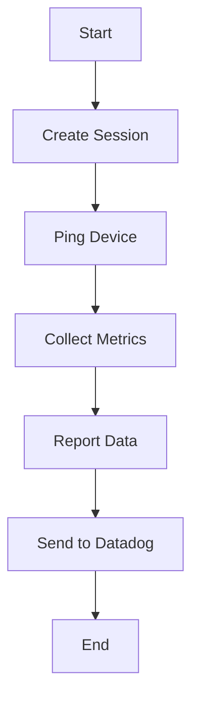

## Overview

SNMP Device Check is a mechanism used to collect information from a single SNMP-enabled device. It involves creating a session with the device using the provided configuration and IP address. The check can include additional functionalities such as pinging the device to verify its reachability. Metrics and telemetry data are collected and reported, including device status and performance metrics. The collected data is then sent to the Datadog platform for monitoring and analysis.

## Configuration

The configuration for the SNMP Device Check includes the device's IP address and community string. Optionally, you can enable ping checks.

<SwmSnippet path="/pkg/collector/corechecks/snmp/internal/devicecheck/devicecheck_test.go" line="48">

---

The configuration example shows how to set up the IP address, community string, and profiles for the SNMP Device Check.

```go
	rawInstanceConfig := []byte(`
ip_address: 1.2.3.4
community_string: public
collect_topology: false
`)
	// language=yaml
	rawInitConfig := []byte(`
profiles:
 f5-big-ip:
   definition_file: f5-big-ip.yaml
 another-profile:
   definition_file: another_profile.yaml
`)

	config, err := checkconfig.NewCheckConfig(rawInstanceConfig, rawInitConfig)
```

---

</SwmSnippet>

<SwmSnippet path="/pkg/collector/corechecks/snmp/internal/devicecheck/devicecheck.go" line="79">

---

The <SwmToken path="pkg/collector/corechecks/snmp/internal/devicecheck/devicecheck.go" pos="79:2:2" line-data="// NewDeviceCheck returns a new DeviceCheck">`NewDeviceCheck`</SwmToken> function initializes a new <SwmToken path="pkg/collector/corechecks/snmp/internal/devicecheck/devicecheck.go" pos="79:10:10" line-data="// NewDeviceCheck returns a new DeviceCheck">`DeviceCheck`</SwmToken> instance. It sets up the configuration, session, and pinger for the device. It also reads tags from the cache and returns the initialized <SwmToken path="pkg/collector/corechecks/snmp/internal/devicecheck/devicecheck.go" pos="79:10:10" line-data="// NewDeviceCheck returns a new DeviceCheck">`DeviceCheck`</SwmToken> instance.

```go
// NewDeviceCheck returns a new DeviceCheck
func NewDeviceCheck(config *checkconfig.CheckConfig, ipAddress string, sessionFactory session.Factory) (*DeviceCheck, error) {
	newConfig := config.CopyWithNewIP(ipAddress)

	sess, err := sessionFactory(newConfig)
	if err != nil {
		return nil, fmt.Errorf("failed to configure session: %s", err)
	}

	var devicePinger pinger.Pinger
	if newConfig.PingEnabled {
		devicePinger, err = createPinger(newConfig.PingConfig)
		if err != nil {
			return nil, fmt.Errorf("failed to create pinger: %s", err)
		}
	}

	configHash := newConfig.DeviceDigest(newConfig.IPAddress)
	cacheKey := fmt.Sprintf("%s:%s", cacheKeyPrefix, configHash)

	d := DeviceCheck{
```

---

</SwmSnippet>

## Collecting Metrics

The <SwmToken path="pkg/collector/corechecks/snmp/internal/devicecheck/devicecheck.go" pos="158:2:2" line-data="// Run executes the check">`Run`</SwmToken> method collects metrics from the device and reports them to Datadog.

<SwmSnippet path="/pkg/collector/corechecks/snmp/internal/devicecheck/devicecheck.go" line="158">

---

The <SwmToken path="pkg/collector/corechecks/snmp/internal/devicecheck/devicecheck.go" pos="158:2:2" line-data="// Run executes the check">`Run`</SwmToken> method executes the SNMP device check. It starts by recording the start time and fetching static tags. It then fetches and reports metrics, handles device and ping statuses, and submits telemetry metrics.

```go
// Run executes the check
func (d *DeviceCheck) Run(collectionTime time.Time) error {
	startTime := time.Now()
	staticTags := append(d.config.GetStaticTags(), d.config.GetNetworkTags()...)

	// Fetch and report metrics
	var checkErr error
	var deviceStatus metadata.DeviceStatus
	var pingStatus metadata.DeviceStatus

	deviceReachable, dynamicTags, values, checkErr := d.getValuesAndTags()

	tags := utils.CopyStrings(staticTags)
	if checkErr != nil {
		tags = append(tags, d.savedDynamicTags...)
		d.sender.ServiceCheck(serviceCheckName, servicecheck.ServiceCheckCritical, tags, checkErr.Error())
	} else {
		if !reflect.DeepEqual(d.savedDynamicTags, dynamicTags) {
			d.savedDynamicTags = dynamicTags
			d.writeTagsInCache()
		}
```

---

</SwmSnippet>

## Reporting Telemetry

The <SwmToken path="pkg/collector/corechecks/snmp/internal/devicecheck/devicecheck.go" pos="418:9:9" line-data="func (d *DeviceCheck) submitTelemetryMetrics(startTime time.Time, tags []string) {">`submitTelemetryMetrics`</SwmToken> method reports telemetry data, including device status and performance metrics.

<SwmSnippet path="/pkg/collector/corechecks/snmp/internal/devicecheck/devicecheck.go" line="418">

---

The <SwmToken path="pkg/collector/corechecks/snmp/internal/devicecheck/devicecheck.go" pos="418:9:9" line-data="func (d *DeviceCheck) submitTelemetryMetrics(startTime time.Time, tags []string) {">`submitTelemetryMetrics`</SwmToken> method submits telemetry metrics such as devices monitored, check interval, check duration, and submitted metrics. It appends necessary tags and uses the sender to report these metrics.

```go
func (d *DeviceCheck) submitTelemetryMetrics(startTime time.Time, tags []string) {
	newTags := append(utils.CopyStrings(tags), snmpLoaderTag, utils.GetAgentVersionTag())

	d.sender.Gauge("snmp.devices_monitored", float64(1), newTags)

	// SNMP Performance metrics
	d.sender.MonotonicCount("datadog.snmp.check_interval", time.Duration(startTime.UnixNano()).Seconds(), newTags)
	d.sender.Gauge("datadog.snmp.check_duration", time.Since(startTime).Seconds(), newTags)
	d.sender.Gauge("datadog.snmp.submitted_metrics", float64(d.sender.GetSubmittedMetrics()), newTags)
}
```

---

</SwmSnippet>

## Detecting Metrics to Monitor

The <SwmToken path="pkg/collector/corechecks/snmp/internal/devicecheck/devicecheck.go" pos="315:9:9" line-data="func (d *DeviceCheck) detectMetricsToMonitor(sess session.Session) error {">`detectMetricsToMonitor`</SwmToken> method detects metrics to monitor based on the session. If metric detection is enabled, it updates the next autodetect metrics time and sets the autodetect profile with the detected metrics and tags. If autodetect profile is enabled, it fetches the <SwmToken path="pkg/collector/corechecks/snmp/internal/devicecheck/devicecheck.go" pos="326:7:7" line-data="		// detect using sysObjectID">`sysObjectID`</SwmToken> and updates the profile accordingly.

<SwmSnippet path="/pkg/collector/corechecks/snmp/internal/devicecheck/devicecheck.go" line="315">

---

The <SwmToken path="pkg/collector/corechecks/snmp/internal/devicecheck/devicecheck.go" pos="315:9:9" line-data="func (d *DeviceCheck) detectMetricsToMonitor(sess session.Session) error {">`detectMetricsToMonitor`</SwmToken> method detects metrics to monitor based on the session. It updates the autodetect profile with the detected metrics and tags if enabled.

```go
func (d *DeviceCheck) detectMetricsToMonitor(sess session.Session) error {
	if d.config.DetectMetricsEnabled {
		if d.nextAutodetectMetrics.After(timeNow()) {
			return nil
		}
		d.nextAutodetectMetrics = d.nextAutodetectMetrics.Add(time.Duration(d.config.DetectMetricsRefreshInterval) * time.Second)

		detectedMetrics, metricTagConfigs := d.detectAvailableMetrics()
		log.Debugf("detected metrics: %v", detectedMetrics)
		d.config.SetAutodetectProfile(detectedMetrics, metricTagConfigs)
	} else if d.config.AutodetectProfile {
		// detect using sysObjectID
		sysObjectID, err := session.FetchSysObjectID(sess)
		if err != nil {
			return fmt.Errorf("failed to fetch sysobjectid: %s", err)
		}
		profile, err := profile.GetProfileForSysObjectID(d.config.Profiles, sysObjectID)
		if err != nil {
			return fmt.Errorf("failed to get profile sys object id for `%s`: %s", sysObjectID, err)
		}
		if profile != d.config.Profile {
```

---

</SwmSnippet>

&nbsp;

*This is an auto-generated document by Swimm AI 🌊 and has not yet been verified by a human*

<SwmMeta version="3.0.0" repo-id="Z2l0aHViJTNBJTNBZGF0YWRvZy1hZ2VudCUzQSUzQVN3aW1tLURlbW8=" repo-name="datadog-agent"><sup>Powered by [Swimm](/)</sup></SwmMeta>
