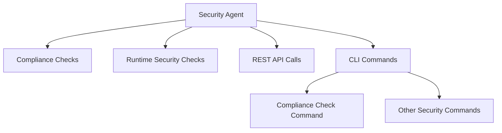

# Introduction

The Security Agent is responsible for running compliance and runtime security checks. It is configured through the <SwmPath>[test/new-e2e/tests/agent-shared-components/config-refresh/fixtures/security-agent.yaml](test/new-e2e/tests/agent-shared-components/config-refresh/fixtures/security-agent.yaml)</SwmPath> file, which is merged with the main <SwmPath>[pkg/util/scrubber/test/datadog.yaml](pkg/util/scrubber/test/datadog.yaml)</SwmPath> configuration file.

# Commands

The Security Agent commands are defined using the `cobra` library, which provides a simple interface for creating CLI applications. The `SecurityAgentCommands` function returns the security agent commands, including compliance checks and other security-related functionalities.

The `SecurityAgentCommands` function defines the CLI commands for the Security Agent, including compliance checks and other security-related functionalities.

# REST API

The Security Agent also handles REST API calls to provide high-level functionalities at the agent level.

# Diagram

The following diagram illustrates the main components and functionalities of the Security Agent.

&nbsp;

*This is an auto-generated document by Swimm AI 🌊 and has not yet been verified by a human*

<SwmMeta version="3.0.0" repo-id="Z2l0aHViJTNBJTNBZGF0YWRvZy1hZ2VudCUzQSUzQVN3aW1tLURlbW8=" repo-name="datadog-agent">Powered by [Swimm](/)</SwmMeta>
