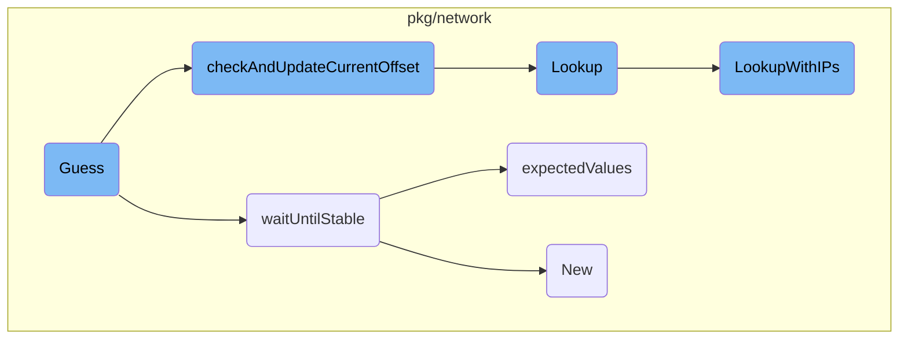

In this document, we will explain the process of guessing kernel struct offsets. The process involves initializing the tracer, creating connections, storing possible offsets and expected values, and verifying these values using kprobes and <SwmToken path="pkg/network/tracer/offsetguess/tracer.go" pos="325:6:6" line-data="// in the eBPF map against the expected value, incrementing the offset if it">`eBPF`</SwmToken> maps.

The flow starts with initializing the tracer by guessing the correct kernel struct offsets. This involves creating connections and storing possible offsets and expected values in an <SwmToken path="pkg/network/tracer/offsetguess/tracer.go" pos="325:6:6" line-data="// in the eBPF map against the expected value, incrementing the offset if it">`eBPF`</SwmToken> map. The <SwmToken path="pkg/network/tracer/offsetguess/tracer.go" pos="188:2:2" line-data="func waitUntilStable(conn net.Conn, window time.Duration, attempts int) (*fieldValues, error) {">`waitUntilStable`</SwmToken> function ensures that the TCP socket parameters are stable before proceeding. The <SwmToken path="pkg/network/tracer/offsetguess/tracer.go" pos="324:2:2" line-data="// checkAndUpdateCurrentOffset checks the value for the current offset stored">`checkAndUpdateCurrentOffset`</SwmToken> function then checks the current offset stored in the <SwmToken path="pkg/network/tracer/offsetguess/tracer.go" pos="325:6:6" line-data="// in the eBPF map against the expected value, incrementing the offset if it">`eBPF`</SwmToken> map against the expected value. If the values match, it advances to the next field; otherwise, it increments the offset and retries. The <SwmToken path="pkg/network/tracer/offsetguess/tracer.go" pos="330:9:9" line-data="	if err := mp.Lookup(&amp;zero, t.status); err != nil {">`Lookup`</SwmToken> function performs a gateway lookup for connection stats, and the <SwmToken path="pkg/network/tracer/offsetguess/tracer.go" pos="160:2:2" line-data="func expectedValues(conn net.Conn) (*fieldValues, error) {">`expectedValues`</SwmToken> function retrieves the expected values for various fields from a TCP connection. Finally, the <SwmToken path="pkg/network/tracer/offsetguess/tracer.go" pos="208:8:8" line-data="	return nil, errors.New(&quot;unstable TCP socket params&quot;)">`New`</SwmToken> function creates a new configuration for the network tracer.

# Flow drill down



<SwmSnippet path="/pkg/network/tracer/offsetguess/tracer.go" line="731">

---

## Guessing the kernel struct offsets

The <SwmToken path="pkg/network/tracer/offsetguess/tracer.go" pos="731:2:2" line-data="// Guess expects manager.Manager to contain a map named tracer_status and helps initialize the">`Guess`</SwmToken> function is responsible for initializing the tracer by guessing the correct kernel struct offsets. It creates connections and stores possible offsets and expected values in an <SwmToken path="pkg/network/tracer/offsetguess/tracer.go" pos="733:22:22" line-data="// returned as constants which are runtime-edited into the tracer eBPF code.">`eBPF`</SwmToken> map. The function relies on kprobes to store values in kernel space, which are then checked in user space.

```go
// Guess expects manager.Manager to contain a map named tracer_status and helps initialize the
// tracer by guessing the right struct sock kernel struct offsets. Results are
// returned as constants which are runtime-edited into the tracer eBPF code.
//
// To guess the offsets, we create connections from localhost (127.0.0.1) to
// 127.0.0.2:$PORT, where we have a server listening. We store the current
// possible offset and expected value of each field in a eBPF map. In kernel-space
// we rely on two different kprobes: `tcp_getsockopt` and `tcp_connect_v6`. When they're
// are triggered, we store the value of
//
//	(struct sock *)skp + possible_offset
//
// in the eBPF map. Then, back in userspace (checkAndUpdateCurrentOffset()), we
// check that value against the expected value of the field, advancing the
// offset and repeating the process until we find the value we expect. Then, we
// guess the next field.
```

---

</SwmSnippet>

<SwmSnippet path="/pkg/network/tracer/offsetguess/tracer.go" line="188">

---

## Waiting for stable values

The <SwmToken path="pkg/network/tracer/offsetguess/tracer.go" pos="188:2:2" line-data="func waitUntilStable(conn net.Conn, window time.Duration, attempts int) (*fieldValues, error) {">`waitUntilStable`</SwmToken> function ensures that the TCP socket parameters are stable before proceeding. It repeatedly checks the expected values and returns them once they are stable.

```go
func waitUntilStable(conn net.Conn, window time.Duration, attempts int) (*fieldValues, error) {
	var (
		current *fieldValues
		prev    *fieldValues
		err     error
	)
	for i := 0; i <= attempts; i++ {
		current, err = expectedValues(conn)
		if err != nil {
			return nil, err
		}

		if prev != nil && *prev == *current {
			return current, nil
		}

		prev = current
		time.Sleep(window)
	}

	return nil, errors.New("unstable TCP socket params")
```

---

</SwmSnippet>

<SwmSnippet path="/pkg/network/tracer/offsetguess/tracer.go" line="324">

---

## Checking and updating current offset

The <SwmToken path="pkg/network/tracer/offsetguess/tracer.go" pos="324:2:2" line-data="// checkAndUpdateCurrentOffset checks the value for the current offset stored">`checkAndUpdateCurrentOffset`</SwmToken> function checks the current offset stored in the <SwmToken path="pkg/network/tracer/offsetguess/tracer.go" pos="325:6:6" line-data="// in the eBPF map against the expected value, incrementing the offset if it">`eBPF`</SwmToken> map against the expected value. If the values match, it advances to the next field; otherwise, it increments the offset and retries.

```go
// checkAndUpdateCurrentOffset checks the value for the current offset stored
// in the eBPF map against the expected value, incrementing the offset if it
// doesn't match, or going to the next field to guess if it does
func (t *tracerOffsetGuesser) checkAndUpdateCurrentOffset(mp *maps.GenericMap[uint64, TracerStatus], expected *fieldValues, maxRetries *int, threshold uint64) error {
	// get the updated map value, so we can check if the current offset is
	// the right one
	if err := mp.Lookup(&zero, t.status); err != nil {
		return fmt.Errorf("error reading tracer_status: %v", err)
	}

	if State(t.status.State) != StateChecked {
		if *maxRetries == 0 {
			return fmt.Errorf("invalid guessing state while guessing %v, got %v expected %v. %v",
				whatString[GuessWhat(t.status.What)], stateString[State(t.status.State)], stateString[StateChecked], tcpKprobeCalledString[t.status.Tcp_info_kprobe_status])
		}
		*maxRetries--
		time.Sleep(10 * time.Millisecond)
		return nil
	}

```

---

</SwmSnippet>

<SwmSnippet path="/pkg/network/gateway_lookup_linux.go" line="114">

---

## Performing gateway lookup

The <SwmToken path="pkg/network/gateway_lookup_linux.go" pos="114:2:2" line-data="// Lookup performs a gateway lookup for connection stats">`Lookup`</SwmToken> function performs a gateway lookup for connection stats. It determines the destination IP and calls <SwmToken path="pkg/network/gateway_lookup_linux.go" pos="121:5:5" line-data="	return g.LookupWithIPs(cs.Source, dest, cs.NetNS)">`LookupWithIPs`</SwmToken> to get the gateway information.

```go
// Lookup performs a gateway lookup for connection stats
func (g *gatewayLookup) Lookup(cs *ConnectionStats) *Via {
	dest := cs.Dest
	if cs.IPTranslation != nil {
		dest = cs.IPTranslation.ReplSrcIP
	}

	return g.LookupWithIPs(cs.Source, dest, cs.NetNS)
}
```

---

</SwmSnippet>

<SwmSnippet path="/pkg/network/tracer/offsetguess/tracer.go" line="160">

---

## Retrieving expected values

The <SwmToken path="pkg/network/tracer/offsetguess/tracer.go" pos="160:2:2" line-data="func expectedValues(conn net.Conn) (*fieldValues, error) {">`expectedValues`</SwmToken> function retrieves the expected values for various fields from a TCP connection. These values are used to verify the guessed offsets.

```go
func expectedValues(conn net.Conn) (*fieldValues, error) {
	netns, err := kernel.GetCurrentIno()
	if err != nil {
		return nil, err
	}

	tcpInfo, err := TcpGetInfo(conn)
	if err != nil {
		return nil, err
	}

	saddr, daddr, sport, dport, err := extractIPsAndPorts(conn)
	if err != nil {
		return nil, err
	}

	return &fieldValues{
		saddr:  saddr,
		daddr:  daddr,
		sport:  sport,
		dport:  dport,
```

---

</SwmSnippet>

<SwmSnippet path="/pkg/network/config/config.go" line="315">

---

## Creating a new config

The <SwmToken path="pkg/network/config/config.go" pos="315:2:2" line-data="// New creates a config for the network tracer">`New`</SwmToken> function creates a new configuration for the network tracer. It initializes various settings and options based on the system probe configuration.

```go
// New creates a config for the network tracer
func New() *Config {
	cfg := ddconfig.SystemProbe
	sysconfig.Adjust(cfg)

	c := &Config{
		Config: *ebpf.NewConfig(),

		NPMEnabled:               cfg.GetBool(join(netNS, "enabled")),
		ServiceMonitoringEnabled: cfg.GetBool(join(smNS, "enabled")),

		CollectTCPv4Conns: cfg.GetBool(join(netNS, "collect_tcp_v4")),
		CollectTCPv6Conns: cfg.GetBool(join(netNS, "collect_tcp_v6")),
		TCPConnTimeout:    2 * time.Minute,
		TCPClosedTimeout:  1 * time.Second,

		CollectUDPv4Conns: cfg.GetBool(join(netNS, "collect_udp_v4")),
		CollectUDPv6Conns: cfg.GetBool(join(netNS, "collect_udp_v6")),
		UDPConnTimeout:    defaultUDPTimeoutSeconds * time.Second,
		UDPStreamTimeout:  defaultUDPStreamTimeoutSeconds * time.Second,

```

---

</SwmSnippet>

<SwmSnippet path="/pkg/network/gateway_lookup_linux.go" line="124">

---

## Lookup with <SwmToken path="tasks/kernel_matrix_testing/ci.py" pos="126:1:1" line-data="        ips: set[str] = set()">`ips`</SwmToken>

The <SwmToken path="pkg/network/gateway_lookup_linux.go" pos="124:2:2" line-data="// LookupWithIPs performs a gateway lookup given the">`LookupWithIPs`</SwmToken> function performs a gateway lookup given the source, destination, and namespace. It checks the route cache and subnet cache to determine the gateway information.

```go
// LookupWithIPs performs a gateway lookup given the
// source, destination, and namespace
func (g *gatewayLookup) LookupWithIPs(source util.Address, dest util.Address, netns uint32) *Via {
	r, ok := g.routeCache.Get(source, dest, netns)
	if !ok {
		return nil
	}

	// if there is no gateway, we don't need to add subnet info
	// for gateway resolution in the backend
	if r.Gateway.IsZero() || r.Gateway.IsUnspecified() {
		return nil
	}

	gatewayLookupTelemetry.subnetCacheLookups.Inc()
	v, ok := g.subnetCache.Get(r.IfIndex)
	if !ok {
		gatewayLookupTelemetry.subnetCacheMisses.Inc()

		var s Subnet
		var err error
```

---

</SwmSnippet>

&nbsp;

*This is an auto-generated document by Swimm AI 🌊 and has not yet been verified by a human*

<SwmMeta version="3.0.0" repo-id="Z2l0aHViJTNBJTNBZGF0YWRvZy1hZ2VudCUzQSUzQVN3aW1tLURlbW8=" repo-name="datadog-agent"><sup>Powered by [Swimm](/)</sup></SwmMeta>
