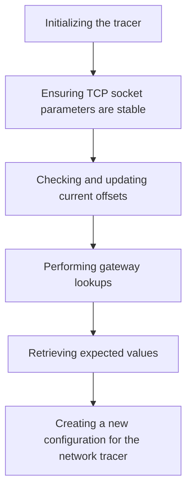

This document will cover the process of guessing kernel struct offsets, which includes:

1. Initializing the tracer
2. Ensuring TCP socket parameters are stable
3. Checking and updating current offsets
4. Performing gateway lookups
5. Retrieving expected values
6. Creating a new configuration for the network tracer.

Technical document: <SwmLink doc-title="Guessing Kernel Struct Offsets">[Guessing Kernel Struct Offsets](/.swm/guessing-kernel-struct-offsets.coe7dubs.sw.md)</SwmLink>

# [Initializing the tracer](https://app.swimm.io/repos/Z2l0aHViJTNBJTNBZGF0YWRvZy1hZ2VudCUzQSUzQVN3aW1tLURlbW8=/docs/coe7dubs#guessing-the-kernel-struct-offsets)

The process begins with initializing the tracer by guessing the correct kernel struct offsets. This involves creating connections and storing possible offsets and expected values in an eBPF map. The tracer uses kprobes to store values in kernel space, which are then checked in user space. This step is crucial for ensuring that the tracer can accurately monitor network traffic by understanding the structure of kernel data.

# [Ensuring TCP socket parameters are stable](https://app.swimm.io/repos/Z2l0aHViJTNBJTNBZGF0YWRvZy1hZ2VudCUzQSUzQVN3aW1tLURlbW8=/docs/coe7dubs#waiting-for-stable-values)

The `waitUntilStable` function ensures that the TCP socket parameters are stable before proceeding. It repeatedly checks the expected values and returns them once they are stable. This step is important to ensure that the tracer is working with consistent and reliable data, which is necessary for accurate monitoring.

# [Checking and updating current offsets](https://app.swimm.io/repos/Z2l0aHViJTNBJTNBZGF0YWRvZy1hZ2VudCUzQSUzQVN3aW1tLURlbW8=/docs/coe7dubs#checking-and-updating-current-offset)

The `checkAndUpdateCurrentOffset` function checks the current offset stored in the eBPF map against the expected value. If the values match, it advances to the next field; otherwise, it increments the offset and retries. This step ensures that the tracer can accurately map the kernel data structures, which is essential for effective monitoring.

# [Performing gateway lookups](https://app.swimm.io/repos/Z2l0aHViJTNBJTNBZGF0YWRvZy1hZ2VudCUzQSUzQVN3aW1tLURlbW8=/docs/coe7dubs#performing-gateway-lookup)

The `Lookup` function performs a gateway lookup for connection stats. It determines the destination IP and calls `LookupWithIPs` to get the gateway information. This step is important for understanding the network topology and ensuring that the tracer can accurately monitor network traffic.

# [Retrieving expected values](https://app.swimm.io/repos/Z2l0aHViJTNBJTNBZGF0YWRvZy1hZ2VudCUzQSUzQVN3aW1tLURlbW8=/docs/coe7dubs#retrieving-expected-values)

The `expectedValues` function retrieves the expected values for various fields from a TCP connection. These values are used to verify the guessed offsets. This step is crucial for ensuring that the tracer can accurately map the kernel data structures and monitor network traffic effectively.

# [Creating a new configuration for the network tracer](https://app.swimm.io/repos/Z2l0aHViJTNBJTNBZGF0YWRvZy1hZ2VudCUzQSUzQVN3aW1tLURlbW8=/docs/coe7dubs#creating-a-new-config)

The <SwmToken path="tasks/kernel_matrix_testing/vmconfig.py" pos="643:1:1" line-data="    new: bool,">`new`</SwmToken> function creates a new configuration for the network tracer. It initializes various settings and options based on the system probe configuration. This step is important for ensuring that the tracer is configured correctly and can effectively monitor network traffic.

&nbsp;

*This is an auto-generated document by Swimm AI 🌊 and has not yet been verified by a human*

<SwmMeta version="3.0.0" repo-id="Z2l0aHViJTNBJTNBZGF0YWRvZy1hZ2VudCUzQSUzQVN3aW1tLURlbW8=" repo-name="datadog-agent">Powered by [Swimm](/)</SwmMeta>
