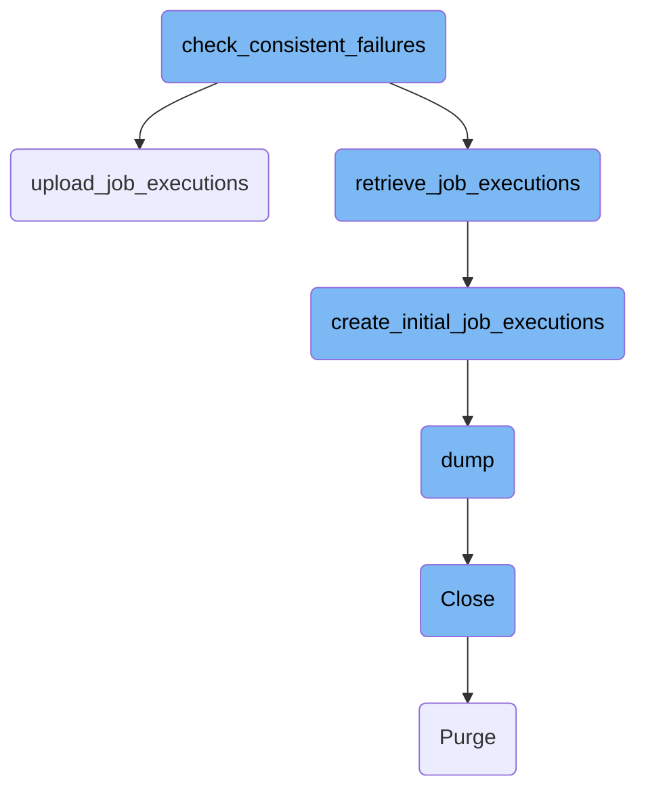
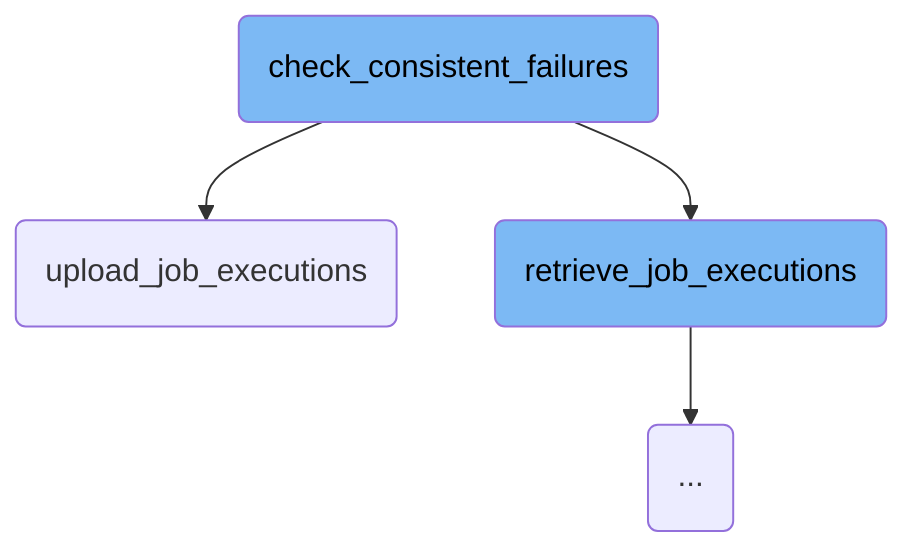
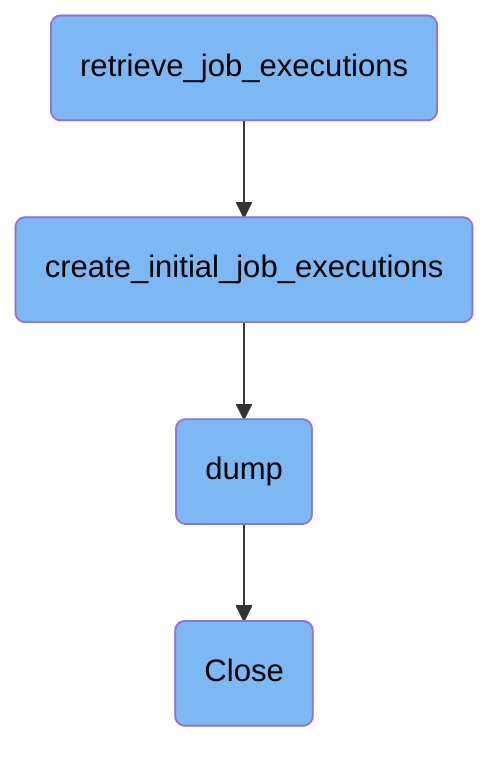

This document explains the process of identifying and handling consistent job failures. The process involves retrieving job execution data, checking for consistent failures, updating job statistics, and sending notifications if necessary.

The flow starts by retrieving job execution data from AWS <SwmToken path="tasks/notify.py" pos="76:15:15" line-data="    # Retrieve the stored document in aws s3. It has the following format:">`s3`</SwmToken>. This data includes information about job failures. The system then checks if the jobs have consistent failures by analyzing the data. If any job has reached a failure threshold, the system updates the job statistics and sends notifications. Finally, the updated job execution data is uploaded back to AWS <SwmToken path="tasks/notify.py" pos="76:15:15" line-data="    # Retrieve the stored document in aws s3. It has the following format:">`s3`</SwmToken>.

Here is a high level diagram of the flow, showing only the most important functions:



# Flow drill down

First, we'll zoom into this section of the flow:



<SwmSnippet path="/tasks/notify.py" line="75">

---

## Checking Consistent Failures

The function <SwmToken path="tasks/notify.py" pos="75:2:2" line-data="def check_consistent_failures(ctx, job_failures_file=&quot;job_executions.v2.json&quot;):">`check_consistent_failures`</SwmToken> is responsible for analyzing job execution data to identify consistent failures. It retrieves job execution data from AWS <SwmToken path="tasks/notify.py" pos="76:15:15" line-data="    # Retrieve the stored document in aws s3. It has the following format:">`s3`</SwmToken>, checks if the pipeline's chronological order is respected, updates job statistics, and sends notifications if necessary. Finally, it uploads the updated job execution data back to AWS <SwmToken path="tasks/notify.py" pos="76:15:15" line-data="    # Retrieve the stored document in aws s3. It has the following format:">`s3`</SwmToken>.

```python
def check_consistent_failures(ctx, job_failures_file="job_executions.v2.json"):
    # Retrieve the stored document in aws s3. It has the following format:
    # {
    #     "pipeline_id": 123,
    #     "jobs": {
    #         "job1": {"consecutive_failures": 2, "jobs_info": [{"id": null, "failing": false, "commit": "abcdef42"}, {"id": 314618, "failing": true, "commit": "abcdef42"}, {"id": 618314, "failing": true, "commit": "abcdef42"}]},
    #         "job2": {"consecutive_failures": 0, "cumulative_failures": [{"id": 314618, "failing": true, "commit": "abcdef42"}, {"id": null, "failing": false, "commit": "abcdef42"}]},
    #         "job3": {"consecutive_failures": 1, "cumulative_failures": [{"id": 314618, "failing": true, "commit": "abcdef42"}]},
    #     }
    # }
    # NOTE: this format is described by the Executions class
    # The pipeline_id is used to by-pass the check if the pipeline chronological order is not respected
    # The jobs dictionary contains the consecutive and cumulative failures for each job
    # The consecutive failures are reset to 0 when the job is not failing, and are raising an alert when reaching the CONSECUTIVE_THRESHOLD (3)
    # The cumulative failures list contains 1 for failures, 0 for succes. They contain only then CUMULATIVE_LENGTH(10) last executions and raise alert when 50% failure rate is reached

    job_executions = alerts.retrieve_job_executions(ctx, job_failures_file)

    # By-pass if the pipeline chronological order is not respected
    if job_executions.pipeline_id > int(os.environ["CI_PIPELINE_ID"]):
        return
```

---

</SwmSnippet>

<SwmSnippet path="/tasks/notify.py" line="91">

---

### Retrieving Job Executions

The function <SwmToken path="tasks/notify.py" pos="91:7:7" line-data="    job_executions = alerts.retrieve_job_executions(ctx, job_failures_file)">`retrieve_job_executions`</SwmToken> is called to fetch the job execution data from AWS <SwmToken path="tasks/notify.py" pos="76:15:15" line-data="    # Retrieve the stored document in aws s3. It has the following format:">`s3`</SwmToken>. This data includes details about consecutive and cumulative failures for each job.

```python
    job_executions = alerts.retrieve_job_executions(ctx, job_failures_file)
```

---

</SwmSnippet>

<SwmSnippet path="/tasks/notify.py" line="98">

---

### Updating Statistics and Sending Notifications

The function <SwmToken path="tasks/notify.py" pos="98:10:10" line-data="    alert_jobs, job_executions = alerts.update_statistics(job_executions)">`update_statistics`</SwmToken> updates the job execution statistics, and <SwmToken path="tasks/notify.py" pos="100:3:3" line-data="    alerts.send_notification(ctx, alert_jobs)">`send_notification`</SwmToken> sends alerts if any job has reached the failure thresholds.

```python
    alert_jobs, job_executions = alerts.update_statistics(job_executions)

    alerts.send_notification(ctx, alert_jobs)
```

---

</SwmSnippet>

<SwmSnippet path="/tasks/libs/notify/alerts.py" line="278">

---

## Uploading Job Executions

The function <SwmToken path="tasks/libs/notify/alerts.py" pos="278:2:2" line-data="def upload_job_executions(ctx, job_executions: PipelineRuns, job_failures_file: str):">`upload_job_executions`</SwmToken> uploads the updated job execution data back to AWS <SwmToken path="tasks/notify.py" pos="76:15:15" line-data="    # Retrieve the stored document in aws s3. It has the following format:">`s3`</SwmToken>. It first writes the data to a local file and then uses an AWS <SwmToken path="tasks/notify.py" pos="76:15:15" line-data="    # Retrieve the stored document in aws s3. It has the following format:">`s3`</SwmToken> command to upload this file to the specified <SwmToken path="tasks/notify.py" pos="76:15:15" line-data="    # Retrieve the stored document in aws s3. It has the following format:">`s3`</SwmToken> bucket.

```python
def upload_job_executions(ctx, job_executions: PipelineRuns, job_failures_file: str):
    with open(job_failures_file, "w") as f:
        json.dump(job_executions.to_dict(), f)
    ctx.run(
        f"{AWS_S3_CP_CMD} {job_failures_file} {ALERTS_S3_CI_BUCKET_URL}/{job_failures_file}",
        hide="stdout",
    )
```

---

</SwmSnippet>

Now, lets zoom into this section of the flow:



<SwmSnippet path="/tasks/libs/notify/alerts.py" line="159">

---

## Retrieving Job Executions

The function <SwmToken path="tasks/libs/notify/alerts.py" pos="159:2:2" line-data="def retrieve_job_executions(ctx, job_failures_file):">`retrieve_job_executions`</SwmToken> is responsible for retrieving the stored document from AWS <SwmToken path="tasks/libs/notify/alerts.py" pos="161:13:13" line-data="    Retrieve the stored document in aws s3, or create it">`s3`</SwmToken> or creating it if it doesn't exist. It attempts to download the file using the AWS <SwmToken path="tasks/libs/notify/alerts.py" pos="161:13:13" line-data="    Retrieve the stored document in aws s3, or create it">`s3`</SwmToken> command and then loads its contents. If the file is not found (404 error), it calls <SwmToken path="tasks/libs/notify/alerts.py" pos="173:5:5" line-data="            job_executions = create_initial_job_executions(job_failures_file)">`create_initial_job_executions`</SwmToken> to create a new document.

```python
def retrieve_job_executions(ctx, job_failures_file):
    """
    Retrieve the stored document in aws s3, or create it
    """
    try:
        ctx.run(
            f"{AWS_S3_CP_CMD} {ALERTS_S3_CI_BUCKET_URL}/{job_failures_file} {job_failures_file}",
            hide=True,
        )
        with open(job_failures_file) as f:
            job_executions = json.load(f)
        job_executions = PipelineRuns.from_dict(job_executions)
    except UnexpectedExit as e:
        if "404" in e.result.stderr:
            job_executions = create_initial_job_executions(job_failures_file)
        else:
            raise e
    return job_executions
```

---

</SwmSnippet>

<SwmSnippet path="/tasks/libs/notify/alerts.py" line="179">

---

## Creating Initial Job Executions

The function <SwmToken path="tasks/libs/notify/alerts.py" pos="179:2:2" line-data="def create_initial_job_executions(job_failures_file):">`create_initial_job_executions`</SwmToken> initializes a new <SwmToken path="tasks/libs/notify/alerts.py" pos="180:5:5" line-data="    job_executions = PipelineRuns()">`PipelineRuns`</SwmToken> object and writes it to the specified file. This function is called when the job executions file does not exist in AWS <SwmToken path="tasks/notify.py" pos="76:15:15" line-data="    # Retrieve the stored document in aws s3. It has the following format:">`s3`</SwmToken>, ensuring that there is always a valid document to work with.

```python
def create_initial_job_executions(job_failures_file):
    job_executions = PipelineRuns()
    with open(job_failures_file, "w") as f:
        json.dump(job_executions.to_dict(), f)
    return job_executions
```

---

</SwmSnippet>

<SwmSnippet path="/pkg/security/resolvers/netns/resolver.go" line="592">

---

## Dumping Network Namespace Data

The <SwmToken path="pkg/security/resolvers/netns/resolver.go" pos="592:9:9" line-data="func (nr *Resolver) dump(params *api.DumpNetworkNamespaceParams) []NetworkNamespaceDump {">`dump`</SwmToken> method in the <SwmToken path="pkg/security/resolvers/netns/resolver.go" pos="592:6:6" line-data="func (nr *Resolver) dump(params *api.DumpNetworkNamespaceParams) []NetworkNamespaceDump {">`Resolver`</SwmToken> class iterates over the list of network namespaces and collects detailed information about each namespace, including its ID, handle, and associated network devices. This data is then returned as a list of <SwmToken path="pkg/security/resolvers/netns/resolver.go" pos="592:21:21" line-data="func (nr *Resolver) dump(params *api.DumpNetworkNamespaceParams) []NetworkNamespaceDump {">`NetworkNamespaceDump`</SwmToken> objects.

```go
func (nr *Resolver) dump(params *api.DumpNetworkNamespaceParams) []NetworkNamespaceDump {
	nr.Lock()
	defer nr.Unlock()

	var handle *os.File
	var ntl *manager.NetlinkSocket
	var links []netlink.Link
	var dump []NetworkNamespaceDump
	var err error

	// iterate over the list of network namespaces
	for _, nsID := range nr.networkNamespaces.Keys() {
		netns, _ := nr.networkNamespaces.Peek(nsID)
		netns.Lock()

		netnsDump := NetworkNamespaceDump{
			NsID:          netns.nsID,
			HandleFD:      int(netns.handle.Fd()),
			HandlePath:    netns.handle.Name(),
			LonelyTimeout: netns.lonelyTimeout,
		}
```

---

</SwmSnippet>

<SwmSnippet path="/pkg/security/resolvers/netns/resolver.go" line="554">

---

## Closing the Resolver

The <SwmToken path="pkg/security/resolvers/netns/resolver.go" pos="554:2:2" line-data="// Close closes this resolver and frees all the resources">`Close`</SwmToken> method in the <SwmToken path="pkg/security/resolvers/netns/resolver.go" pos="554:8:8" line-data="// Close closes this resolver and frees all the resources">`resolver`</SwmToken> class is responsible for freeing all resources associated with the resolver. It locks the network namespaces, purges them, and then performs a manual flush of the namespaces to ensure all resources are properly released.

```go
// Close closes this resolver and frees all the resources
func (nr *Resolver) Close() {
	if nr.networkNamespaces != nil {
		nr.Lock()
		nr.networkNamespaces.Purge()
		nr.Unlock()
	}
	nr.manualFlushNamespaces()
}
```

---

</SwmSnippet>

&nbsp;

*This is an auto-generated document by Swimm AI 🌊 and has not yet been verified by a human*

<SwmMeta version="3.0.0" repo-id="Z2l0aHViJTNBJTNBZGF0YWRvZy1hZ2VudCUzQSUzQVN3aW1tLURlbW8=" repo-name="datadog-agent"><sup>Powered by [Swimm](/)</sup></SwmMeta>
