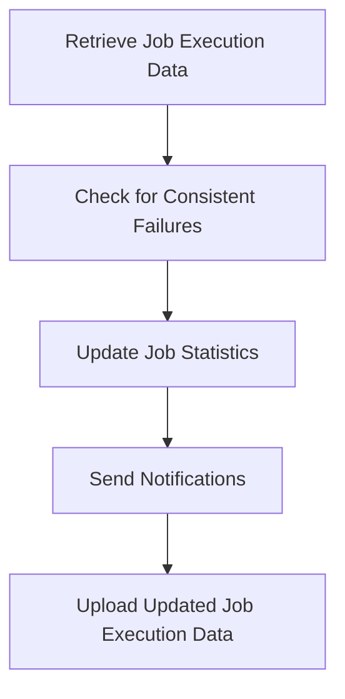

This document will cover the process of handling consistent job failures, which includes:

1. Retrieving job execution data
2. Checking for consistent failures
3. Updating job statistics
4. Sending notifications
5. Uploading updated job execution data.

Technical document: <SwmLink doc-title="Handling Consistent Job Failures">[Handling Consistent Job Failures](/.swm/handling-consistent-job-failures.j2d3clvy.sw.md)</SwmLink>

# [Retrieving Job Execution Data](https://app.swimm.io/repos/Z2l0aHViJTNBJTNBZGF0YWRvZy1hZ2VudCUzQSUzQVN3aW1tLURlbW8=/docs/j2d3clvy#retrieving-job-executions)

The first step in handling consistent job failures is to retrieve the job execution data. This data is stored in AWS S3 and includes details about each job's execution history, such as consecutive and cumulative failures. Retrieving this data allows the system to analyze past job performance and identify any patterns of consistent failures.

# [Checking for Consistent Failures](https://app.swimm.io/repos/Z2l0aHViJTNBJTNBZGF0YWRvZy1hZ2VudCUzQSUzQVN3aW1tLURlbW8=/docs/j2d3clvy#checking-consistent-failures)

Once the job execution data is retrieved, the system checks for consistent failures. This involves analyzing the data to see if any job has reached a predefined failure threshold. For example, if a job has failed consecutively three times, it is flagged as having consistent failures. This step is crucial for identifying problematic jobs that may need further investigation or intervention.

# [Updating Job Statistics](https://app.swimm.io/repos/Z2l0aHViJTNBJTNBZGF0YWRvZy1hZ2VudCUzQSUzQVN3aW1tLURlbW8=/docs/j2d3clvy#updating-statistics-and-sending-notifications)

After identifying jobs with consistent failures, the system updates the job statistics. This includes recording the number of consecutive and cumulative failures for each job. Updating these statistics helps in maintaining an accurate record of job performance over time, which is essential for monitoring and improving system reliability.

# [Sending Notifications](https://app.swimm.io/repos/Z2l0aHViJTNBJTNBZGF0YWRvZy1hZ2VudCUzQSUzQVN3aW1tLURlbW8=/docs/j2d3clvy#updating-statistics-and-sending-notifications)

If any job has reached the failure threshold, the system sends notifications to the relevant stakeholders. These notifications can be in the form of emails, alerts, or messages in a monitoring dashboard. The purpose of these notifications is to inform the stakeholders about the consistent failures so that they can take appropriate actions to resolve the issues.

# [Uploading Updated Job Execution Data](https://app.swimm.io/repos/Z2l0aHViJTNBJTNBZGF0YWRvZy1hZ2VudCUzQSUzQVN3aW1tLURlbW8=/docs/j2d3clvy#uploading-job-executions)

The final step in the process is to upload the updated job execution data back to AWS S3. This ensures that the latest job performance data is stored and available for future analysis. By keeping the job execution data up-to-date, the system can continuously monitor job performance and quickly identify any new patterns of consistent failures.

&nbsp;

*This is an auto-generated document by Swimm AI 🌊 and has not yet been verified by a human*

<SwmMeta version="3.0.0" repo-id="Z2l0aHViJTNBJTNBZGF0YWRvZy1hZ2VudCUzQSUzQVN3aW1tLURlbW8=" repo-name="datadog-agent">Powered by [Swimm](/)</SwmMeta>
