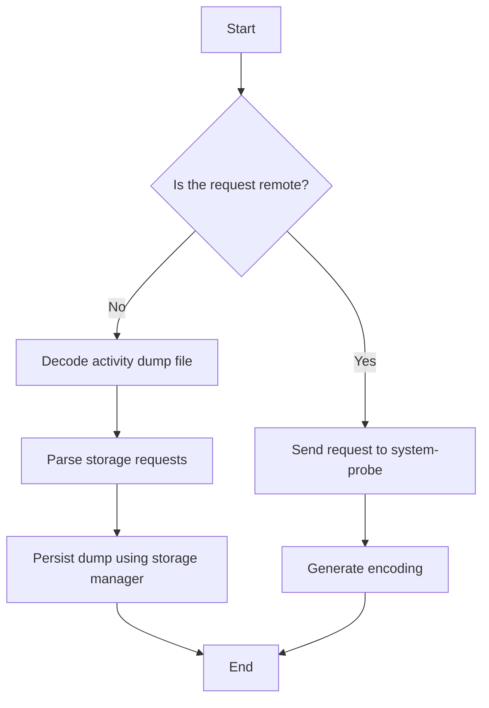

This document will cover the process of handling encoding requests from activity dumps. We'll cover:

1. Determining if the request is remote or local
2. Handling remote encoding requests
3. Handling local encoding requests
4. Managing storage for activity dumps

Technical document: <SwmLink doc-title="Handling Encoding Requests from Activity Dumps">[Handling Encoding Requests from Activity Dumps](/.swm/handling-encoding-requests-from-activity-dumps.x01zyz3g.sw.md)</SwmLink>

# [Determining if the request is remote or local](https://app.swimm.io/repos/Z2l0aHViJTNBJTNBZGF0YWRvZy1hZ2VudCUzQSUzQVN3aW1tLURlbW8=/docs/x01zyz3g#handling-encoding-requests)

The first step in handling an encoding request from an activity dump is to determine whether the request is remote or local. This decision affects how the request will be processed. A remote request means the encoding will be handled by the system-probe, while a local request means the encoding will be handled on the local machine.

# [Handling remote encoding requests](https://app.swimm.io/repos/Z2l0aHViJTNBJTNBZGF0YWRvZy1hZ2VudCUzQSUzQVN3aW1tLURlbW8=/docs/x01zyz3g#handling-encoding-requests)

If the encoding request is remote, the system-probe is responsible for generating the encoding. The request is sent to the system-probe, which involves creating a client to communicate with the system-probe. The client sends the encoding request along with the necessary parameters, such as the activity dump file and storage details. The system-probe then processes the request and generates the encoding.

# [Handling local encoding requests](https://app.swimm.io/repos/Z2l0aHViJTNBJTNBZGF0YWRvZy1hZ2VudCUzQSUzQVN3aW1tLURlbW8=/docs/x01zyz3g#local-encoding-request-handling)

For local encoding requests, the process involves several steps. First, the activity dump file is decoded to extract the relevant data. Next, storage requests are parsed to determine how the data should be stored. Finally, the dump is persisted using a storage manager, which handles the actual storage of the data. This ensures that the activity dump is properly encoded and stored locally.

# [Managing storage for activity dumps](https://app.swimm.io/repos/Z2l0aHViJTNBJTNBZGF0YWRvZy1hZ2VudCUzQSUzQVN3aW1tLURlbW8=/docs/x01zyz3g#managing-storage)

The storage manager is responsible for handling both local and remote storage capabilities. It initializes instances of local and remote storage and adds them to the manager's storage map. This setup allows the system to handle storage requests efficiently, whether they are local or remote. The storage manager ensures that the activity dumps are stored in the appropriate format and location, making them accessible for future use.

&nbsp;

*This is an auto-generated document by Swimm AI 🌊 and has not yet been verified by a human*

<SwmMeta version="3.0.0" repo-id="Z2l0aHViJTNBJTNBZGF0YWRvZy1hZ2VudCUzQSUzQVN3aW1tLURlbW8=" repo-name="datadog-agent">Powered by [Swimm](/)</SwmMeta>
