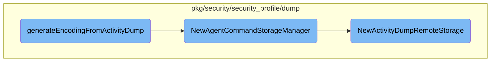

This document explains the process of handling encoding requests from activity dumps. The process involves determining whether the request is remote or local, and then handling it accordingly.

The flow starts by checking if the encoding request is remote. If it is, the request is sent to the <SwmToken path="cmd/security-agent/subcommands/runtime/activity_dump.go" pos="374:13:15" line-data="		// send the encoding request to system-probe">`system-probe`</SwmToken>, which generates the encoding. If the request is local, the activity dump file is decoded, storage requests are parsed, and the dump is persisted using a storage manager. The storage manager handles both local and remote storage capabilities.

# Flow drill down



<SwmSnippet path="/cmd/security-agent/subcommands/runtime/activity_dump.go" line="373">

---

## Handling Encoding Requests

The function <SwmToken path="cmd/security-agent/subcommands/runtime/activity_dump.go" pos="135:7:7" line-data="			return fxutil.OneShot(generateEncodingFromActivityDump,">`generateEncodingFromActivityDump`</SwmToken> handles encoding requests. If the request is remote, it sends the encoding request to the <SwmToken path="cmd/security-agent/subcommands/runtime/activity_dump.go" pos="374:13:15" line-data="		// send the encoding request to system-probe">`system-probe`</SwmToken> by creating a client and generating the encoding using <SwmToken path="cmd/security-agent/subcommands/runtime/activity_dump.go" pos="387:8:10" line-data="		output, err = client.GenerateEncoding(&amp;api.TranscodingRequestParams{">`client.GenerateEncoding`</SwmToken>.

```go
	if activityDumpArgs.remoteRequest {
		// send the encoding request to system-probe
		client, err := secagent.NewRuntimeSecurityClient()
		if err != nil {
			return fmt.Errorf("encoding generation failed: %w", err)
		}
		defer client.Close()

		// parse encoding request
		storage, err := parseStorageRequest(activityDumpArgs)
		if err != nil {
			return err
		}

		output, err = client.GenerateEncoding(&api.TranscodingRequestParams{
			ActivityDumpFile: activityDumpArgs.file,
			Storage:          storage,
		})
		if err != nil {
			return fmt.Errorf("couldn't send request to system-probe: %w", err)
		}
```

---

</SwmSnippet>

<SwmSnippet path="/cmd/security-agent/subcommands/runtime/activity_dump.go" line="395">

---

### Local Encoding Request Handling

For local encoding requests, the function decodes the activity dump file, parses storage requests, and persists the dump using the <SwmToken path="pkg/security/security_profile/dump/storage_manager.go" pos="55:2:2" line-data="func NewAgentCommandStorageManager(cfg *config.Config) (*ActivityDumpStorageManager, error) {">`NewAgentCommandStorageManager`</SwmToken>. The result is then converted to a transcoding request message.

```go
	} else {
		// encoding request will be handled locally
		ad := dump.NewEmptyActivityDump(nil)

		// open and parse input file
		if err := ad.Decode(activityDumpArgs.file); err != nil {
			return err
		}
		parsedRequests, err := parseStorageRequest(activityDumpArgs)
		if err != nil {
			return err
		}

		storageRequests, err := secconfig.ParseStorageRequests(parsedRequests)
		if err != nil {
			return fmt.Errorf("couldn't parse transcoding request for [%s]: %v", ad.GetSelectorStr(), err)
		}
		for _, request := range storageRequests {
			ad.AddStorageRequest(request)
		}

```

---

</SwmSnippet>

<SwmSnippet path="/pkg/security/security_profile/dump/storage_manager.go" line="55">

---

## Managing Storage

The function <SwmToken path="pkg/security/security_profile/dump/storage_manager.go" pos="55:2:2" line-data="func NewAgentCommandStorageManager(cfg *config.Config) (*ActivityDumpStorageManager, error) {">`NewAgentCommandStorageManager`</SwmToken> initializes an <SwmToken path="pkg/security/security_profile/dump/storage_manager.go" pos="55:14:14" line-data="func NewAgentCommandStorageManager(cfg *config.Config) (*ActivityDumpStorageManager, error) {">`ActivityDumpStorageManager`</SwmToken> with both local and remote storage capabilities. It creates instances of local and remote storage and adds them to the manager's storage map.

```go
func NewAgentCommandStorageManager(cfg *config.Config) (*ActivityDumpStorageManager, error) {
	manager := &ActivityDumpStorageManager{
		storages: make(map[config.StorageType]ActivityDumpStorage),
	}

	storage, err := NewActivityDumpLocalStorage(cfg, nil)
	if err != nil {
		return nil, fmt.Errorf("couldn't instantiate storage: %w", err)
	}
	manager.storages[storage.GetStorageType()] = storage

	// create remote storage
	remote, err := NewActivityDumpRemoteStorage()
	if err != nil {
		return nil, fmt.Errorf("couldn't instantiate remote storage: %w", err)
	}
	manager.storages[remote.GetStorageType()] = remote

	return manager, nil
}
```

---

</SwmSnippet>

<SwmSnippet path="/pkg/security/security_profile/dump/remote_storage.go" line="48">

---

### Initializing Remote Storage

The function <SwmToken path="pkg/security/security_profile/dump/remote_storage.go" pos="48:2:2" line-data="func NewActivityDumpRemoteStorage() (ActivityDumpStorage, error) {">`NewActivityDumpRemoteStorage`</SwmToken> initializes an <SwmToken path="pkg/security/security_profile/dump/remote_storage.go" pos="49:6:6" line-data="	storage := &amp;ActivityDumpRemoteStorage{">`ActivityDumpRemoteStorage`</SwmToken> instance. It sets up HTTP clients, configures storage formats, and generates storage endpoints. This setup is crucial for handling remote storage requests.

```go
func NewActivityDumpRemoteStorage() (ActivityDumpStorage, error) {
	storage := &ActivityDumpRemoteStorage{
		tooLargeEntities: make(map[tooLargeEntityStatsEntry]*atomic.Uint64),
		client: &http.Client{
			Transport: ddhttputil.CreateHTTPTransport(pkgconfig.Datadog()),
		},
	}

	for _, format := range config.AllStorageFormats() {
		for _, compression := range []bool{true, false} {
			entry := tooLargeEntityStatsEntry{
				storageFormat: format,
				compression:   compression,
			}
			storage.tooLargeEntities[entry] = atomic.NewUint64(0)
		}
	}

	endpoints, err := config.ActivityDumpRemoteStorageEndpoints("cws-intake.", "secdump", logsconfig.DefaultIntakeProtocol, "cloud-workload-security")
	if err != nil {
		return nil, fmt.Errorf("couldn't generate storage endpoints: %w", err)
```

---

</SwmSnippet>

&nbsp;

*This is an auto-generated document by Swimm AI 🌊 and has not yet been verified by a human*

<SwmMeta version="3.0.0" repo-id="Z2l0aHViJTNBJTNBZGF0YWRvZy1hZ2VudCUzQSUzQVN3aW1tLURlbW8=" repo-name="datadog-agent"><sup>Powered by [Swimm](/)</sup></SwmMeta>
