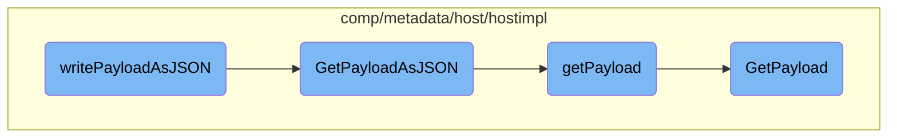

In this document, we will explain the process of handling metadata payloads in JSON format. The process involves retrieving the payload, converting it to JSON, scrubbing sensitive information, and writing the response.

The flow starts with retrieving the metadata payload, which includes various system and configuration data. This payload is then converted into a JSON format. After conversion, the JSON data is scrubbed to remove any sensitive information. Finally, the scrubbed JSON is written as a response.

# Flow drill down



<SwmSnippet path="/comp/metadata/host/hostimpl/host.go" line="139">

---

## <SwmToken path="comp/metadata/host/hostimpl/host.go" pos="139:9:9" line-data="func (h *host) writePayloadAsJSON(w http.ResponseWriter, _ *http.Request) {">`writePayloadAsJSON`</SwmToken>

The <SwmToken path="comp/metadata/host/hostimpl/host.go" pos="139:9:9" line-data="func (h *host) writePayloadAsJSON(w http.ResponseWriter, _ *http.Request) {">`writePayloadAsJSON`</SwmToken> function is responsible for writing the metadata payload as a JSON response. It first calls <SwmToken path="comp/metadata/host/hostimpl/host.go" pos="140:10:10" line-data="	jsonPayload, err := h.GetPayloadAsJSON(context.Background())">`GetPayloadAsJSON`</SwmToken> to get the payload in JSON format. If an error occurs during this process, it sets an error response. The payload is then scrubbed for sensitive information before being written to the response.

```go
func (h *host) writePayloadAsJSON(w http.ResponseWriter, _ *http.Request) {
	jsonPayload, err := h.GetPayloadAsJSON(context.Background())
	if err != nil {
		httputils.SetJSONError(w, h.log.Errorf("Unable to marshal v5 metadata payload: %s", err), 500)
		return
	}

	scrubbed, err := scrubber.ScrubBytes(jsonPayload)
	if err != nil {
		httputils.SetJSONError(w, h.log.Errorf("Unable to scrub metadata payload: %s", err), 500)
		return
	}
	w.Write(scrubbed)
}
```

---

</SwmSnippet>

<SwmSnippet path="/comp/metadata/host/hostimpl/host.go" line="131">

---

## <SwmToken path="comp/metadata/host/hostimpl/host.go" pos="131:9:9" line-data="func (h *host) GetPayloadAsJSON(ctx context.Context) ([]byte, error) {">`GetPayloadAsJSON`</SwmToken>

The <SwmToken path="comp/metadata/host/hostimpl/host.go" pos="131:9:9" line-data="func (h *host) GetPayloadAsJSON(ctx context.Context) ([]byte, error) {">`GetPayloadAsJSON`</SwmToken> function converts the payload into a JSON format. It calls <SwmToken path="comp/metadata/host/hostimpl/host.go" pos="132:9:9" line-data="	return json.MarshalIndent(h.getPayload(ctx), &quot;&quot;, &quot;    &quot;)">`getPayload`</SwmToken> to retrieve the payload and then marshals it into a JSON byte slice with indentation.

```go
func (h *host) GetPayloadAsJSON(ctx context.Context) ([]byte, error) {
	return json.MarshalIndent(h.getPayload(ctx), "", "    ")
}
```

---

</SwmSnippet>

<SwmSnippet path="/comp/metadata/host/hostimpl/payload.go" line="44">

---

## <SwmToken path="comp/metadata/host/hostimpl/payload.go" pos="44:2:2" line-data="// getPayload returns the complete metadata payload as seen in Agent v5">`getPayload`</SwmToken>

The <SwmToken path="comp/metadata/host/hostimpl/payload.go" pos="44:2:2" line-data="// getPayload returns the complete metadata payload as seen in Agent v5">`getPayload`</SwmToken> function constructs the complete metadata payload. It gathers common payload data, specific payload data, and additional resources if available. It also includes the Gohai payload if enabled in the configuration.

```go
// getPayload returns the complete metadata payload as seen in Agent v5
func (h *host) getPayload(ctx context.Context) *Payload {
	p := &Payload{
		CommonPayload: *utils.GetCommonPayload(h.hostname, h.config),
		Payload:       *utils.GetPayload(ctx, h.config),
	}

	if r := h.resources.Get(); r != nil {
		p.ResourcesPayload = r["resources"]
	}

	if h.config.GetBool("enable_gohai") {
		gohaiPayload, err := gohai.GetPayloadAsString(pkgconfig.IsContainerized())
		if err != nil {
			h.log.Errorf("Could not serialize gohai payload: %s", err)
		} else {
			p.GohaiPayload = gohaiPayload
		}
	}
	return p
}
```

---

</SwmSnippet>

<SwmSnippet path="/comp/metadata/host/hostimpl/utils/host.go" line="169">

---

## <SwmToken path="comp/metadata/host/hostimpl/utils/host.go" pos="169:2:2" line-data="// GetPayload builds a metadata payload every time is called.">`GetPayload`</SwmToken>

The <SwmToken path="comp/metadata/host/hostimpl/utils/host.go" pos="169:2:2" line-data="// GetPayload builds a metadata payload every time is called.">`GetPayload`</SwmToken> function builds the metadata payload by collecting various pieces of data such as OS information, agent flavor, Python version, system stats, and more. Some of this data is collected only once, some is cached, and some is collected at every call.

```go
// GetPayload builds a metadata payload every time is called.
// Some data is collected only once, some is cached, some is collected at every call.
func GetPayload(ctx context.Context, conf config.Reader) *Payload {
	hostnameData, err := hostname.GetWithProvider(ctx)
	if err != nil {
		log.Errorf("Error grabbing hostname for status: %v", err)
		hostnameData = hostname.Data{Hostname: "unknown", Provider: "unknown"}
	}

	meta := GetMeta(ctx, conf)
	meta.Hostname = hostnameData.Hostname

	p := &Payload{
		Os:            osName,
		AgentFlavor:   flavor.GetFlavor(),
		PythonVersion: python.GetPythonInfo(),
		SystemStats:   getSystemStats(),
		Meta:          meta,
		HostTags:      hosttags.Get(ctx, false, conf),
		ContainerMeta: containerMetadata.Get(1 * time.Second),
		NetworkMeta:   getNetworkMeta(ctx),
```

---

</SwmSnippet>

&nbsp;

*This is an auto-generated document by Swimm AI 🌊 and has not yet been verified by a human*

<SwmMeta version="3.0.0" repo-id="Z2l0aHViJTNBJTNBZGF0YWRvZy1hZ2VudCUzQSUzQVN3aW1tLURlbW8=" repo-name="datadog-agent"><sup>Powered by [Swimm](/)</sup></SwmMeta>
