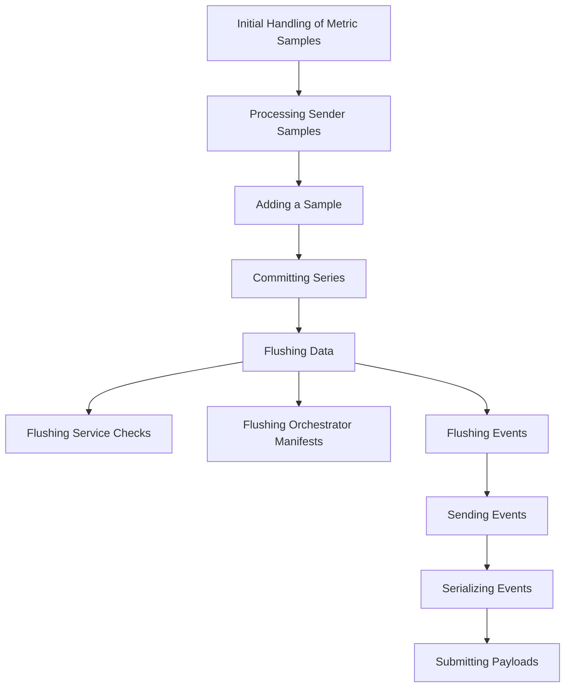

This document will cover the process of handling metric samples within the Datadog Agent. We'll cover:

 1. Initial Handling of Metric Samples
 2. Processing Sender Samples
 3. Adding a Sample
 4. Committing Series
 5. Flushing Data
 6. Flushing Service Checks
 7. Flushing Orchestrator Manifests
 8. Flushing Events
 9. Sending Events
10. Serializing Events
11. Submitting Payloads

Technical document: <SwmLink doc-title="Handling Metric Samples">[Handling Metric Samples](/.swm/handling-metric-samples.h8b5xip7.sw.md)</SwmLink>

# [Initial Handling of Metric Samples](https://app.swimm.io/repos/Z2l0aHViJTNBJTNBZGF0YWRvZy1hZ2VudCUzQSUzQVN3aW1tLURlbW8=/docs/h8b5xip7#handling-metric-samples)

The process begins with the initial handling of a metric sample. This involves receiving the metric sample and passing it to the appropriate handler within the BufferedAggregator instance. This step ensures that the metric sample is correctly routed for further processing.

# [Processing Sender Samples](https://app.swimm.io/repos/Z2l0aHViJTNBJTNBZGF0YWRvZy1hZ2VudCUzQSUzQVN3aW1tLURlbW8=/docs/h8b5xip7#processing-sender-samples)

Once the metric sample is received, it is processed to ensure thread safety by locking the aggregator. Relevant metrics are incremented to keep track of the number of samples processed. The system then checks if a CheckSampler exists for the given sample ID. If it does, the sample is either committed or added to the CheckSampler based on its status.

# [Adding a Sample](https://app.swimm.io/repos/Z2l0aHViJTNBJTNBZGF0YWRvZy1hZ2VudCUzQSUzQVN3aW1tLURlbW8=/docs/h8b5xip7#adding-a-sample)

If the sample is to be added to the CheckSampler, it is first tracked in the context of the sample. Depending on the type of the sample, it is either inserted into the sketchMap (for DistributionType samples) or added to the metrics. This step ensures that all samples are correctly categorized and stored for further processing.

# [Committing Series](https://app.swimm.io/repos/Z2l0aHViJTNBJTNBZGF0YWRvZy1hZ2VudCUzQSUzQVN3aW1tLURlbW8=/docs/h8b5xip7#commitseries)

When a sample is marked for commit, the commitSeries function is responsible for flushing the metrics series. It resolves the context for each series, populates the series with the appropriate metadata, and appends it to the series slice. This step ensures that all committed samples are prepared for final transmission.

# [Flushing Data](https://app.swimm.io/repos/Z2l0aHViJTNBJTNBZGF0YWRvZy1hZ2VudCUzQSUzQVN3aW1tLURlbW8=/docs/h8b5xip7#flush)

The Flush function is a critical part of the data flow. It flushes the data contained in the BufferedAggregator into the Forwarder. This includes series, sketches, service checks, events, and orchestrator manifests. The function ensures that all data is transmitted to the Datadog platform for monitoring and analysis.

# [Flushing Service Checks](https://app.swimm.io/repos/Z2l0aHViJTNBJTNBZGF0YWRvZy1hZ2VudCUzQSUzQVN3aW1tLURlbW8=/docs/h8b5xip7#flushservicechecks)

The flushServiceChecks function adds a simple service check for the Agent status and retrieves all service checks to be flushed. Depending on the configuration, it either sends the service checks synchronously or asynchronously. This step ensures that the status of the Agent and other service checks are accurately reported.

# [Flushing Orchestrator Manifests](https://app.swimm.io/repos/Z2l0aHViJTNBJTNBZGF0YWRvZy1hZ2VudCUzQSUzQVN3aW1tLURlbW8=/docs/h8b5xip7#flushorchestratormanifests)

The flushOrchestratorManifests function retrieves orchestrator manifests and forwards them. If there are no manifests to flush, it returns early. Otherwise, it either sends the manifests synchronously or asynchronously based on the configuration. This step ensures that orchestrator data is correctly transmitted.

# [Flushing Events](https://app.swimm.io/repos/Z2l0aHViJTNBJTNBZGF0YWRvZy1hZ2VudCUzQSUzQVN3aW1tLURlbW8=/docs/h8b5xip7#flushevents)

The flushEvents function is responsible for serializing and forwarding events. It retrieves the events and, if there are any, logs them for debugging purposes. Depending on the configuration, it either sends the events synchronously or asynchronously. This step ensures that all events are accurately captured and transmitted.

# [Sending Events](https://app.swimm.io/repos/Z2l0aHViJTNBJTNBZGF0YWRvZy1hZ2VudCUzQSUzQVN3aW1tLURlbW8=/docs/h8b5xip7#sendevents)

The sendEvents function logs the number of events being flushed and then calls the serializer to handle the serialization and forwarding of the events. It updates various metrics and logs any errors encountered during the process. This step ensures that events are correctly serialized and sent to the Datadog platform.

# [Serializing Events](https://app.swimm.io/repos/Z2l0aHViJTNBJTNBZGF0YWRvZy1hZ2VudCUzQSUzQVN3aW1tLURlbW8=/docs/h8b5xip7#sendevents)

The SendEvents function in the Serializer class is responsible for serializing a list of events and sending the payload to the forwarder. It checks if event payloads are enabled and then serializes the events using either JSON or protobuf, depending on the configuration. This step ensures that events are correctly formatted for transmission.

# [Submitting Payloads](https://app.swimm.io/repos/Z2l0aHViJTNBJTNBZGF0YWRvZy1hZ2VudCUzQSUzQVN3aW1tLURlbW8=/docs/h8b5xip7#submitv1intake)

The SubmitV1Intake function sends payloads to the universal intake endpoint used by Agent v.5. It handles the actual submission of the payload by creating HTTP transactions and setting the appropriate headers. This step ensures that the serialized data is correctly transmitted to the Datadog platform.

&nbsp;

*This is an auto-generated document by Swimm AI 🌊 and has not yet been verified by a human*

<SwmMeta version="3.0.0" repo-id="Z2l0aHViJTNBJTNBZGF0YWRvZy1hZ2VudCUzQSUzQVN3aW1tLURlbW8=" repo-name="datadog-agent">Powered by [Swimm](/)</SwmMeta>
