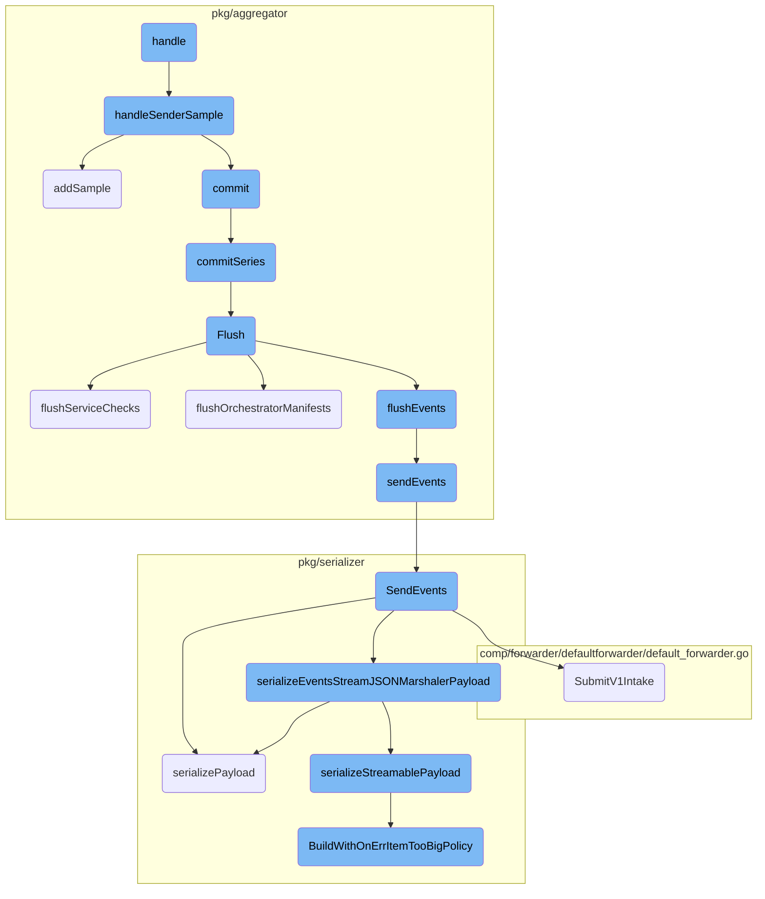
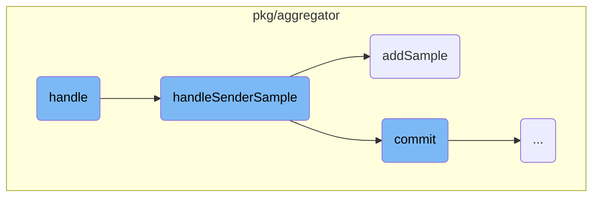
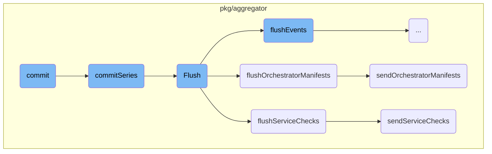
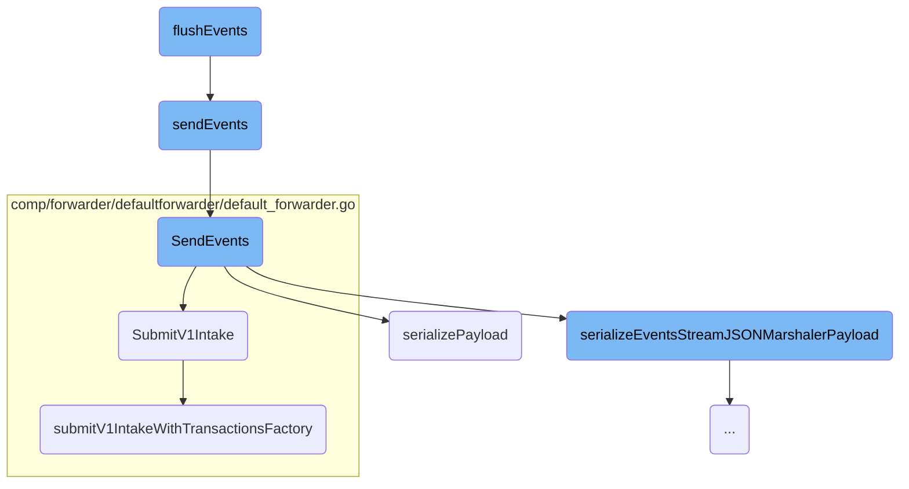
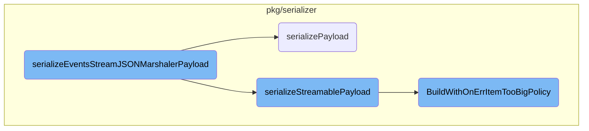

This document explains the process of handling metric samples within the Datadog Agent. The process involves several steps, starting from the initial handling of the metric sample to its eventual serialization and forwarding to the Datadog platform.

The flow begins with the handling of a metric sample, which is then processed to ensure thread safety and increment relevant metrics. If a <SwmToken path="pkg/aggregator/aggregator.go" pos="418:3:3" line-data="	if checkSampler, ok := agg.checkSamplers[ss.id]; ok {">`checkSampler`</SwmToken> exists for the sample ID, the sample is either committed or added to the <SwmToken path="pkg/aggregator/aggregator.go" pos="418:3:3" line-data="	if checkSampler, ok := agg.checkSamplers[ss.id]; ok {">`checkSampler`</SwmToken>. The committed samples are then flushed, serialized, and sent to the Datadog platform. This ensures that all metric data is accurately captured and transmitted for monitoring and analysis.

Here is a high level diagram of the flow, showing only the most important functions:



# Flow drill down

First, we'll zoom into this section of the flow:



<SwmSnippet path="/pkg/aggregator/sender.go" line="60">

---

## Handling Metric Samples

The <SwmToken path="pkg/aggregator/sender.go" pos="60:9:9" line-data="func (s *senderMetricSample) handle(agg *BufferedAggregator) {">`handle`</SwmToken> function is responsible for initiating the handling of a metric sample. It calls the <SwmToken path="pkg/aggregator/sender.go" pos="61:3:3" line-data="	agg.handleSenderSample(*s)">`handleSenderSample`</SwmToken> method on the <SwmToken path="pkg/aggregator/sender.go" pos="60:14:14" line-data="func (s *senderMetricSample) handle(agg *BufferedAggregator) {">`BufferedAggregator`</SwmToken> instance, passing the metric sample to it.

```go
func (s *senderMetricSample) handle(agg *BufferedAggregator) {
	agg.handleSenderSample(*s)
}
```

---

</SwmSnippet>

<SwmSnippet path="/pkg/aggregator/aggregator.go" line="411">

---

## Processing Sender Samples

The <SwmToken path="pkg/aggregator/aggregator.go" pos="411:9:9" line-data="func (agg *BufferedAggregator) handleSenderSample(ss senderMetricSample) {">`handleSenderSample`</SwmToken> function processes the metric sample. It locks the aggregator to ensure thread safety, increments relevant metrics, and then checks if a <SwmToken path="pkg/aggregator/aggregator.go" pos="418:3:3" line-data="	if checkSampler, ok := agg.checkSamplers[ss.id]; ok {">`checkSampler`</SwmToken> exists for the given sample ID. If the sample is marked for commit, it commits the sample; otherwise, it adds the sample to the <SwmToken path="pkg/aggregator/aggregator.go" pos="418:3:3" line-data="	if checkSampler, ok := agg.checkSamplers[ss.id]; ok {">`checkSampler`</SwmToken>.

```go
func (agg *BufferedAggregator) handleSenderSample(ss senderMetricSample) {
	agg.mu.Lock()
	defer agg.mu.Unlock()

	aggregatorChecksMetricSample.Add(1)
	tlmProcessed.Inc("", "metrics")

	if checkSampler, ok := agg.checkSamplers[ss.id]; ok {
		if ss.commit {
			checkSampler.commit(timeNowNano())
		} else {
			ss.metricSample.Tags = sort.UniqInPlace(ss.metricSample.Tags)
			checkSampler.addSample(ss.metricSample)
		}
	} else {
		log.Debugf("CheckSampler with ID '%s' doesn't exist, can't handle senderMetricSample", ss.id)
	}
}
```

---

</SwmSnippet>

<SwmSnippet path="/pkg/aggregator/check_sampler.go" line="49">

---

### Adding a Sample

The <SwmToken path="pkg/aggregator/check_sampler.go" pos="49:9:9" line-data="func (cs *CheckSampler) addSample(metricSample *metrics.MetricSample) {">`addSample`</SwmToken> function in <SwmToken path="pkg/aggregator/check_sampler.go" pos="49:6:6" line-data="func (cs *CheckSampler) addSample(metricSample *metrics.MetricSample) {">`CheckSampler`</SwmToken> adds a metric sample to the sampler. It first tracks the context of the sample, then processes it based on its type. If the sample is of type <SwmToken path="pkg/aggregator/check_sampler.go" pos="52:11:11" line-data="	if metricSample.Mtype == metrics.DistributionType {">`DistributionType`</SwmToken>, it inserts it into the <SwmToken path="pkg/aggregator/check_sampler.go" pos="53:3:3" line-data="		cs.sketchMap.insert(int64(metricSample.Timestamp), contextKey, metricSample.Value, metricSample.SampleRate)">`sketchMap`</SwmToken>. For other types, it adds the sample to the metrics and handles any errors that occur.

```go
func (cs *CheckSampler) addSample(metricSample *metrics.MetricSample) {
	contextKey := cs.contextResolver.trackContext(metricSample)

	if metricSample.Mtype == metrics.DistributionType {
		cs.sketchMap.insert(int64(metricSample.Timestamp), contextKey, metricSample.Value, metricSample.SampleRate)
		return
	}

	if err := cs.metrics.AddSample(contextKey, metricSample, metricSample.Timestamp, 1, config.Datadog()); err != nil {
		log.Debugf("Ignoring sample '%s' on host '%s' and tags '%s': %s", metricSample.Name, metricSample.Host, metricSample.Tags, err)
	}
}
```

---

</SwmSnippet>

Now, lets zoom into this section of the flow:



<SwmSnippet path="/pkg/aggregator/check_sampler.go" line="134">

---

## <SwmToken path="pkg/aggregator/check_sampler.go" pos="134:9:9" line-data="func (cs *CheckSampler) commitSeries(timestamp float64) {">`commitSeries`</SwmToken>

The <SwmToken path="pkg/aggregator/check_sampler.go" pos="134:9:9" line-data="func (cs *CheckSampler) commitSeries(timestamp float64) {">`commitSeries`</SwmToken> function is responsible for flushing the metrics series and handling any errors that occur during the flush. It resolves the context for each series and populates the series with the appropriate metadata before appending it to the <SwmToken path="pkg/aggregator/check_sampler.go" pos="158:1:3" line-data="		cs.series = append(cs.series, serie)">`cs.series`</SwmToken> slice.

```go
func (cs *CheckSampler) commitSeries(timestamp float64) {
	series, errors := cs.metrics.Flush(timestamp)
	for ckey, err := range errors {
		context, ok := cs.contextResolver.get(ckey)
		if !ok {
			log.Errorf("Can't resolve context of error '%s': inconsistent context resolver state: context with key '%v' is not tracked", err, ckey)
		} else {
			log.Infof("No value returned for check metric '%s' on host '%s' and tags '%s': %s", context.Name, context.Host, context.Tags().Join(", "), err)
		}
	}
	for _, serie := range series {
		// Resolve context and populate new []Serie
		context, ok := cs.contextResolver.get(serie.ContextKey)
		if !ok {
			log.Errorf("Ignoring all metrics on context key '%v': inconsistent context resolver state: the context is not tracked", serie.ContextKey)
			continue
		}
		serie.Name = context.Name + serie.NameSuffix
		serie.Tags = context.Tags()
		serie.Host = context.Host
		serie.NoIndex = context.noIndex
```

---

</SwmSnippet>

<SwmSnippet path="/pkg/aggregator/aggregator.go" line="716">

---

## Flush

The <SwmToken path="pkg/aggregator/aggregator.go" pos="716:2:2" line-data="// Flush flushes the data contained in the BufferedAggregator into the Forwarder.">`Flush`</SwmToken> function is a critical part of the data flow, as it flushes the data contained in the <SwmToken path="pkg/aggregator/aggregator.go" pos="716:16:16" line-data="// Flush flushes the data contained in the BufferedAggregator into the Forwarder.">`BufferedAggregator`</SwmToken> into the Forwarder. It ensures that the series, sketches, service checks, events, and orchestrator manifests are all flushed and updates the telemetry accordingly.

```go
// Flush flushes the data contained in the BufferedAggregator into the Forwarder.
// This method can be called from multiple routines.
func (agg *BufferedAggregator) Flush(trigger flushTrigger) {
	agg.flushMutex.Lock()
	defer agg.flushMutex.Unlock()
	agg.flushSeriesAndSketches(trigger)
	// notify the triggerer that we're done flushing the series and sketches
	if trigger.blockChan != nil {
		trigger.blockChan <- struct{}{}
	}
	agg.flushServiceChecks(trigger.time, trigger.waitForSerializer)
	agg.flushEvents(trigger.time, trigger.waitForSerializer)
	agg.flushOrchestratorManifests(trigger.time, trigger.waitForSerializer)
	agg.updateChecksTelemetry()
}
```

---

</SwmSnippet>

<SwmSnippet path="/pkg/aggregator/aggregator.go" line="632">

---

### <SwmToken path="pkg/aggregator/aggregator.go" pos="632:9:9" line-data="func (agg *BufferedAggregator) flushServiceChecks(start time.Time, waitForSerializer bool) {">`flushServiceChecks`</SwmToken>

The <SwmToken path="pkg/aggregator/aggregator.go" pos="632:9:9" line-data="func (agg *BufferedAggregator) flushServiceChecks(start time.Time, waitForSerializer bool) {">`flushServiceChecks`</SwmToken> function adds a simple service check for the Agent status and retrieves all service checks to be flushed. It then either sends the service checks synchronously or asynchronously based on the <SwmToken path="pkg/aggregator/aggregator.go" pos="632:18:18" line-data="func (agg *BufferedAggregator) flushServiceChecks(start time.Time, waitForSerializer bool) {">`waitForSerializer`</SwmToken> flag.

```go
func (agg *BufferedAggregator) flushServiceChecks(start time.Time, waitForSerializer bool) {
	// Add a simple service check for the Agent status
	agg.addServiceCheck(servicecheck.ServiceCheck{
		CheckName: fmt.Sprintf("datadog.%s.up", agg.agentName),
		Status:    servicecheck.ServiceCheckOK,
		Tags:      agg.tags(false),
		Host:      agg.hostname,
	})

	serviceChecks := agg.GetServiceChecks()
	addFlushCount("ServiceChecks", int64(len(serviceChecks)))

	// For debug purposes print out all serviceCheck/tag combinations
	if config.Datadog().GetBool("log_payloads") {
		log.Debug("Flushing the following Service Checks:")
		for _, sc := range serviceChecks {
			log.Debugf("%s", sc)
		}
	}

	if waitForSerializer {
```

---

</SwmSnippet>

<SwmSnippet path="/pkg/aggregator/aggregator.go" line="358">

---

### <SwmToken path="pkg/aggregator/aggregator.go" pos="358:2:2" line-data="// flushOrchestratorManifests serializes and forwards events in a separate goroutine">`flushOrchestratorManifests`</SwmToken>

The <SwmToken path="pkg/aggregator/aggregator.go" pos="358:2:2" line-data="// flushOrchestratorManifests serializes and forwards events in a separate goroutine">`flushOrchestratorManifests`</SwmToken> function retrieves orchestrator manifests and forwards them. If there are no manifests to flush, it returns early. Otherwise, it either sends the manifests synchronously or asynchronously based on the <SwmToken path="pkg/aggregator/aggregator.go" pos="359:18:18" line-data="func (agg *BufferedAggregator) flushOrchestratorManifests(start time.Time, waitForSerializer bool) {">`waitForSerializer`</SwmToken> flag.

```go
// flushOrchestratorManifests serializes and forwards events in a separate goroutine
func (agg *BufferedAggregator) flushOrchestratorManifests(start time.Time, waitForSerializer bool) {
	manifests := agg.getOrchestratorManifests()
	if len(manifests) == 0 {
		return
	}
	addFlushCount("Manifests", int64(len(manifests)))

	if waitForSerializer {
		agg.sendOrchestratorManifests(start, manifests)
	} else {
		go agg.sendOrchestratorManifests(start, manifests)
	}
}
```

---

</SwmSnippet>

Now, lets zoom into this section of the flow:



<SwmSnippet path="/pkg/aggregator/aggregator.go" line="692">

---

## <SwmToken path="pkg/aggregator/aggregator.go" pos="692:2:2" line-data="// flushEvents serializes and forwards events in a separate goroutine">`flushEvents`</SwmToken>

The <SwmToken path="pkg/aggregator/aggregator.go" pos="692:2:2" line-data="// flushEvents serializes and forwards events in a separate goroutine">`flushEvents`</SwmToken> function is responsible for serializing and forwarding events in a separate goroutine. It first retrieves the events using <SwmToken path="pkg/aggregator/aggregator.go" pos="695:5:9" line-data="	events := agg.GetEvents()">`agg.GetEvents()`</SwmToken>. If there are no events, it returns immediately. Otherwise, it logs the events if the <SwmToken path="pkg/aggregator/aggregator.go" pos="702:12:12" line-data="	if config.Datadog().GetBool(&quot;log_payloads&quot;) {">`log_payloads`</SwmToken> configuration is enabled. Depending on the <SwmToken path="pkg/aggregator/aggregator.go" pos="693:18:18" line-data="func (agg *BufferedAggregator) flushEvents(start time.Time, waitForSerializer bool) {">`waitForSerializer`</SwmToken> flag, it either calls <SwmToken path="pkg/aggregator/aggregator.go" pos="710:1:3" line-data="		agg.sendEvents(start, events)">`agg.sendEvents`</SwmToken> directly or in a separate goroutine.

```go
// flushEvents serializes and forwards events in a separate goroutine
func (agg *BufferedAggregator) flushEvents(start time.Time, waitForSerializer bool) {
	// Serialize and forward in a separate goroutine
	events := agg.GetEvents()
	if len(events) == 0 {
		return
	}
	addFlushCount("Events", int64(len(events)))

	// For debug purposes print out all Event/tag combinations
	if config.Datadog().GetBool("log_payloads") {
		log.Debug("Flushing the following Events:")
		for _, event := range events {
			log.Debugf("%s", event)
		}
	}

	if waitForSerializer {
		agg.sendEvents(start, events)
	} else {
		go agg.sendEvents(start, events)
```

---

</SwmSnippet>

<SwmSnippet path="/pkg/aggregator/aggregator.go" line="678">

---

### <SwmToken path="pkg/aggregator/aggregator.go" pos="678:9:9" line-data="func (agg *BufferedAggregator) sendEvents(start time.Time, events event.Events) {">`sendEvents`</SwmToken>

The <SwmToken path="pkg/aggregator/aggregator.go" pos="678:9:9" line-data="func (agg *BufferedAggregator) sendEvents(start time.Time, events event.Events) {">`sendEvents`</SwmToken> function logs the number of events being flushed and then calls <SwmToken path="pkg/aggregator/aggregator.go" pos="680:5:9" line-data="	err := agg.serializer.SendEvents(events)">`agg.serializer.SendEvents`</SwmToken> to handle the serialization and forwarding of the events. It also updates various metrics and logs any errors encountered during the process.

```go
func (agg *BufferedAggregator) sendEvents(start time.Time, events event.Events) {
	log.Debugf("Flushing %d events to the forwarder", len(events))
	err := agg.serializer.SendEvents(events)
	state := stateOk
	if err != nil {
		log.Warnf("Error flushing events: %v", err)
		aggregatorEventsFlushErrors.Add(1)
		state = stateError
	}
	addFlushTime("EventFlushTime", int64(time.Since(start)))
	aggregatorEventsFlushed.Add(int64(len(events)))
	tlmFlush.Add(float64(len(events)), "events", state)
}
```

---

</SwmSnippet>

<SwmSnippet path="/pkg/serializer/serializer.go" line="278">

---

### <SwmToken path="pkg/serializer/serializer.go" pos="278:2:2" line-data="// SendEvents serializes a list of event and sends the payload to the forwarder">`SendEvents`</SwmToken>

The <SwmToken path="pkg/serializer/serializer.go" pos="278:2:2" line-data="// SendEvents serializes a list of event and sends the payload to the forwarder">`SendEvents`</SwmToken> function in the <SwmToken path="pkg/serializer/serializer.go" pos="279:6:6" line-data="func (s *Serializer) SendEvents(events event.Events) error {">`Serializer`</SwmToken> class is responsible for serializing a list of events and sending the payload to the forwarder. It checks if event payloads are enabled and then serializes the events using either JSON or protobuf, depending on the configuration. Finally, it submits the serialized payload to the forwarder using <SwmToken path="comp/forwarder/defaultforwarder/default_forwarder.go" pos="599:2:2" line-data="// SubmitV1Intake will send payloads to the universal `/intake/` endpoint used by Agent v.5">`SubmitV1Intake`</SwmToken>.

```go
// SendEvents serializes a list of event and sends the payload to the forwarder
func (s *Serializer) SendEvents(events event.Events) error {
	if !s.enableEvents {
		log.Debug("events payloads are disabled: dropping it")
		return nil
	}

	var eventPayloads transaction.BytesPayloads
	var extraHeaders http.Header
	var err error

	eventsSerializer := metricsserializer.Events{
		EventsArr: events,
		Hostname:  s.hostname,
	}
	if s.enableEventsJSONStream {
		eventPayloads, extraHeaders, err = s.serializeEventsStreamJSONMarshalerPayload(eventsSerializer, true)
	} else {
		eventPayloads, extraHeaders, err = s.serializePayload(eventsSerializer, eventsSerializer, true, true)
	}
	if err != nil {
```

---

</SwmSnippet>

<SwmSnippet path="/comp/forwarder/defaultforwarder/default_forwarder.go" line="599">

---

### <SwmToken path="comp/forwarder/defaultforwarder/default_forwarder.go" pos="599:2:2" line-data="// SubmitV1Intake will send payloads to the universal `/intake/` endpoint used by Agent v.5">`SubmitV1Intake`</SwmToken>

The <SwmToken path="comp/forwarder/defaultforwarder/default_forwarder.go" pos="599:2:2" line-data="// SubmitV1Intake will send payloads to the universal `/intake/` endpoint used by Agent v.5">`SubmitV1Intake`</SwmToken> function sends payloads to the universal `/intake/` endpoint used by Agent <SwmToken path="comp/forwarder/defaultforwarder/default_forwarder.go" pos="599:28:30" line-data="// SubmitV1Intake will send payloads to the universal `/intake/` endpoint used by Agent v.5">`v.5`</SwmToken>. It calls <SwmToken path="comp/forwarder/defaultforwarder/default_forwarder.go" pos="601:5:5" line-data="	return f.submitV1IntakeWithTransactionsFactory(payload, kind, extra, f.createHTTPTransactions)">`submitV1IntakeWithTransactionsFactory`</SwmToken> to handle the actual submission of the payload.

```go
// SubmitV1Intake will send payloads to the universal `/intake/` endpoint used by Agent v.5
func (f *DefaultForwarder) SubmitV1Intake(payload transaction.BytesPayloads, kind transaction.Kind, extra http.Header) error {
	return f.submitV1IntakeWithTransactionsFactory(payload, kind, extra, f.createHTTPTransactions)
}
```

---

</SwmSnippet>

<SwmSnippet path="/pkg/serializer/serializer.go" line="187">

---

### <SwmToken path="pkg/serializer/serializer.go" pos="187:8:8" line-data="func (s Serializer) serializePayload(">`serializePayload`</SwmToken>

The <SwmToken path="pkg/serializer/serializer.go" pos="187:8:8" line-data="func (s Serializer) serializePayload(">`serializePayload`</SwmToken> function in the <SwmToken path="pkg/serializer/serializer.go" pos="187:5:5" line-data="func (s Serializer) serializePayload(">`Serializer`</SwmToken> class handles the serialization of the payload. It takes in JSON and protobuf marshalers and decides whether to use JSON or protobuf serialization based on the <SwmToken path="pkg/serializer/serializer.go" pos="191:1:1" line-data="	useV1API bool,">`useV1API`</SwmToken> flag.

```go
func (s Serializer) serializePayload(
	jsonMarshaler marshaler.JSONMarshaler,
	protoMarshaler marshaler.ProtoMarshaler,
	compress bool,
	useV1API bool,
) (transaction.BytesPayloads, http.Header, error) {
	if useV1API {
		return s.serializePayloadJSON(jsonMarshaler, compress)
	}
	return s.serializePayloadProto(protoMarshaler, compress)
}
```

---

</SwmSnippet>

<SwmSnippet path="/comp/forwarder/defaultforwarder/default_forwarder.go" line="604">

---

### <SwmToken path="comp/forwarder/defaultforwarder/default_forwarder.go" pos="604:9:9" line-data="func (f *DefaultForwarder) submitV1IntakeWithTransactionsFactory(">`submitV1IntakeWithTransactionsFactory`</SwmToken>

The <SwmToken path="comp/forwarder/defaultforwarder/default_forwarder.go" pos="604:9:9" line-data="func (f *DefaultForwarder) submitV1IntakeWithTransactionsFactory(">`submitV1IntakeWithTransactionsFactory`</SwmToken> function creates HTTP transactions for the `/intake/` endpoint and sets the <SwmToken path="comp/forwarder/defaultforwarder/default_forwarder.go" pos="612:13:15" line-data="	// the intake endpoint requires the Content-Type header to be set">`Content-Type`</SwmToken> header to <SwmPath>[pkg/util/json/](pkg/util/json/)</SwmPath>. It then sends these transactions using <SwmToken path="comp/forwarder/defaultforwarder/default_forwarder.go" pos="617:3:5" line-data="	return f.sendHTTPTransactions(transactions)">`f.sendHTTPTransactions`</SwmToken>.

```go
func (f *DefaultForwarder) submitV1IntakeWithTransactionsFactory(
	payload transaction.BytesPayloads,
	kind transaction.Kind,
	extra http.Header,
	createHTTPTransactions func(endpoint transaction.Endpoint, payload transaction.BytesPayloads, kind transaction.Kind, extra http.Header) []*transaction.HTTPTransaction,
) error {
	transactions := createHTTPTransactions(endpoints.V1IntakeEndpoint, payload, kind, extra)

	// the intake endpoint requires the Content-Type header to be set
	for _, t := range transactions {
		t.Headers.Set("Content-Type", "application/json")
	}

	return f.sendHTTPTransactions(transactions)
}
```

---

</SwmSnippet>

Now, lets zoom into this section of the flow:



<SwmSnippet path="/pkg/serializer/serializer.go" line="241">

---

## <SwmToken path="pkg/serializer/serializer.go" pos="250:8:8" line-data="func (s Serializer) serializeEventsStreamJSONMarshalerPayload(">`serializeEventsStreamJSONMarshalerPayload`</SwmToken>

The function <SwmToken path="pkg/serializer/serializer.go" pos="250:8:8" line-data="func (s Serializer) serializeEventsStreamJSONMarshalerPayload(">`serializeEventsStreamJSONMarshalerPayload`</SwmToken> handles the serialization of events by first attempting to use <SwmToken path="pkg/serializer/serializer.go" pos="242:12:12" line-data="// We first try to use JSONPayloadBuilder where a single item is the list of all events for the same source type.">`JSONPayloadBuilder`</SwmToken> for all events of the same source type. If the payload is too large, it falls back to creating individual payloads for each event or using an older serialization method.

```go
// As events are gathered by SourceType, the serialization logic is more complex than for the other serializations.
// We first try to use JSONPayloadBuilder where a single item is the list of all events for the same source type.

// This method may lead to item than can be too big to be serialized. In this case we try the following method.
// If the count of source type is less than maxItemCountForCreateMarshalersBySourceType then we use a
// of JSONPayloadBuilder for each source type where an item is a single event. We limit to maxItemCountForCreateMarshalersBySourceType
// for performance reasons.
//
// If none of the previous methods work, we fallback to the old serialization method (Serializer.serializePayload).
func (s Serializer) serializeEventsStreamJSONMarshalerPayload(
	eventsSerializer metricsserializer.Events, useV1API bool,
) (transaction.BytesPayloads, http.Header, error) {
	marshaler := eventsSerializer.CreateSingleMarshaler()
	eventPayloads, extraHeaders, err := s.serializeStreamablePayload(marshaler, stream.FailOnErrItemTooBig)

	if err == stream.ErrItemTooBig {
		expvarsSendEventsErrItemTooBigs.Add(1)

		// Do not use CreateMarshalersBySourceType when there are too many source types (Performance issue).
		if marshaler.Len() > maxItemCountForCreateMarshalersBySourceType {
			expvarsSendEventsErrItemTooBigsFallback.Add(1)
```

---

</SwmSnippet>

<SwmSnippet path="/pkg/serializer/serializer.go" line="230">

---

## <SwmToken path="pkg/serializer/serializer.go" pos="230:8:8" line-data="func (s Serializer) serializeStreamablePayload(payload marshaler.StreamJSONMarshaler, policy stream.OnErrItemTooBigPolicy) (transaction.BytesPayloads, http.Header, error) {">`serializeStreamablePayload`</SwmToken>

The function <SwmToken path="pkg/serializer/serializer.go" pos="230:8:8" line-data="func (s Serializer) serializeStreamablePayload(payload marshaler.StreamJSONMarshaler, policy stream.OnErrItemTooBigPolicy) (transaction.BytesPayloads, http.Header, error) {">`serializeStreamablePayload`</SwmToken> is responsible for adapting the payload into an iterable format and then building the payloads using the <SwmToken path="pkg/serializer/serializer.go" pos="232:12:12" line-data="	payloads, err := s.seriesJSONPayloadBuilder.BuildWithOnErrItemTooBigPolicy(adapter, policy)">`BuildWithOnErrItemTooBigPolicy`</SwmToken> method. This ensures that the payloads are created according to the specified policy for handling items that are too large.

```go
func (s Serializer) serializeStreamablePayload(payload marshaler.StreamJSONMarshaler, policy stream.OnErrItemTooBigPolicy) (transaction.BytesPayloads, http.Header, error) {
	adapter := marshaler.NewIterableStreamJSONMarshalerAdapter(payload)
	payloads, err := s.seriesJSONPayloadBuilder.BuildWithOnErrItemTooBigPolicy(adapter, policy)
	return payloads, s.jsonExtraHeadersWithCompression, err
}
```

---

</SwmSnippet>

<SwmSnippet path="/pkg/serializer/internal/stream/json_payload_builder.go" line="107">

---

## <SwmToken path="pkg/serializer/internal/stream/json_payload_builder.go" pos="107:2:2" line-data="// BuildWithOnErrItemTooBigPolicy serializes a metadata payload and sends it to the forwarder">`BuildWithOnErrItemTooBigPolicy`</SwmToken>

The function <SwmToken path="pkg/serializer/internal/stream/json_payload_builder.go" pos="107:2:2" line-data="// BuildWithOnErrItemTooBigPolicy serializes a metadata payload and sends it to the forwarder">`BuildWithOnErrItemTooBigPolicy`</SwmToken> serializes the metadata payload and manages the payload size constraints. It handles the creation of new payloads when the current one is full and deals with items that are too large according to the specified policy.

```go
// BuildWithOnErrItemTooBigPolicy serializes a metadata payload and sends it to the forwarder
func (b *JSONPayloadBuilder) BuildWithOnErrItemTooBigPolicy(
	m marshaler.IterableStreamJSONMarshaler,
	policy OnErrItemTooBigPolicy) (transaction.BytesPayloads, error) {
	var input, output *bytes.Buffer

	// the backend accepts payloads up to specific compressed / uncompressed
	// sizes, but prefers small uncompressed payloads.
	maxPayloadSize := b.config.GetInt("serializer_max_payload_size")
	maxUncompressedSize := b.config.GetInt("serializer_max_uncompressed_payload_size")

	if b.shareAndLockBuffers {
		defer b.mu.Unlock()

		tlmCompressorLocks.Inc()
		expvarsCompressorLocks.Add(1)
		start := time.Now()
		b.mu.Lock()
		elapsed := time.Since(start)
		expvarsTotalLockTime.Add(int64(elapsed))
		tlmTotalLockTime.Add(float64(elapsed))
```

---

</SwmSnippet>

&nbsp;

*This is an auto-generated document by Swimm AI 🌊 and has not yet been verified by a human*

<SwmMeta version="3.0.0" repo-id="Z2l0aHViJTNBJTNBZGF0YWRvZy1hZ2VudCUzQSUzQVN3aW1tLURlbW8=" repo-name="datadog-agent"><sup>Powered by [Swimm](/)</sup></SwmMeta>
