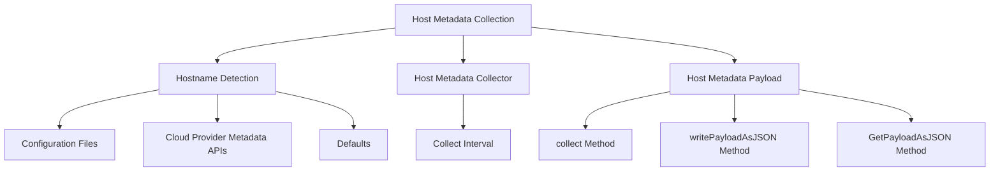

# Understanding Host Metadata

Host refers to the entity that the Datadog Agent is running on. It is a vital part of the metadata collected by the agent.

The hostname is detected using a specific logic that prioritizes various sources such as configuration files, cloud provider metadata APIs, and defaults. The detected hostname is used to update the status page and metadata, ensuring that the correct information is displayed and used for monitoring and analysis.

The host metadata collector runs at a configurable interval, collecting and sending host-related data to the Datadog platform. The collected host metadata includes various details about the host, such as its hostname, configuration, and resources.

<SwmSnippet path="/comp/metadata/host/hostimpl/host.go" line="45">

---

The <SwmToken path="comp/metadata/host/hostimpl/host.go" pos="45:2:2" line-data="type host struct {">`host`</SwmToken> struct defines the components and properties required for collecting host metadata, including logging, configuration, resources, hostname, collection interval, and serializer.

```go
type host struct {
	log       log.Component
	config    config.Component
	resources resources.Component

	hostname        string
	collectInterval time.Duration
	serializer      serializer.MetricSerializer
}
```

---

</SwmSnippet>

<SwmSnippet path="/comp/metadata/host/hostimpl/host.go" line="123">

---

The <SwmToken path="comp/metadata/host/hostimpl/host.go" pos="123:9:9" line-data="func (h *host) collect(ctx context.Context) time.Duration {">`collect`</SwmToken> method in the <SwmToken path="comp/metadata/host/hostimpl/host.go" pos="123:6:6" line-data="func (h *host) collect(ctx context.Context) time.Duration {">`host`</SwmToken> struct is responsible for collecting the host metadata payload and sending it to the Datadog platform at the specified interval.

```go
func (h *host) collect(ctx context.Context) time.Duration {
	payload := h.getPayload(ctx)
	if err := h.serializer.SendHostMetadata(payload); err != nil {
		h.log.Errorf("unable to submit host metadata payload, %s", err)
	}
	return h.collectInterval
}
```

---

</SwmSnippet>

<SwmSnippet path="/comp/metadata/host/hostimpl/host.go" line="139">

---

The <SwmToken path="comp/metadata/host/hostimpl/host.go" pos="139:9:9" line-data="func (h *host) writePayloadAsJSON(w http.ResponseWriter, _ *http.Request) {">`writePayloadAsJSON`</SwmToken> method in the <SwmToken path="comp/metadata/host/hostimpl/host.go" pos="139:6:6" line-data="func (h *host) writePayloadAsJSON(w http.ResponseWriter, _ *http.Request) {">`host`</SwmToken> struct handles the HTTP request to provide the host metadata payload in JSON format.

```go
func (h *host) writePayloadAsJSON(w http.ResponseWriter, _ *http.Request) {
	jsonPayload, err := h.GetPayloadAsJSON(context.Background())
	if err != nil {
		httputils.SetJSONError(w, h.log.Errorf("Unable to marshal v5 metadata payload: %s", err), 500)
		return
	}

	scrubbed, err := scrubber.ScrubBytes(jsonPayload)
	if err != nil {
		httputils.SetJSONError(w, h.log.Errorf("Unable to scrub metadata payload: %s", err), 500)
		return
	}
	w.Write(scrubbed)
}
```

---

</SwmSnippet>

# Main Functions

There are several main functions in this folder. Some of them are <SwmToken path="comp/metadata/host/hostimpl/host.go" pos="123:9:9" line-data="func (h *host) collect(ctx context.Context) time.Duration {">`collect`</SwmToken>, <SwmToken path="comp/metadata/host/hostimpl/host.go" pos="131:9:9" line-data="func (h *host) GetPayloadAsJSON(ctx context.Context) ([]byte, error) {">`GetPayloadAsJSON`</SwmToken>, <SwmToken path="comp/metadata/host/hostimpl/host.go" pos="114:10:10" line-data="		FlareProvider:    flaretypes.NewProvider(h.fillFlare),">`fillFlare`</SwmToken>, <SwmToken path="comp/metadata/host/hostimpl/host.go" pos="139:9:9" line-data="func (h *host) writePayloadAsJSON(w http.ResponseWriter, _ *http.Request) {">`writePayloadAsJSON`</SwmToken>, and <SwmToken path="comp/metadata/host/hostimpl/host.go" pos="119:10:10" line-data="		GohaiEndpoint: api.NewAgentEndpointProvider(h.writeGohaiPayload, &quot;/metadata/gohai&quot;, &quot;GET&quot;),">`writeGohaiPayload`</SwmToken>. We will dive a little into <SwmToken path="comp/metadata/host/hostimpl/host.go" pos="123:9:9" line-data="func (h *host) collect(ctx context.Context) time.Duration {">`collect`</SwmToken> and <SwmToken path="comp/metadata/host/hostimpl/host.go" pos="131:9:9" line-data="func (h *host) GetPayloadAsJSON(ctx context.Context) ([]byte, error) {">`GetPayloadAsJSON`</SwmToken>.

<SwmSnippet path="/comp/metadata/host/hostimpl/host.go" line="123">

---

## collect

The <SwmToken path="comp/metadata/host/hostimpl/host.go" pos="123:9:9" line-data="func (h *host) collect(ctx context.Context) time.Duration {">`collect`</SwmToken> function is responsible for gathering the host metadata payload and sending it to the Datadog platform. It runs at a configurable interval and logs any errors encountered during the process.

```go
func (h *host) collect(ctx context.Context) time.Duration {
	payload := h.getPayload(ctx)
	if err := h.serializer.SendHostMetadata(payload); err != nil {
		h.log.Errorf("unable to submit host metadata payload, %s", err)
	}
	return h.collectInterval
}
```

---

</SwmSnippet>

<SwmSnippet path="/comp/metadata/host/hostimpl/host.go" line="131">

---

## <SwmToken path="comp/metadata/host/hostimpl/host.go" pos="131:9:9" line-data="func (h *host) GetPayloadAsJSON(ctx context.Context) ([]byte, error) {">`GetPayloadAsJSON`</SwmToken>

The <SwmToken path="comp/metadata/host/hostimpl/host.go" pos="131:9:9" line-data="func (h *host) GetPayloadAsJSON(ctx context.Context) ([]byte, error) {">`GetPayloadAsJSON`</SwmToken> function converts the host metadata payload into a JSON format. This is useful for generating JSON representations of the host metadata for various purposes, such as API responses.

```go
func (h *host) GetPayloadAsJSON(ctx context.Context) ([]byte, error) {
	return json.MarshalIndent(h.getPayload(ctx), "", "    ")
}
```

---

</SwmSnippet>

&nbsp;

*This is an auto-generated document by Swimm AI 🌊 and has not yet been verified by a human*

<SwmMeta version="3.0.0" repo-id="Z2l0aHViJTNBJTNBZGF0YWRvZy1hZ2VudCUzQSUzQVN3aW1tLURlbW8=" repo-name="datadog-agent"><sup>Powered by [Swimm](/)</sup></SwmMeta>
