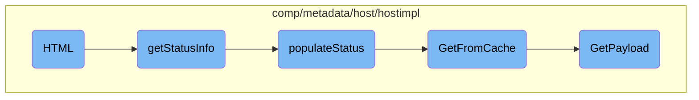

In this document, we will explain the process of rendering HTML output. The process involves gathering status information, populating it with various details, retrieving data from the cache, and finally generating the HTML content.

The flow starts with gathering status information and populating it with details like hostname statistics, metadata, and host tags. This information is then retrieved from the cache if available, or generated anew if not. Finally, the HTML content is rendered using this status information.

# Flow drill down



<SwmSnippet path="/comp/metadata/host/hostimpl/status.go" line="85">

---

## HTML Rendering

The <SwmToken path="comp/metadata/host/hostimpl/status.go" pos="85:2:2" line-data="// HTML renders the html output">`HTML`</SwmToken> function is responsible for rendering the HTML output. It uses the <SwmToken path="comp/metadata/host/hostimpl/status.go" pos="87:3:5" line-data="	return status.RenderHTML(templatesFS, &quot;hostHTML.tmpl&quot;, buffer, p.getStatusInfo())">`status.RenderHTML`</SwmToken> method to generate the HTML content based on the <SwmPath>[comp/metadata/host/hostimpl/status_templates/hostHTML.tmpl](comp/metadata/host/hostimpl/status_templates/hostHTML.tmpl)</SwmPath> template and the status information retrieved by the <SwmToken path="comp/metadata/host/hostimpl/status.go" pos="87:22:22" line-data="	return status.RenderHTML(templatesFS, &quot;hostHTML.tmpl&quot;, buffer, p.getStatusInfo())">`getStatusInfo`</SwmToken> function.

```go
// HTML renders the html output
func (p StatusProvider) HTML(_ bool, buffer io.Writer) error {
	return status.RenderHTML(templatesFS, "hostHTML.tmpl", buffer, p.getStatusInfo())
```

---

</SwmSnippet>

<SwmSnippet path="/comp/metadata/host/hostimpl/status.go" line="40">

---

## Retrieving Status Information

The <SwmToken path="comp/metadata/host/hostimpl/status.go" pos="40:8:8" line-data="func (p StatusProvider) getStatusInfo() map[string]interface{} {">`getStatusInfo`</SwmToken> function gathers status information by initializing a map and populating it with various status details using the <SwmToken path="comp/metadata/host/hostimpl/status.go" pos="43:3:3" line-data="	p.populateStatus(stats)">`populateStatus`</SwmToken> function. This map is then returned to be used in the HTML rendering process.

```go
func (p StatusProvider) getStatusInfo() map[string]interface{} {
	stats := make(map[string]interface{})

	p.populateStatus(stats)

	return stats
```

---

</SwmSnippet>

<SwmSnippet path="/comp/metadata/host/hostimpl/status.go" line="48">

---

### Populating Status Information

The <SwmToken path="comp/metadata/host/hostimpl/status.go" pos="48:8:8" line-data="func (p StatusProvider) populateStatus(stats map[string]interface{}) {">`populateStatus`</SwmToken> function fills the provided map with detailed status information. It retrieves hostname statistics, metadata from the cache, host tags, and host information. This data is then added to the map, which is used to generate the status report.

```go
func (p StatusProvider) populateStatus(stats map[string]interface{}) {
	hostnameStatsJSON := []byte(expvar.Get("hostname").String())
	hostnameStats := make(map[string]interface{})
	json.Unmarshal(hostnameStatsJSON, &hostnameStats) //nolint:errcheck
	stats["hostnameStats"] = hostnameStats

	payload := utils.GetFromCache(context.TODO(), p.Config)
	metadataStats := make(map[string]interface{})
	payloadBytes, _ := json.Marshal(payload)

	json.Unmarshal(payloadBytes, &metadataStats) //nolint:errcheck

	stats["metadata"] = metadataStats

	hostTags := make([]string, 0, len(payload.HostTags.System)+len(payload.HostTags.GoogleCloudPlatform))
	hostTags = append(hostTags, payload.HostTags.System...)
	hostTags = append(hostTags, payload.HostTags.GoogleCloudPlatform...)
	stats["hostTags"] = hostTags
	hostinfo := utils.GetInformation()
	hostinfoMap := make(map[string]interface{})
	hostinfoBytes, _ := json.Marshal(hostinfo)
```

---

</SwmSnippet>

<SwmSnippet path="/comp/metadata/host/hostimpl/utils/host.go" line="201">

---

### Getting Data from Cache

The <SwmToken path="comp/metadata/host/hostimpl/utils/host.go" pos="201:2:2" line-data="// GetFromCache returns the payload from the cache if it exists, otherwise it creates it.">`GetFromCache`</SwmToken> function attempts to retrieve the payload from the cache. If the payload is not found in the cache, it calls the <SwmToken path="comp/metadata/host/hostimpl/utils/host.go" pos="206:3:3" line-data="		return GetPayload(ctx, conf)">`GetPayload`</SwmToken> function to generate a new payload and then caches it for future use.

```go
// GetFromCache returns the payload from the cache if it exists, otherwise it creates it.
// The metadata reporting should always grab it fresh. Any other uses, e.g. status, should use this
func GetFromCache(ctx context.Context, conf config.Reader) *Payload {
	data, found := cache.Cache.Get(hostCacheKey)
	if !found {
		return GetPayload(ctx, conf)
	}
	return data.(*Payload)
}
```

---

</SwmSnippet>

<SwmSnippet path="/comp/metadata/host/hostimpl/utils/host.go" line="169">

---

### Generating Payload

The <SwmToken path="comp/metadata/host/hostimpl/utils/host.go" pos="169:2:2" line-data="// GetPayload builds a metadata payload every time is called.">`GetPayload`</SwmToken> function constructs a metadata payload by collecting various pieces of information such as hostname data, system stats, host tags, and other metadata. This payload is then cached for future retrieval by the <SwmToken path="comp/metadata/host/hostimpl/status.go" pos="54:7:7" line-data="	payload := utils.GetFromCache(context.TODO(), p.Config)">`GetFromCache`</SwmToken> function.

```go
// GetPayload builds a metadata payload every time is called.
// Some data is collected only once, some is cached, some is collected at every call.
func GetPayload(ctx context.Context, conf config.Reader) *Payload {
	hostnameData, err := hostname.GetWithProvider(ctx)
	if err != nil {
		log.Errorf("Error grabbing hostname for status: %v", err)
		hostnameData = hostname.Data{Hostname: "unknown", Provider: "unknown"}
	}

	meta := GetMeta(ctx, conf)
	meta.Hostname = hostnameData.Hostname

	p := &Payload{
		Os:            osName,
		AgentFlavor:   flavor.GetFlavor(),
		PythonVersion: python.GetPythonInfo(),
		SystemStats:   getSystemStats(),
		Meta:          meta,
		HostTags:      hosttags.Get(ctx, false, conf),
		ContainerMeta: containerMetadata.Get(1 * time.Second),
		NetworkMeta:   getNetworkMeta(ctx),
```

---

</SwmSnippet>

&nbsp;

*This is an auto-generated document by Swimm AI 🌊 and has not yet been verified by a human*

<SwmMeta version="3.0.0" repo-id="Z2l0aHViJTNBJTNBZGF0YWRvZy1hZ2VudCUzQSUzQVN3aW1tLURlbW8=" repo-name="datadog-agent"><sup>Powered by [Swimm](/)</sup></SwmMeta>
