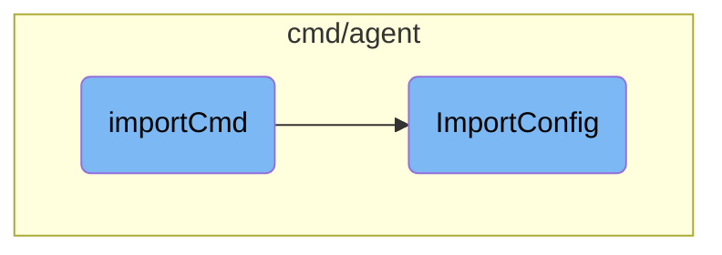

In this document, we will explain the process of importing configuration files from an older version of the Datadog Agent to a newer version. The process involves validating input arguments, reading the old configuration, creating a new configuration if it doesn't exist, and merging the old configuration with the new one.

The flow starts with validating the input arguments to ensure all required arguments are provided. If the configuration file path is specified, a message is printed indicating that the <SwmToken path="cmd/agent/subcommands/import/command.go" pos="63:15:15" line-data="		fmt.Fprintf(os.Stderr, &quot;Please note configdir option has no effect\n&quot;)">`configdir`</SwmToken> option has no effect. The old and new configuration directory paths are extracted from the arguments and passed to the <SwmToken path="cmd/agent/subcommands/import/command.go" pos="68:5:5" line-data="	return common.ImportConfig(oldConfigDir, newConfigDir, cliParams.force)">`ImportConfig`</SwmToken> function. The <SwmToken path="cmd/agent/subcommands/import/command.go" pos="68:5:5" line-data="	return common.ImportConfig(oldConfigDir, newConfigDir, cliParams.force)">`ImportConfig`</SwmToken> function reads the old configuration file, creates a new configuration file if it doesn't exist, and loads the new configuration. It then merges the old configuration with the new one, copies necessary files, handles specific configurations for Docker and Kubernetes, backs up the original configuration file, and writes the new configuration to the new file.

# Flow drill down



<SwmSnippet path="/cmd/agent/subcommands/import/command.go" line="57">

---

## <SwmToken path="cmd/agent/subcommands/import/command.go" pos="57:2:2" line-data="func importCmd(cliParams *cliParams) error {">`importCmd`</SwmToken> Function

The <SwmToken path="cmd/agent/subcommands/import/command.go" pos="57:2:2" line-data="func importCmd(cliParams *cliParams) error {">`importCmd`</SwmToken> function is responsible for validating the input arguments and ensuring that the required arguments are provided. It then calls the <SwmToken path="cmd/agent/subcommands/import/command.go" pos="68:5:5" line-data="	return common.ImportConfig(oldConfigDir, newConfigDir, cliParams.force)">`ImportConfig`</SwmToken> function to handle the actual import process. This function checks if the configuration file path is provided and prints a message if the <SwmToken path="cmd/agent/subcommands/import/command.go" pos="63:15:15" line-data="		fmt.Fprintf(os.Stderr, &quot;Please note configdir option has no effect\n&quot;)">`configdir`</SwmToken> option has no effect. It extracts the old and new configuration directory paths from the arguments and passes them to <SwmToken path="cmd/agent/subcommands/import/command.go" pos="68:5:5" line-data="	return common.ImportConfig(oldConfigDir, newConfigDir, cliParams.force)">`ImportConfig`</SwmToken>.

```go
func importCmd(cliParams *cliParams) error {
	if len(cliParams.args) != 2 {
		return fmt.Errorf("please provide all the required arguments")
	}

	if cliParams.ConfFilePath != "" {
		fmt.Fprintf(os.Stderr, "Please note configdir option has no effect\n")
	}
	oldConfigDir := cliParams.args[0]
	newConfigDir := cliParams.args[1]

	return common.ImportConfig(oldConfigDir, newConfigDir, cliParams.force)
}
```

---

</SwmSnippet>

<SwmSnippet path="/cmd/agent/common/import.go" line="28">

---

## <SwmToken path="cmd/agent/common/import.go" pos="28:2:2" line-data="// ImportConfig imports the agent5 configuration into the agent6 yaml config">`ImportConfig`</SwmToken> Function

The <SwmToken path="cmd/agent/common/import.go" pos="28:2:2" line-data="// ImportConfig imports the agent5 configuration into the agent6 yaml config">`ImportConfig`</SwmToken> function is responsible for importing the configuration from an older version of the Datadog Agent to a newer version. It reads the old configuration file, creates a new configuration file if it does not exist, and loads the new configuration. It ensures that the new configuration file does not contain a valid API key unless the <SwmToken path="cmd/agent/common/import.go" pos="29:14:14" line-data="func ImportConfig(oldConfigDir string, newConfigDir string, force bool) error {">`force`</SwmToken> option is used. The function then merges the old configuration with the new configuration, copies necessary files from the old configuration directory to the new one, and handles specific configurations for Docker and Kubernetes. Finally, it backs up the original configuration file, marshals the new configuration to YAML, and writes it to the new configuration file.

```go
// ImportConfig imports the agent5 configuration into the agent6 yaml config
func ImportConfig(oldConfigDir string, newConfigDir string, force bool) error {
	datadogConfPath := filepath.Join(oldConfigDir, "datadog.conf")
	datadogYamlPath := filepath.Join(newConfigDir, "datadog.yaml")
	traceAgentConfPath := filepath.Join(newConfigDir, "trace-agent.conf")
	configConverter := config.NewConfigConverter()
	const cfgExt = ".yaml"
	const dirExt = ".d"

	// read the old configuration in memory
	agentConfig, err := legacy.GetAgentConfig(datadogConfPath)
	if err != nil {
		return fmt.Errorf("unable to read data from %s: %v", datadogConfPath, err)
	}

	// the new config file might not exist, create it
	created := false
	if _, err := os.Stat(datadogYamlPath); os.IsNotExist(err) {
		f, err := os.Create(datadogYamlPath)
		if err != nil {
			return fmt.Errorf("error creating %s: %v", datadogYamlPath, err)
```

---

</SwmSnippet>

&nbsp;

*This is an auto-generated document by Swimm AI 🌊 and has not yet been verified by a human*

<SwmMeta version="3.0.0" repo-id="Z2l0aHViJTNBJTNBZGF0YWRvZy1hZ2VudCUzQSUzQVN3aW1tLURlbW8=" repo-name="datadog-agent"><sup>Powered by [Swimm](/)</sup></SwmMeta>
