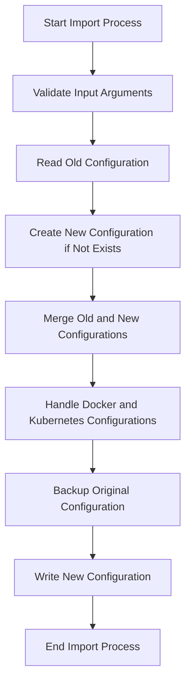

This document will cover the process of importing configuration files from an older version of the Datadog Agent to a newer version. We'll cover:

1. Validating input arguments
2. Reading the old configuration
3. Creating a new configuration if it doesn't exist
4. Merging the old configuration with the new one
5. Handling specific configurations for Docker and Kubernetes
6. Backing up the original configuration file
7. Writing the new configuration to the new file.

Technical document: <SwmLink doc-title="Importing Configuration Files">[Importing Configuration Files](/.swm/importing-configuration-files.exclm1g0.sw.md)</SwmLink>

# [Validating Input Arguments](https://app.swimm.io/repos/Z2l0aHViJTNBJTNBZGF0YWRvZy1hZ2VudCUzQSUzQVN3aW1tLURlbW8=/docs/exclm1g0#importcmd-function)

The process begins by validating the input arguments to ensure that all required arguments are provided. This step checks if the configuration file path is specified and prints a message indicating that the `configdir` option has no effect. It then extracts the old and new configuration directory paths from the arguments and prepares them for the import process.

# [Reading the Old Configuration](https://app.swimm.io/repos/Z2l0aHViJTNBJTNBZGF0YWRvZy1hZ2VudCUzQSUzQVN3aW1tLURlbW8=/docs/exclm1g0#importconfig-function)

Next, the old configuration file is read into memory. This step is crucial as it ensures that the existing settings and configurations are captured accurately before any modifications are made.

&nbsp;

*This is an auto-generated document by Swimm AI 🌊 and has not yet been verified by a human*

<SwmMeta version="3.0.0" repo-id="Z2l0aHViJTNBJTNBZGF0YWRvZy1hZ2VudCUzQSUzQVN3aW1tLURlbW8=" repo-name="datadog-agent">Powered by [Swimm](/)</SwmMeta>
