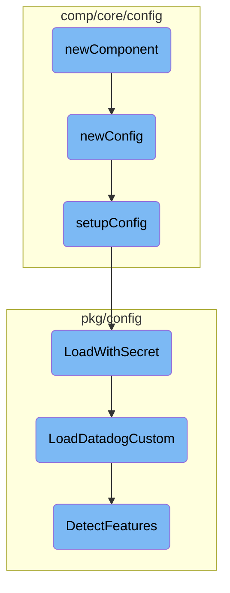

This document explains the initialization and configuration process of the <SwmToken path="comp/core/config/config.go" pos="81:2:2" line-data="func newComponent(deps dependencies) (provides, error) {">`newComponent`</SwmToken>. It covers the steps from setting up the initial configuration to loading custom configurations and detecting features.

The process starts with initializing the <SwmToken path="comp/core/config/config.go" pos="81:2:2" line-data="func newComponent(deps dependencies) (provides, error) {">`newComponent`</SwmToken>, which sets up the initial configuration. This configuration is then refined by setting paths and handling secrets. After that, the configuration is loaded with decrypted secrets, and custom settings are applied. Finally, feature detection is performed to ensure the environment is correctly configured for the Datadog Agent.

# Flow drill down



<SwmSnippet path="/comp/core/config/config.go" line="81">

---

## Initialization with <SwmToken path="comp/core/config/config.go" pos="81:2:2" line-data="func newComponent(deps dependencies) (provides, error) {">`newComponent`</SwmToken>

The <SwmToken path="comp/core/config/config.go" pos="81:2:2" line-data="func newComponent(deps dependencies) (provides, error) {">`newComponent`</SwmToken> function initializes the component by calling <SwmToken path="comp/core/config/config.go" pos="82:8:8" line-data="	c, err := newConfig(deps)">`newConfig`</SwmToken> to set up the configuration and then returns the component along with a flare provider. This step is crucial as it sets the foundation for the subsequent configuration steps.

```go
func newComponent(deps dependencies) (provides, error) {
	c, err := newConfig(deps)
	return provides{
		Comp:          c,
		FlareProvider: flaretypes.NewProvider(c.fillFlare),
	}, err
}
```

---

</SwmSnippet>

<SwmSnippet path="/comp/core/config/config.go" line="89">

---

## Configuration Setup with <SwmToken path="comp/core/config/config.go" pos="89:2:2" line-data="func newConfig(deps dependencies) (*cfg, error) {">`newConfig`</SwmToken>

The <SwmToken path="comp/core/config/config.go" pos="89:2:2" line-data="func newConfig(deps dependencies) (*cfg, error) {">`newConfig`</SwmToken> function is responsible for setting up the initial configuration. It loads the Datadog configuration, handles warnings, and merges security agent configurations if needed. This function ensures that the configuration is correctly initialized and ready for further setup.

```go
func newConfig(deps dependencies) (*cfg, error) {
	config := pkgconfigsetup.Datadog()
	warnings, err := setupConfig(config, deps)
	returnErrFct := func(e error) (*cfg, error) {
		if e != nil && deps.Params.ignoreErrors {
			if warnings == nil {
				warnings = &pkgconfigmodel.Warnings{}
			}
			warnings.Err = e
			e = nil
		}
		return &cfg{Config: config, warnings: warnings}, e
	}

	if err != nil {
		return returnErrFct(err)
	}

	if deps.Params.configLoadSecurityAgent {
		if err := pkgconfigsetup.Merge(deps.Params.securityAgentConfigFilePaths, config); err != nil {
			return returnErrFct(err)
```

---

</SwmSnippet>

<SwmSnippet path="/comp/core/config/setup.go" line="21">

---

## Detailed Configuration with <SwmToken path="comp/core/config/setup.go" pos="21:2:2" line-data="// setupConfig is copied from cmd/agent/common/helpers.go.">`setupConfig`</SwmToken>

The <SwmToken path="comp/core/config/setup.go" pos="21:2:2" line-data="// setupConfig is copied from cmd/agent/common/helpers.go.">`setupConfig`</SwmToken> function further refines the configuration by setting paths, loading extra config file paths, and handling secrets. It ensures that the configuration is loaded correctly and handles any errors that may arise during this process.

```go
// setupConfig is copied from cmd/agent/common/helpers.go.
func setupConfig(config pkgconfigmodel.Config, deps configDependencies) (*pkgconfigmodel.Warnings, error) {
	p := deps.getParams()

	confFilePath := p.ConfFilePath
	configName := p.configName
	failOnMissingFile := !p.configMissingOK
	defaultConfPath := p.defaultConfPath

	if configName != "" {
		config.SetConfigName(configName)
	}

	// set the paths where a config file is expected
	if len(confFilePath) != 0 {
		// if the configuration file path was supplied on the command line,
		// add that first so it's first in line
		config.AddConfigPath(confFilePath)
		// If they set a config file directly, let's try to honor that
		if strings.HasSuffix(confFilePath, ".yaml") || strings.HasSuffix(confFilePath, ".yml") {
			config.SetConfigFile(confFilePath)
```

---

</SwmSnippet>

<SwmSnippet path="/pkg/config/setup/config.go" line="1655">

---

## Loading Configuration with Secrets

The <SwmToken path="pkg/config/setup/config.go" pos="1655:2:2" line-data="// LoadWithSecret reads config files and initializes config with decrypted secrets">`LoadWithSecret`</SwmToken> function reads the configuration files and initializes the configuration with decrypted secrets. This step is essential for securely loading sensitive information into the configuration.

```go
// LoadWithSecret reads config files and initializes config with decrypted secrets
func LoadWithSecret(config pkgconfigmodel.Config, secretResolver secrets.Component, additionalEnvVars []string) (*pkgconfigmodel.Warnings, error) {
	return LoadDatadogCustom(config, "datadog.yaml", optional.NewOption[secrets.Component](secretResolver), additionalEnvVars)
}
```

---

</SwmSnippet>

<SwmSnippet path="/pkg/config/setup/config.go" line="1837">

---

## Custom Configuration Loading

The <SwmToken path="pkg/config/setup/config.go" pos="1837:2:2" line-data="// LoadDatadogCustom loads the datadog config in the given config">`LoadDatadogCustom`</SwmToken> function loads the Datadog configuration and applies various settings and overrides. It also handles proxy settings, resolves secrets, and checks for conflicting options. This function ensures that the configuration is fully loaded and ready for use.

```go
// LoadDatadogCustom loads the datadog config in the given config
func LoadDatadogCustom(config pkgconfigmodel.Config, origin string, secretResolver optional.Option[secrets.Component], additionalKnownEnvVars []string) (*pkgconfigmodel.Warnings, error) {
	// Feature detection running in a defer func as it always  need to run (whether config load has been successful or not)
	// Because some Agents (e.g. trace-agent) will run even if config file does not exist
	defer func() {
		// Environment feature detection needs to run before applying override funcs
		// as it may provide such overrides
		pkgconfigenv.DetectFeatures(config)
		pkgconfigmodel.ApplyOverrideFuncs(config)
	}()

	warnings := &pkgconfigmodel.Warnings{}
	err := LoadCustom(config, additionalKnownEnvVars)
	if err != nil {
		if errors.Is(err, os.ErrPermission) {
			log.Warnf("Error loading config: %v (check config file permissions for dd-agent user)", err)
		} else {
			log.Warnf("Error loading config: %v", err)
		}
		return warnings, err
	}
```

---

</SwmSnippet>

<SwmSnippet path="/pkg/config/env/environment_detection.go" line="96">

---

## Feature Detection

The <SwmToken path="pkg/config/env/environment_detection.go" pos="96:2:2" line-data="// DetectFeatures runs the feature detection.">`DetectFeatures`</SwmToken> function runs feature detection based on the loaded configuration. It identifies and activates features as needed, ensuring that the environment is correctly configured for the Datadog Agent.

```go
// DetectFeatures runs the feature detection.
// We guarantee that Datadog configuration is entirely loaded (env + YAML)
// before this function is called
func DetectFeatures(cfg model.Reader) {
	featureLock.Lock()
	defer featureLock.Unlock()

	// Detection should not run in unit tests to avoid overriding features based on runner environment
	if detectionAlwaysDisabledInTests {
		return
	}

	newFeatures := make(FeatureMap)
	if IsAutoconfigEnabled(cfg) {
		detectContainerFeatures(newFeatures, cfg)
		excludedFeatures := cfg.GetStringSlice("autoconfig_exclude_features")
		excludeFeatures(newFeatures, excludedFeatures)

		includedFeatures := cfg.GetStringSlice("autoconfig_include_features")
		for _, f := range includedFeatures {
			f = strings.ToLower(f)
```

---

</SwmSnippet>

&nbsp;

*This is an auto-generated document by Swimm AI 🌊 and has not yet been verified by a human*

<SwmMeta version="3.0.0" repo-id="Z2l0aHViJTNBJTNBZGF0YWRvZy1hZ2VudCUzQSUzQVN3aW1tLURlbW8=" repo-name="datadog-agent"><sup>Powered by [Swimm](/)</sup></SwmMeta>
