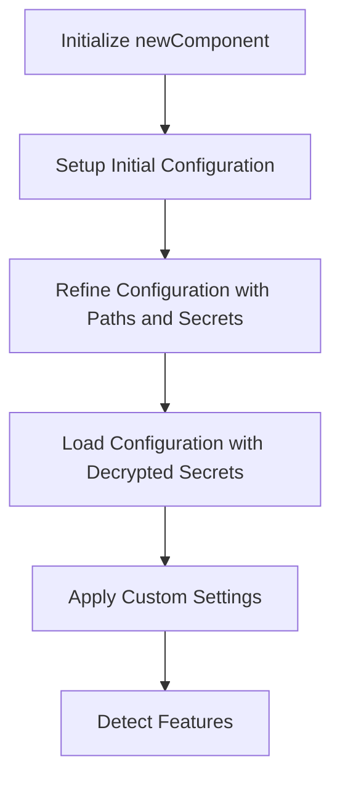

This document will cover the Initialization and Configuration of the newComponent, which includes:

1. Initializing the newComponent
2. Setting up the initial configuration
3. Refining the configuration with paths and secrets
4. Loading the configuration with decrypted secrets
5. Applying custom settings
6. Detecting features.

Technical document: <SwmLink doc-title="Initialization and Configuration of newComponent">[Initialization and Configuration of newComponent](/.swm/initialization-and-configuration-of-newcomponent.8o9qga3t.sw.md)</SwmLink>

# [Initializing the newComponent](https://app.swimm.io/repos/Z2l0aHViJTNBJTNBZGF0YWRvZy1hZ2VudCUzQSUzQVN3aW1tLURlbW8=/docs/8o9qga3t#initialization-with-newcomponent)

The initialization of the newComponent sets up the initial configuration and returns the component along with a flare provider. This step is foundational as it prepares the component for further configuration steps. The flare provider is essential for troubleshooting and diagnostics, ensuring that any issues can be easily identified and resolved.

# [Setting up the Initial Configuration](https://app.swimm.io/repos/Z2l0aHViJTNBJTNBZGF0YWRvZy1hZ2VudCUzQSUzQVN3aW1tLURlbW8=/docs/8o9qga3t#configuration-setup-with-newconfig)

The initial configuration setup involves loading the Datadog configuration and handling any warnings that may arise. This step ensures that the configuration is correctly initialized and ready for further refinement. It also merges security agent configurations if needed, ensuring that all necessary security settings are in place.

# [Refining the Configuration with Paths and Secrets](https://app.swimm.io/repos/Z2l0aHViJTNBJTNBZGF0YWRvZy1hZ2VudCUzQSUzQVN3aW1tLURlbW8=/docs/8o9qga3t#detailed-configuration-with-setupconfig)

Refining the configuration involves setting the paths where configuration files are expected, loading additional configuration file paths, and handling secrets. This step ensures that the configuration is loaded correctly and that any errors are handled appropriately. It is crucial for ensuring that the configuration is comprehensive and includes all necessary settings.

# [Loading the Configuration with Decrypted Secrets](https://app.swimm.io/repos/Z2l0aHViJTNBJTNBZGF0YWRvZy1hZ2VudCUzQSUzQVN3aW1tLURlbW8=/docs/8o9qga3t#loading-configuration-with-secrets)

Loading the configuration with decrypted secrets involves reading the configuration files and initializing the configuration with decrypted secrets. This step is essential for securely loading sensitive information into the configuration, ensuring that all sensitive data is handled securely and appropriately.

# [Applying Custom Settings](https://app.swimm.io/repos/Z2l0aHViJTNBJTNBZGF0YWRvZy1hZ2VudCUzQSUzQVN3aW1tLURlbW8=/docs/8o9qga3t#custom-configuration-loading)

Applying custom settings involves loading the Datadog configuration and applying various settings and overrides. This step also handles proxy settings, resolves secrets, and checks for conflicting options. It ensures that the configuration is fully loaded and ready for use, with all necessary customizations applied.

# [Detecting Features](https://app.swimm.io/repos/Z2l0aHViJTNBJTNBZGF0YWRvZy1hZ2VudCUzQSUzQVN3aW1tLURlbW8=/docs/8o9qga3t#feature-detection)

Feature detection involves identifying and activating features based on the loaded configuration. This step ensures that the environment is correctly configured for the Datadog Agent, with all necessary features activated and ready for use. It is crucial for ensuring that the Datadog Agent operates correctly and efficiently in the given environment.

&nbsp;

*This is an auto-generated document by Swimm AI 🌊 and has not yet been verified by a human*

<SwmMeta version="3.0.0" repo-id="Z2l0aHViJTNBJTNBZGF0YWRvZy1hZ2VudCUzQSUzQVN3aW1tLURlbW8=" repo-name="datadog-agent">Powered by [Swimm](/)</SwmMeta>
