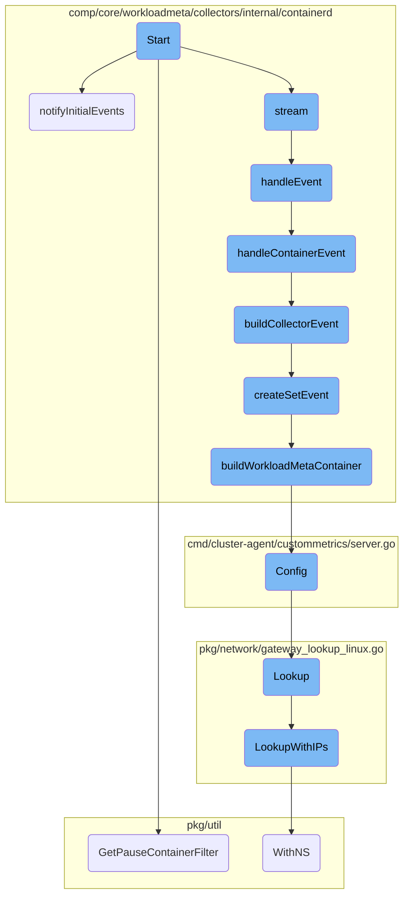
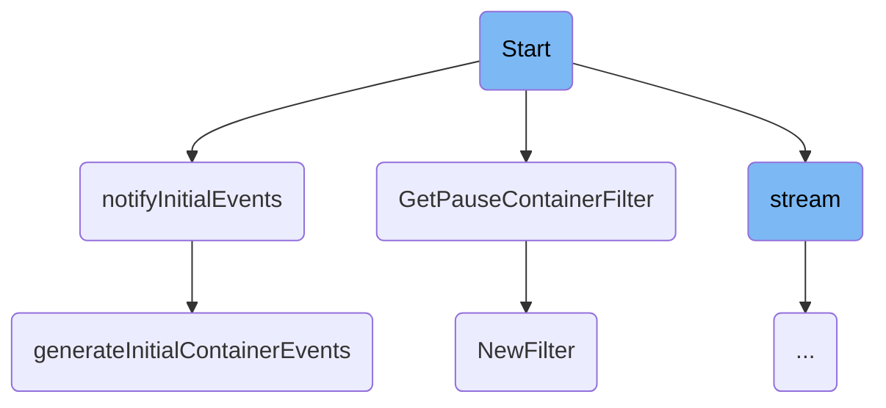
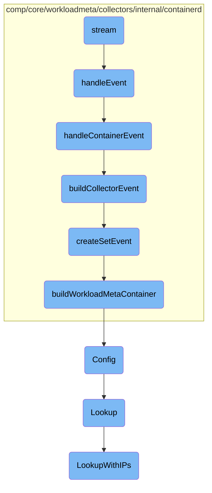

This document explains the initialization and event processing flow for the containerd collector. It covers setting up the containerd client, starting SBOM collection, setting up filters for paused containers, subscribing to containerd events, and streaming these events.

The process starts with initializing the collector by setting up necessary clients and filters. It then subscribes to containerd events and begins streaming these events. The flow includes handling initial events, setting up filters to exclude certain containers, and processing incoming events to generate and notify the store about container events.

Here is a high level diagram of the flow, showing only the most important functions:



# Flow drill down

First, we'll zoom into this section of the flow:



<SwmSnippet path="/comp/core/workloadmeta/collectors/internal/containerd/containerd.go" line="125">

---

## Initialization

The <SwmToken path="comp/core/workloadmeta/collectors/internal/containerd/containerd.go" pos="125:9:9" line-data="func (c *collector) Start(ctx context.Context, store workloadmeta.Component) error {">`Start`</SwmToken> function initializes the collector by setting up the containerd client, starting SBOM collection, and setting up filters for paused containers. It also subscribes to containerd events and starts streaming these events.

```go
func (c *collector) Start(ctx context.Context, store workloadmeta.Component) error {
	if !config.IsFeaturePresent(config.Containerd) {
		return agentErrors.NewDisabled(componentName, "Agent is not running on containerd")
	}

	c.store = store

	var err error
	c.containerdClient, err = cutil.NewContainerdUtil()
	if err != nil {
		return err
	}

	if err = c.startSBOMCollection(ctx); err != nil {
		return err
	}

	c.filterPausedContainers, err = containers.GetPauseContainerFilter()
	if err != nil {
		return err
	}
```

---

</SwmSnippet>

<SwmSnippet path="/pkg/util/containers/filter.go" line="173">

---

### Setting Up Filters

The <SwmToken path="pkg/util/containers/filter.go" pos="173:2:2" line-data="// GetPauseContainerFilter returns a filter only excluding pause containers">`GetPauseContainerFilter`</SwmToken> function sets up a filter to exclude pause containers based on a predefined list. This filter is used to ignore irrelevant containers during event processing.

```go
// GetPauseContainerFilter returns a filter only excluding pause containers
func GetPauseContainerFilter() (*Filter, error) {
	var excludeList []string
	if config.Datadog().GetBool("exclude_pause_container") {
		excludeList = append(excludeList,
			pauseContainerGCR,
			pauseContainerOpenshift,
			pauseContainerOpenshift3,
			pauseContainerKubernetes,
			pauseContainerGoogle,
			pauseContainerAzure,
			pauseContainerECS,
			pauseContainerEKS,
			pauseContainerRancher,
			pauseContainerRancherMirrored,
			pauseContainerMCR,
			pauseContainerWin,
			pauseContainerAKS,
			pauseContainerECR,
			pauseContainerUpstream,
			pauseContainerCDK,
```

---

</SwmSnippet>

<SwmSnippet path="/pkg/util/containers/filter.go" line="218">

---

### Creating Filters

The <SwmToken path="pkg/util/containers/filter.go" pos="218:2:2" line-data="// NewFilter creates a new container filter from a two slices of">`NewFilter`</SwmToken> function creates a new container filter from include and exclude lists. This filter is used to determine which containers should be monitored or ignored.

```go
// NewFilter creates a new container filter from a two slices of
// regexp patterns for a include list and exclude list. Each pattern should have
// the following format: "field:pattern" where field can be: [image, name, kube_namespace].
// An error is returned if any of the expression don't compile.
func NewFilter(ft FilterType, includeList, excludeList []string) (*Filter, error) {
	imgIncl, nameIncl, nsIncl, filterErrsIncl, errIncl := parseFilters(includeList)
	imgExcl, nameExcl, nsExcl, filterErrsExcl, errExcl := parseFilters(excludeList)

	errors := append(filterErrsIncl, filterErrsExcl...)
	errorsMap := make(map[string]struct{})
	if len(errors) > 0 {
		for _, err := range errors {
			errorsMap[err] = struct{}{}
		}
	}

	if errIncl != nil {
		return &Filter{Errors: errorsMap}, errIncl
	}
	if errExcl != nil {
		return &Filter{Errors: errorsMap}, errExcl
```

---

</SwmSnippet>

<SwmSnippet path="/comp/core/workloadmeta/collectors/internal/containerd/containerd.go" line="213">

---

## Event Notification

The <SwmToken path="comp/core/workloadmeta/collectors/internal/containerd/containerd.go" pos="213:9:9" line-data="func (c *collector) notifyInitialEvents(ctx context.Context) error {">`notifyInitialEvents`</SwmToken> function generates and notifies initial container events. It collects events from all namespaces and notifies the store if there are any initial container events.

```go
func (c *collector) notifyInitialEvents(ctx context.Context) error {
	var containerEvents []workloadmeta.CollectorEvent

	namespaces, err := cutil.NamespacesToWatch(ctx, c.containerdClient)
	if err != nil {
		return err
	}

	for _, namespace := range namespaces {
		if imageMetadataCollectionIsEnabled() {
			if err := c.notifyInitialImageEvents(ctx, namespace); err != nil {
				return err
			}
		}

		nsContainerEvents, err := c.generateInitialContainerEvents(namespace)
		if err != nil {
			return err
		}
		containerEvents = append(containerEvents, nsContainerEvents...)
	}
```

---

</SwmSnippet>

<SwmSnippet path="/comp/core/workloadmeta/collectors/internal/containerd/containerd.go" line="242">

---

### Generating Initial Events

The <SwmToken path="comp/core/workloadmeta/collectors/internal/containerd/containerd.go" pos="242:9:9" line-data="func (c *collector) generateInitialContainerEvents(namespace string) ([]workloadmeta.CollectorEvent, error) {">`generateInitialContainerEvents`</SwmToken> function generates events for existing containers in a given namespace. It checks each container to determine if it should be ignored and creates events for those that should be monitored.

```go
func (c *collector) generateInitialContainerEvents(namespace string) ([]workloadmeta.CollectorEvent, error) {
	var events []workloadmeta.CollectorEvent

	existingContainers, err := c.containerdClient.Containers(namespace)
	if err != nil {
		return nil, err
	}

	for _, container := range existingContainers {
		// if ignoreContainer returns an error, keep the container
		// regardless.  it might've been because of network errors, so
		// it's better to keep a container we should've ignored than
		// ignoring a container we should've kept
		ignore, err := c.ignoreContainer(namespace, container)
		if err != nil {
			log.Debugf("Error while deciding to ignore event %s, keeping it: %s", container.ID(), err)
		} else if ignore {
			continue
		}

		ev, err := createSetEvent(container, namespace, c.containerdClient, c.store)
```

---

</SwmSnippet>

Now, lets zoom into this section of the flow:



<SwmSnippet path="/comp/core/workloadmeta/collectors/internal/containerd/containerd.go" line="182">

---

## Stream

The <SwmToken path="comp/core/workloadmeta/collectors/internal/containerd/containerd.go" pos="182:9:9" line-data="func (c *collector) stream(ctx context.Context) {">`stream`</SwmToken> function is responsible for continuously listening to various channels such as <SwmToken path="comp/core/workloadmeta/collectors/internal/containerd/containerd.go" pos="190:10:10" line-data="		case ev := &lt;-c.eventsChan:">`eventsChan`</SwmToken> and <SwmToken path="comp/core/workloadmeta/collectors/internal/containerd/containerd.go" pos="195:10:10" line-data="		case err := &lt;-c.errorsChan:">`errorsChan`</SwmToken>. It processes incoming events by calling <SwmToken path="comp/core/workloadmeta/collectors/internal/containerd/containerd.go" pos="191:9:9" line-data="			if err := c.handleEvent(ctx, ev); err != nil {">`handleEvent`</SwmToken> and handles errors by logging them and stopping the collection if necessary.

```go
func (c *collector) stream(ctx context.Context) {
	healthHandle := health.RegisterLiveness(componentName)
	ctx, cancel := context.WithCancel(ctx)

	for {
		select {
		case <-healthHandle.C:

		case ev := <-c.eventsChan:
			if err := c.handleEvent(ctx, ev); err != nil {
				log.Warnf(err.Error())
			}

		case err := <-c.errorsChan:
			if err != nil {
				log.Errorf("stopping collection: %s", err)
			}
			cancel()
			return

		case <-ctx.Done():
```

---

</SwmSnippet>

<SwmSnippet path="/comp/core/workloadmeta/collectors/internal/containerd/containerd.go" line="306">

---

## Handle Event

The <SwmToken path="comp/core/workloadmeta/collectors/internal/containerd/containerd.go" pos="306:9:9" line-data="func (c *collector) handleEvent(ctx context.Context, containerdEvent *containerdevents.Envelope) error {">`handleEvent`</SwmToken> function determines the type of event received. If the event is related to an image, it calls <SwmToken path="comp/core/workloadmeta/collectors/internal/containerd/containerd.go" pos="308:5:5" line-data="		return c.handleImageEvent(ctx, containerdEvent)">`handleImageEvent`</SwmToken>. Otherwise, it processes container-related events by calling <SwmToken path="comp/core/workloadmeta/collectors/internal/containerd/containerd.go" pos="311:5:5" line-data="	return c.handleContainerEvent(ctx, containerdEvent)">`handleContainerEvent`</SwmToken>.

```go
func (c *collector) handleEvent(ctx context.Context, containerdEvent *containerdevents.Envelope) error {
	if isImageTopic(containerdEvent.Topic) {
		return c.handleImageEvent(ctx, containerdEvent)
	}

	return c.handleContainerEvent(ctx, containerdEvent)
}
```

---

</SwmSnippet>

<SwmSnippet path="/comp/core/workloadmeta/collectors/internal/containerd/containerd.go" line="314">

---

## Handle Container Event

The <SwmToken path="comp/core/workloadmeta/collectors/internal/containerd/containerd.go" pos="314:9:9" line-data="func (c *collector) handleContainerEvent(ctx context.Context, containerdEvent *containerdevents.Envelope) error {">`handleContainerEvent`</SwmToken> function extracts container information from the event and decides whether to ignore the event. If the event is not ignored, it builds a <SwmToken path="comp/core/workloadmeta/collectors/internal/containerd/containerd.go" pos="214:9:9" line-data="	var containerEvents []workloadmeta.CollectorEvent">`CollectorEvent`</SwmToken> and notifies the store with this event.

```go
func (c *collector) handleContainerEvent(ctx context.Context, containerdEvent *containerdevents.Envelope) error {
	containerID, container, err := c.extractContainerFromEvent(ctx, containerdEvent)
	if err != nil {
		return fmt.Errorf("cannot extract container from event: %w", err)
	}

	if container != nil {
		ignore, err := c.ignoreContainer(containerdEvent.Namespace, container)
		if err != nil {
			log.Debugf("Error while deciding to ignore event %s, keeping it: %s", container.ID(), err)
		} else if ignore {
			return nil
		}
	}

	workloadmetaEvent, err := c.buildCollectorEvent(containerdEvent, containerID, container, c.store)
	if err != nil {
		if errors.Is(err, errNoContainer) {
			log.Debugf("No event could be built as container is nil, skipping event. CID: %s, event: %+v", containerID, containerdEvent)
			return nil
		}
```

---

</SwmSnippet>

<SwmSnippet path="/comp/core/workloadmeta/collectors/internal/containerd/event_builder.go" line="26">

---

## Build Collector Event

The <SwmToken path="comp/core/workloadmeta/collectors/internal/containerd/event_builder.go" pos="26:2:2" line-data="// buildCollectorEvent generates a CollectorEvent from a containerdevents.Envelope">`buildCollectorEvent`</SwmToken> function generates a <SwmToken path="comp/core/workloadmeta/collectors/internal/containerd/event_builder.go" pos="26:8:8" line-data="// buildCollectorEvent generates a CollectorEvent from a containerdevents.Envelope">`CollectorEvent`</SwmToken> based on the type of containerd event. It handles various topics such as container creation, deletion, and task events, and calls <SwmToken path="comp/core/workloadmeta/collectors/internal/containerd/event_builder.go" pos="35:3:3" line-data="		return createSetEvent(container, containerdEvent.Namespace, c.containerdClient, store)">`createSetEvent`</SwmToken> or <SwmToken path="comp/core/workloadmeta/collectors/internal/containerd/event_builder.go" pos="41:3:3" line-data="		return createDeletionEvent(containerID, exitInfo), nil">`createDeletionEvent`</SwmToken> accordingly.

```go
// buildCollectorEvent generates a CollectorEvent from a containerdevents.Envelope
func (c *collector) buildCollectorEvent(
	containerdEvent *containerdevents.Envelope,
	containerID string,
	container containerd.Container,
	store workloadmeta.Component,
) (workloadmeta.CollectorEvent, error) {
	switch containerdEvent.Topic {
	case containerCreationTopic, containerUpdateTopic:
		return createSetEvent(container, containerdEvent.Namespace, c.containerdClient, store)

	case containerDeletionTopic:
		exitInfo := c.getExitInfo(containerID)
		defer c.deleteExitInfo(containerID)

		return createDeletionEvent(containerID, exitInfo), nil

	case TaskExitTopic:
		exited := &events.TaskExit{}
		if err := proto.Unmarshal(containerdEvent.Event.GetValue(), exited); err != nil {
			return workloadmeta.CollectorEvent{}, err
```

---

</SwmSnippet>

<SwmSnippet path="/comp/core/workloadmeta/collectors/internal/containerd/event_builder.go" line="69">

---

## Create Set Event

The <SwmToken path="comp/core/workloadmeta/collectors/internal/containerd/event_builder.go" pos="69:2:2" line-data="func createSetEvent(">`createSetEvent`</SwmToken> function creates a <SwmToken path="comp/core/workloadmeta/collectors/internal/containerd/event_builder.go" pos="73:11:11" line-data="	store workloadmeta.Component) (workloadmeta.CollectorEvent, error) {">`CollectorEvent`</SwmToken> of type <SwmToken path="cmd/cluster-agent/custommetrics/server.go" pos="130:29:29" line-data="		// Ensure backward compatibility. 443 by default, but will error out if incorrectly set.">`set`</SwmToken>. It builds a <SwmToken path="comp/core/workloadmeta/collectors/internal/containerd/container_builder.go" pos="32:8:10" line-data="// buildWorkloadMetaContainer generates a workloadmeta.Container from a containerd.Container">`workloadmeta.Container`</SwmToken> entity using the <SwmToken path="comp/core/workloadmeta/collectors/internal/containerd/event_builder.go" pos="78:8:8" line-data="	entity, err := buildWorkloadMetaContainer(namespace, container, containerdClient, store)">`buildWorkloadMetaContainer`</SwmToken> function and sets the namespace before returning the event.

```go
func createSetEvent(
	container containerd.Container,
	namespace string,
	containerdClient cutil.ContainerdItf,
	store workloadmeta.Component) (workloadmeta.CollectorEvent, error) {
	if container == nil {
		return workloadmeta.CollectorEvent{}, errNoContainer
	}

	entity, err := buildWorkloadMetaContainer(namespace, container, containerdClient, store)
	if err != nil {
		return workloadmeta.CollectorEvent{}, fmt.Errorf("could not fetch info for container %s: %s", container.ID(), err)
	}

	// The namespace cannot be obtained from a container instance. That's why we
	// propagate it here using the one in the event.
	entity.Namespace = namespace

	return workloadmeta.CollectorEvent{
		Type:   workloadmeta.EventTypeSet,
		Source: workloadmeta.SourceRuntime,
```

---

</SwmSnippet>

<SwmSnippet path="/comp/core/workloadmeta/collectors/internal/containerd/container_builder.go" line="32">

---

## Build Workload Meta Container

The <SwmToken path="comp/core/workloadmeta/collectors/internal/containerd/container_builder.go" pos="32:2:2" line-data="// buildWorkloadMetaContainer generates a workloadmeta.Container from a containerd.Container">`buildWorkloadMetaContainer`</SwmToken> function constructs a <SwmToken path="comp/core/workloadmeta/collectors/internal/containerd/container_builder.go" pos="32:8:10" line-data="// buildWorkloadMetaContainer generates a workloadmeta.Container from a containerd.Container">`workloadmeta.Container`</SwmToken> from a <SwmToken path="comp/core/workloadmeta/collectors/internal/containerd/container_builder.go" pos="32:16:18" line-data="// buildWorkloadMetaContainer generates a workloadmeta.Container from a containerd.Container">`containerd.Container`</SwmToken>. It gathers various details such as image ID, PID, and network <SwmToken path="tasks/kernel_matrix_testing/ci.py" pos="126:1:1" line-data="        ips: set[str] = set()">`ips`</SwmToken>, and sets attributes like runtime flavor and state before returning the container entity.

```go
// buildWorkloadMetaContainer generates a workloadmeta.Container from a containerd.Container
func buildWorkloadMetaContainer(namespace string, container containerd.Container, containerdClient cutil.ContainerdItf, store workloadmeta.Component) (workloadmeta.Container, error) {
	if container == nil {
		return workloadmeta.Container{}, fmt.Errorf("cannot build workloadmeta container from nil containerd container")
	}

	info, err := containerdClient.Info(namespace, container)
	if err != nil {
		return workloadmeta.Container{}, err
	}
	runtimeFlavor := extractRuntimeFlavor(info.Runtime.Name)

	// Prepare context
	ctx := context.Background()
	ctx = namespaces.WithNamespace(ctx, namespace)

	// Get image id from container's image config
	var imageID string
	if img, err := container.Image(ctx); err != nil {
		log.Warnf("cannot get container %s's image: %v", container.ID(), err)
	} else {
```

---

</SwmSnippet>

<SwmSnippet path="/cmd/cluster-agent/custommetrics/server.go" line="122">

---

## Config

The <SwmToken path="cmd/cluster-agent/custommetrics/server.go" pos="122:2:2" line-data="// Config creates the configuration containing the required parameters to communicate with the APIServer as an APIService">`Config`</SwmToken> function creates the configuration required for communicating with the <SwmToken path="cmd/cluster-agent/custommetrics/server.go" pos="122:26:26" line-data="// Config creates the configuration containing the required parameters to communicate with the APIServer as an APIService">`APIServer`</SwmToken> as an <SwmToken path="cmd/cluster-agent/custommetrics/server.go" pos="122:32:32" line-data="// Config creates the configuration containing the required parameters to communicate with the APIServer as an APIService">`APIService`</SwmToken>. It ensures backward compatibility by setting default values for certain flags and generates a server configuration.

```go
// Config creates the configuration containing the required parameters to communicate with the APIServer as an APIService
func (a *DatadogMetricsAdapter) Config() (*apiserver.Config, error) {
	if !a.FlagSet.Lookup("cert-dir").Changed {
		// Ensure backward compatibility. Was hardcoded before.
		// Config flag is now to be added to the map `external_metrics_provider.config` as, `cert-dir`.
		a.SecureServing.ServerCert.CertDirectory = "/etc/datadog-agent/certificates"
	}
	if !a.FlagSet.Lookup("secure-port").Changed {
		// Ensure backward compatibility. 443 by default, but will error out if incorrectly set.
		// refer to apiserver code in k8s.io/apiserver/pkg/server/option/serving.go
		a.SecureServing.BindPort = config.Datadog().GetInt("external_metrics_provider.port")
		// Default in External Metrics is TLS 1.2
		if !config.Datadog().GetBool("cluster_agent.allow_legacy_tls") {
			a.SecureServing.MinTLSVersion = tlsVersion13Str
		}
	}
	if err := a.SecureServing.MaybeDefaultWithSelfSignedCerts("localhost", nil, []net.IP{net.ParseIP("127.0.0.1")}); err != nil {
		log.Errorf("Failed to create self signed AuthN/Z configuration %#v", err)
		return nil, fmt.Errorf("error creating self-signed certificates: %v", err)
	}
	if errList := a.CustomMetricsAdapterServerOptions.Validate(); len(errList) > 0 {
```

---

</SwmSnippet>

<SwmSnippet path="/pkg/network/gateway_lookup_linux.go" line="114">

---

## Lookup

The <SwmToken path="pkg/network/gateway_lookup_linux.go" pos="114:2:2" line-data="// Lookup performs a gateway lookup for connection stats">`Lookup`</SwmToken> function performs a gateway lookup for connection stats. It determines the destination IP and calls <SwmToken path="pkg/network/gateway_lookup_linux.go" pos="121:5:5" line-data="	return g.LookupWithIPs(cs.Source, dest, cs.NetNS)">`LookupWithIPs`</SwmToken> to perform the actual lookup.

```go
// Lookup performs a gateway lookup for connection stats
func (g *gatewayLookup) Lookup(cs *ConnectionStats) *Via {
	dest := cs.Dest
	if cs.IPTranslation != nil {
		dest = cs.IPTranslation.ReplSrcIP
	}

	return g.LookupWithIPs(cs.Source, dest, cs.NetNS)
}
```

---

</SwmSnippet>

<SwmSnippet path="/pkg/network/gateway_lookup_linux.go" line="124">

---

## Lookup With <SwmToken path="tasks/kernel_matrix_testing/ci.py" pos="126:1:1" line-data="        ips: set[str] = set()">`ips`</SwmToken>

The <SwmToken path="pkg/network/gateway_lookup_linux.go" pos="124:2:2" line-data="// LookupWithIPs performs a gateway lookup given the">`LookupWithIPs`</SwmToken> function performs a gateway lookup given the source, destination, and namespace. It retrieves the route from the cache and, if necessary, fetches subnet information to complete the lookup.

```go
// LookupWithIPs performs a gateway lookup given the
// source, destination, and namespace
func (g *gatewayLookup) LookupWithIPs(source util.Address, dest util.Address, netns uint32) *Via {
	r, ok := g.routeCache.Get(source, dest, netns)
	if !ok {
		return nil
	}

	// if there is no gateway, we don't need to add subnet info
	// for gateway resolution in the backend
	if r.Gateway.IsZero() || r.Gateway.IsUnspecified() {
		return nil
	}

	gatewayLookupTelemetry.subnetCacheLookups.Inc()
	v, ok := g.subnetCache.Get(r.IfIndex)
	if !ok {
		gatewayLookupTelemetry.subnetCacheMisses.Inc()

		var s Subnet
		var err error
```

---

</SwmSnippet>

&nbsp;

*This is an auto-generated document by Swimm AI 🌊 and has not yet been verified by a human*

<SwmMeta version="3.0.0" repo-id="Z2l0aHViJTNBJTNBZGF0YWRvZy1hZ2VudCUzQSUzQVN3aW1tLURlbW8=" repo-name="datadog-agent"><sup>Powered by [Swimm](/)</sup></SwmMeta>
