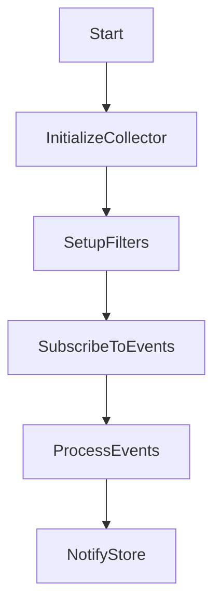

This document will cover the Initialization and Event Processing Flow for the containerd collector, which includes:

1. Initializing the collector
2. Setting up filters
3. Subscribing to and processing events.

Technical document: <SwmLink doc-title="Initialization and Event Processing Flow">[Initialization and Event Processing Flow](/.swm/initialization-and-event-processing-flow.4b4w0z51.sw.md)</SwmLink>

# [Initializing the collector](https://app.swimm.io/repos/Z2l0aHViJTNBJTNBZGF0YWRvZy1hZ2VudCUzQSUzQVN3aW1tLURlbW8=/docs/4b4w0z51#initialization)

The initialization process begins by setting up the necessary clients and filters. This includes creating a connection to the containerd client, which is essential for interacting with containerd and collecting data. The initialization also involves starting the SBOM (Software Bill of Materials) collection, which helps in tracking the software components within the containers. This step ensures that the collector is ready to receive and process events from containerd.

# [Setting up filters](https://app.swimm.io/repos/Z2l0aHViJTNBJTNBZGF0YWRvZy1hZ2VudCUzQSUzQVN3aW1tLURlbW8=/docs/4b4w0z51#setting-up-filters)

Filters are set up to exclude certain containers from being processed. Specifically, pause containers, which are used by container orchestration systems to manage container lifecycles, are excluded. This is done to avoid processing irrelevant containers that do not contribute meaningful data. The filter is created based on a predefined list of pause container identifiers, ensuring that only relevant containers are monitored.

# [Subscribing to and processing events](https://app.swimm.io/repos/Z2l0aHViJTNBJTNBZGF0YWRvZy1hZ2VudCUzQSUzQVN3aW1tLURlbW8=/docs/4b4w0z51#stream)

The collector subscribes to containerd events and begins streaming these events. This involves continuously listening to various channels for incoming events and errors. When an event is received, it is processed to determine its type and relevance. For container-related events, the collector extracts the necessary information and decides whether to ignore the event or generate a notification. This step ensures that the collector is actively monitoring container activities and updating the store with relevant events.

# [Generating and notifying initial events](https://app.swimm.io/repos/Z2l0aHViJTNBJTNBZGF0YWRvZy1hZ2VudCUzQSUzQVN3aW1tLURlbW8=/docs/4b4w0z51#event-notification)

Upon initialization, the collector generates initial events for existing containers. This involves collecting events from all namespaces and determining which containers should be monitored. The collector creates events for these containers and notifies the store. This step ensures that the store has an up-to-date view of the current state of containers, even before new events start streaming in.

&nbsp;

*This is an auto-generated document by Swimm AI 🌊 and has not yet been verified by a human*

<SwmMeta version="3.0.0" repo-id="Z2l0aHViJTNBJTNBZGF0YWRvZy1hZ2VudCUzQSUzQVN3aW1tLURlbW8=" repo-name="datadog-agent">Powered by [Swimm](/)</SwmMeta>
