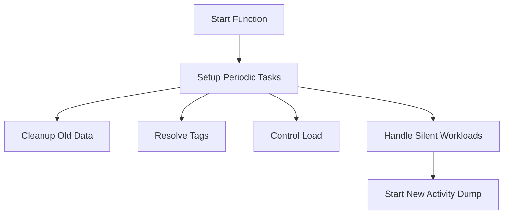

This document will cover the initialization and execution flow of the Start function within the ActivityDumpManager. We'll cover:

1. Setting up periodic tasks
2. Handling silent workloads
3. Controlling the load
4. Starting new activity dumps.

Technical document: <SwmLink doc-title="Initialization and Execution Flow of Start Function">[Initialization and Execution Flow of Start Function](/.swm/initialization-and-execution-flow-of-start-function.vfgg4eju.sw.md)</SwmLink>

# [Setting up periodic tasks](https://app.swimm.io/repos/Z2l0aHViJTNBJTNBZGF0YWRvZy1hZ2VudCUzQSUzQVN3aW1tLURlbW8=/docs/vfgg4eju#start)

The Start function initializes the ActivityDumpManager by setting up several timers that trigger different tasks at regular intervals. These tasks include cleaning up old data, resolving tags, controlling the load, and handling workloads that are not currently being traced. This setup ensures that the system remains efficient and does not get overloaded with unnecessary data.

# [Handling silent workloads](https://app.swimm.io/repos/Z2l0aHViJTNBJTNBZGF0YWRvZy1hZ2VudCUzQSUzQVN3aW1tLURlbW8=/docs/vfgg4eju#handlesilentworkloads)

The handleSilentWorkloads function checks if there are any workloads that should be traced but currently aren't. It ensures that the security profile manager is set and that the conditions are right to start tracing a new workload. If conditions are met, it fetches silent workloads and starts tracing them. This step is crucial for ensuring that all relevant workloads are being monitored, which helps in maintaining comprehensive security coverage.

# [Controlling the load](https://app.swimm.io/repos/Z2l0aHViJTNBJTNBZGF0YWRvZy1hZ2VudCUzQSUzQVN3aW1tLURlbW8=/docs/vfgg4eju#triggerloadcontroller)

The triggerLoadController function handles overweight dumps by finalizing them and persisting their data if they are not empty. It then restarts a new dump for the same workload to continue tracing. This function ensures that the system does not get overloaded by managing the active dumps efficiently, which is important for maintaining system performance and reliability.

# [Starting new activity dumps](https://app.swimm.io/repos/Z2l0aHViJTNBJTNBZGF0YWRvZy1hZ2VudCUzQSUzQVN3aW1tLURlbW8=/docs/vfgg4eju#startdumpwithconfig)

The startDumpWithConfig function starts a new activity dump for a given workload with the provided configuration. It sets up the metadata and storage requests for the new dump and inserts it into the active dumps list. This function is essential for initiating the tracing of new workloads, ensuring that all activities are monitored and recorded for security analysis.

&nbsp;

*This is an auto-generated document by Swimm AI 🌊 and has not yet been verified by a human*

<SwmMeta version="3.0.0" repo-id="Z2l0aHViJTNBJTNBZGF0YWRvZy1hZ2VudCUzQSUzQVN3aW1tLURlbW8=" repo-name="datadog-agent">Powered by [Swimm](/)</SwmMeta>
