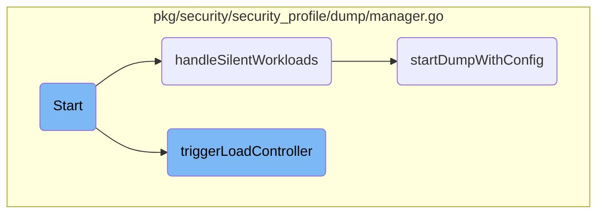

This document explains the initialization and execution flow of the <SwmToken path="pkg/security/security_profile/dump/manager.go" pos="88:2:2" line-data="// Start runs the ActivityDumpManager">`Start`</SwmToken> function within the <SwmToken path="pkg/security/security_profile/dump/manager.go" pos="88:8:8" line-data="// Start runs the ActivityDumpManager">`ActivityDumpManager`</SwmToken>. The <SwmToken path="pkg/security/security_profile/dump/manager.go" pos="88:2:2" line-data="// Start runs the ActivityDumpManager">`Start`</SwmToken> function is responsible for setting up periodic tasks and managing the activity dumps.

The <SwmToken path="pkg/security/security_profile/dump/manager.go" pos="88:2:2" line-data="// Start runs the ActivityDumpManager">`Start`</SwmToken> function begins by setting up several timers that trigger different tasks at regular intervals. These tasks include cleaning up old data, resolving tags, controlling the load, and handling workloads that are not currently being traced. Once the timers are set, the function enters a loop where it waits for these timers to signal that it's time to perform their respective tasks. When a timer goes off, the function performs the necessary actions, such as starting a new trace for a workload or managing the data storage to ensure the system doesn't get overloaded.

# Flow drill down



<SwmSnippet path="/pkg/security/security_profile/dump/manager.go" line="88">

---

## Start

The <SwmToken path="pkg/security/security_profile/dump/manager.go" pos="88:2:2" line-data="// Start runs the ActivityDumpManager">`Start`</SwmToken> function initializes and runs the <SwmToken path="pkg/security/security_profile/dump/manager.go" pos="88:8:8" line-data="// Start runs the ActivityDumpManager">`ActivityDumpManager`</SwmToken>. It sets up several tickers to periodically trigger different tasks such as cleanup, tag resolution, load control, and handling silent workloads. The function enters a loop where it waits for these tickers to trigger their respective tasks or for the context to be done.

```go
// Start runs the ActivityDumpManager
func (adm *ActivityDumpManager) Start(ctx context.Context, wg *sync.WaitGroup) {
	defer wg.Done()

	ctx, cancel := context.WithCancel(ctx)
	defer cancel()

	ticker := time.NewTicker(adm.config.RuntimeSecurity.ActivityDumpCleanupPeriod)
	defer ticker.Stop()

	tagsTicker := time.NewTicker(adm.config.RuntimeSecurity.ActivityDumpTagsResolutionPeriod)
	defer tagsTicker.Stop()

	loadControlTicker := time.NewTicker(adm.config.RuntimeSecurity.ActivityDumpLoadControlPeriod)
	defer loadControlTicker.Stop()

	silentWorkloadsTicker := time.NewTicker(adm.config.RuntimeSecurity.ActivityDumpSilentWorkloadsTicker)
	defer silentWorkloadsTicker.Stop()

	for {
		select {
```

---

</SwmSnippet>

<SwmSnippet path="/pkg/security/security_profile/dump/manager.go" line="472">

---

## <SwmToken path="pkg/security/security_profile/dump/manager.go" pos="472:2:2" line-data="// handleSilentWorkloads checks if we should start tracing one of the workloads from a profile without an activity tree of the Security Profile manager">`handleSilentWorkloads`</SwmToken>

The <SwmToken path="pkg/security/security_profile/dump/manager.go" pos="472:2:2" line-data="// handleSilentWorkloads checks if we should start tracing one of the workloads from a profile without an activity tree of the Security Profile manager">`handleSilentWorkloads`</SwmToken> function checks if there are any workloads that should be traced but currently aren't. It ensures that the security profile manager is set and that the conditions are right to start tracing a new workload. If conditions are met, it fetches silent workloads and starts tracing them using the <SwmToken path="pkg/security/security_profile/dump/manager.go" pos="414:9:9" line-data="func (adm *ActivityDumpManager) startDumpWithConfig(containerID string, containerFlags, cookie uint64, loadConfig model.ActivityDumpLoadConfig) error {">`startDumpWithConfig`</SwmToken> function.

```go
// handleSilentWorkloads checks if we should start tracing one of the workloads from a profile without an activity tree of the Security Profile manager
func (adm *ActivityDumpManager) handleSilentWorkloads() {
	adm.Lock()
	defer adm.Unlock()

	if adm.securityProfileManager == nil {
		// the security profile manager hasn't been set yet
		return
	}

	// check if it's a good time to look for a silent workload, to do so, check if the last stopped dump was stopped more
	// than the configured amount of time ago
	if time.Since(adm.lastStoppedDumpTime) < adm.config.RuntimeSecurity.ActivityDumpSilentWorkloadsDelay {
		return
	}

	// if we're already at capacity leave now - this prevents an unnecessary lock on the security profile manager
	if len(adm.activeDumps) >= adm.config.RuntimeSecurity.ActivityDumpTracedCgroupsCount {
		return
	}

```

---

</SwmSnippet>

<SwmSnippet path="/pkg/security/security_profile/dump/manager.go" line="834">

---

## <SwmToken path="pkg/security/security_profile/dump/manager.go" pos="834:9:9" line-data="func (adm *ActivityDumpManager) triggerLoadController() {">`triggerLoadController`</SwmToken>

The <SwmToken path="pkg/security/security_profile/dump/manager.go" pos="834:9:9" line-data="func (adm *ActivityDumpManager) triggerLoadController() {">`triggerLoadController`</SwmToken> function handles overweight dumps by finalizing them and persisting their data if they are not empty. It then restarts a new dump for the same workload to continue tracing. This function ensures that the system does not get overloaded by managing the active dumps efficiently.

```go
func (adm *ActivityDumpManager) triggerLoadController() {
	// fetch the list of overweight dump
	dumps := adm.getOverweightDumps()

	// handle overweight dumps
	for _, ad := range dumps {
		// stop the dump but do not release the cgroup
		ad.Finalize(false)
		seclog.Infof("tracing paused for [%s]", ad.GetSelectorStr())

		// persist dump if not empty
		if !ad.IsEmpty() {
			if ad.GetWorkloadSelector() != nil {
				if err := adm.storage.Persist(ad); err != nil {
					seclog.Errorf("couldn't persist dump [%s]: %v", ad.GetSelectorStr(), err)
				}
			}
		} else {
			adm.emptyDropped.Inc()
		}

```

---

</SwmSnippet>

<SwmSnippet path="/pkg/security/security_profile/dump/manager.go" line="413">

---

## <SwmToken path="pkg/security/security_profile/dump/manager.go" pos="414:9:9" line-data="func (adm *ActivityDumpManager) startDumpWithConfig(containerID string, containerFlags, cookie uint64, loadConfig model.ActivityDumpLoadConfig) error {">`startDumpWithConfig`</SwmToken>

The <SwmToken path="pkg/security/security_profile/dump/manager.go" pos="414:9:9" line-data="func (adm *ActivityDumpManager) startDumpWithConfig(containerID string, containerFlags, cookie uint64, loadConfig model.ActivityDumpLoadConfig) error {">`startDumpWithConfig`</SwmToken> function starts a new activity dump for a given workload with the provided configuration. It sets up the metadata and storage requests for the new dump and inserts it into the active dumps list. This function is crucial for initiating the tracing of new workloads.

```go
// handleDefaultDumpRequest starts dumping a new workload with the provided load configuration and the default dump configuration
func (adm *ActivityDumpManager) startDumpWithConfig(containerID string, containerFlags, cookie uint64, loadConfig model.ActivityDumpLoadConfig) error {
	newDump := NewActivityDump(adm, func(ad *ActivityDump) {
		ad.Metadata.ContainerID = containerID
		ad.Metadata.ContainerFlags = containerFlags
		ad.SetLoadConfig(cookie, loadConfig)

		if adm.config.RuntimeSecurity.ActivityDumpCgroupDifferentiateArgs {
			ad.Metadata.DifferentiateArgs = true
			ad.ActivityTree.DifferentiateArgs()
		}
	})

	// add local storage requests
	for _, format := range adm.config.RuntimeSecurity.ActivityDumpLocalStorageFormats {
		newDump.AddStorageRequest(config.NewStorageRequest(
			config.LocalStorage,
			format,
			adm.config.RuntimeSecurity.ActivityDumpLocalStorageCompression,
			adm.config.RuntimeSecurity.ActivityDumpLocalStorageDirectory,
		))
```

---

</SwmSnippet>

&nbsp;

*This is an auto-generated document by Swimm AI 🌊 and has not yet been verified by a human*

<SwmMeta version="3.0.0" repo-id="Z2l0aHViJTNBJTNBZGF0YWRvZy1hZ2VudCUzQSUzQVN3aW1tLURlbW8=" repo-name="datadog-agent"><sup>Powered by [Swimm](/)</sup></SwmMeta>
